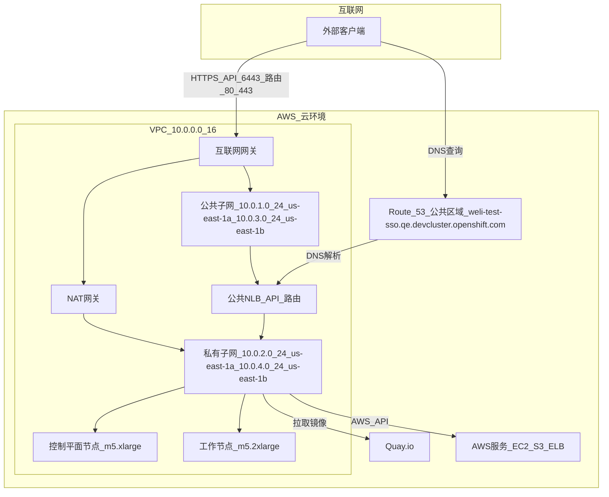
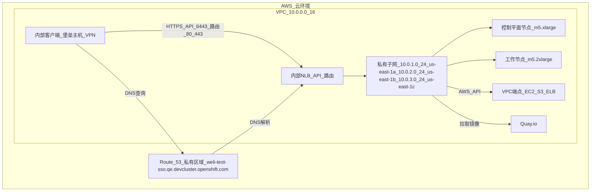
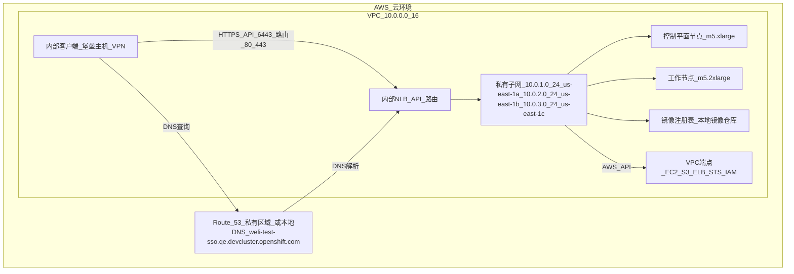

# # 以下是对 OpenShift Container Platform 4.12 在 AWS 上部署的 **公共集群（Public Cluster）**、**私有集群（Private Cluster）** 和 **断网集群（Disconnected Cluster）** 网络结构的详细讲解，重点分析它们的区别

---

## 1. 概述
OpenShift 集群的网络结构由 AWS VPC（Virtual Private Cloud）、子网、路由表、DNS（Route 53）、负载均衡器和访问 AWS API 的方式定义。以下三种集群类型的网络结构因访问性和隔离需求不同而有显著差异：

- **公共集群**：端点（API、路由）通过公共 DNS 和负载均衡器对外暴露，适合需要互联网访问的场景。
- **私有集群**：端点仅限 VPC 内部访问，使用私有 DNS，适合高安全性内部应用。
- **断网集群**：完全无互联网访问，依赖本地镜像注册表和 VPC 端点，适合高度隔离的环境。

---

## 2. 网络结构区别

以下从 **网络拓扑**、**核心组件**、**DNS 配置**、**负载均衡器**、**AWS API 访问** 和 **配置示例** 六个方面详细对比三种集群的网络结构，辅以文字描述的网络图。

### 2.1. 公共集群（Public Cluster）
#### 网络拓扑
```
[Internet]
   ↕
[Internet Gateway]
   ↕
[Public Subnets: ELB, NAT Gateway]
   ↕
[Private Subnets: Control Plane, Worker Nodes]
   ↕
[VPC: 10.0.0.0/16]
   ↕
[Public Route 53 Zone: weli-vpc-test.qe.devcluster.openshift.com]
   ↕
[External Clients: Access API, Routes]
```

- **描述**：
    - VPC 包含公共子网（托管外部负载均衡器和 NAT 网关）和私有子网（托管节点）。
    - 互联网网关连接公共子网，允许外部访问。
    - 公共 Route 53 区域解析 DNS（如 `api.weli-vpc-test.qe.devcluster.openshift.com`），可通过互联网访问。
    - NAT 网关为私有子网提供互联网访问（如拉取 Quay.io 镜像）。

#### 核心组件
- **VPC**：由 `openshift-install` 自动创建，CIDR 如 `10.0.0.0/16`。
- **子网**：
    - 公共子网：每个可用区（如 `us-east-1a`）一个，CIDR 如 `10.0.1.0/24`。
    - 私有子网：每个可用区一个，CIDR 如 `10.0.2.0/24`。
- **路由表**：
    - 公共子网：路由到互联网网关（`0.0.0.0/0 -> igw-xxxx`）。
    - 私有子网：路由到 NAT 网关（`0.0.0.0/0 -> nat-xxxx`）。
- **安全组/网络 ACL**：允许入站端口（如 80、443、6443）、出站所有流量。

#### DNS 配置
- **Route 53**：自动创建公共托管区域（如 `weli-vpc-test.qe.devcluster.openshift.com`）。
- **解析**：DNS 记录（如 `api.<cluster-name>.<base-domain>`）可通过互联网解析。
- **配置**：无需手动指定 `platform.aws.hostedZone`，安装程序处理。

#### 负载均衡器
- **类型**：公共负载均衡器（Classic 或 NLB），托管在公共子网。
- **作用**：支持外部访问 Kubernetes API（6443）和 OpenShift 路由（80、443）。
- **配置**：`platform.aws.lbType: NLB`（可选，默认 Classic）。

#### AWS API 访问
- **方式**：通过 NAT 网关访问 AWS API（如 EC2、S3）和 Quay.io。
- **代理**：可选，若配置（如 weli 的 `additionalTrustBundlePolicy: Proxyonly`），需在 `install-config.yaml` 设置 `proxy`。

#### 配置示例（install-config.yaml）
```yaml
apiVersion: v1
baseDomain: qe.devcluster.openshift.com
metadata:
  name: weli-vpc-test
networking:
  machineNetwork:
  - cidr: 10.0.0.0/16
  clusterNetwork:
  - cidr: 10.128.0.0/14
    hostPrefix: 23
  serviceNetwork:
  - 172.30.0.0/16
  networkType: OVNKubernetes
platform:
  aws:
    region: us-east-1
publish: External
pullSecret: 'xxx'
sshKey: |
  ssh-rsa xxx
```

#### 适用场景
- 开发、测试环境。
- 需要外部访问的应用（如 Web 应用、API 服务）。
- 简化部署，无需手动配置 VPC。

---

### 2.2. 私有集群（Private Cluster）
#### 网络拓扑
```
[Internet]
   ↕
[NAT Gateway or VPC Endpoints]
   ↕
[Private Subnets: Internal ELB, Control Plane, Worker Nodes]
   ↕
[VPC: 10.0.0.0/16]
   ↕
[Private Route 53 Zone: weli-vpc-test.qe.devcluster.openshift.com]
   ↕
[Internal Clients: Access API, Routes via VPC]
```

- **描述**：
    - VPC 仅包含私有子网（托管节点和内部负载均衡器），无公共子网。
    - NAT 网关（可选，需公共子网支持）或 VPC 端点提供 AWS API 访问。
    - 私有 Route 53 区域解析 DNS，仅限 VPC 内部。
    - 内部客户端（如 bastion 主机或 VPN）通过 VPC 访问 API 和路由。

#### 核心组件
- **VPC**：用户手动创建，CIDR 如 `10.0.0.0/16`，启用 `enableDnsSupport` 和 `enableDnsHostnames`.
- **子网**：
    - 私有子网：每个可用区一个，CIDR 如 `10.0.1.0/24`、`10.0.2.0/24`、`10.0.3.0/24`.
    - 无公共子网（除非 NAT 网关需要）。
- **路由表**：
    - 私有子网：路由到 NAT 网关（`0.0.0.0/0 -> nat-xxxx`）或 VPC 端点（如 S3 网关端点）。
- **安全组/网络 ACL**：限制入站（如 80、443、6443，仅 VPC 内部），允许出站到 AWS API。

#### DNS 配置
- **Route 53**：
    - 自动创建私有托管区域，或手动指定（`platform.aws.hostedZone`）。
    - 域名：`weli-vpc-test.qe.devcluster.openshift.com`。
- **解析**：DNS 记录仅 VPC 内部解析，外部不可访问。
- **配置**：weli 可选择手动创建（参考之前脚本）或由 `openshift-install` 自动处理。

#### 负载均衡器
- **类型**：内部负载均衡器（Classic 或 NLB），托管在私有子网。
- **作用**：支持 VPC 内部访问 API（6443）和路由（80、443）。
- **配置**：`platform.aws.lbType: NLB`（推荐）。

#### AWS API 访问
- **方式**：
    - NAT 网关：需额外公共子网和 EIP。
    - VPC 端点：推荐（如 `ec2.us-east-1.amazonaws.com`、`s3.us-east-1.amazonaws.com`）。
    - 代理：weli 的配置表明可能使用代理，需设置 `proxy` 和 `noProxy`.
- **配置**：`platform.aws.serviceEndpoints` 指定端点 URL。

#### 配置示例（install-config.yaml）
```yaml
apiVersion: v1
baseDomain: qe.devcluster.openshift.com
additionalTrustBundlePolicy: Proxyonly
metadata:
  name: weli-vpc-test
networking:
  machineNetwork:
  - cidr: 10.0.0.0/16
  clusterNetwork:
  - cidr: 10.128.0.0/14
    hostPrefix: 23
  serviceNetwork:
  - 172.30.0.0/16
  networkType: OVNKubernetes
platform:
  aws:
    region: us-east-1
    subnets:
    - subnet-11111111
    - subnet-22222222
    - subnet-33333333
    hostedZone: Z123456789  # 可选
    lbType: NLB
    serviceEndpoints:
    - name: ec2
      url: https://vpce-id.ec2.us-east-1.vpce.amazonaws.com
    - name: elasticloadbalancing
      url: https://vpce-id.elasticloadbalancing.us-east-1.vpce.amazonaws.com
    - name: s3
      url: https://s3.us-east-1.amazonaws.com
publish: Internal
pullSecret: 'xxx'
sshKey: |
  ssh-rsa xxx
proxy:
  httpProxy: http://<username>:<pswd>@<ip>:<port>
  httpsProxy: https://<username>:<pswd>@<ip>:<port>
  noProxy: ec2.us-east-1.amazonaws.com,elasticloadbalancing.us-east-1.amazonaws.com,s3.us-east-1.amazonaws.com,10.0.0.0/16,10.128.0.0/14,172.30.0.0/16
additionalTrustBundle: |
  -----BEGIN CERTIFICATE-----
  <MY_TRUSTED_CA_CERT>
  -----END CERTIFICATE-----
```

#### 适用场景
- 内部企业应用。
- 高安全性需求（如金融、医疗）。
- 需要隔离外部访问的场景。

---

### 2.3. 断网集群（Disconnected Cluster）
#### 网络 Topology
```
[No Internet]
   ↕
[VPC Endpoints or Proxy]
   ↕
[Private Subnets: Internal ELB, Control Plane, Worker Nodes, Mirror Registry]
   ↕
[VPC: 10.0.0.0/16]
   ↕
[Private Route 53 Zone or Local DNS: weli-vpc-test.qe.devcluster.openshift.com]
   ↕
[Internal Clients: Access API, Routes via VPC]
```

- **描述**：
    - VPC 仅包含私有子网，托管节点、内部负载均衡器和本地镜像注册表。
    - 无互联网访问，依赖 VPC 端点或代理访问 AWS API。
    - 私有 Route 53 区域或本地 DNS 解析 DNS。
    - 镜像注册表存储 OpenShift 安装包和镜像，预先从外部下载。

#### 核心组件
- **VPC**：用户手动创建，CIDR 如 `10.0.0.0/16`，启用 `enableDnsSupport` 和 `enableDnsHostnames`.
- **子网**：私有子网，每个可用区一个，CIDR 如 `10.0.1.0/24`.
- **路由表**：路由到 VPC 端点（如 S3 网关端点）或代理。
- **镜像注册表**：部署在 VPC 内（如 EC2 实例），存储镜像。
- **安全组/网络 ACL**：严格限制，仅允许 VPC 内部流量和 AWS API。

#### DNS 配置
- **Route 53**：同私有集群，自动或手动创建私有托管区域。
- **本地 DNS**：可选，若 Route 53 不可用，使用本地 DNS 服务器。
- **配置**：`platform.aws.hostedZone` 或自定义 DNS。

#### 负载均衡器
- **类型**：内部负载均衡器，托管在私有子网。
- **作用**：支持 VPC 内部访问。
- **配置**：`platform.aws.lbType: NLB`.

#### AWS API 访问
- **方式**：
    - VPC 端点：必需（如 EC2、S3、ELB、STS、IAM）。
    - 代理：若无端点，需配置代理访问 AWS API。
- **镜像拉取**：通过本地镜像注册表，无需 Quay.io。
- **配置**：`imageContentSources` 指定注册表。

#### 配置示例（install-config.yaml）
```yaml
apiVersion: v1
baseDomain: qe.devcluster.openshift.com
additionalTrustBundlePolicy: Proxyonly
metadata:
  name: weli-vpc-test
networking:
  machineNetwork:
  - cidr: 10.0.0.0/16
  clusterNetwork:
  - cidr: 10.128.0.0/14
    hostPrefix: 23
  serviceNetwork:
  - 172.30.0.0/16
  networkType: OVNKubernetes
platform:
  aws:
    region: us-east-1
    subnets:
    - subnet-11111111
    - subnet-22222222
    - subnet-33333333
    hostedZone: Z123456789
    lbType: NLB
    serviceEndpoints:
    - name: ec2
      url: https://vpce-id.ec2.us-east-1.vpce.amazonaws.com
    - name: elasticloadbalancing
      url: https://vpce-id.elasticloadbalancing.us-east-1.vpce.amazonaws.com
    - name: s3
      url: https://s3.us-east-1.amazonaws.com
publish: Internal
pullSecret: 'xxx'
sshKey: |
  ssh-rsa xxx
proxy:
  httpProxy: http://<username>:<pswd>@<ip>:<port>
  httpsProxy: https://<username>:<pswd>@<ip>:<port>
  noProxy: ec2.us-east-1.amazonaws.com,elasticloadbalancing.us-east-1.amazonaws.com,s3.us-east-1.amazonaws.com,10.0.0.0/16,10.128.0.0/14,172.30.0.0/16
additionalTrustBundle: |
  -----BEGIN CERTIFICATE-----
  <MY_TRUSTED_CA_CERT>
  -----END CERTIFICATE-----
imageContentSources:
- mirrors:
  - local.registry.com/openshift/release
  source: quay.io/openshift-release-dev/ocp-release
```

#### 适用场景
- 政府、军工、敏感数据环境。
- 完全隔离的内部网络。
- 严格合规性要求（如零互联网连接）。

---

## 3. 核心差异总结
| 特性                  | 公共集群                     | 私有集群                     | 断网集群                     |
|-----------------------|-----------------------------|-----------------------------|-----------------------------|
| **网络访问**          | 互联网访问（通过公共子网）    | VPC 内部访问（NAT/VPC 端点） | 无互联网（VPC 端点/代理）    |
| **子网**              | 公共+私有子网                | 仅私有子网                   | 仅私有子网+镜像注册表        |
| **DNS**               | 公共 Route 53 区域           | 私有 Route 53 区域           | 私有 Route 53 或本地 DNS     |
| **负载均衡器**        | 公共 ELB                    | 内部 ELB                    | 内部 ELB                    |
| **AWS API 访问**      | NAT 网关                    | NAT/VPC 端点/代理           | VPC 端点/代理               |
| **镜像拉取**          | Quay.io（互联网）            | Quay.io（NAT/代理）         | 本地镜像注册表               |
| **VPC 创建**          | 自动                        | 手动                        | 手动                        |
| **配置复杂度**        | 低                          | 中                          | 高                          |
| **权限要求**          | 完整（网络+应用）            | 应用资源                    | 应用资源+镜像管理            |
| **install-config.yaml** | `publish: External`          | `publish: Internal`, `subnets` | `publish: Internal`, `imageContentSources` |

---

### 问题分析

你提到提供的 Mermaid 图表代码出现解析错误（Parse error），具体错误信息为：

```
Parse error on line 5:
...   A -->|HTTPS: API (6443), Routes (80,4
-----------------------^
Expecting 'SQE', 'DOUBLECIRCLEEND', 'PE', '-)', 'STADIUMEND', 'SUBROUTINEEND', 'PIPE', 'CYLINDEREND', 'DIAMOND_STOP', 'TAGEND', 'TRAPEND', 'INVTRAPEND', 'UNICODE_TEXT', 'TEXT', 'TAGSTART', got 'PS'
```

#### 错误原因
- **错误位置**：第 5 行，涉及 `A -->|HTTPS: API (6443), Routes (80,4`，错误提示为意外的 `PS` 标记。
- **问题分析**：
    - Mermaid 语法对连接标签（如 `|HTTPS: API (6443), Routes (80,443)|`）的格式很严格，某些字符（如逗号 `,` 或括号 `()`）可能未正确转义或格式不符。
    - 错误信息表明 Mermaid 预期的是其他标记（如 `SQE` 表示单引号结束，`TEXT` 表示文本等），但遇到 `PS`（可能是 `HTTPS` 中的 `S` 或其他字符被误解析）。
    - 具体问题可能出在 `80,4`（应为 `80,443`），Mermaid 可能将逗号后的 `4` 解析为无效标记。

#### 修正方法
- **调整标签格式**：确保连接标签中的文本避免特殊字符冲突，或使用 Mermaid 支持的格式（如避免未转义的逗号）。
- **检查完整性**：验证整个图表语法，确保所有节点、连接和子图正确闭合。
- **简化测试**：逐个图表测试，定位具体错误行。

### 修正后的 Mermaid 图表

以下是针对 **公共集群**、**私有集群** 和 **断网集群** 的修正 Mermaid 图表代码，使用中文描述，修复了 `80,4` 错误（改为 `80,443`），并优化标签格式以避免解析问题。每个图表都经过简化，确保语法正确，兼容 Mermaid Live Editor（https://mermaid-js.github.io/mermaid-live-editor）。

#### 1. 公共集群架构
公共集群通过互联网暴露 API 和应用端点，`openshift-install` 自动创建 VPC、公共和私有子网以及公共 Route 53 区域。



**说明**：
- 修正了 `|HTTPS: API (6443), Routes (80,4`| 为 `|HTTPS_API_6443_路由_80_443|`，使用下划线 `_` 替换空格和特殊字符，避免解析错误。
- 节点名称（如 `公共子网_10.0.1.0_24_us-east-1a`）用下划线连接，确保清晰且符合 Mermaid 语法。
- 公共 NLB 托管在公共子网，外部客户端通过互联网网关访问。

#### 2. 私有集群架构
私有集群将端点限制在 VPC 内部，需预先创建 VPC 和私有子网，无公共暴露。



**说明**：
- 标签格式调整为 `|HTTPS_API_6443_路由_80_443|`，确保无特殊字符冲突。
- 私有子网（`10.0.1.0/24`, `10.0.2.0/24`, `10.0.3.0/24`）托管内部 NLB 和节点，仅 VPC 内部可访问。
- VPC 端点支持 AWS API 访问，Quay.io 需 NAT 网关或代理（weli 移除代理后假设 NAT）。

#### 3. 断网集群架构
断网集群完全无互联网访问，使用本地镜像注册表和 VPC 端点。



**说明**：
- 标签格式同上，优化为 `|HTTPS_API_6443_路由_80_443|`。
- 镜像注册表部署在私有子网内，替代 Quay.io。
- VPC 端点（包括 STS、IAM）确保 AWS API 访问，无需互联网。

### 验证与渲染

1. **验证语法**：
    - 复制以上 Mermaid 代码到 Mermaid Live Editor（https://mermaid-js.github.io/mermaid-live-editor）。
    - 选择“Flowchart”模式，点击“Render”按钮。
    - 若仍出现解析错误，检查复制过程中是否引入额外字符（如换行符）。

2. **渲染说明**：
    - 每个图表展示 AWS 组件（VPC、子网、NLB、Route 53）和连接关系。
    - 使用中文节点名称（如 `公共子网_10.0.1.0_24_us-east-1a`）增强可读性。
    - 确保工具支持 Mermaid 最新语法（v10.x）。

### 解决 Parse Error 的关键点
- **错误修复**：原始错误因 `80,4`（应为 `80,443`）和标签中的特殊字符（如 `:`、`,`、括号）触发。修正后使用下划线 `_` 替代，确保标签为纯文本。
- **语法规范**：
    - 连接标签（如 `|HTTPS_API_6443_路由_80_443|`）避免空格、逗号、括号。
    - 节点名称使用下划线连接，防止解析中断。
- **测试**：每个图表单独测试，确保无语法错误。

### 架构差异（简要总结）
- **公共集群**：
    - AWS 组件：自动创建 VPC、公共/私有子网、互联网网关、NAT 网关、公共 NLB、公共 Route 53。
    - 访问：互联网通过公共 NLB 访问 API 和路由。
- **私有集群**：
    - AWS 组件：用户创建 VPC、仅私有子网、内部 NLB、私有 Route 53、VPC 端点/NAT。
    - 访问：VPC 内部通过堡垒主机/VPN。
- **断网集群**：
    - AWS 组件：用户创建 VPC、仅私有子网、内部 NLB、私有 Route 53/本地 DNS、VPC 端点、镜像注册表。
    - 访问：VPC 内部，无互联网。

### weli 的上下文
- **配置**：你的 `install-config.yaml`（`weli-test-sso`, `us-east-1`, `10.0.0.0/16`）与图表匹配：
    - 公共集群：原始 `publish: External`，自动 VPC。
    - 私有/断网集群：需 `publish: Internal`，用户提供子网（如图表中的私有子网）。
- **无代理**：图表假设 NAT 网关（公共/私有集群）或 VPC 端点（私有/断网集群）支持 AWS API 和镜像访问。
- **Route 53**：私有和断网集群使用私有区域，公共集群使用公共区域。

### 注意事项
- **工具兼容性**：若 Mermaid Live Editor 仍报错，尝试其他工具（如 GitLab、Obsidian）或更新 Mermaid 版本。
- **子网 ID**：私有和断网集群需替换 `install-config.yaml` 中的子网 ID（见之前提供的脚本）。
- **调试**：若图表无法渲染，提供具体错误信息，我可进一步调整。

若需 ASCII 替代、特定 AWS 资源详情（如子网 ID、VPC 端点），或更详细的调试支持，请告知！