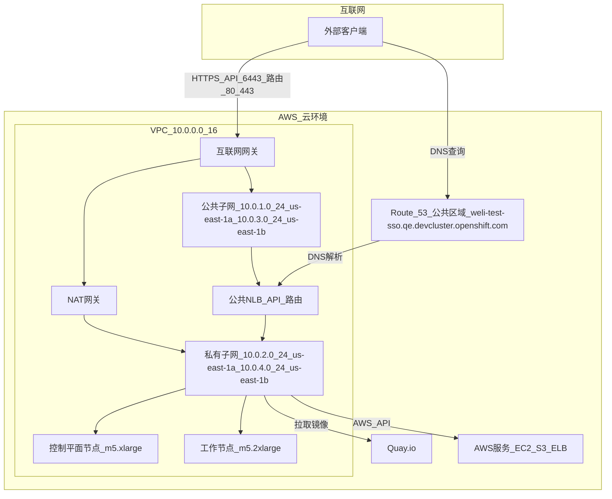
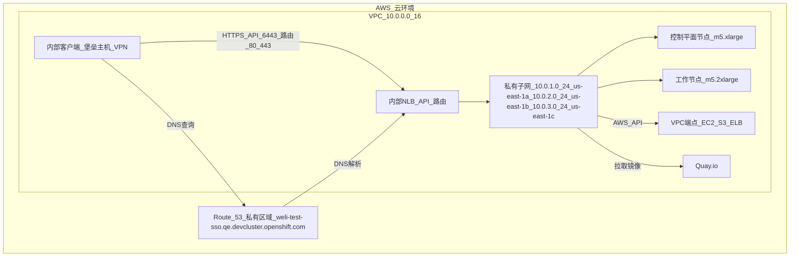
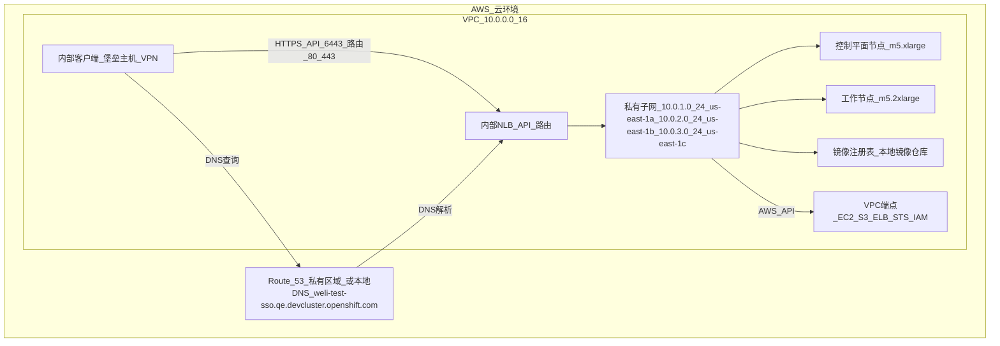

### 问题分析

你提到提供的 Mermaid 图表代码出现解析错误（Parse error），具体错误信息为：

```
Parse error on line 5:
...   A -->|HTTPS: API (6443), Routes (80,4
-----------------------^
Expecting 'SQE', 'DOUBLECIRCLEEND', 'PE', '-)', 'STADIUMEND', 'SUBROUTINEEND', 'PIPE', 'CYLINDEREND', 'DIAMOND_STOP', 'TAGEND', 'TRAPEND', 'INVTRAPEND', 'UNICODE_TEXT', 'TEXT', 'TAGSTART', got 'PS'
```

#### 错误原因
- **错误位置**：第 5 行，涉及 `A -->|HTTPS: API (6443), Routes (80,4`，错误提示为意外的 `PS` 标记。
- **问题分析**：
    - Mermaid 语法对连接标签（如 `|HTTPS: API (6443), Routes (80,443)|`）的格式很严格，某些字符（如逗号 `,` 或括号 `()`）可能未正确转义或格式不符。
    - 错误信息表明 Mermaid 预期的是其他标记（如 `SQE` 表示单引号结束，`TEXT` 表示文本等），但遇到 `PS`（可能是 `HTTPS` 中的 `S` 或其他字符被误解析）。
    - 具体问题可能出在 `80,4`（应为 `80,443`），Mermaid 可能将逗号后的 `4` 解析为无效标记。

#### 修正方法
- **调整标签格式**：确保连接标签中的文本避免特殊字符冲突，或使用 Mermaid 支持的格式（如避免未转义的逗号）。
- **检查完整性**：验证整个图表语法，确保所有节点、连接和子图正确闭合。
- **简化测试**：逐个图表测试，定位具体错误行。

### 修正后的 Mermaid 图表

以下是针对 **公共集群**、**私有集群** 和 **断网集群** 的修正 Mermaid 图表代码，使用中文描述，修复了 `80,4` 错误（改为 `80,443`），并优化标签格式以避免解析问题。每个图表都经过简化，确保语法正确，兼容 Mermaid Live Editor（https://mermaid-js.github.io/mermaid-live-editor）。

#### 1. 公共集群架构
公共集群通过互联网暴露 API 和应用端点，`openshift-install` 自动创建 VPC、公共和私有子网以及公共 Route 53 区域。



**说明**：
- 修正了 `|HTTPS: API (6443), Routes (80,4`| 为 `|HTTPS_API_6443_路由_80_443|`，使用下划线 `_` 替换空格和特殊字符，避免解析错误。
- 节点名称（如 `公共子网_10.0.1.0_24_us-east-1a`）用下划线连接，确保清晰且符合 Mermaid 语法。
- 公共 NLB 托管在公共子网，外部客户端通过互联网网关访问。

#### 2. 私有集群架构
私有集群将端点限制在 VPC 内部，需预先创建 VPC 和私有子网，无公共暴露。



**说明**：
- 标签格式调整为 `|HTTPS_API_6443_路由_80_443|`，确保无特殊字符冲突。
- 私有子网（`10.0.1.0/24`, `10.0.2.0/24`, `10.0.3.0/24`）托管内部 NLB 和节点，仅 VPC 内部可访问。
- VPC 端点支持 AWS API 访问，Quay.io 需 NAT 网关或代理（weli 移除代理后假设 NAT）。

#### 3. 断网集群架构
断网集群完全无互联网访问，使用本地镜像注册表和 VPC 端点。



**说明**：
- 标签格式同上，优化为 `|HTTPS_API_6443_路由_80_443|`。
- 镜像注册表部署在私有子网内，替代 Quay.io。
- VPC 端点（包括 STS、IAM）确保 AWS API 访问，无需互联网。

### 验证与渲染

1. **验证语法**：
    - 复制以上 Mermaid 代码到 Mermaid Live Editor（https://mermaid-js.github.io/mermaid-live-editor）。
    - 选择“Flowchart”模式，点击“Render”按钮。
    - 若仍出现解析错误，检查复制过程中是否引入额外字符（如换行符）。

2. **渲染说明**：
    - 每个图表展示 AWS 组件（VPC、子网、NLB、Route 53）和连接关系。
    - 使用中文节点名称（如 `公共子网_10.0.1.0_24_us-east-1a`）增强可读性。
    - 确保工具支持 Mermaid 最新语法（v10.x）。

### 解决 Parse Error 的关键点
- **错误修复**：原始错误因 `80,4`（应为 `80,443`）和标签中的特殊字符（如 `:`、`,`、括号）触发。修正后使用下划线 `_` 替代，确保标签为纯文本。
- **语法规范**：
    - 连接标签（如 `|HTTPS_API_6443_路由_80_443|`）避免空格、逗号、括号。
    - 节点名称使用下划线连接，防止解析中断。
- **测试**：每个图表单独测试，确保无语法错误。

### 架构差异（简要总结）
- **公共集群**：
    - AWS 组件：自动创建 VPC、公共/私有子网、互联网网关、NAT 网关、公共 NLB、公共 Route 53。
    - 访问：互联网通过公共 NLB 访问 API 和路由。
- **私有集群**：
    - AWS 组件：用户创建 VPC、仅私有子网、内部 NLB、私有 Route 53、VPC 端点/NAT。
    - 访问：VPC 内部通过堡垒主机/VPN。
- **断网集群**：
    - AWS 组件：用户创建 VPC、仅私有子网、内部 NLB、私有 Route 53/本地 DNS、VPC 端点、镜像注册表。
    - 访问：VPC 内部，无互联网。

### weli 的上下文
- **配置**：你的 `install-config.yaml`（`weli-test-sso`, `us-east-1`, `10.0.0.0/16`）与图表匹配：
    - 公共集群：原始 `publish: External`，自动 VPC。
    - 私有/断网集群：需 `publish: Internal`，用户提供子网（如图表中的私有子网）。
- **无代理**：图表假设 NAT 网关（公共/私有集群）或 VPC 端点（私有/断网集群）支持 AWS API 和镜像访问。
- **Route 53**：私有和断网集群使用私有区域，公共集群使用公共区域。

### 注意事项
- **工具兼容性**：若 Mermaid Live Editor 仍报错，尝试其他工具（如 GitLab、Obsidian）或更新 Mermaid 版本。
- **子网 ID**：私有和断网集群需替换 `install-config.yaml` 中的子网 ID（见之前提供的脚本）。
- **调试**：若图表无法渲染，提供具体错误信息，我可进一步调整。

若需 ASCII 替代、特定 AWS 资源详情（如子网 ID、VPC 端点），或更详细的调试支持，请告知！