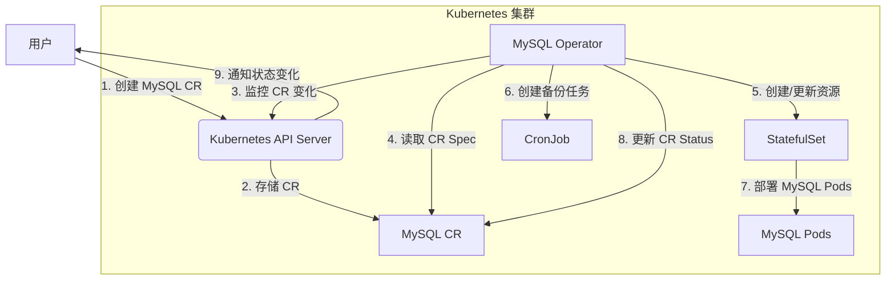

# OpenShift Operator 和 Kubernetes Controller Manager 是 Kubernetes 生态系统中两个相关但功能不同的组件，它们在管理和扩展 Kubernetes 集群时有各自的角色。以下是它们的介绍以及它们之间的关系：

### 1. **Kubernetes Controller Manager**
Kubernetes Controller Manager 是 Kubernetes 核心组件之一，运行在控制平面（Control Plane）中，负责确保集群的实际状态与期望状态一致。它通过控制器（Controller）的形式实现这一目标，每个控制器监控特定资源的状态并采取行动以达到期望状态。

- **核心功能**：
    - 运行多个内置控制器，如 Deployment Controller、StatefulSet Controller、ReplicaSet Controller 等。
    - 每个控制器通过 `Informer` 机制监控 API Server 中的资源对象（如 Pod、Service 等），并根据资源的 `Spec` 和 `Status` 执行协调逻辑。
    - 通过 `workqueue` 处理事件，确保资源状态收敛到期望状态。
    - 控制器是通用的，处理 Kubernetes 原生资源类型。

- **局限性**：
    - Controller Manager 主要处理 Kubernetes 核心资源，无法直接处理自定义资源（Custom Resources，CR）。
    - 对于复杂应用的生命周期管理（如安装、升级、配置管理），内置控制器功能有限。

---

### 2. **OpenShift Operator**
OpenShift Operator 是 Red Hat OpenShift 平台中基于 Kubernetes Operator 模式的一种扩展机制，用于管理和自动化复杂应用的生命周期。Operator 是 Kubernetes 的自定义控制器，结合了自定义资源（CRD，Custom Resource Definition）和自定义逻辑，专门用于管理特定应用或服务。

- **核心功能**：
    - **Operator 框架**：基于 Operator SDK 或 Kubebuilder 构建，结合 CRD 和自定义控制器逻辑。
    - **自定义资源**：Operator 定义特定应用的 CRD（如 EtcdCluster、Prometheus），用户通过创建 CR 实例来声明应用期望状态。
    - **自动化管理**：Operator 监控 CR 的状态，执行安装、升级、备份、故障恢复等操作。例如，数据库 Operator 可能自动处理分片、备份和版本升级。
    - **OpenShift 集成**：在 OpenShift 中，Operator 通过 Operator Lifecycle Manager (OLM) 管理和分发，支持 Operator 的生命周期管理和 Marketplace 集成。

- **典型用例**：
    - 管理有状态应用（如数据库、消息队列）。
    - 自动化复杂工作负载的部署和维护。
    - 扩展 Kubernetes 的功能以支持特定领域的需求。

---

### 3. **Operator 和 Controller Manager 的关系**
Operator 和 Controller Manager 的关系可以从以下几个方面理解：

#### （1）**功能上的扩展**
- **Controller Manager** 是 Kubernetes 的核心组件，运行内置控制器，管理通用资源（如 Pod、Deployment）。
- **Operator** 是对 Controller Manager 的扩展，基于相同的控制器模式（Watch → Reconcile → Act），但专注于自定义资源和特定应用的复杂逻辑。
- Operator 可以看作是 Controller Manager 的“用户态”实现，允许开发者为特定应用编写专用控制器，而无需修改 Kubernetes 核心代码。

#### （2）**技术上的相似性**
- **共同点**：
    - 两者都基于 Kubernetes 的控制器模式，依赖 Informer、Workqueue 等机制来监控资源并执行协调逻辑。
    - 都通过 API Server 与集群交互，响应资源变更事件。
- **不同点**：
    - Controller Manager 运行在控制平面，管理核心资源，属于 Kubernetes 原生组件。
    - Operator 通常运行在用户命名空间中，作为 Pod 部署，管理自定义资源，属于扩展组件。

#### （3）**部署和使用场景**
- **Controller Manager** 是 Kubernetes 集群的默认组件，自动运行，无需用户干预。
- **Operator** 需要用户或管理员通过 OperatorHub 或 OLM 安装，针对特定应用场景（如数据库、监控、CI/CD）部署。例如，OpenShift 的 Cluster Operator 管理集群组件（如网络、存储），而用户可以部署其他 Operator（如 MySQL Operator）管理应用。

#### （4）**OpenShift 中的特殊性**
- 在 OpenShift 中，Operator 是平台的核心理念之一。OpenShift 使用 Operator 管理集群本身的组件（如 OpenShift API Server、Ingress Controller），这些 Operator 类似于 Controller Manager 中的控制器，但以 Operator 形式实现，更加模块化和可扩展。
- OpenShift 的 Operator Lifecycle Manager (OLM) 提供了 Operator 的安装、升级和依赖管理，进一步增强了 Operator 的生态系统。

---

### 4. **总结**
- **Kubernetes Controller Manager** 是 Kubernetes 核心控制平面组件，运行内置控制器，管理通用资源，确保集群状态一致。
- **OpenShift Operator** 是 Kubernetes 的扩展机制，通过 CRD 和自定义控制器管理特定应用的生命周期，适合复杂工作负载的自动化。
- **关系**：Operator 是 Controller Manager 理念的延伸，继承了其控制器模式，但在功能上更专注于自定义资源和应用管理。OpenShift 通过 Operator 增强了 Kubernetes 的灵活性和可扩展性。

如果需要更深入的技术细节（例如 Operator 的开发流程或 Controller Manager 的内部实现），请告诉我！

---

下面以 **MySQL Operator** 为例，展示一个 OpenShift/Kubernetes Operator 的典型实现，包括其核心组件和工作原理。这是一个简化的例子，说明 Operator 如何管理 MySQL 数据库实例。

---

### 例子：MySQL Operator

**目标**：MySQL Operator 允许用户通过创建自定义资源（CR）来声明 MySQL 数据库实例，Operator 自动完成数据库的部署、配置、备份等生命周期管理。

---

#### 1. **核心组件**

##### （1）自定义资源定义（CRD）
CRD 定义了 MySQL 实例的结构，用户通过 YAML 文件声明 MySQL 实例的期望状态。

```yaml
apiVersion: apiextensions.k8s.io/v1
kind: CustomResourceDefinition
metadata:
  name: mysqls.db.example.com
spec:
  group: db.example.com
  names:
    kind: MySQL
    listKind: MySQLList
    plural: mysqls
    singular: mysql
  scope: Namespaced
  versions:
  - name: v1
    schema:
      openAPIV3Schema:
        type: object
        properties:
          spec:
            type: object
            properties:
              replicas:
                type: integer
                minimum: 1
              version:
                type: string
              backup:
                type: boolean
            required: ["replicas", "version"]
          status:
            type: object
            properties:
              availableReplicas:
                type: integer
              phase:
                type: string
    served: true
    storage: true
    subresources:
      status: {}
```

这个 CRD 定义了 `MySQL` 资源，包含：
- `spec.replicas`：MySQL 实例的副本数。
- `spec.version`：MySQL 版本（如 8.0）。
- `spec.backup`：是否启用备份。
- `status`：记录实例的当前状态（如 `availableReplicas` 和 `phase`）。

##### （2）自定义资源实例（CR）
用户通过以下 YAML 创建一个 MySQL 实例：

```yaml
apiVersion: db.example.com/v1
kind: MySQL
metadata:
  name: mysql-instance
  namespace: default
spec:
  replicas: 3
  version: "8.0"
  backup: true
```

这个 CR 声明了一个 3 副本的 MySQL 8.0 实例，并启用了备份。

##### （3）Operator 控制器逻辑
Operator 是一个运行在 Kubernetes 集群中的应用程序（通常以 Pod 形式部署），包含以下逻辑：

- **监控 CR**：Operator 使用 Kubernetes 客户端库（如 Go 的 `controller-runtime`）监控 `MySQL` 资源的创建、更新、删除事件。
- **协调循环（Reconcile Loop）**：
    - 读取 CR 的 `spec`，获取用户期望的 MySQL 配置。
    - 检查集群当前状态（如现有的 MySQL Pods、ConfigMaps）。
    - 执行操作以达到期望状态，例如：
        - 创建或更新 StatefulSet 部署 MySQL 实例。
        - 配置 MySQL 的 ConfigMap（如 `my.cnf`）。
        - 如果 `backup: true`，创建 CronJob 执行定期备份。
        - 更新 CR 的 `status` 字段，反映当前状态。

示例伪代码（基于 Go 和 `controller-runtime`）：

```go
package main

import (
    "context"
    dbv1 "github.com/example/mysql-operator/api/v1"
    appsv1 "k8s.io/api/apps/v1"
    corev1 "k8s.io/api/core/v1"
    ctrl "sigs.k8s.io/controller-runtime"
)

type MySQLReconciler struct {
    client.Client
    Scheme *runtime.Scheme
}

func (r *MySQLReconciler) Reconcile(ctx context.Context, req ctrl.Request) (ctrl.Result, error) {
    // 获取 MySQL CR
    mysql := &dbv1.MySQL{}
    if err := r.Get(ctx, req.NamespacedName, mysql); err != nil {
        return ctrl.Result{}, client.IgnoreNotFound(err)
    }

    // 检查并创建 StatefulSet
    statefulSet := &appsv1.StatefulSet{}
    if err := r.Get(ctx, req.NamespacedName, statefulSet); err != nil {
        statefulSet = r.createStatefulSet(mysql)
        if err := r.Create(ctx, statefulSet); err != nil {
            return ctrl.Result{}, err
        }
    }

    // 配置备份（如果启用）
    if mysql.Spec.Backup {
        r.ensureBackupCronJob(mysql)
    }

    // 更新状态
    mysql.Status.AvailableReplicas = statefulSet.Status.ReadyReplicas
    mysql.Status.Phase = "Running"
    if err := r.Status().Update(ctx, mysql); err != nil {
        return ctrl.Result{}, err
    }

    return ctrl.Result{}, nil
}

func (r *MySQLReconciler) createStatefulSet(mysql *dbv1.MySQL) *appsv1.StatefulSet {
    // 返回配置好的 StatefulSet 对象
    // 包含 MySQL 容器、卷、配置等
}
```

##### （4）部署 Operator
Operator 以 Deployment 形式部署到集群中，包含 RBAC 配置以访问相关资源：

```yaml
apiVersion: apps/v1
kind: Deployment
metadata:
  name: mysql-operator
  namespace: default
spec:
  replicas: 1
  selector:
    matchLabels:
      app: mysql-operator
  template:
    metadata:
      labels:
        app: mysql-operator
    spec:
      containers:
      - name: operator
        image: mysql-operator:latest
        env:
        - name: WATCH_NAMESPACE
          value: default
---
apiVersion: rbac.authorization.k8s.io/v1
kind: Role
metadata:
  name: mysql-operator
  namespace: default
rules:
- apiGroups: ["db.example.com"]
  resources: ["mysqls", "mysqls/status"]
  verbs: ["get", "list", "watch", "create", "update", "patch", "delete"]
- apiGroups: ["apps"]
  resources: ["statefulsets"]
  verbs: ["get", "list", "watch", "create", "update", "patch", "delete"]
- apiGroups: ["batch"]
  resources: ["cronjobs"]
  verbs: ["get", "list", "watch", "create", "update", "patch", "delete"]
```

---

#### 2. **工作流程**
1. 用户创建 `MySQL` CR（例如 `mysql-instance`）。
2. Operator 监听到 CR 创建事件，进入协调循环。
3. Operator 检查集群状态，发现没有对应的 StatefulSet，创建 StatefulSet 部署 3 个 MySQL Pod。
4. 如果 `backup: true`，Operator 创建 CronJob 执行定期备份。
5. Operator 更新 CR 的 `status` 字段，记录当前副本数和运行状态。
6. 如果用户修改 CR（例如将 `replicas` 改为 5），Operator 重新进入协调循环，更新 StatefulSet。

---

#### 3. **在 OpenShift 中的特点**
- **Operator Lifecycle Manager (OLM)**：在 OpenShift 中，MySQL Operator 可以通过 OLM 安装，用户从 OperatorHub 选择并部署 Operator，OLM 自动管理依赖和版本。
- **Cluster Operator**：OpenShift 本身使用类似机制管理集群组件，MySQL Operator 可以无缝集成到这种生态中。
- **用户体验**：用户通过 OpenShift 控制台创建 MySQL CR，无需直接操作底层 YAML。

---

#### 4. **实际效果**
- 用户只需要定义一个简单的 `MySQL` CR，Operator 自动完成：
    - MySQL 实例的部署（使用 StatefulSet 保证数据持久性）。
    - 配置（如主从复制、用户权限）。
    - 定期备份到指定存储。
    - 故障恢复（如 Pod 失败时自动重启）。
- 如果 MySQL 版本需要升级，Operator 可以根据 `spec.version` 自动执行滚动升级。

---

### 5. **扩展说明**
- **真实 Operator**：实际的 MySQL Operator（例如 `mysql-operator` 或 `percona-operator-mysql`）会更复杂，可能包括：
    - 主从复制或集群模式（如 Galera）。
    - 监控集成（如 Prometheus 指标）。
    - 高级备份策略（如增量备份）。
- **开发工具**：可以使用 Operator SDK 或 Kubebuilder 生成 Operator 框架，简化开发。
- **其他例子**：类似的 Operator 包括 `Prometheus Operator`（管理监控）、`Kafka Operator`（管理消息队列）等。

如果需要更详细的代码实现、部署步骤，或其他 Operator 示例（如 Redis、PostgreSQL），请告诉我！

---

以下是一个使用 **Mermaid** 语法绘制的图，展示 **MySQL Operator** 的工作流程及其与 Kubernetes 组件的交互。图中包括用户、Operator、自定义资源（CR）、Kubernetes API Server 和底层资源（如 StatefulSet、CronJob）之间的关系。

### Mermaid 图：MySQL Operator 工作流程



### 图说明
- **用户**：通过 kubectl 或 OpenShift 控制台创建 MySQL CR。
- **Kubernetes API Server**：存储 CR 并通知 Operator。
- **MySQL CR**：定义 MySQL 实例的期望状态（例如副本数、版本）。
- **MySQL Operator**：监控 CR 变化，执行协调逻辑，创建或更新 StatefulSet 和 CronJob。
- **StatefulSet**：管理 MySQL Pods 的部署和数据持久性。
- **CronJob**：执行定期备份任务。
- **MySQL Pods**：运行实际的 MySQL 数据库实例。
- **状态更新**：Operator 更新 CR 的状态，通知用户。

### 使用说明
- 你可以将上述 Mermaid 代码粘贴到支持 Mermaid 的编辑器（如 Mermaid Live Editor、GitHub、VS Code 插件）中，渲染为交互式流程图。
- 如果需要在 OpenShift 环境中查看，可以通过 OpenShift 控制台的开发者视角使用类似工具（需安装相关插件）。

如果需要调整图的内容（例如添加更多细节、更改样式）或提供其他格式的图，请告诉我！