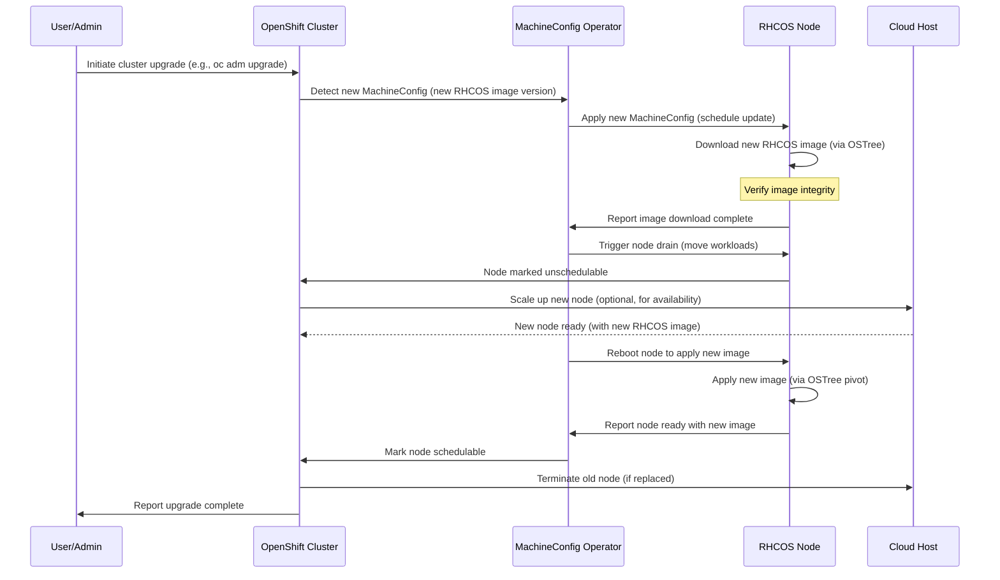

# Yes, OpenShift Relies on Red Hat CoreOS (RHCOS) in Its Core Architecture. Here Are the Specific Reasons and Background:

1. **RHCOS as the Default Operating System**:  
   OpenShift Container Platform (OCP) uses RHCOS as the default operating system for its nodes (including control plane nodes and worker nodes). RHCOS is a lightweight, container-optimized operating system specifically designed for running containerized workloads and is highly integrated with OpenShift's Kubernetes architecture.

2. **Immutable Infrastructure**:  
   RHCOS adopts an immutable infrastructure model, where the system is managed through atomic updates. This design ensures consistency and reliability, aligning with OpenShift's philosophy of automated operations and cluster management.

3. **Integration and Optimization**:  
   RHCOS includes specific tools and configurations required by OpenShift, such as the CRI-O container runtime, Ignition (for initial system configuration), and tight integration with the Red Hat ecosystem. These features make RHCOS the preferred operating system for OpenShift.

4. **Support for Other Operating Systems**:  
   While RHCOS is the default and recommended operating system, OpenShift also supports other operating systems (such as Red Hat Enterprise Linux, RHEL) as worker nodes in certain scenarios. However, control plane nodes typically still require RHCOS. Additionally, using non-RHCOS systems may require extra configuration and have limited support scope.

5. **Version Compatibility**:  
   OpenShift versions are closely related to RHCOS versions. Each OpenShift upgrade usually accompanies an RHCOS update to ensure compatibility and feature support.

### Summary
OpenShift highly depends on RHCOS, especially in its core functions and default deployments. RHCOS provides container optimization, immutable infrastructure, and seamless integration with the OpenShift ecosystem. While other operating systems can be used in some cases, RHCOS is the recommended and optimal choice for running OpenShift clusters.

If you have more specific needs or scenarios (such as hybrid deployments or specific versions), provide more details, and I can further answer your questions!

---

Immutable Infrastructure is a modern IT architecture and management philosophy that emphasizes that components of the infrastructure (such as servers, operating systems, configurations, etc.) are not modified after deployment. Instead, updates or changes are achieved by replacing entirely new, predefined instances. Here's a detailed explanation:

### 1. **Core Concepts**
- **Immutability**: Components of the infrastructure (such as virtual machines, container images, or operating systems) are not modified after deployment. If updates, fixes, or configuration changes are needed, a new instance (containing all updates) is created to replace the old one, rather than directly modifying the existing instance.
- **Atomicity**: Each change is applied in a complete, independent manner, avoiding inconsistent states caused by partial updates.
- **Declarative Configuration**: The state of the infrastructure is predefined through code or configuration files (such as Ignition, Terraform), ensuring predictable and consistent results for each deployment.

### 2. **Comparison with Traditional Mutable Infrastructure**
- **Traditional Mutable Infrastructure**:
    - After servers or systems are deployed, updates are performed by SSH login, running scripts, or manual configuration changes (such as installing patches, modifying configuration files).
    - Problems: Long-running systems may become unpredictable due to manual operations, configuration drift, or undocumented changes, making them difficult to debug or replicate.
- **Immutable Infrastructure**:
    - Systems are pre-built in the form of images or templates, containing all necessary software, configurations, and dependencies.
    - When updating, a new image is generated, new instances are deployed, and old instances are destroyed or gradually phased out.
    - Advantages: High consistency, easy automation, convenient rollback.

### 3. **Working Principle of Immutable Infrastructure**
Taking Red Hat CoreOS (RHCOS) and OpenShift as examples:
- **Image-based**: RHCOS uses pre-built operating system images, containing core components and configurations. Images are managed through version control (such as 4.12, 4.13).
- **Declarative Initialization**: RHCOS uses Ignition files to configure nodes at startup (such as network, storage, users), ensuring nodes start in the expected state.
- **Atomic Updates**: When upgrades or patches are needed, RHCOS downloads new images and applies updates atomically through OSTree technology, switching to the new image after node reboot.
- **Replace Rather Than Modify**: If the cluster needs to scale or update, OpenShift will start new RHCOS nodes (based on the latest image) and gradually take old nodes offline.

### 4. **Advantages of Immutable Infrastructure**
- **Consistency**: All instances are based on the same image, eliminating configuration drift issues and ensuring consistency across production, testing, and development environments.
- **Reproducibility**: Through versioned images and declarative configurations, infrastructure can be easily replicated or rebuilt.
- **Reliability**: Atomic updates reduce the risk of update failures, and quick rollback to old versions is possible in case of failure.
- **Security**: Immutable systems reduce opportunities for runtime modifications, lowering the risk of malicious tampering. Patches are applied through new images, avoiding vulnerabilities from manual patching.
- **Automation-friendly**: Closely integrated with CI/CD pipelines and Infrastructure as Code (IaC), suitable for DevOps practices.

### 5. **Challenges and Limitations**
- **Storage Overhead**: Each update requires a new image, which may increase storage requirements.
- **Initial Complexity**: Requires establishing automated pipelines (such as image building, deployment processes), with higher upfront investment.
- **State Management**: Immutable infrastructure is more suitable for stateless applications. For applications requiring persistent data (such as databases), additional state management mechanisms (such as external storage volumes) are needed.
- **Learning Curve**: Teams need to adapt to new tools and processes, such as containerization, IaC, or declarative configuration.

### 6. **Implementation in OpenShift and RHCOS**
- **Immutability of RHCOS**: RHCOS is a read-only root file system, with core configuration applied at startup through Ignition. System updates are implemented through OSTree, downloading new images and switching upon reboot.
- **OpenShift Cluster Management**: OpenShift uses the MachineConfig Operator to manage node configuration. Any configuration changes will trigger the creation of new nodes and replacement of old nodes.
- **Containerized Workloads**: Applications on OpenShift run in containers, which are themselves immutable. Each update generates new container images, consistent with the immutable infrastructure philosophy.

### 7. **Practical Application Scenarios**
- **Cluster Upgrades**: When upgrading OpenShift clusters, RHCOS nodes are replaced one by one with new version images, ensuring consistent cluster state.
- **Fault Recovery**: If a node fails, OpenShift automatically replaces it with a new node based on the same image, without manual repair.
- **CI/CD Integration**: When development teams push new application versions, they build new container images and deploy them to OpenShift, replacing old version containers.

### Summary
Immutable infrastructure achieves higher reliability, consistency, and automation capabilities by treating infrastructure components as immutable, versioned components. In OpenShift and RHCOS, this philosophy is implemented through read-only images, atomic updates, and declarative configuration, making cluster management more efficient and secure. If you have specific scenarios (such as how to implement immutable deployments in OpenShift or handle persistent data), we can discuss further!

---

The following is a sequence diagram using Mermaid syntax, showing the process of OpenShift cluster updates combined with RHCOS on cloud hosts. The diagram includes main participants (such as User/Admin, OpenShift cluster, MachineConfig Operator, RHCOS nodes, and cloud hosts) and key steps in the update process.

### Description
- **Participants**:
    - **User/Admin**: Administrator who initiates the update.
    - **OpenShift Cluster (OCP)**: OpenShift control plane that coordinates the upgrade.
    - **MachineConfig Operator (MCO)**: Manages node configuration and RHCOS updates.
    - **RHCOS Node**: Node running RHCOS that performs image updates.
    - **Cloud Host**: Cloud platform that provides host instances.
- **Process**:
    1. User triggers cluster upgrade through commands (such as `oc adm upgrade`).
    2. MCO detects new MachineConfig (containing new RHCOS image version).
    3. RHCOS node downloads new image (through OSTree) and verifies integrity.
    4. MCO coordinates node draining (workloads are moved) and marks node as unschedulable.
    5. Optionally: For high availability, the cluster may start new nodes on the cloud.
    6. Node reboots to apply new RHCOS image (OSTree pivot).
    7. After update completion, node becomes schedulable again, old nodes (if replaced) are terminated.
    8. Upgrade completes, user receives notification.

This diagram shows the typical process of OpenShift cluster and RHCOS updates on cloud hosts, emphasizing the characteristics of immutable infrastructure (nodes are updated by replacing with new images, not by modification). If you need more detailed steps or adjustments for specific scenarios, please let me know!