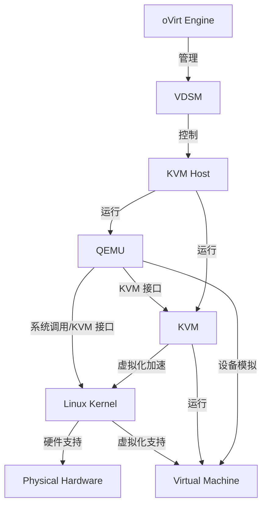

# oVirt 是一个免费的开源虚拟化管理平台，用于集中管理虚拟机、计算、存储和网络资源。它由 Red Hat 发起，是 Red Hat Virtualization 的社区项目基础。oVirt 基于 KVM（内核虚拟机）hypervisor，支持 x86-64、PowerPC64 和 s390x 架构，未来计划支持 ARM。

### 主要组件：
1. **oVirt Engine**：核心管理后端，用 Java 开发，运行在 WildFly 应用服务器上，通过 PostgreSQL 数据库存储数据。提供 Web 管理门户（Webadmin Portal）进行资源管理，支持 REST API 自定义功能。
2. **oVirt Node**：运行虚拟机的服务器，基于 RHEL、CentOS 或 Debian，启用 KVM 和 VDSM（虚拟桌面与服务器管理器）守护进程，负责管理节点上的计算、存储和网络资源。
3. **存储域**：用于存储虚拟机磁盘镜像、ISO 文件等，支持本地或共享存储（如 NFS、GlusterFS、Ceph）。

### 主要功能：
- **虚拟机管理**：支持创建、迁移、监控和停止虚拟机，提供高可用性和实时迁移。
- **用户管理**：可通过本地用户或集成 LDAP/AD 进行权限管理。
- **集群支持**：多节点集群增强可靠性、可用性和可扩展性。
- **超融合部署**：结合 GlusterFS 实现计算和存储一体化，适合小型或无高可用需求的场景。
- **集成性**：支持与 OpenStack、Foreman、ManageIQ 等开源项目集成，增强功能。

### 特点：
- **开源免费**：基于 Apache 许可证，无需高昂许可费用，适合替代 VMware vSphere 或 Microsoft Hyper-V。
- **灵活性**：支持从单节点到大型企业级数据中心的部署。
- **社区驱动**：由活跃社区维护，得到 Red Hat、Intel、Cisco 等公司支持。

### 与 Red Hat Virtualization (RHV) 的关系：
oVirt 是 RHV 的上游项目，RHV 是更稳定的企业级产品，提供商业支持，而 oVirt 更前沿但无官方支持，适合开发或测试环境。

### 应用场景：
- 企业数据中心虚拟化管理。
- 教育机构（如佛罗里达州立大学）或机场（如布鲁塞尔机场）的基础设施管理。
- 需要低成本、高灵活性虚拟化解决方案的中小型企业。

更多信息可访问 [oVirt 官网](https://www.ovirt.org/) 或 [Wikipedia](https://en.wikipedia.org/wiki/OVirt)。

---

oVirt、KVM 和 QEMU 是虚拟化技术栈中紧密相关的组件，各自扮演不同角色。以下是它们的关系介绍，以及请求的表格和 Mermaid 图。

### 关系介绍

1. **KVM (Kernel-based Virtual Machine)**:
    - KVM 是 Linux 内核中的虚拟化模块，允许 Linux 内核作为 hypervisor 运行。它利用 CPU 的硬件虚拟化扩展（如 Intel VT-x 或 AMD-V），提供高性能虚拟化。
    - KVM 本身只负责虚拟机的 CPU 和内存管理，依赖其他用户空间工具来处理设备模拟和 I/O。
    - 它是 oVirt 和 QEMU 的底层技术基础。

2. **QEMU**:
    - QEMU 是一个开源的虚拟化工具，功能强大，可模拟整个计算机系统（包括 CPU、内存、磁盘、网络等）。
    - 在 KVM 环境中，QEMU 作为用户空间工具，为 KVM 提供设备模拟（如虚拟网卡、磁盘控制器）和 I/O 处理。
    - QEMU 直接与 KVM 交互，通过 KVM 的接口加速虚拟机的运行，结合形成高效的虚拟化解决方案。

3. **oVirt**:
    - oVirt 是一个虚拟化管理平台，集中管理多个 KVM 主机（节点）上的虚拟机、存储和网络。
    - oVirt 使用 KVM 作为底层 hypervisor，通过 VDSM（虚拟桌面与服务器管理器）与 KVM/QEMU 交互，管理虚拟机的生命周期。
    - oVirt 不直接与 QEMU 交互，而是通过 VDSM 调用 QEMU/KVM 的功能。

### 关系总结
- **层级关系**：KVM 是内核级 hypervisor，QEMU 是用户空间的虚拟化工具，oVirt 是管理层平台。
- **交互方式**：oVirt 通过 VDSM 管理 KVM 主机，KVM 依赖 QEMU 提供完整的虚拟机环境。
- **功能互补**：KVM 提供高效的 CPU/内存虚拟化，QEMU 补充设备模拟，oVirt 提供集群管理和用户界面。

感谢您的反馈！您是对的，上一个 Mermaid 图未明确展示 QEMU 和 Linux Kernel 之间的关系。以下是更新的说明，重点补充 QEMU 和 Linux Kernel 的关系，并提供更清晰的 Mermaid 图和解释。

### QEMU 和 Linux Kernel 的关系
- **QEMU 的角色**：QEMU 是一个用户空间的虚拟化工具，负责模拟虚拟机的硬件环境（如 CPU、内存、磁盘、网络设备等）。它可以独立运行（纯软件模拟，性能较低）或与 KVM 结合使用。
- **与 Linux Kernel 的关系**：
    - 当 QEMU 单独运行时，它通过系统调用与 Linux Kernel 交互，依赖内核提供的资源（如内存分配、I/O 处理）来模拟虚拟机。
    - 当 QEMU 与 KVM 结合时，QEMU 通过 KVM 内核模块（`/dev/kvm` 接口）直接调用 Linux Kernel 的虚拟化功能，利用 CPU 硬件虚拟化扩展（如 Intel VT-x 或 AMD-V）加速虚拟机运行。
    - KVM 负责 CPU 和内存的虚拟化，但不处理设备模拟，QEMU 则补充设备模拟和 I/O 处理，共同构成完整的虚拟化环境。
- **交互方式**：QEMU 使用 KVM 的 ioctl 调用与 Linux Kernel 通信，将虚拟机的 CPU 指令直接交给硬件执行，同时 QEMU 自己处理虚拟机的非 CPU 相关操作（如虚拟网卡、磁盘 I/O）。

### oVirt、KVM、QEMU 和 Linux Kernel 的整体关系
- oVirt 是管理层，通过 VDSM 控制 KVM 主机。
- KVM 是 Linux Kernel 的虚拟化模块，依赖硬件虚拟化支持。
- QEMU 运行在用户空间，与 KVM 协同工作，依赖 Linux Kernel 的系统调用或 KVM 模块。
- Linux Kernel 提供底层支持，包括硬件资源管理和虚拟化加速。

### 更新后的 Mermaid 图
以下是更新的 Mermaid 图，明确展示 QEMU 和 Linux Kernel 的关系，以及与其他组件的交互：

**图说明**：
- **oVirt Engine** 通过 VDSM 管理 KVM 主机。
- **KVM 主机** 运行 KVM（内核模块）和 QEMU（用户空间工具）。
- **KVM** 依赖 Linux Kernel 的虚拟化功能，通过硬件加速（Physical Hardware）运行虚拟机。
- **QEMU** 与 Linux Kernel 交互：
    - 通过系统调用处理常规资源（如 I/O）。
    - 通过 KVM 接口（`/dev/kvm`）调用虚拟化加速功能。
- **Virtual Machine** 由 KVM（CPU/内存）和 QEMU（设备模拟）共同支持。
- **Linux Kernel** 提供底层支持，与 Physical Hardware 交互以实现高效虚拟化。

### 补充表格（突出 QEMU 和 Kernel 关系）
以下是更新后的表格，增加 QEMU 和 Linux Kernel 关系的细节：

| 特性/组件        | oVirt                              | KVM                              | QEMU                             | Linux Kernel                     |
|------------------|------------------------------------|----------------------------------|----------------------------------|----------------------------------|
| **类型**         | 虚拟化管理平台                     | 内核级 Hypervisor                | 用户空间虚拟化工具               | 操作系统内核                     |
| **主要功能**     | 集中管理虚拟机、存储、网络         | CPU 和内存虚拟化                 | 设备模拟、I/O 处理               | 资源管理、硬件虚拟化支持         |
| **与 Kernel 关系**| 间接依赖（通过 KVM/QEMU）          | 内核模块，直接使用 Kernel 虚拟化 | 通过系统调用或 KVM 接口交互      | 提供虚拟化加速和系统资源         |
| **依赖关系**     | 依赖 KVM 和 QEMU（通过 VDSM）      | 依赖 Linux Kernel                | 依赖 Kernel（系统调用或 KVM）    | 依赖物理硬件                     |
| **性能**         | 管理层，性能依赖 KVM/QEMU          | 高性能（硬件加速）               | 配合 KVM 时高效，单独较慢        | 提供底层性能支持                 |

### 额外说明
- **QEMU 的两种模式**：
    - **纯 QEMU 模式**：不使用 KVM，QEMU 通过 Linux Kernel 的系统调用模拟整个虚拟机，性能较低，适合无硬件虚拟化支持的场景。
    - **KVM 加速模式**：QEMU 通过 KVM 模块利用 Linux Kernel 的虚拟化功能，性能接近原生，oVirt 默认使用此模式。
- **oVirt 的角色**：oVirt 不直接与 Linux Kernel 交互，而是通过 VDSM 调用 KVM 和 QEMU 的功能。
- **实际工作流程**：
    1. oVirt Engine 下发虚拟机创建命令给 VDSM。
    2. VDSM 在 KVM 主机上启动 QEMU 进程。
    3. QEMU 通过 KVM 模块与 Linux Kernel 交互，创建虚拟机。
    4. KVM 利用硬件虚拟化运行虚拟机的 CPU/内存，QEMU 模拟其他设备。

如果您需要更深入的技术细节（例如 QEMU 和 KVM 的具体接口调用、VDSM 的代码实现）或想调整图表，请告诉我！

---

感谢您的提问！您提到的是 Mermaid 图中 QEMU (E) 连接到 Linux Kernel (F) 的线，标注为“系统调用/KVM 接口”。我来解释为什么这样标注，以及这条线代表的 QEMU 和 Linux Kernel 之间的交互。

### 为什么是“系统调用/KVM 接口”？
QEMU 和 Linux Kernel 之间的交互有两种主要方式，具体取决于是否使用 KVM 加速：

1. **系统调用（System Calls）**：
    - 当 QEMU 独立运行（不使用 KVM，例如在不支持硬件虚拟化的环境中），它作为一个用户空间程序，通过 Linux Kernel 提供的标准系统调用（如 `read`, `write`, `mmap` 等）与 Kernel 交互。这些系统调用用于管理内存、处理 I/O（如磁盘和网络操作）以及模拟虚拟机的硬件。
    - 在这种情况下，QEMU 完全依赖 Kernel 的通用功能，性能较低，因为所有虚拟化操作都由软件模拟。

2. **KVM 接口（/dev/kvm）**：
    - 当 QEMU 与 KVM 结合使用（这是 oVirt 的默认场景），QEMU 通过 KVM 提供的特殊接口（`/dev/kvm` 设备文件）与 Linux Kernel 交互。KVM 是一个内核模块，暴露了 ioctl 调用，允许 QEMU 直接利用 CPU 的硬件虚拟化扩展（如 Intel VT-x 或 AMD-V）来加速虚拟机的 CPU 和内存操作。
    - QEMU 使用 KVM 接口将虚拟机的 CPU 指令交给硬件执行，同时继续负责设备模拟（如虚拟网卡、磁盘控制器）。这大大提高了性能，接近原生速度。

3. **为什么标注为“系统调用/KVM 接口”**？
    - 在 oVirt 环境中，QEMU 通常与 KVM 一起使用，因此 KVM 接口是主要的交互方式。但 QEMU 仍然需要系统调用来处理非虚拟化相关的任务（如文件 I/O、网络通信）。
    - 为了全面表示 QEMU 和 Linux Kernel 的关系，标注“系统调用/KVM 接口”涵盖了两种交互方式：
        - **KVM 接口**：用于虚拟化加速（CPU 和内存管理）。
        - **系统调用**：用于设备模拟和其他常规操作。
    - 在 Mermaid 图中，这条线（`E -->|系统调用/KVM 接口| F`）表示 QEMU 依赖 Linux Kernel 的双重交互机制。

### 图中上下文
- **QEMU (E) -->|KVM 接口| KVM (D)**：QEMU 直接通过 `/dev/kvm` 调用 KVM 的功能，请求虚拟化加速。
- **QEMU (E) -->|系统调用/KVM 接口| Linux Kernel (F)**：QEMU 既通过 KVM 接口（依赖 Kernel 的 KVM 模块）进行虚拟化，也通过系统调用与 Kernel 交互以完成其他任务。
- **KVM (D) -->|虚拟化加速| Linux Kernel (F)**：KVM 作为一个内核模块，直接依赖 Kernel 的虚拟化支持。

---

oVirt 和 VirtualBox 都是虚拟化解决方案，但它们的定位、架构和使用场景有显著差异。以下是它们的区别说明，以及请求的对比表格。

### oVirt 和 VirtualBox 的区别

1. **定位和用途**：
    - **oVirt**：一个开源的企业级虚拟化管理平台，基于 KVM hypervisor，旨在集中管理大规模虚拟机、存储和网络资源。适合数据中心、企业环境或需要高可用性和集群管理的场景。
    - **VirtualBox**：由 Oracle 开发的开源桌面虚拟化工具，适用于个人用户、开发者或小型测试环境，用于在单机上运行多个虚拟机，测试软件或学习虚拟化。

2. **Hypervisor 类型**：
    - **oVirt**：使用 KVM（Type 1 裸金属 hypervisor），直接运行在硬件上，通过 Linux 内核提供高效虚拟化。
    - **VirtualBox**：Type 2 托管型 hypervisor，运行在主机操作系统（如 Windows、macOS、Linux）之上，依赖主机 OS 管理硬件资源。

3. **管理方式**：
    - **oVirt**：提供集中式管理，通过 Web 界面（Webadmin Portal）或 REST API 管理多个 KVM 主机，支持集群、高可用性和存储域。
    - **VirtualBox**：主要通过本地 GUI 或命令行工具（VBoxManage）管理单机上的虚拟机，缺乏企业级集中管理功能。

4. **可扩展性**：
    - **oVirt**：设计为高可扩展，支持多节点集群、负载均衡和超融合部署，适合大规模虚拟化环境。
    - **VirtualBox**：主要面向单机，扩展性有限，适合小型或个人使用场景。

5. **功能特性**：
    - **oVirt**：支持企业级功能，如实时迁移、高可用性、存储管理（NFS、GlusterFS、Ceph）、用户权限管理（LDAP/AD 集成）。
    - **VirtualBox**：提供用户友好的功能，如快照、共享文件夹、无缝模式（Seamless Mode）、跨平台支持，适合开发和测试。

6. **开源与许可**：
    - **oVirt**：完全开源，基于 Apache 许可证，免费使用，社区支持。
    - **VirtualBox**：核心开源（GNU GPL v2），但部分功能（如 USB 2.0/3.0、RDP）需要闭源的 Extension Pack，免费用于个人使用，商业使用可能需要许可。

7. **性能**：
    - **oVirt**：基于 KVM 的 Type 1 hypervisor，性能接近原生，适合高负载企业应用。
    - **VirtualBox**：Type 2 hypervisor，受主机 OS 影响，性能稍逊，适合轻量级任务。

### 对比表格

| 特性/组件            | oVirt                                      | VirtualBox                                |
|---------------------|--------------------------------------------|------------------------------------------|
| **类型**            | 企业级虚拟化管理平台                       | 桌面虚拟化工具                           |
| **Hypervisor**      | Type 1（KVM，裸金属）                      | Type 2（托管型）                         |
| **主要用途**        | 数据中心、企业级虚拟化管理                 | 个人使用、开发测试、学习                 |
| **管理方式**        | Web 界面、REST API、VDSM                   | GUI、VBoxManage CLI                      |
| **可扩展性**        | 高，支持多节点集群、超融合                 | 低，单机运行                             |
| **核心功能**        | 实时迁移、高可用性、存储域、用户权限管理   | 快照、共享文件夹、无缝模式、跨平台支持   |
| **支持的宿主 OS**   | Linux（RHEL、CentOS 等）                   | Windows、macOS、Linux、Solaris           |
| **支持的客户机 OS** | Windows、Linux 等（通过 KVM）              | 广泛，包括 Windows、Linux、macOS 等      |
| **许可**            | 完全开源（Apache 许可证）                  | 开源（GPL v2），Extension Pack 闭源      |
| **性能**            | 高（接近原生）                             | 中等（受主机 OS 影响）                   |
| **学习曲线**        | 较陡峭，需要虚拟化知识                    | 简单，用户友好                           |
| **社区支持**        | 社区支持，文档有时不完整                   | 强大社区，文档丰富                       |
| **典型场景**        | 企业数据中心、虚拟化集群                   | 个人开发、测试环境、小型实验             |

### 补充说明
- **oVirt 的优势**：适合需要集中管理、高可用性和大规模部署的场景，例如企业 IT 基础设施或教育机构的虚拟化实验室。它与 KVM 和 QEMU 的集成提供了高性能和灵活性，但配置较复杂，适合有 Linux 管理经验的用户。
- **VirtualBox 的优势**：易于安装和使用，支持广泛的宿主和客户机操作系统，适合个人用户或开发者在本地测试不同 OS 或软件。功能如无缝模式和共享文件夹提升了桌面用户体验，但不适合生产环境。

### 使用建议
- 选择 **oVirt** 如果：
    - 你需要管理多个虚拟机和主机，构建企业级虚拟化平台。
    - 你有 Linux 管理经验，愿意投入时间配置和管理集群。
    - 你需要高可用性、实时迁移等高级功能。
- 选择 **VirtualBox** 如果：
    - 你是个人用户、开发者或学生，需要简单易用的虚拟化工具。
    - 你需要在 Windows、macOS 或 Linux 上运行少量虚拟机进行测试。
    - 你优先考虑用户友好性和跨平台支持。

如果需要更详细的某方面比较（例如性能测试数据或配置步骤），请告诉我！