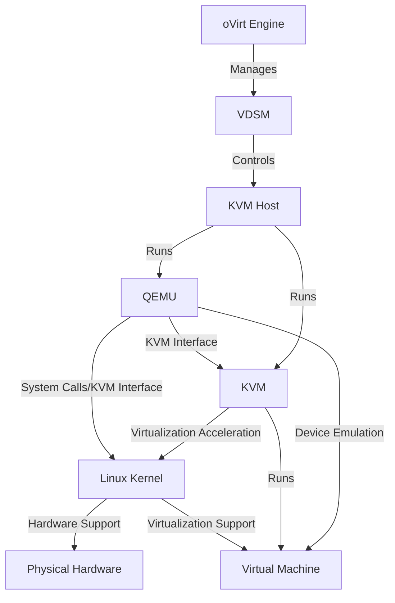

# oVirt is a free and open-source virtualization management platform used for centralized management of virtual machines, compute, storage, and network resources. It was initiated by Red Hat and serves as the community project foundation for Red Hat Virtualization. oVirt is based on the KVM (Kernel-based Virtual Machine) hypervisor and supports x86-64, PowerPC64, and s390x architectures, with plans to support ARM in the future.

### Main Components:
1. **oVirt Engine**: The core management backend, developed in Java, running on the WildFly application server, with data stored through a PostgreSQL database. Provides a web management portal (Webadmin Portal) for resource management and supports REST API for custom functionality.
2. **oVirt Node**: Servers that run virtual machines, based on RHEL, CentOS, or Debian, with KVM and VDSM (Virtual Desktop and Server Manager) daemon enabled, responsible for managing compute, storage, and network resources on the node.
3. **Storage Domain**: Used to store virtual machine disk images, ISO files, etc., supporting local or shared storage (such as NFS, GlusterFS, Ceph).

### Main Features:
- **Virtual Machine Management**: Supports creating, migrating, monitoring, and stopping virtual machines, providing high availability and live migration.
- **User Management**: Can perform permission management through local users or integrated LDAP/AD.
- **Cluster Support**: Multi-node clusters enhance reliability, availability, and scalability.
- **Hyper-converged Deployment**: Combines with GlusterFS to achieve compute and storage integration, suitable for small or non-high availability requirement scenarios.
- **Integration**: Supports integration with open-source projects like OpenStack, Foreman, ManageIQ to enhance functionality.

### Characteristics:
- **Open Source and Free**: Based on the Apache license, no high licensing fees, suitable as an alternative to VMware vSphere or Microsoft Hyper-V.
- **Flexibility**: Supports deployment from single nodes to large enterprise data centers.
- **Community-driven**: Maintained by an active community, supported by companies like Red Hat, Intel, Cisco.

### Relationship with Red Hat Virtualization (RHV):
oVirt is the upstream project for RHV. RHV is a more stable enterprise-grade product providing commercial support, while oVirt is more cutting-edge but without official support, suitable for development or testing environments.

### Application Scenarios:
- Enterprise data center virtualization management.
- Educational institutions (like Florida State University) or airports (like Brussels Airport) infrastructure management.
- Small and medium-sized enterprises needing low-cost, high-flexibility virtualization solutions.

More information can be found at [oVirt official website](https://www.ovirt.org/) or [Wikipedia](https://en.wikipedia.org/wiki/OVirt).

---

oVirt, KVM, and QEMU are closely related components in the virtualization technology stack, each playing different roles. Here's their relationship introduction, along with the requested table and Mermaid diagram.

### Relationship Introduction

1. **KVM (Kernel-based Virtual Machine)**:
    - KVM is a virtualization module in the Linux kernel that allows the Linux kernel to act as a hypervisor. It utilizes CPU hardware virtualization extensions (such as Intel VT-x or AMD-V) to provide high-performance virtualization.
    - KVM itself is only responsible for virtual machine CPU and memory management and relies on other user-space tools to handle device emulation and I/O.
    - It is the underlying technology foundation for oVirt and QEMU.

2. **QEMU**:
    - QEMU is a powerful open-source virtualization tool that can emulate entire computer systems (including CPU, memory, disk, network, etc.).
    - In KVM environments, QEMU serves as a user-space tool, providing device emulation (such as virtual network cards, disk controllers) and I/O processing for KVM.
    - QEMU directly interacts with KVM, accelerating virtual machine operation through KVM's interfaces, forming an efficient virtualization solution together.

3. **oVirt**:
    - oVirt is a virtualization management platform that centrally manages virtual machines, storage, and networks across multiple KVM hosts (nodes).
    - oVirt uses KVM as the underlying hypervisor and interacts with KVM/QEMU through VDSM (Virtual Desktop and Server Manager) to manage virtual machine lifecycles.
    - oVirt doesn't directly interact with QEMU but calls QEMU/KVM functions through VDSM.

### Relationship Summary
- **Layer Relationship**: KVM is the kernel-level hypervisor, QEMU is the user-space virtualization tool, and oVirt is the management layer platform.
- **Interaction Method**: oVirt manages KVM hosts through VDSM, and KVM relies on QEMU to provide a complete virtual machine environment.
- **Functional Complementarity**: KVM provides efficient CPU/memory virtualization, QEMU supplements device emulation, and oVirt provides cluster management and user interfaces.

Thank you for your feedback! You're right, the previous Mermaid diagram didn't clearly show the relationship between QEMU and the Linux Kernel. Here's an updated explanation, focusing on supplementing the relationship between QEMU and the Linux Kernel, along with a clearer Mermaid diagram and explanation.

### QEMU and Linux Kernel Relationship
- **QEMU's Role**: QEMU is a user-space virtualization tool responsible for emulating the virtual machine's hardware environment (such as CPU, memory, disk, network devices, etc.). It can run independently (pure software emulation, lower performance) or in combination with KVM.
- **Relationship with Linux Kernel**:
    - When QEMU runs independently (without KVM, such as in environments without hardware virtualization support), it interacts with the Linux Kernel through standard system calls provided by the kernel (such as `read`, `write`, `mmap`, etc.) as a user-space program. These system calls are used to manage memory, handle I/O (such as disk and network operations), and emulate virtual machine hardware.
    - When QEMU combines with KVM (oVirt's default scenario), QEMU directly calls the Linux Kernel's virtualization functions through KVM's special interface (`/dev/kvm` device file). KVM is a kernel module that exposes ioctl calls, allowing QEMU to directly utilize CPU hardware virtualization extensions (such as Intel VT-x or AMD-V) to accelerate virtual machine CPU and memory operations.
    - KVM is responsible for CPU and memory virtualization but doesn't handle device emulation. QEMU supplements device emulation and I/O processing, together forming a complete virtualization environment.
- **Interaction Method**: QEMU uses KVM's ioctl calls to communicate with the Linux Kernel, directly hands over virtual machine CPU instructions to hardware for execution, while QEMU itself handles virtual machine non-CPU related operations (such as virtual network cards, disk I/O).

### Overall Relationship of oVirt, KVM, QEMU, and Linux Kernel
- oVirt is the management layer that controls KVM hosts through VDSM.
- KVM hosts run KVM (kernel module) and QEMU (user-space tool).
- KVM relies on the Linux Kernel's virtualization functions, supported by hardware acceleration.
- QEMU runs in user space, works with KVM, and depends on the Linux Kernel's system calls or KVM module.
- The Linux Kernel provides underlying support, including hardware resource management and virtualization acceleration.

### Updated Mermaid Diagram
Here's the updated Mermaid diagram, clearly showing the relationship between QEMU and the Linux Kernel, as well as interactions with other components:

**Diagram Explanation**:
- **oVirt Engine** manages KVM hosts through VDSM.
- **KVM Host** runs KVM (kernel module) and QEMU (user-space tool).
- **KVM** relies on the Linux Kernel's virtualization functions, running virtual machines through hardware acceleration (Physical Hardware).
- **QEMU** interacts with the Linux Kernel:
    - Handles regular resources (such as I/O) through system calls.
    - Calls virtualization acceleration functions through the KVM interface (`/dev/kvm`).
- **Virtual Machine** is jointly supported by KVM (CPU/memory) and QEMU (device emulation).
- **Linux Kernel** provides underlying support and interacts with Physical Hardware for efficient virtualization.

### Supplementary Table (Highlighting QEMU and Kernel Relationship)
Here's an updated table with added details about the relationship between QEMU and the Linux Kernel:

| Feature/Component | oVirt                              | KVM                              | QEMU                             | Linux Kernel                     |
|-------------------|------------------------------------|----------------------------------|----------------------------------|----------------------------------|
| **Type**          | Virtualization Management Platform | Kernel-level Hypervisor          | User-space Virtualization Tool   | Operating System Kernel          |
| **Main Function** | Centrally manages VMs, storage, networks | CPU and memory virtualization    | Device emulation, I/O processing | Resource management, hardware virtualization support |
| **Relationship with Kernel** | Indirect dependency (through KVM/QEMU) | Kernel module, directly uses Kernel virtualization | Interacts with Kernel through system calls or KVM interface | Provides virtualization acceleration and system resources |
| **Dependencies**  | Depends on KVM and QEMU (through VDSM) | Depends on Linux Kernel          | Depends on Kernel (system calls or KVM) | Depends on physical hardware     |
| **Performance**   | Management layer, performance depends on KVM/QEMU | High performance (hardware acceleration) | Efficient when combined with KVM, slower when standalone | Provides underlying performance support |

### Additional Notes
- **QEMU's Two Modes**:
    - **Pure QEMU Mode**: Without using KVM, QEMU emulates the entire virtual machine through Linux Kernel's system calls, with lower performance, suitable for scenarios without hardware virtualization support.
    - **KVM Acceleration Mode**: QEMU utilizes the Linux Kernel's virtualization functions through the KVM module, with near-native performance, which is oVirt's default mode.
- **oVirt's Role**: oVirt doesn't directly interact with the Linux Kernel but calls KVM and QEMU functions through VDSM.
- **Actual Workflow**:
    1. oVirt Engine issues virtual machine creation commands to VDSM.
    2. VDSM starts QEMU processes on KVM hosts.
    3. QEMU interacts with the Linux Kernel through the KVM module to create virtual machines.
    4. KVM utilizes hardware virtualization to run virtual machine CPU/memory, while QEMU emulates other devices.

If you need more in-depth technical details (such as specific interface calls between QEMU and KVM, VDSM code implementation) or want to adjust the diagram, please let me know!

### oVirt vs VirtualBox

oVirt and VirtualBox are both virtualization solutions, but they have significant differences in positioning, architecture, and use cases. Here's their comparison and the requested comparison table.

### Differences Between oVirt and VirtualBox

1. **Positioning and Use Cases**:
    - **oVirt**: An open-source enterprise-grade virtualization management platform based on the KVM hypervisor, aimed at centrally managing large-scale virtual machines, storage, and network resources. Suitable for data centers, enterprise environments, or scenarios requiring high availability and cluster management.
    - **VirtualBox**: An open-source desktop virtualization tool developed by Oracle, suitable for individual users, developers, or small testing environments, used to run multiple virtual machines on a single machine for software testing or learning virtualization.

2. **Hypervisor Type**:
    - **oVirt**: Uses KVM (Type 1 bare-metal hypervisor), runs directly on hardware, providing efficient virtualization through the Linux kernel.
    - **VirtualBox**: Type 2 hosted hypervisor, runs on top of the host operating system (such as Windows, macOS, Linux), relying on the host OS to manage hardware resources.

3. **Management Method**:
    - **oVirt**: Provides centralized management through web interface (Webadmin Portal) or REST API to manage multiple KVM hosts, supporting clusters, high availability, and storage domains.
    - **VirtualBox**: Mainly manages virtual machines on a single machine through local GUI or command-line tools (VBoxManage), lacking enterprise-level centralized management features.

4. **Scalability**:
    - **oVirt**: Designed for high scalability, supports multi-node clusters, load balancing, and hyper-converged deployment, suitable for large-scale virtualization environments.
    - **VirtualBox**: Mainly oriented toward single machines, with limited scalability, suitable for small or personal use scenarios.

5. **Feature Characteristics**:
    - **oVirt**: Supports enterprise-grade features such as live migration, high availability, storage management (NFS, GlusterFS, Ceph), user permission management (LDAP/AD integration).
    - **VirtualBox**: Provides user-friendly features such as snapshots, shared folders, seamless mode, cross-platform support, suitable for development and testing.

6. **Open Source and Licensing**:
    - **oVirt**: Completely open-source, based on the Apache license, free to use, with community support.
    - **VirtualBox**: Core is open-source (GNU GPL v2), but some features (such as USB 2.0/3.0, RDP) require the closed-source Extension Pack, free for personal use, commercial use may require licensing.

7. **Performance**:
    - **oVirt**: Based on KVM's Type 1 hypervisor, performance is close to native, suitable for high-load enterprise applications.
    - **VirtualBox**: Type 2 hypervisor, affected by the host OS, performance is slightly inferior, suitable for lightweight tasks.

### Comparison Table

| Feature/Component     | oVirt                                      | VirtualBox                                |
|-----------------------|--------------------------------------------|------------------------------------------|
| **Type**              | Enterprise Virtualization Management Platform | Desktop Virtualization Tool              |
| **Hypervisor**        | Type 1 (KVM, Bare-metal)                   | Type 2 (Hosted)                          |
| **Main Use Cases**    | Data center, enterprise virtualization management | Personal use, development testing, learning |
| **Management Method** | Web interface, REST API, VDSM              | GUI, VBoxManage CLI                      |
| **Scalability**       | High, supports multi-node clusters, hyper-converged | Low, single machine operation            |
| **Core Features**     | Live migration, high availability, storage domains, user permission management | Snapshots, shared folders, seamless mode, cross-platform support |
| **Supported Host OS** | Linux (RHEL, CentOS, etc.)                 | Windows, macOS, Linux, Solaris           |
| **Supported Guest OS**| Windows, Linux, etc. (through KVM)         | Wide range, including Windows, Linux, macOS |
| **Licensing**         | Completely open-source (Apache License)    | Open-source (GPL v2), Extension Pack closed-source |
| **Performance**       | High (near-native)                         | Medium (affected by host OS)             |
| **Learning Curve**    | Steeper, requires virtualization knowledge | Simple, user-friendly                    |
| **Community Support** | Community support, documentation sometimes incomplete | Strong community, rich documentation     |
| **Typical Scenarios** | Enterprise data centers, virtualization clusters | Personal development, testing environments, small experiments |

### Additional Notes
- **oVirt Advantages**: Suitable for scenarios requiring centralized management, high availability, and large-scale deployment, such as enterprise IT infrastructure or educational institution virtualization laboratories. Its integration with KVM and QEMU provides high performance and flexibility, but configuration is more complex, suitable for users with Linux management experience.
- **VirtualBox Advantages**: Easy to install and use, supports a wide range of host and guest operating systems, suitable for individual users or developers to test different OS or software locally. Features like seamless mode and shared folders enhance the desktop user experience, but it's not suitable for production environments.

### Usage Recommendations
- Choose **oVirt** if:
    - You need to manage multiple virtual machines and hosts, building an enterprise-grade virtualization platform.
    - You have Linux management experience and are willing to invest time in configuring and managing clusters.
    - You need advanced features like high availability and live migration.
- Choose **VirtualBox** if:
    - You are an individual user, developer, or student who needs a simple and easy-to-use virtualization tool.
    - You need to run a small number of virtual machines on Windows, macOS, or Linux for testing.
    - You prioritize user-friendliness and cross-platform support.

If you need more detailed comparison in specific aspects (such as performance test data or configuration steps), please let me know!

---

No, **VirtualBox does not depend on KVM**. This is a common misunderstanding because both VirtualBox and KVM are virtualization technologies, but their architectures and working methods are completely different. Here's a detailed explanation to clarify the relationship between VirtualBox and KVM, combined with the previous oVirt context.

### Does VirtualBox Depend on KVM?
- **VirtualBox Architecture**:
    - VirtualBox is a **Type 2 hypervisor** (hosted virtualization) developed by Oracle that runs on top of the host operating system (such as Windows, macOS, Linux, or Solaris).
    - It accesses hardware resources through the host operating system's system calls and drivers, emulating the virtual machine's CPU, memory, storage, and network, etc.
    - VirtualBox has its own built-in virtualization engine and **does not depend on KVM or any other external hypervisor**. It directly handles virtualization tasks, combined with the host OS functionality.

- **KVM Architecture**:
    - KVM (Kernel-based Virtual Machine) is a **Type 1 hypervisor** (bare-metal virtualization) integrated into the Linux kernel, relying on the Linux kernel's virtualization module (`/dev/kvm`) and hardware virtualization extensions (such as Intel VT-x or AMD-V).
    - KVM requires user-space tools (such as QEMU) to provide device emulation, together forming a complete virtualization environment.
    - KVM only runs on Linux systems and requires specific kernel support.

- **Relationship Between VirtualBox and KVM**:
    - **Completely Independent**: VirtualBox doesn't use KVM as its virtualization engine. Even when running on Linux systems, VirtualBox still uses its own virtualization implementation rather than calling KVM.
    - **Competitive Relationship**: In some scenarios, VirtualBox and KVM may be mutually exclusive. For example, if the KVM module is already loaded (`/dev/kvm` is occupied), VirtualBox may not be able to use hardware virtualization features simultaneously because they compete for CPU virtualization extensions.
    - **Compatibility**: On Linux, VirtualBox can coexist with KVM, but care must be taken to ensure hardware virtualization resources (VT-x/AMD-V) don't conflict. For example, when running KVM virtual machines, VirtualBox virtual machines may need to be paused.

- **VirtualBox Hardware Virtualization**:
    - VirtualBox supports hardware virtualization (Intel VT-x or AMD-V), but this is achieved through direct interaction with the CPU, not through KVM.
    - On Linux hosts, VirtualBox uses its own kernel modules (`vboxdrv`, etc.) to manage hardware virtualization, unrelated to KVM's modules (`kvm` and `kvm-intel`/`kvm-amd`).

### Combining oVirt and VirtualBox Context
You previously mentioned the comparison between oVirt and VirtualBox, as well as the relationship between KVM and QEMU. Here are the key points to clarify the relationship between VirtualBox and oVirt/KVM:
- **oVirt**:
    - oVirt is an enterprise-grade virtualization management platform that **depends on KVM** as the underlying hypervisor.
    - KVM runs on bare-metal Linux systems (Type 1), combined with QEMU to provide efficient virtualization, and oVirt manages these KVM hosts through VDSM.
    - Therefore, oVirt's virtualization is completely based on KVM and the Linux kernel.

- **VirtualBox**:
    - VirtualBox doesn't depend on KVM, runs on the host OS (Type 2), and is suitable for individual users or testing environments.
    - It cannot directly integrate with oVirt because oVirt is specifically designed to manage KVM hosts, while VirtualBox uses its own virtualization engine.

- **Key Differences**:
    - **oVirt + KVM**: Bare-metal, Type 1 hypervisor, enterprise-grade management, high performance, depends on Linux and KVM.
    - **VirtualBox**: Hosted, Type 2 hypervisor, desktop-grade application, cross-platform, doesn't depend on KVM.

### Why the Misconception That "VirtualBox Depends on KVM"?
- **Linux Environment**: When running VirtualBox on Linux systems, you might see discussions related to KVM (such as `/dev/kvm` or `kvm` modules), leading to the mistaken belief that VirtualBox uses KVM.
- **Hardware Virtualization**: Both VirtualBox and KVM utilize CPU hardware virtualization extensions (VT-x/AMD-V), which might make people think they share underlying technology, but their implementations are actually independent.
- **Community Discussions**: Some users may try to run VirtualBox and KVM virtual machines simultaneously on Linux, encounter conflicts (such as competition for hardware virtualization resources), and thus confuse the relationship between the two.

### Verifying That VirtualBox Doesn't Depend on KVM
- **Cross-platform Operation**: VirtualBox can run on Windows and macOS, while KVM only supports Linux, proving that VirtualBox doesn't depend on KVM.
- **Kernel Modules**: On Linux, checking VirtualBox's kernel modules (`lsmod | grep vbox`) will show `vboxdrv` and other modules, not `kvm` or `kvm-intel`.
- **Configuration**: VirtualBox's settings (such as "Acceleration" options) allow enabling/disabling hardware virtualization (VT-x/AMD-V) but never mention KVM.

### Updated Comparison Table (Combining oVirt and VirtualBox)
Here's a comparison table specifically for VirtualBox and oVirt, emphasizing that VirtualBox doesn't depend on KVM:

| Feature/Component     | oVirt                                      | VirtualBox                                |
|-----------------------|--------------------------------------------|------------------------------------------|
| **Type**              | Enterprise Virtualization Management Platform | Desktop Virtualization Tool              |
| **Hypervisor**        | Type 1 (KVM, Bare-metal)                   | Type 2 (Hosted)                          |
| **Depends on KVM**    | Yes, depends on KVM as hypervisor          | No, uses its own virtualization engine   |
| **Runtime Environment**| Bare-metal Linux (RHEL, CentOS, etc.)      | Windows, macOS, Linux, Solaris           |
| **Management Method** | Web interface, REST API, VDSM              | GUI, VBoxManage CLI                      |
| **Performance**       | High (near-native, KVM acceleration)       | Medium (affected by host OS)             |
| **Typical Scenarios** | Enterprise data centers, virtualization clusters | Personal development, testing environments, small experiments |

### Summary
- **VirtualBox doesn't depend on KVM**, it's an independent Type 2 hypervisor that uses its own virtualization engine and runs on top of the host operating system.
- **oVirt depends on KVM**, KVM is a Type 1 hypervisor that runs on bare-metal Linux systems, providing high-performance virtualization.
- VirtualBox and KVM both support hardware virtualization (VT-x/AMD-V), but their implementation methods are different and independent of each other.

If you have further questions (such as performance comparison between VirtualBox and KVM, solutions for configuration conflicts, or other oVirt-related questions), please let me know!