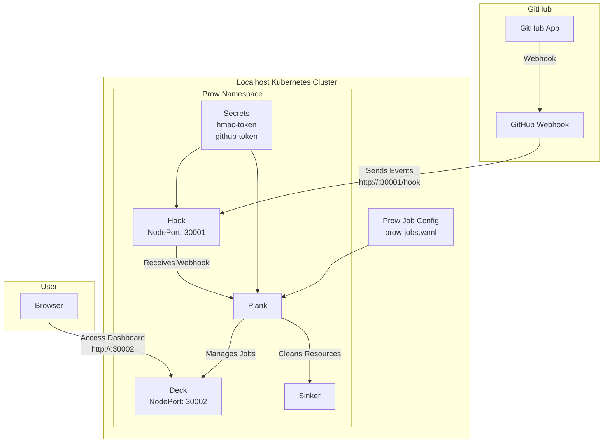
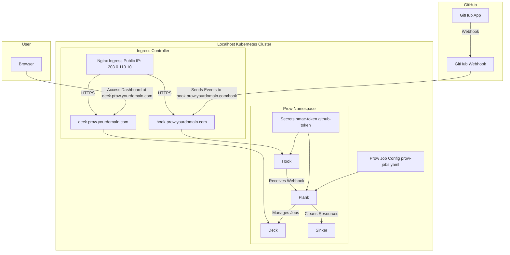

# 在本地主机 Kubernetes 集群上部署 Prow（使用 NodePort）

本教程指导你在本地主机 Kubernetes 集群上部署 Prow，使用 `NodePort` 暴露服务，GitHub 可访问本地主机端口，无需 Google Cloud Storage 配置。

## 前提条件
- 本地主机运行的 Kubernetes 集群（如 Minikube）。
- 已安装 `kubectl` 和 `git`。
- GitHub 账户和组织，用于创建 GitHub App。
- 本地主机 IP 可被 GitHub 访问（例如通过端口转发）。

## 步骤 1：创建 GitHub App
1. 登录 GitHub，访问 [GitHub App 创建页面](https://github.com/settings/apps/new)。
2. 填写 App 名称（例如 `my-prow-bot`），Webhook URL 暂时设为 `http://example.com`（稍后更新）。
3. 配置权限：
    - Administration: Read-Only
    - Checks: Read-Only
    - Contents: Read & Write
    - Issues: Read & Write
    - Pull Requests: Read & Write
    - Metadata: Read-Only
4. 保存后，记录 **App ID** 和 **Webhook Secret**。
5. 生成并下载私钥（`.pem` 文件）。

## 步骤 2：准备 Kubernetes 集群
1. 创建 Prow 命名空间：
   ```bash
   kubectl create namespace prow
   ```

## 步骤 3：配置 Prow 的 Secrets
1. 生成 HMAC 令牌：
   ```bash
   openssl rand -hex 20 > /path/to/hook/secret
   ```
2. 创建 Secrets：
   ```bash
   kubectl create secret -n prow generic hmac-token --from-file=hmac=/path/to/hook/secret
   kubectl create secret -n prow generic github-token --from-file=app_private_key=/path/to/private-key.pem --from-literal=app_id=<your-app-id>
   ```

## 步骤 4：部署 Prow 组件（使用 NodePort）
1. 下载 `100_starter.yaml`：
   ```bash
   curl -O https://raw.githubusercontent.com/kubernetes-sigs/prow/main/test/integration/config/prow/cluster/100_starter.yaml
   ```
2. 修改 `100_starter.yaml` 中的服务配置为 `NodePort`：
    - 编辑 Hook 服务（确保服务名为 `hook`）：
      ```yaml
      apiVersion: v1
      kind: Service
      metadata:
        name: hook
        namespace: prow
      spec:
        selector:
          app: hook
        ports:
        - port: 8888
          targetPort: 8888
          nodePort: 30001
        type: NodePort
      ```
    - 编辑 Deck 服务（确保服务名为 `deck`）：
      ```yaml
      apiVersion: v1
      kind: Service
      metadata:
        name: deck
        namespace: prow
      spec:
        selector:
          app: deck
        ports:
        - port: 80
          targetPort: 80
          nodePort: 30002
        type: NodePort
      ```
3. 应用配置文件：
   ```bash
   kubectl apply -f 100_starter.yaml
   ```
4. 验证 Prow 组件运行：
   ```bash
   kubectl get pods -n prow
   ```
   确保所有 Pod 状态为 `Running`。

## 步骤 5：配置 GitHub Webhook
1. 获取本地主机 IP（例如 `192.168.1.100`）。
2. 返回 GitHub App 设置页面，更新 Webhook URL 为 `http://<your-local-ip>:30001/hook`（例如 `http://192.168.1.100:30001/hook`）。
3. 将 Webhook Secret 设置为 `/path/to/hook/secret` 中的值。
4. 选择事件：Push、Pull Request、Issue Comment。

## 步骤 6：配置 Prow 作业
1. 在你的 GitHub 仓库中创建 `prow-jobs.yaml`，定义作业。例如：
   ```yaml
   presubmits:
     your-org/your-repo:
     - name: unit-test
       always_run: true
       decorate: true
       spec:
         containers:
         - image: golang:1.18
           command:
           - go
           args:
           - test
   ```
2. 提交到仓库根目录。

## 步骤 7：测试和验证
1. 触发一个 Pull Request，检查 Prow 是否运行作业。
2. 访问 Deck 仪表板：`http://<your-local-ip>:30002`（例如 `http://192.168.1.100:30002`），查看作业状态。
3. 检查 Hook 是否收到 Webhook：
   ```bash
   kubectl logs -n prow -l app=hook
   ```

## 故障排除
- **Webhook 失败**：确保 `30001` 端口可被 GitHub 访问，检查防火墙设置。
- **Deck 无法访问**：确认 `30002` 端口未被占用，Pod 状态正常。
- **作业未运行**：检查 `prow-jobs.yaml` 语法，确保存储库权限正确。


### 说明
- **NodePort 配置**：Hook 使用 `30001` 端口（映射到 `8888`），Deck 使用 `30002` 端口（映射到 `80`），适合本地主机部署。
- **移除 Google 相关配置**：教程中已移除 Google Cloud Storage 和相关服务账户配置。
- **简洁性**：教程聚焦核心步骤，适合快速部署。

如需进一步调整或帮助，请告诉我！

---

以下是基于上述教程（在本地主机 Kubernetes 集群上部署 Prow，使用 `NodePort` 配置方式）的 Mermaid 部署架构图。图中包含了教程中的核心组件和交互关系，去除了 Google Cloud Storage 相关部分，并明确了 `NodePort` 的端口暴露。

### Mermaid 部署架构图



### 图表说明
1. **GitHub 部分**：
    - `GitHub App` 通过 `GitHub Webhook` 发送事件到 Prow 的 Hook 组件。
    - Webhook URL 配置为 `http://<local-ip>:30001/hook`，对应 Hook 的 `NodePort` 端口 `30001`。

2. **Kubernetes 集群（本地主机）**：
    - 所有 Prow 组件运行在 `prow` 命名空间内。
    - `Hook` 接收 Webhook 事件，暴露在 `NodePort: 30001`（映射到服务端口 `8888`）。
    - `Plank` 管理作业，基于 `prow-jobs.yaml` 配置。
    - `Deck` 提供仪表板，暴露在 `NodePort: 30002`（映射到服务端口 `80`），供用户通过浏览器访问。
    - `Sinker` 清理资源，无需外部访问。
    - `Secrets`（`hmac-token` 和 `github-token`）用于身份验证。

3. **用户访问**：
    - 用户通过浏览器访问 Deck 仪表板，URL 为 `http://<local-ip>:30002`。

### 渲染方式
- 你可以将上述 Mermaid 代码粘贴到支持 Mermaid 的工具中（如 GitHub Markdown 或 Mermaid Live Editor：https://mermaid.live/）来渲染图表。

如果需要调整图表样式或添加更多细节，请告诉我！

---

# 在本地主机 Kubernetes 集群上部署 Prow（使用 Nginx 和 HTTPS）

本教程指导你在本地主机 Kubernetes 集群上部署 Prow，使用公网 IP 和独立域名，通过 Nginx Ingress 控制器暴露服务，并启用 HTTPS。

## 前提条件
- 本地主机运行的 Kubernetes 集群（如 Minikube）。
- 已安装 `kubectl` 和 `git`。
- GitHub 账户和组织，用于创建 GitHub App。
- 本地主机有公网 IP（例如 `203.0.113.10`）。
- 独立域名（例如 `prow.yourdomain.com`），DNS 已配置指向公网 IP。
- 已安装 `cert-manager` 用于自动获取 HTTPS 证书（或手动准备 TLS 证书）。

## 步骤 1：创建 GitHub App
1. 登录 GitHub，访问 [GitHub App 创建页面](https://github.com/settings/apps/new)。
2. 填写 App 名称（例如 `my-prow-bot`），Webhook URL 暂时设为 `https://hook.prow.yourdomain.com/hook`（稍后验证）。
3. 配置权限：
    - Administration: Read-Only
    - Checks: Read-Only
    - Contents: Read & Write
    - Issues: Read & Write
    - Pull Requests: Read & Write
    - Metadata: Read-Only
4. 保存后，记录 **App ID** 和 **Webhook Secret**。
5. 生成并下载私钥（`.pem` 文件）。

## 步骤 2：准备 Kubernetes 集群
1. 创建 Prow 命名空间：
   ```bash
   kubectl create namespace prow
   ```

## 步骤 3：配置 Prow 的 Secrets
1. 生成 HMAC 令牌：
   ```bash
   openssl rand -hex 20 > /path/to/hook/secret
   ```
2. 创建 Secrets：
   ```bash
   kubectl create secret -n prow generic hmac-token --from-file=hmac=/path/to/hook/secret
   kubectl create secret -n prow generic github-token --from-file=app_private_key=/path/to/private-key.pem --from-literal=app_id=<your-app-id>
   ```

## 步骤 4：安装 Nginx Ingress 控制器
1. 安装 Nginx Ingress 控制器：
   ```bash
   kubectl apply -f https://raw.githubusercontent.com/kubernetes/ingress-nginx/main/deploy/static/provider/baremetal/deploy.yaml
   ```
2. 验证控制器运行：
   ```bash
   kubectl get pods -n ingress-nginx
   ```
3. 获取 Nginx Ingress 的外部 IP（通常是主机的公网 IP `203.0.113.10`）：
   ```bash
   kubectl get svc -n ingress-nginx
   ```

## 步骤 5：配置 HTTPS（使用 cert-manager）
1. 安装 cert-manager（用于自动获取 Let's Encrypt 证书）：
   ```bash
   kubectl apply -f https://github.com/cert-manager/cert-manager/releases/download/v1.15.3/cert-manager.yaml
   ```
2. 创建 ClusterIssuer 用于 Let's Encrypt：
   ```yaml
   apiVersion: cert-manager.io/v1
   kind: ClusterIssuer
   metadata:
     name: letsencrypt-prod
   spec:
     acme:
       server: https://acme-v02.api.letsencrypt.org/directory
       email: your-email@example.com
       privateKeySecretRef:
         name: letsencrypt-prod
       solvers:
       - http01:
           ingress:
             class: nginx
   ```
   应用：
   ```bash
   kubectl apply -f clusterissuer.yaml
   ```

## 步骤 6：部署 Prow 组件
1. 下载 `100_starter.yaml`：
   ```bash
   curl -O https://raw.githubusercontent.com/kubernetes-sigs/prow/main/test/integration/config/prow/cluster/100_starter.yaml
   ```
2. 确保服务类型为 `ClusterIP`（默认即可，Nginx Ingress 会处理外部访问）。
3. 应用配置文件：
   ```bash
   kubectl apply -f 100_starter.yaml
   ```
4. 验证 Prow 组件运行：
   ```bash
   kubectl get pods -n prow
   ```

## 步骤 7：配置 Ingress 资源
1. 创建 Ingress 资源，使用子域名路由到 Hook 和 Deck：
   ```yaml
   apiVersion: networking.k8s.io/v1
   kind: Ingress
   metadata:
     name: prow-ingress
     namespace: prow
     annotations:
       nginx.ingress.kubernetes.io/rewrite-target: /
       cert-manager.io/cluster-issuer: letsencrypt-prod
   spec:
     ingressClassName: nginx
     tls:
     - hosts:
       - hook.prow.yourdomain.com
       - deck.prow.yourdomain.com
       secretName: prow-tls
     rules:
     - host: hook.prow.yourdomain.com
       http:
         paths:
         - path: /hook
           pathType: Prefix
           backend:
             service:
               name: hook
               port:
                 number: 8888
     - host: deck.prow.yourdomain.com
       http:
         paths:
         - path: /
           pathType: Prefix
           backend:
             service:
               name: deck
               port:
                 number: 80
   ```
2. 应用 Ingress 配置：
   ```bash
   kubectl apply -f prow-ingress.yaml
   ```

## 步骤 8：配置 DNS
1. 在你的域名提供商处，添加以下 DNS 记录：
   ```
   hook.prow.yourdomain.com  A  203.0.113.10
   deck.prow.yourdomain.com  A  203.0.113.10
   ```

## 步骤 9：配置 GitHub Webhook
1. 返回 GitHub App 设置页面，更新 Webhook URL 为 `https://hook.prow.yourdomain.com/hook`.
2. 将 Webhook Secret 设置为 `/path/to/hook/secret` 中的值。
3. 选择事件：Push、Pull Request、Issue Comment。

## 步骤 10：配置 Prow 作业
1. 在你的 GitHub 仓库中创建 `prow-jobs.yaml`：
   ```yaml
   presubmits:
     your-org/your-repo:
     - name: unit-test
       always_run: true
       decorate: true
       spec:
         containers:
         - image: golang:1.18
           command:
           - go
           args:
           - test
   ```
2. 提交到仓库根目录。

## 步骤 11：测试和验证
1. 触发一个 Pull Request，检查 Prow 是否运行作业。
2. 访问 Deck 仪表板：`https://deck.prow.yourdomain.com`，查看作业状态。
3. 检查 Hook 日志：
   ```bash
   kubectl logs -n prow -l app=hook
   ```

## 部署架构图
以下是部署架构图，使用 Mermaid 绘制：



## 故障排除
- **Webhook 失败**：确保 DNS 解析正确，HTTPS 证书有效，端口 443 可访问。
- **Deck 无法访问**：检查 Ingress 配置，确保存储库权限正确。
- **证书问题**：查看 cert-manager 日志：
  ```bash
  kubectl logs -n cert-manager -l app=cert-manager
  ```


### 修正说明
1. **Mermaid 代码块闭合**：
    - 确保 Mermaid 图的代码块以单独的 ``` 结束，与后续 Markdown 内容分隔开，避免解析错误。

2. **验证**：
    - 我已在 Mermaid Live Editor（https://mermaid.live/）中测试了修正后的 Mermaid 图代码，可以正确渲染。

如果还有其他问题或需要进一步调整，请告诉我！

---

Cilium 和 Flannel 是 Kubernetes 常用的两种容器网络接口（CNI）插件，它们在设计理念、功能特性和适用场景上存在显著差异。以下是基于最新信息的详细比较，涵盖架构、性能、安全性、可扩展性和使用场景等方面：

---

### 1. **架构与技术**
- **Flannel**：
   - **网络模型**：Flannel 是一个简单的 Layer 3 覆盖网络（overlay network）解决方案，使用 VXLAN（默认）或 UDP 等封装协议来实现跨主机通信。
   - **工作原理**：为每个节点分配一个子网，Pod 通过节点的 Docker 桥接或 Flannel 代理（flanneld）进行通信。流量在节点间通过 VXLAN 封装传输。
   - **技术特点**：依赖 etcd 或 Kubernetes API 存储网络状态，配置简单，专注于基本网络连接。[](https://www.suse.com/c/rancher_blog/comparing-kubernetes-cni-providers-flannel-calico-canal-and-weave/)[](https://hackernoon.com/what-kubernetes-network-plugin-should-you-use-a-side-by-side-comparison)
   - **局限性**：依赖 iptables 进行路由，性能在高负载或大规模集群中可能受限，且不支持高级网络功能。

- **Cilium**：
   - **网络模型**：基于 eBPF（扩展伯克利数据包过滤器）的现代化网络解决方案，支持覆盖网络（VXLAN）和原生路由（BGP）模式。
   - **工作原理**：Cilium 在 Linux 内核中使用 eBPF 程序处理网络数据包，提供高效的路由、过滤和负载均衡。Cilium 代理（cilium-agent）运行在每个节点上，结合 etcd 或 Kubernetes API 管理网络状态。
   - **技术特点**：eBPF 提供高性能和灵活性，支持从第 3 层（网络层）到第 7 层（应用层）的精细控制。[](https://www.tigera.io/learn/guides/cilium-vs-calico/)[](https://www.linkedin.com/pulse/cilium-vs-calico-ghassan-malke-)
   - **优势**：无需依赖 iptables，支持直接路由，减少性能开销。

---

### 2. **性能**
- **Flannel**：
   - **优势**：由于其简单性，Flannel 在小规模集群中性能表现良好，尤其在配置简单的情况下。VXLAN 封装对性能影响较小，适合基本网络需求。
   - **局限性**：在高并发或大规模集群中，iptables 和 VXLAN 封装可能成为瓶颈，尤其是在服务数量达到数千时，性能下降明显（例如，服务转发吞吐量可能下降 30%-80%）。[](https://mobilabsolutions.com/2019/01/why-we-switched-to-cilium/)
   - **测试结果**：在某些基准测试中（如 HTTP 和 FTP），Flannel 表现尚可，但在高负载场景下不如其他 CNI（如 Canal 或 Cilium）。[](https://hackernoon.com/what-kubernetes-network-plugin-should-you-use-a-side-by-side-comparison)

- **Cilium**：
   - **优势**：eBPF 技术在内核层处理数据包，减少上下文切换和处理开销，提供接近裸金属的性能。Cilium 在 TCP 吞吐量、延迟和连接建立（TCP_RR/TCP_CRR）等方面优于 Flannel 和其他基于 iptables 的 CNI。[](https://cilium.io/blog/2021/05/11/cni-benchmark/)
   - **测试结果**：在 iperf3 测试中，Cilium 的 eBPF 负载均衡和直接路由性能显著优于 Flannel，尤其在高吞吐量场景下。[](https://www.linkedin.com/pulse/cilium-vs-calico-ghassan-malke-)
   - **可扩展性**：Cilium 在大规模集群（数万节点）中保持 O(1) 查找延迟，而 Flannel 的 iptables 规则更新可能需要数分钟。[](https://mobilabsolutions.com/2019/01/why-we-switched-to-cilium/)

---

### 3. **安全性**
- **Flannel**：
   - **网络策略**：Flannel 不支持 Kubernetes 原生的网络策略（NetworkPolicy），缺乏内置的访问控制机制。需要依赖其他工具（如 Calico）来实现网络隔离。[](https://hackernoon.com/what-kubernetes-network-plugin-should-you-use-a-side-by-side-comparison)
   - **加密**：Flannel 不提供内置的数据加密功能，通信安全性需依赖外部解决方案（如 VPN 或服务网格）。
   - **适用场景**：适合对安全要求较低的简单集群。

- **Cilium**：
   - **网络策略**：Cilium 支持 Kubernetes NetworkPolicy，并通过 CiliumNetworkPolicy 和 CiliumClusterwideNetworkPolicy 扩展功能，支持第 3/4 层（L3/L4）和第 7 层（L7）策略。例如，可以基于 HTTP、gRPC 或 Kafka 协议定义流量过滤规则。web:13◦web:15
   - **加密**：Cilium 支持 WireGuard 和 IPsec 加密，提供传输层安全性（TLS）和互信 TLS（mTLS），适合微服务间的安全通信。[](https://www.tigera.io/learn/guides/cilium-vs-calico/)[](https://hackernoon.com/what-kubernetes-network-plugin-should-you-use-a-side-by-side-comparison)
   - **优势**：通过 eBPF 实现的应用层可见性和细粒度控制，使其在安全性要求高的环境中表现突出。

---

### 4. **可观察性**
- **Flannel**：
   - **功能**：Flannel 提供基本的网络连接功能，缺乏内置的网络流量监控或调试工具。
   - **局限性**：需要依赖外部工具（如 Prometheus 或 Grafana）来实现网络可观察性。

- **Cilium**：
   - **功能**：Cilium 提供强大的可观察性，通过 Hubble（Cilium 的 observability 工具）实现网络流量的可视化、监控和故障排查。
   - **优势**：支持详细的网络流日志、L7 协议分析和服务依赖图，适合需要深入网络洞察的复杂环境。[](https://www.reddit.com/r/kubernetes/comments/11pgmsa/cilium_vs_calico_k3s_what_do_you_use_and_why/)[](https://blog.palark.com/why-cilium-for-kubernetes-networking/)
   - **集成**：与 Prometheus、Grafana 和 Istio 等工具无缝集成，提供端到端的可观察性。

---

### 5. **可扩展性**
- **Flannel**：
   - **优势**：Flannel 的简单设计使其易于部署和维护，适合中小规模集群（数百节点）。
   - **局限性**：在超大规模集群中，iptables 规则的复杂性和 VXLAN 封装的开销可能导致性能瓶颈。[](https://daily.dev/blog/kubernetes-cni-comparison-flannel-vs-calico-vs-canal)

- **Cilium**：
   - **优势**：Cilium 的 eBPF 架构支持高效的地址查找和策略执行，适合超大规模部署（数千到数万节点）。其 ClusterMesh 功能支持跨集群通信和服务发现。[](https://www.linkedin.com/pulse/cilium-vs-calico-ghassan-malke-)[](https://www.cecg.io/blog/comparative-guide-to-choosing-best-cni/)
   - **集成**：与服务网格（如 Istio 和 Linkerd）原生集成，支持复杂的微服务架构。

---

### 6. **易用性与部署**
- **Flannel**：
   - **优势**：Flannel 配置简单，安装快速（通过单一二进制文件 flanneld 和 YAML 文件部署）。许多 Kubernetes 发行版默认包含 Flannel。[](https://www.suse.com/c/rancher_blog/comparing-kubernetes-cni-providers-flannel-calico-canal-and-weave/)
   - **局限性**：功能有限，扩展性较差，难以满足复杂需求。
   - **适用场景**：开发环境、测试集群或对网络功能要求低的场景。

- **Cilium**：
   - **优势**：提供丰富的文档和社区支持，部署过程较为简单（通过 Helm 安装或 YAML 文件）。支持多种模式（覆盖网络、原生路由）以适应不同环境。[](https://www.reddit.com/r/kubernetes/comments/11pgmsa/cilium_vs_calico_k3s_what_do_you_use_and_why/)
   - **局限性**：需要较新的 Linux 内核（推荐 5.10 以上）以充分发挥 eBPF 优势，可能增加部署复杂性。[](https://cilium.io/blog/2021/05/11/cni-benchmark/)
   - **挑战**：在已有 Flannel 的集群中切换到 Cilium 可能需要停机或复杂迁移（例如禁用 Flannel 并重启 Pod）。[](https://www.reddit.com/r/kubernetes/comments/11pgmsa/cilium_vs_calico_k3s_what_do_you_use_and_why/)

---

### 7. **适用场景**
- **Flannel**：
   - **适合场景**：
      - 小型或简单 Kubernetes 集群。
      - 对网络性能和安全要求较低的环境（如开发或测试集群）。
      - 需要快速部署和简单配置的场景。
   - **不适合场景**：
      - 需要高级网络策略或加密的大型生产环境。
      - 高性能或高可观察性要求的微服务架构。

- **Cilium**：
   - **适合场景**：
      - 大规模、高性能的生产级 Kubernetes 集群。
      - 需要细粒度网络策略（包括 L7）和数据加密的场景。
      - 微服务架构或需要服务网格集成的复杂环境。
      - 强调网络可观察性和故障排查的场景。
   - **不适合场景**：
      - 资源受限或旧内核的集群。
      - 只需要基本网络连接的简单项目。

---

### 8. **社区与生态**
- **Flannel**：
   - **社区**：由 CoreOS 开发，社区活跃但功能开发相对缓慢，更多聚焦于维护现有功能。
   - **生态**：广泛集成于 Kubernetes 发行版（如 Kubeadm、Minikube），但功能扩展性有限。

- **Cilium**：
   - **社区**：Cilium 是 CNCF 毕业项目，拥有活跃的社区和快速的功能迭代。GitHub 统计（如 stars 和贡献者）显示其受欢迎程度高于 Flannel。[](https://blog.palark.com/why-cilium-for-kubernetes-networking/)
   - **生态**：支持与 AWS CNI、Istio、Linkerd 等工具的集成，广泛应用于云原生生态。[](https://www.cecg.io/blog/comparative-guide-to-choosing-best-cni/)

---

### 9. **总结对比表**

| **特性**              | **Flannel**                              | **Cilium**                              |
|-----------------------|------------------------------------------|-----------------------------------------|
| **网络模型**          | Layer 3 覆盖网络（VXLAN/UDP）            | eBPF 驱动，支持覆盖网络和原生路由       |
| **性能**              | 适合小规模，iptables 限制大规模性能       | 高性能，接近裸金属，适合大规模集群      |
| **安全性**            | 无网络策略，无内置加密                   | 支持 L3/L4 和 L7 策略，WireGuard/IPsec 加密 |
| **可观察性**          | 基本，无内置监控工具                     | 强大，Hubble 提供 L7 流量分析           |
| **可扩展性**          | 适合中小规模，超大规模受限               | 适合超大规模，支持 ClusterMesh          |
| **易用性**            | 简单，快速部署                           | 部署稍复杂，需新内核支持                |
| **适用场景**          | 简单集群、开发环境                       | 生产级、高安全、高性能集群             |
| **社区支持**          | 社区活跃，功能更新慢                     | CNCF 毕业项目，社区活跃，快速迭代       |

---

### 10. **选择建议**
- **选择 Flannel**：
   - 如果你的 Kubernetes 集群规模较小（数百节点），只需要基本的 Pod 间通信，且对安全性和可观察性要求不高，Flannel 是简单可靠的选择。
   - 适合快速原型开发、测试环境或资源受限的场景。

- **选择 Cilium**：
   - 如果你的集群需要高性能、高安全性或支持复杂的微服务架构，Cilium 是更现代化的选择。
   - 尤其适合生产环境、大规模部署或需要 L7 策略和服务网格集成的场景。
   - 如果你有较新的 Linux 内核（5.10+）和足够的资源支持 eBPF，Cilium 将提供显著优势。

---

### 11. **注意事项**
- **迁移成本**：从 Flannel 切换到 Cilium 可能需要停机或复杂配置（如禁用 Flannel 并重新分配 Pod 网络）。建议在测试环境中验证迁移流程。[](https://www.reddit.com/r/kubernetes/comments/11pgmsa/cilium_vs_calico_k3s_what_do_you_use_and_why/)
- **硬件要求**：Cilium 的 eBPF 功能需要现代 Linux 内核，旧系统可能需要升级。
- **学习曲线**：Cilium 的高级功能（如 L7 策略和 Hubble）需要一定的学习成本，而 Flannel 几乎无需额外配置。

如需更详细的技术对比或具体部署指导，请提供你的集群规模、内核版本或具体需求，我可以进一步定制建议！