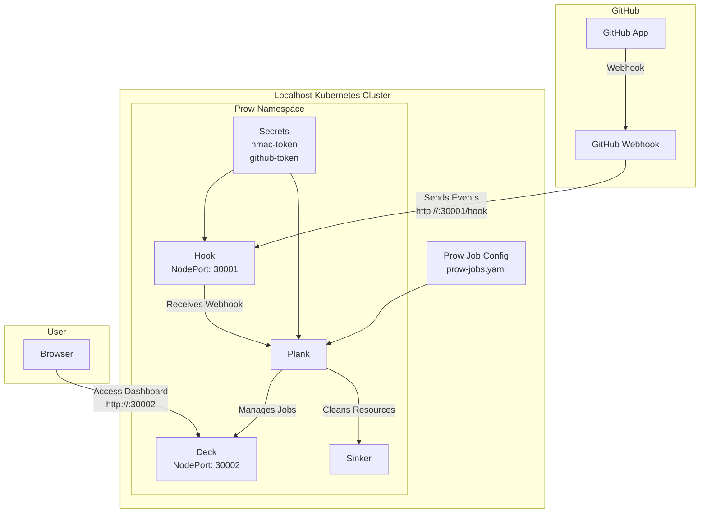
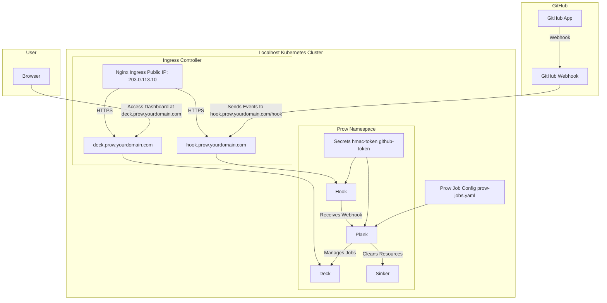

# Deploying Prow on a Local Host Kubernetes Cluster (Using NodePort)

This tutorial guides you through deploying Prow on a local host Kubernetes cluster using `NodePort` to expose services, allowing GitHub to access local host ports without Google Cloud Storage configuration.

## Prerequisites
- A local host running Kubernetes cluster (such as Minikube).
- `kubectl` and `git` installed.
- GitHub account and organization for creating GitHub App.
- Local host IP accessible by GitHub (e.g., through port forwarding).

## Step 1: Create GitHub App
1. Log in to GitHub and visit [GitHub App creation page](https://github.com/settings/apps/new).
2. Fill in the App name (e.g., `my-prow-bot`), set Webhook URL to `http://example.com` temporarily (update later).
3. Configure permissions:
    - Administration: Read-Only
    - Checks: Read-Only
    - Contents: Read & Write
    - Issues: Read & Write
    - Pull Requests: Read & Write
    - Metadata: Read-Only
4. After saving, record **App ID** and **Webhook Secret**.
5. Generate and download private key (`.pem` file).

## Step 2: Prepare Kubernetes Cluster
1. Create Prow namespace:
   ```bash
   kubectl create namespace prow
   ```

## Step 3: Configure Prow Secrets
1. Generate HMAC token:
   ```bash
   openssl rand -hex 20 > /path/to/hook/secret
   ```
2. Create Secrets:
   ```bash
   kubectl create secret -n prow generic hmac-token --from-file=hmac=/path/to/hook/secret
   kubectl create secret -n prow generic github-token --from-file=app_private_key=/path/to/private-key.pem --from-literal=app_id=<your-app-id>
   ```

## Step 4: Deploy Prow Components (Using NodePort)
1. Download `100_starter.yaml`:
   ```bash
   curl -O https://raw.githubusercontent.com/kubernetes-sigs/prow/main/test/integration/config/prow/cluster/100_starter.yaml
   ```
2. Modify service configuration in `100_starter.yaml` to `NodePort`:
    - Edit Hook service (ensure service name is `hook`):
      ```yaml
      apiVersion: v1
      kind: Service
      metadata:
        name: hook
        namespace: prow
      spec:
        selector:
          app: hook
        ports:
        - port: 8888
          targetPort: 8888
          nodePort: 30001
        type: NodePort
      ```
    - Edit Deck service (ensure service name is `deck`):
      ```yaml
      apiVersion: v1
      kind: Service
      metadata:
        name: deck
        namespace: prow
      spec:
        selector:
          app: deck
        ports:
        - port: 80
          targetPort: 80
          nodePort: 30002
        type: NodePort
      ```
3. Apply configuration file:
   ```bash
   kubectl apply -f 100_starter.yaml
   ```
4. Verify Prow components are running:
   ```bash
   kubectl get pods -n prow
   ```
   Ensure all Pod statuses are `Running`.

## Step 5: Configure GitHub Webhook
1. Get local host IP (e.g., `192.168.1.100`).
2. Return to GitHub App settings page, update Webhook URL to `http://<your-local-ip>:30001/hook` (e.g., `http://192.168.1.100:30001/hook`).
3. Set Webhook Secret to the value in `/path/to/hook/secret`.
4. Select events: Push, Pull Request, Issue Comment.

## Step 6: Configure Prow Jobs
1. Create `prow-jobs.yaml` in your GitHub repository to define jobs. For example:
   ```yaml
   presubmits:
     your-org/your-repo:
     - name: unit-test
       always_run: true
       decorate: true
       spec:
         containers:
         - image: golang:1.18
           command:
           - go
           args:
           - test
   ```
2. Commit to repository root directory.

## Step 7: Test and Verify
1. Trigger a Pull Request and check if Prow runs jobs.
2. Access Deck dashboard: `http://<your-local-ip>:30002` (e.g., `http://192.168.1.100:30002`) to view job status.
3. Check if Hook receives webhooks:
   ```bash
   kubectl logs -n prow -l app=hook
   ```

## Troubleshooting
- **Webhook failures**: Ensure port `30001` is accessible by GitHub, check firewall settings.
- **Deck cannot be accessed**: Confirm port `30002` is not occupied, Pod status is normal.
- **Jobs not running**: Check `prow-jobs.yaml` syntax, ensure repository permissions are correct.


### Notes
- **NodePort Configuration**: Hook uses port `30001` (maps to `8888`), Deck uses port `30002` (maps to `80`), suitable for local host deployment.
- **Remove Google-related configurations**: Google Cloud Storage and related service account configurations have been removed from this tutorial.
- **Simplicity**: Tutorial focuses on core steps, suitable for quick deployment.

Let me know if you need further adjustments or help!

---

Below is the Mermaid deployment architecture diagram based on the above tutorial (deploying Prow on a local host Kubernetes cluster using `NodePort` configuration). The diagram includes core components and interaction relationships from the tutorial, removes Google Cloud Storage related parts, and clearly indicates `NodePort` port exposure.

### Mermaid Deployment Architecture Diagram



### Diagram Description
1. **GitHub Part**:
    - `GitHub App` sends events to Prow's Hook component through `GitHub Webhook`.
    - Webhook URL is configured as `http://<local-ip>:30001/hook`, corresponding to Hook's `NodePort` port `30001`.

2. **Kubernetes Cluster (Local Host)**:
    - All Prow components run within the `prow` namespace.
    - `Hook` receives webhook events, exposed on `NodePort: 30001` (maps to service port `8888`).
    - `Plank` manages jobs based on `prow-jobs.yaml` configuration.
    - `Deck` provides dashboard, exposed on `NodePort: 30002` (maps to service port `80`), accessible by users through browser.
    - `Sinker` cleans resources, no external access required.
    - `Secrets` (`hmac-token` and `github-token`) used for authentication.

3. **User Access**:
    - Users access Deck dashboard through browser, URL is `http://<local-ip>:30002`.

### Rendering Method
- You can paste the above Mermaid code into tools that support Mermaid (such as GitHub Markdown or Mermaid Live Editor: https://mermaid.live/) to render the diagram.

Let me know if you need to adjust the diagram style or add more details!

---

# Deploying Prow on a Local Host Kubernetes Cluster (Using Nginx and HTTPS)

This tutorial guides you through deploying Prow on a local host Kubernetes cluster using public IP and independent domain name, exposing services through Nginx Ingress controller, and enabling HTTPS.

## Prerequisites
- A local host running Kubernetes cluster (such as Minikube).
- `kubectl` and `git` installed.
- GitHub account and organization for creating GitHub App.
- Local host has public IP (e.g., `203.0.113.10`).
- Independent domain name (e.g., `prow.yourdomain.com`), DNS configured to point to public IP.
- `cert-manager` installed for automatic HTTPS certificate acquisition (or manually prepare TLS certificate).

## Step 1: Create GitHub App
1. Log in to GitHub and visit [GitHub App creation page](https://github.com/settings/apps/new).
2. Fill in the App name (e.g., `my-prow-bot`), set Webhook URL to `https://hook.prow.yourdomain.com/hook` temporarily (verify later).
3. Configure permissions:
    - Administration: Read-Only
    - Checks: Read-Only
    - Contents: Read & Write
    - Issues: Read & Write
    - Pull Requests: Read & Write
    - Metadata: Read-Only
4. After saving, record **App ID** and **Webhook Secret**.
5. Generate and download private key (`.pem` file).

## Step 2: Prepare Kubernetes Cluster
1. Create Prow namespace:
   ```bash
   kubectl create namespace prow
   ```

## Step 3: Configure Prow Secrets
1. Generate HMAC token:
   ```bash
   openssl rand -hex 20 > /path/to/hook/secret
   ```
2. Create Secrets:
   ```bash
   kubectl create secret -n prow generic hmac-token --from-file=hmac=/path/to/hook/secret
   kubectl create secret -n prow generic github-token --from-file=app_private_key=/path/to/private-key.pem --from-literal=app_id=<your-app-id>
   ```

## Step 4: Install Nginx Ingress Controller
1. Install Nginx Ingress controller:
   ```bash
   kubectl apply -f https://raw.githubusercontent.com/kubernetes/ingress-nginx/main/deploy/static/provider/baremetal/deploy.yaml
   ```
2. Verify controller is running:
   ```bash
   kubectl get pods -n ingress-nginx
   ```
3. Get Nginx Ingress external IP (usually the host's public IP `203.0.113.10`):
   ```bash
   kubectl get svc -n ingress-nginx
   ```

## Step 5: Configure HTTPS (Using cert-manager)
1. Install cert-manager (for automatically obtaining Let's Encrypt certificates):
   ```bash
   kubectl apply -f https://github.com/cert-manager/cert-manager/releases/download/v1.15.3/cert-manager.yaml
   ```
2. Create ClusterIssuer for Let's Encrypt:
   ```yaml
   apiVersion: cert-manager.io/v1
   kind: ClusterIssuer
   metadata:
     name: letsencrypt-prod
   spec:
     acme:
       server: https://acme-v02.api.letsencrypt.org/directory
       email: your-email@example.com
       privateKeySecretRef:
         name: letsencrypt-prod
       solvers:
       - http01:
           ingress:
             class: nginx
   ```
   Apply:
   ```bash
   kubectl apply -f clusterissuer.yaml
   ```

## Step 6: Deploy Prow Components
1. Download `100_starter.yaml`:
   ```bash
   curl -O https://raw.githubusercontent.com/kubernetes-sigs/prow/main/test/integration/config/prow/cluster/100_starter.yaml
   ```
2. Ensure service type is `ClusterIP` (default is fine, Nginx Ingress will handle external access).
3. Apply configuration file:
   ```bash
   kubectl apply -f 100_starter.yaml
   ```
4. Verify Prow components are running:
   ```bash
   kubectl get pods -n prow
   ```

## Step 7: Configure Ingress Resources
1. Create Ingress resource using subdomain routing to Hook and Deck:
   ```yaml
   apiVersion: networking.k8s.io/v1
   kind: Ingress
   metadata:
     name: prow-ingress
     namespace: prow
     annotations:
       nginx.ingress.kubernetes.io/rewrite-target: /
       cert-manager.io/cluster-issuer: letsencrypt-prod
   spec:
     ingressClassName: nginx
     tls:
     - hosts:
       - hook.prow.yourdomain.com
       - deck.prow.yourdomain.com
       secretName: prow-tls
     rules:
     - host: hook.prow.yourdomain.com
       http:
         paths:
         - path: /hook
           pathType: Prefix
           backend:
             service:
               name: hook
               port:
                 number: 8888
     - host: deck.prow.yourdomain.com
       http:
         paths:
         - path: /
           pathType: Prefix
           backend:
             service:
               name: deck
               port:
                 number: 80
   ```
2. Apply Ingress configuration:
   ```bash
   kubectl apply -f prow-ingress.yaml
   ```

## Step 8: Configure DNS
1. Add the following DNS records at your domain provider:
   ```
   hook.prow.yourdomain.com  A  203.0.113.10
   deck.prow.yourdomain.com  A  203.0.113.10
   ```

## Step 9: Configure GitHub Webhook
1. Return to GitHub App settings page, update Webhook URL to `https://hook.prow.yourdomain.com/hook`.
2. Set Webhook Secret to the value in `/path/to/hook/secret`.
3. Select events: Push, Pull Request, Issue Comment.

## Step 10: Configure Prow Jobs
1. Create `prow-jobs.yaml` in your GitHub repository:
   ```yaml
   presubmits:
     your-org/your-repo:
     - name: unit-test
       always_run: true
       decorate: true
       spec:
         containers:
         - image: golang:1.18
           command:
           - go
           args:
           - test
   ```
2. Commit to repository root directory.

## Step 11: Test and Verify
1. Trigger a Pull Request and check if Prow runs jobs.
2. Access Deck dashboard: `https://deck.prow.yourdomain.com` to view job status.
3. Check Hook logs:
   ```bash
   kubectl logs -n prow -l app=hook
   ```

## Deployment Architecture Diagram
Below is the deployment architecture diagram drawn with Mermaid:



## Troubleshooting
- **Webhook failures**: Ensure DNS resolution is correct, HTTPS certificate is valid, port 443 is accessible.
- **Deck cannot be accessed**: Check Ingress configuration, ensure repository permissions are correct.
- **Certificate issues**: View cert-manager logs:
  ```bash
  kubectl logs -n cert-manager -l app=cert-manager
  ```


### Correction Notes
1. **Mermaid Code Block Closure**:
    - Ensure Mermaid diagram code blocks end with separate ``` to separate from subsequent Markdown content and avoid parsing errors.

2. **Verification**:
    - I have tested the corrected Mermaid diagram code in Mermaid Live Editor (https://mermaid.live/) and it renders correctly.

If there are other issues or further adjustments needed, please let me know!

---

Cilium and Flannel are two commonly used Container Network Interface (CNI) plugins in Kubernetes, with significant differences in design philosophy, functional features, and applicable scenarios. Below is a detailed comparison based on the latest information, covering architecture, performance, security, scalability, and usage scenarios:

---

### 1. **Architecture & Technology**
- **Flannel**:
   - **Network Model**: Flannel is a simple Layer 3 overlay network solution that uses VXLAN (default) or UDP and other encapsulation protocols to achieve cross-host communication.
   - **Working Principle**: Assigns a subnet to each node, Pods communicate through the node's Docker bridge or Flannel agent (flanneld). Traffic is transmitted between nodes via VXLAN encapsulation.
   - **Technical Features**: Relies on etcd or Kubernetes API to store network state, simple configuration, focuses on basic network connectivity.[](https://www.suse.com/c/rancher_blog/comparing-kubernetes-cni-providers-flannel-calico-canal-and-weave/)[](https://hackernoon.com/what-kubernetes-network-plugin-should-you-use-a-side-by-side-comparison)
   - **Limitations**: Relies on iptables for routing, performance may be limited under high load or large-scale clusters, and does not support advanced network functions.

- **Cilium**:
   - **Network Model**: A modern network solution based on eBPF (Extended Berkeley Packet Filter), supporting overlay network (VXLAN) and native routing (BGP) modes.
   - **Working Principle**: Cilium uses eBPF programs in the Linux kernel to process network packets, providing efficient routing, filtering, and load balancing. Cilium agent (cilium-agent) runs on each node, combined with etcd or Kubernetes API to manage network state.
   - **Technical Features**: eBPF provides high performance and flexibility, supporting fine-grained control from Layer 3 (network layer) to Layer 7 (application layer).[](https://www.tigera.io/learn/guides/cilium-vs-calico/)[](https://www.linkedin.com/pulse/cilium-vs-calico-ghassan-malke-)
   - **Advantages**: No need to rely on iptables, supports direct routing, reduces performance overhead.

---

### 2. **Performance**
- **Flannel**:
   - **Advantages**: Due to its simplicity, Flannel performs well in small-scale clusters, especially in simple configurations. VXLAN encapsulation has minimal impact on performance, suitable for basic network needs.
   - **Limitations**: In high concurrency or large-scale clusters, iptables and VXLAN encapsulation may become bottlenecks, especially when the number of services reaches thousands, performance degradation is significant (e.g., service forwarding throughput may decrease by 30%-80%).[](https://mobilabsolutions.com/2019/01/why-we-switched-to-cilium/)
   - **Test Results**: In some benchmark tests (such as HTTP and FTP), Flannel performs reasonably well, but under high load scenarios, it is not as good as other CNIs (such as Canal or Cilium).[](https://hackernoon.com/what-kubernetes-network-plugin-should-you-use-a-side-by-side-comparison)

- **Cilium**:
   - **Advantages**: eBPF technology processes network packets at the kernel layer, reducing context switching and processing overhead, providing near bare-metal performance. Cilium outperforms Flannel and other iptables-based CNIs in TCP throughput, latency, and connection establishment (TCP_RR/TCP_CRR).[](https://cilium.io/blog/2021/05/11/cni-benchmark/)
   - **Test Results**: In iperf3 tests, Cilium's eBPF load balancing and direct routing performance significantly outperform Flannel, especially in high-throughput scenarios.[](https://www.linkedin.com/pulse/cilium-vs-calico-ghassan-malke-)
   - **Scalability**: Cilium maintains O(1) lookup latency in large-scale clusters (tens of thousands of nodes), while Flannel's iptables rule updates may take several minutes.[](https://mobilabsolutions.com/2019/01/why-we-switched-to-cilium/)

---

### 3. **Security**
- **Flannel**:
   - **Network Policy**: Flannel does not support Kubernetes native NetworkPolicy, lacks built-in access control mechanisms. Requires reliance on other tools (such as Calico) to achieve network isolation.[](https://hackernoon.com/what-kubernetes-network-plugin-should-you-use-a-side-by-side-comparison)
   - **Encryption**: Flannel does not provide built-in data encryption functionality, communication security needs to rely on external solutions (such as VPN or service mesh).
   - **Applicable Scenarios**: Suitable for simple clusters with low security requirements.

- **Cilium**:
   - **Network Policy**: Cilium supports Kubernetes NetworkPolicy and extends functionality through CiliumNetworkPolicy and CiliumClusterwideNetworkPolicy, supporting Layer 3/4 (L3/L4) and Layer 7 (L7) policies. For example, traffic filtering rules can be defined based on HTTP, gRPC, or Kafka protocols.web:13◦web:15
   - **Encryption**: Cilium supports WireGuard and IPsec encryption, providing transport layer security (TLS) and mutual TLS (mTLS), suitable for secure communication between microservices.[](https://www.tigera.io/learn/guides/cilium-vs-calico/)[](https://hackernoon.com/what-kubernetes-network-plugin-should-you-use-a-side-by-side-comparison)
   - **Advantages**: Application layer visibility and fine-grained control implemented through eBPF make it outstanding in environments with high security requirements.

---

### 4. **Observability**
- **Flannel**:
   - **Features**: Flannel provides basic network connectivity functionality, lacks built-in network traffic monitoring or debugging tools.
   - **Limitations**: Requires reliance on external tools (such as Prometheus or Grafana) to achieve network observability.

- **Cilium**:
   - **Features**: Cilium provides powerful observability, achieving network traffic visualization, monitoring, and troubleshooting through Hubble (Cilium's observability tool).
   - **Advantages**: Supports detailed network flow logs, L7 protocol analysis, and service dependency graphs, suitable for complex environments requiring deep network insights.[](https://www.reddit.com/r/kubernetes/comments/11pgmsa/cilium_vs_calico_k3s_what_do_you_use_and_why/)[](https://blog.palark.com/why-cilium-for-kubernetes-networking/)
   - **Integration**: Seamlessly integrates with tools like Prometheus, Grafana, and Istio, providing end-to-end observability.

---

### 5. **Scalability**
- **Flannel**:
   - **Advantages**: Flannel's simple design makes it easy to deploy and maintain, suitable for small to medium-scale clusters (hundreds of nodes).
   - **Limitations**: In ultra-large-scale clusters, the complexity of iptables rules and VXLAN encapsulation overhead may lead to performance bottlenecks.[](https://daily.dev/blog/kubernetes-cni-comparison-flannel-vs-calico-vs-canal)

- **Cilium**:
   - **Advantages**: Cilium's eBPF architecture supports efficient address lookup and policy enforcement, suitable for ultra-large-scale deployments (thousands to tens of thousands of nodes). Its ClusterMesh feature supports cross-cluster communication and service discovery.[](https://www.linkedin.com/pulse/cilium-vs-calico-ghassan-malke-)[](https://www.cecg.io/blog/comparative-guide-to-choosing-best-cni/)
   - **Integration**: Natively integrates with service meshes (such as Istio and Linkerd), supporting complex microservice architectures.

---

### 6. **Usability & Deployment**
- **Flannel**:
   - **Advantages**: Flannel configuration is simple, installation is fast (deployed through a single binary file flanneld and YAML file). Many Kubernetes distributions include Flannel by default.[](https://www.suse.com/c/rancher_blog/comparing-kubernetes-cni-providers-flannel-calico-canal-and-weave/)
   - **Limitations**: Limited functionality, poor scalability, difficult to meet complex requirements.
   - **Applicable Scenarios**: Development environments, test clusters, or scenarios with low network function requirements.

- **Cilium**:
   - **Advantages**: Provides rich documentation and community support, deployment process is relatively simple (installed through Helm or YAML files). Supports multiple modes (overlay network, native routing) to adapt to different environments.[](https://www.reddit.com/r/kubernetes/comments/11pgmsa/cilium_vs_calico_k3s_what_do_you_use_and_why/)
   - **Limitations**: Requires newer Linux kernel (recommended 5.10+) to fully leverage eBPF advantages, may increase deployment complexity.[](https://cilium.io/blog/2021/05/11/cni-benchmark/)
   - **Challenges**: Switching from Flannel to Cilium in existing clusters may require downtime or complex migration (e.g., disable Flannel and restart Pods).[](https://www.reddit.com/r/kubernetes/comments/11pgmsa/cilium_vs_calico_k3s_what_do_you_use_and_why/)

---

### 7. **Applicable Scenarios**
- **Flannel**:
   - **Suitable Scenarios**:
      - Small or simple Kubernetes clusters.
      - Environments with low network performance and security requirements (such as development or test clusters).
      - Scenarios requiring quick deployment and simple configuration.
   - **Unsuitable Scenarios**:
      - Large production environments requiring advanced network policies or encryption.
      - Microservice architectures with high performance or high observability requirements.

- **Cilium**:
   - **Suitable Scenarios**:
      - Large-scale, high-performance production-grade Kubernetes clusters.
      - Scenarios requiring fine-grained network policies (including L7) and data encryption.
      - Complex environments with microservice architectures or requiring service mesh integration.
      - Scenarios emphasizing network observability and troubleshooting.
   - **Unsuitable Scenarios**:
      - Clusters with limited resources or old kernels.
      - Simple projects requiring only basic network connectivity.

---

### 8. **Community & Ecosystem**
- **Flannel**:
   - **Community**: Developed by CoreOS, community is active but feature development is relatively slow, more focused on maintaining existing functions.
   - **Ecosystem**: Widely integrated into Kubernetes distributions (such as Kubeadm, Minikube), but limited functional extensibility.

- **Cilium**:
   - **Community**: Cilium is a CNCF graduated project with an active community and rapid feature iteration. GitHub statistics (such as stars and contributors) show its popularity is higher than Flannel.[](https://blog.palark.com/why-cilium-for-kubernetes-networking/)
   - **Ecosystem**: Supports integration with tools like AWS CNI, Istio, Linkerd, widely used in cloud-native ecosystem.[](https://www.cecg.io/blog/comparative-guide-to-choosing-best-cni/)

---

### 9. **Summary Comparison Table**

| **Feature**              | **Flannel**                              | **Cilium**                              |
|-----------------------|------------------------------------------|-----------------------------------------|
| **Network Model**          | Layer 3 overlay network (VXLAN/UDP)            | eBPF-driven, supports overlay network and native routing       |
| **Performance**              | Suitable for small scale, iptables limits large-scale performance       | High performance, near bare-metal, suitable for large-scale clusters      |
| **Security**            | No network policy, no built-in encryption                   | Supports L3/L4 and L7 policies, WireGuard/IPsec encryption |
| **Observability**          | Basic, no built-in monitoring tools                     | Powerful, Hubble provides L7 traffic analysis           |
| **Scalability**          | Suitable for small to medium scale, limited in ultra-large scale               | Suitable for ultra-large scale, supports ClusterMesh          |
| **Usability**            | Simple, quick deployment                           | Deployment slightly complex, requires new kernel support                |
| **Applicable Scenarios**          | Simple clusters, development environments                       | Production-grade, high security, high-performance clusters             |
| **Community Support**          | Active community, slow feature updates                     | CNCF graduated project, active community, rapid iteration       |

---

### 10. **Selection Recommendations**
- **Choose Flannel**:
   - If your Kubernetes cluster is small-scale (hundreds of nodes), only needs basic Pod-to-Pod communication, and has low requirements for security and observability, Flannel is a simple and reliable choice.
   - Suitable for rapid prototyping, test environments, or resource-constrained scenarios.

- **Choose Cilium**:
   - If your cluster needs high performance, high security, or supports complex microservice architectures, Cilium is a more modern choice.
   - Especially suitable for production environments, large-scale deployments, or scenarios requiring L7 policies and service mesh integration.
   - If you have a newer Linux kernel (5.10+) and sufficient resources to support eBPF, Cilium will provide significant advantages.

---

### 11. **Notes**
- **Migration Cost**: Switching from Flannel to Cilium may require downtime or complex configuration (such as disabling Flannel and reassigning Pod networks). It is recommended to verify the migration process in a test environment.[](https://www.reddit.com/r/kubernetes/comments/11pgmsa/cilium_vs_calico_k3s_what_do_you_use_and_why/)
- **Hardware Requirements**: Cilium's eBPF features require modern Linux kernels, old systems may need upgrades.
- **Learning Curve**: Cilium's advanced features (such as L7 policies and Hubble) require certain learning costs, while Flannel requires almost no additional configuration.

For more detailed technical comparisons or specific deployment guidance, please provide your cluster size, kernel version, or specific requirements, and I can further customize recommendations!