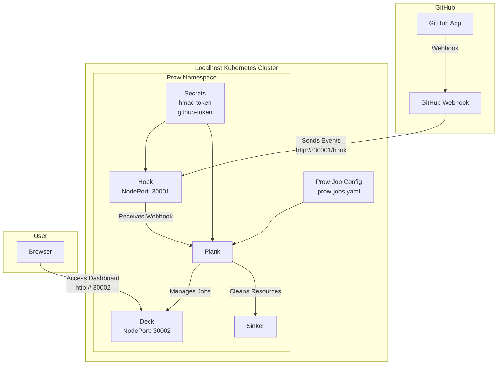

# 在本地主机 Kubernetes 集群上部署 Prow（使用 NodePort）

本教程指导你在本地主机 Kubernetes 集群上部署 Prow，使用 `NodePort` 暴露服务，GitHub 可访问本地主机端口，无需 Google Cloud Storage 配置。

## 前提条件
- 本地主机运行的 Kubernetes 集群（如 Minikube）。
- 已安装 `kubectl` 和 `git`。
- GitHub 账户和组织，用于创建 GitHub App。
- 本地主机 IP 可被 GitHub 访问（例如通过端口转发）。

## 步骤 1：创建 GitHub App
1. 登录 GitHub，访问 [GitHub App 创建页面](https://github.com/settings/apps/new)。
2. 填写 App 名称（例如 `my-prow-bot`），Webhook URL 暂时设为 `http://example.com`（稍后更新）。
3. 配置权限：
    - Administration: Read-Only
    - Checks: Read-Only
    - Contents: Read & Write
    - Issues: Read & Write
    - Pull Requests: Read & Write
    - Metadata: Read-Only
4. 保存后，记录 **App ID** 和 **Webhook Secret**。
5. 生成并下载私钥（`.pem` 文件）。

## 步骤 2：准备 Kubernetes 集群
1. 创建 Prow 命名空间：
   ```bash
   kubectl create namespace prow
   ```

## 步骤 3：配置 Prow 的 Secrets
1. 生成 HMAC 令牌：
   ```bash
   openssl rand -hex 20 > /path/to/hook/secret
   ```
2. 创建 Secrets：
   ```bash
   kubectl create secret -n prow generic hmac-token --from-file=hmac=/path/to/hook/secret
   kubectl create secret -n prow generic github-token --from-file=app_private_key=/path/to/private-key.pem --from-literal=app_id=<your-app-id>
   ```

## 步骤 4：部署 Prow 组件（使用 NodePort）
1. 下载 `100_starter.yaml`：
   ```bash
   curl -O https://raw.githubusercontent.com/kubernetes-sigs/prow/main/test/integration/config/prow/cluster/100_starter.yaml
   ```
2. 修改 `100_starter.yaml` 中的服务配置为 `NodePort`：
    - 编辑 Hook 服务（确保服务名为 `hook`）：
      ```yaml
      apiVersion: v1
      kind: Service
      metadata:
        name: hook
        namespace: prow
      spec:
        selector:
          app: hook
        ports:
        - port: 8888
          targetPort: 8888
          nodePort: 30001
        type: NodePort
      ```
    - 编辑 Deck 服务（确保服务名为 `deck`）：
      ```yaml
      apiVersion: v1
      kind: Service
      metadata:
        name: deck
        namespace: prow
      spec:
        selector:
          app: deck
        ports:
        - port: 80
          targetPort: 80
          nodePort: 30002
        type: NodePort
      ```
3. 应用配置文件：
   ```bash
   kubectl apply -f 100_starter.yaml
   ```
4. 验证 Prow 组件运行：
   ```bash
   kubectl get pods -n prow
   ```
   确保所有 Pod 状态为 `Running`。

## 步骤 5：配置 GitHub Webhook
1. 获取本地主机 IP（例如 `192.168.1.100`）。
2. 返回 GitHub App 设置页面，更新 Webhook URL 为 `http://<your-local-ip>:30001/hook`（例如 `http://192.168.1.100:30001/hook`）。
3. 将 Webhook Secret 设置为 `/path/to/hook/secret` 中的值。
4. 选择事件：Push、Pull Request、Issue Comment。

## 步骤 6：配置 Prow 作业
1. 在你的 GitHub 仓库中创建 `prow-jobs.yaml`，定义作业。例如：
   ```yaml
   presubmits:
     your-org/your-repo:
     - name: unit-test
       always_run: true
       decorate: true
       spec:
         containers:
         - image: golang:1.18
           command:
           - go
           args:
           - test
   ```
2. 提交到仓库根目录。

## 步骤 7：测试和验证
1. 触发一个 Pull Request，检查 Prow 是否运行作业。
2. 访问 Deck 仪表板：`http://<your-local-ip>:30002`（例如 `http://192.168.1.100:30002`），查看作业状态。
3. 检查 Hook 是否收到 Webhook：
   ```bash
   kubectl logs -n prow -l app=hook
   ```

## 故障排除
- **Webhook 失败**：确保 `30001` 端口可被 GitHub 访问，检查防火墙设置。
- **Deck 无法访问**：确认 `30002` 端口未被占用，Pod 状态正常。
- **作业未运行**：检查 `prow-jobs.yaml` 语法，确保存储库权限正确。


### 说明
- **NodePort 配置**：Hook 使用 `30001` 端口（映射到 `8888`），Deck 使用 `30002` 端口（映射到 `80`），适合本地主机部署。
- **移除 Google 相关配置**：教程中已移除 Google Cloud Storage 和相关服务账户配置。
- **简洁性**：教程聚焦核心步骤，适合快速部署。

如需进一步调整或帮助，请告诉我！

---

以下是基于上述教程（在本地主机 Kubernetes 集群上部署 Prow，使用 `NodePort` 配置方式）的 Mermaid 部署架构图。图中包含了教程中的核心组件和交互关系，去除了 Google Cloud Storage 相关部分，并明确了 `NodePort` 的端口暴露。

### Mermaid 部署架构图



### 图表说明
1. **GitHub 部分**：
    - `GitHub App` 通过 `GitHub Webhook` 发送事件到 Prow 的 Hook 组件。
    - Webhook URL 配置为 `http://<local-ip>:30001/hook`，对应 Hook 的 `NodePort` 端口 `30001`。

2. **Kubernetes 集群（本地主机）**：
    - 所有 Prow 组件运行在 `prow` 命名空间内。
    - `Hook` 接收 Webhook 事件，暴露在 `NodePort: 30001`（映射到服务端口 `8888`）。
    - `Plank` 管理作业，基于 `prow-jobs.yaml` 配置。
    - `Deck` 提供仪表板，暴露在 `NodePort: 30002`（映射到服务端口 `80`），供用户通过浏览器访问。
    - `Sinker` 清理资源，无需外部访问。
    - `Secrets`（`hmac-token` 和 `github-token`）用于身份验证。

3. **用户访问**：
    - 用户通过浏览器访问 Deck 仪表板，URL 为 `http://<local-ip>:30002`。

### 渲染方式
- 你可以将上述 Mermaid 代码粘贴到支持 Mermaid 的工具中（如 GitHub Markdown 或 Mermaid Live Editor：https://mermaid.live/）来渲染图表。

如果需要调整图表样式或添加更多细节，请告诉我！