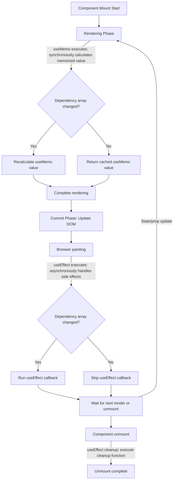

# React's `useMemo` and `useEffect`

In React, the execution behavior of `useMemo` and `useEffect` depends on their dependency arrays and the component's rendering mechanism. Here's a detailed analysis of whether both will execute multiple times:

### 1. Will `useMemo` execute multiple times?

- **Basic behavior**:
    - `useMemo` is a Hook for memoizing calculation results. It checks whether values in its dependency array (`dependencies`) have changed during component rendering.
    - If values in the dependency array haven't changed, `useMemo` returns the cached result without re-executing its callback function.
    - If any value in the dependency array changes, `useMemo` re-executes the callback function and returns a new result.
- **Will it execute multiple times?**:
    - The callback function of `useMemo` only executes in these situations:
        1. During component's first render.
        2. When values in the dependency array change.
    - If the component renders multiple times but values in the dependency array remain unchanged, `useMemo` won't re-execute the callback function, instead directly returning the cached value.
- **Example**:
  ```jsx
  const memoizedValue = useMemo(() => {
    console.log('useMemo executed');
    return expensiveCalculation(propA, propB);
  }, [propA, propB]);
  ```
    - In the above code, the callback function of `useMemo` only executes when `propA` or `propB` changes. If the component renders multiple times but `propA` and `propB` remain unchanged, `console.log` won't trigger repeatedly.

### 2. Will `useEffect` execute multiple times?

- **Basic behavior**:
    - `useEffect` is a Hook for handling side effects. It executes its callback function after component rendering is complete.
    - Similar to `useMemo`, `useEffect` also depends on a dependency array (`dependencies`).
    - If values in the dependency array change, `useEffect` re-executes its callback function.
    - If no dependency array is provided, `useEffect` executes after every render.
- **Will it execute multiple times?**:
    - The callback function of `useEffect` executes in these situations:
        1. During component's first render.
        2. When any value in the dependency array changes.
        3. If no dependency array is provided (`useEffect(() => {...})`), it executes after every component render.
    - If the dependency array is empty (`[]`), `useEffect` only executes once when the component mounts, and executes the cleanup function (if any) when unmounting.
- **Example**:
  ```jsx
  useEffect(() => {
    console.log('useEffect executed');
    return () => {
      console.log('useEffect cleanup');
    };
  }, [propA]);
  ```
    - In the above code, the callback function of `useEffect` executes during first render and when `propA` changes. If the component renders multiple times but `propA` remains unchanged, `console.log('useEffect executed')` won't trigger repeatedly.

### Summary

- **`useMemo`**:
    - Won't execute multiple times without reason, only re-executes the callback function when values in the dependency array change.
    - Used to optimize performance, avoiding repeated calculation of expensive operations.
- **`useEffect`**:
    - May execute multiple times, depending on the dependency array:
        - No dependency array: executes after every render.
        - Empty dependency array: only executes during mount and unmount.
        - Has dependency values: executes when dependency values change.
    - Used to handle side effects, like data fetching, subscriptions, or DOM operations.

### Considerations

- Ensure dependency arrays are correctly set, avoid missing or unnecessary dependencies, otherwise it may lead to unexpected multiple executions or logic errors.
- Use ESLint plugins (like `eslint-plugin-react-hooks`) to help detect dependency array issues.
- If you find `useMemo` or `useEffect` execution times don't meet expectations, check whether values in the dependency array are stable (for example, whether objects or functions create new references on every render).

If you need further analysis of specific code or scenarios, please provide more details, I can help debug!

---

# Although `useMemo` and `useEffect` are both React Hooks and both depend on dependency arrays to control behavior, their purposes and execution timing are fundamentally different:

- **`useMemo`**: Used for **memoizing calculation results**, executes synchronously during the component rendering phase, optimizing performance by avoiding repeated calculation of expensive operations. Returns a value.
- **`useEffect`**: Used for handling **side effects**, executes asynchronously after component rendering is complete, suitable for operations that interact with external systems (like data requests, DOM operations). Returns no value.

Here's an example that clearly demonstrates the difference between the two:

### Example Scenario

Suppose we have a component that displays an expensive calculation result based on input (like Fibonacci sequence), and sends logs to the server whenever the calculation result changes.

```jsx
import React, {useState, useMemo, useEffect} from 'react';

const FibonacciCalculator = ({input}) => {
    // Expensive Fibonacci calculation function
    const calculateFibonacci = (n) => {
        console.log('Calculating Fibonacci...');
        if (n <= 1) return n;
        return calculateFibonacci(n - 1) + calculateFibonacci(n - 2);
    };

    // Use useMemo to memoize Fibonacci calculation result
    const fibResult = useMemo(() => {
        console.log('useMemo executed');
        return calculateFibonacci(input);
    }, [input]);

    // Use useEffect to log calculation result to server
    useEffect(() => {
        console.log('useEffect executed');
        // Simulate sending log to server
        fetch('/api/log', {
            method: 'POST',
            body: JSON.stringify({fibResult}),
        })
            .then(() => console.log('Log sent to server'))
            .catch((err) => console.error('Log failed:', err));
    }, [fibResult]);

    return (
        <div>
            <h1>Fibonacci Result for {input}: {fibResult}</h1>
        </div>
    );
};

// Use the component
const App = () => {
    const [input, setInput] = useState(10);
    return (
        <div>
            <button onClick={() => setInput(input + 1)}>Increase Input</button>
            <FibonacciCalculator input={input}/>
        </div>
    );
};

export default App;
```

### Code Execution Analysis

1. **Initial render (`input = 10`)**:
    - `useMemo` executes:
        - Calculates `calculateFibonacci(10)`, outputs `Calculating Fibonacci...` and `useMemo executed`.
        - Returns result (e.g., `fibResult = 55`) and caches it.
    - `useEffect` executes:
        - Outputs `useEffect executed`.
        - Sends `fibResult` (55) to server, outputs `Log sent to server`.

2. **Unrelated state update (component re-renders but `input` unchanged)**:
    - `useMemo`:
        - Checks dependency `[input]`, finds `input` unchanged, directly returns cached `fibResult` (55).
        - **Does not output** `Calculating Fibonacci...` or `useMemo executed`.
    - `useEffect`:
        - Checks dependency `[fibResult]`, finds `fibResult` unchanged, doesn't execute callback.
        - **Does not output** `useEffect executed` or send request.

3. **Click button, `input` becomes `11`**:
    - `useMemo` executes:
        - `input` changes, recalculates `calculateFibonacci(11)`, outputs `Calculating Fibonacci...` and `useMemo executed`.
        - Returns new result (e.g., `fibResult = 89`) and caches it.
    - `useEffect` executes:
        - `fibResult` changes, executes callback, outputs `useEffect executed`.
        - Sends new `fibResult` (89) to server, outputs `Log sent to server`.

### Key Differences

| Feature             | `useMemo`                                      | `useEffect`                          |
|-------------------|-----------------------------------------------|-------------------------------------|
| **Purpose**         | Memoize calculation results, optimize performance, avoid repeated calculation of expensive operations | Handle side effects, like data requests, DOM operations, subscriptions |
| **Execution Timing** | Executes synchronously during component rendering phase | Executes asynchronously after component rendering completes (after browser painting) |
| **Return Value**     | Returns a cached value (like `fibResult`)         | Returns no value, only executes side effects |
| **Dependency Array Role** | Controls whether to recalculate and return new value | Controls whether to execute side effect callback |
| **Example Role**     | Caches expensive Fibonacci calculation result, avoids recalculation when `input` unchanged | Sends log to server when `fibResult` changes |

### Why They Can't Be Interchanged?

- If using `useEffect` instead of `useMemo` to calculate `fibResult`:
    - Calculation would happen asynchronously after rendering, potentially causing UI delays or flickering (because `fibResult` isn't immediately available for rendering).
    - Doesn't conform to `useEffect`'s side effect handling semantics, increases debugging difficulty.
- If using `useMemo` instead of `useEffect` to send requests:
    - Requests would be sent synchronously during rendering, potentially blocking rendering and reducing performance.
    - `useMemo` can't handle cleanup logic (like canceling requests), while `useEffect` can implement this through returning cleanup functions.

### Summary

- **`useMemo`** is suitable for scenarios requiring synchronous return values and expensive calculations (like Fibonacci calculation).
- **`useEffect`** is suitable for handling asynchronous side effects (like sending logs, subscribing to events).
- In the example, `useMemo` ensures efficient reuse of calculation results, `useEffect` ensures side effects trigger at appropriate times, both cooperate to complete different tasks.

If you have other scenarios or questions, please provide more details, I can further customize examples!

---

To show the position of `useMemo` and `useEffect` in the React component lifecycle using a Mermaid diagram, we need to represent the main lifecycle stages of React function components and mark the execution timing of these two Hooks. The React function component lifecycle mainly includes:

- **Mounting**: Component is created and inserted into DOM.
- **Rendering**: Component renders or re-renders based on state or prop changes.
- **Commit**: DOM updates are complete, side effects are scheduled.
- **Unmounting**: Component is removed from DOM.

### Hook Execution Explanation

- **`useMemo`**: Executes **synchronously during the rendering phase** as part of component calculation output. Memoizes values based on dependency array, avoiding repeated calculations.
- **`useEffect`**: Executes **asynchronously after rendering and commit phases**, running after DOM updates and browser painting is complete, handling side effects.

### Mermaid Diagram

We'll use Mermaid's flowchart to describe the React lifecycle and mark the execution positions of `useMemo` and `useEffect`. Here's the Mermaid code in Chinese showing the lifecycle flow and Hook positions.



### Diagram Explanation

- **Flow**:
    - From "Component Mount Start" enters "Rendering Phase", `useMemo` executes synchronously here, checking dependency array to decide whether to recalculate.
    - After rendering completes, enters "Commit Phase", updates DOM, then browser paints.
    - After painting, `useEffect` executes asynchronously, checking dependency array to decide whether to run side effect callback.
    - Component may re-render due to state/prop updates, or enter unmount phase, triggering `useEffect`'s cleanup function.
- **Annotations**:
    - `useMemo` annotated in rendering phase, emphasizing its synchronous nature.
    - `useEffect` annotated after browser painting, emphasizing its asynchronous side effect handling.
    - Cleanup function executes during unmount.

### Usage Instructions

- This Mermaid code can be rendered in Mermaid-supported environments (like Mermaid Live Editor or Markdown renderers that support Mermaid).
- If you need to adjust diagram style or add more details (like specific side effect types), please let me know, I can further optimize!

---

**`useEffect` itself will not directly trigger the next rendering**, but the code executed inside it may cause changes in state or props, thereby indirectly triggering rendering. Here's a detailed analysis:

### 1. `useEffect` Execution Mechanism

- `useEffect` executes **after component rendering is complete** (after DOM updates and browser painting).
- Its main purpose is to handle side effects (like data fetching, subscriptions, DOM operations), and it doesn't directly affect the component's rendering flow.
- When `useEffect`'s callback function runs, React's rendering phase is already complete, so it won't directly cause re-rendering in the current render cycle.

### 2. Situations that Indirectly Trigger Rendering

Although `useEffect` itself doesn't trigger rendering, its callback function may perform operations that lead to state or prop changes, thereby triggering the next rendering:

- **Updating state (`setState`)**:
  If state update functions (like `setState`) are called inside `useEffect`, React detects state changes and schedules a new render.
  ```jsx
  useEffect(() => {
    setCount(count + 1); // State update may trigger rendering
  }, [count]);
  ```
    - **Note**: This code may cause infinite rendering loops, as `count` changes trigger new `useEffect` execution, unless there are appropriate dependency controls or conditional logic.

- **Modifying props passed from parent component**:
  If `useEffect` modifies parent component state through callback functions or other means, the parent component may re-render, causing child components to re-render too.
  ```jsx
  const Parent = () => {
    const [value, setValue] = useState(0);
    return <Child onUpdate={() => setValue(value + 1)} />;
  };

  const Child = ({ onUpdate }) => {
    useEffect(() => {
      onUpdate(); // Modifies parent component state, triggers parent re-render
    }, [onUpdate]);
    return <div>Child</div>;
  };
  ```

- **External data changes**:
  If `useEffect` initiates asynchronous operations (like API requests) and updates state after receiving responses, it also triggers rendering.
  ```jsx
  useEffect(() => {
    fetchData().then((data) => setData(data)); // Asynchronous state update triggers rendering
  }, []);
  ```

### 3. Situations that Won't Trigger Rendering

If `useEffect`'s callback function doesn't modify state, doesn't affect parent component props, or doesn't trigger other operations that cause rendering, it won't cause the next rendering. For example:

```jsx
useEffect(() => {
    console.log('Effect ran'); // Only logs, doesn't affect state
    document.title = 'Updated'; // Modifies DOM, doesn't trigger React rendering
}, []);
```

- In this case, `useEffect` only executes side effects, React won't schedule new rendering.

### 4. Avoiding Infinite Rendering Loops

When `useEffect` may trigger state updates, carefully manage dependency arrays and logic to avoid infinite loops. For example:

```jsx
useEffect(() => {
    setCount(count + 1); // Error: Updates count after every render, causing infinite loop
}, [count]);
```

**Solutions**:

- Use conditional logic:
  ```jsx
  useEffect(() => {
    if (count < 5) {
      setCount(count + 1); // Limited updates
    }
  }, [count]);
  ```
- Remove unnecessary dependencies:
  ```jsx
  useEffect(() => {
    setCount((prev) => prev + 1); // Runs only under specific conditions
  }, []); // Empty dependency array, runs once
  ```

### 5. Comparison with `useMemo`

Compared with `useMemo`, `useMemo` executes synchronously during the rendering phase, and its result is directly used for the current rendering. If state update functions are called in `useMemo`'s calculation, it causes immediate re-rendering (usually incorrect usage). The asynchronous nature of `useEffect` makes it more suitable for handling side effects that may trigger subsequent rendering.

### Example: Clearly Whether to Trigger Rendering

```jsx
import {useState, useEffect} from 'react';

const Example = () => {
    const [count, setCount] = useState(0);

    // Won't trigger rendering
    useEffect(() => {
        console.log('Effect: No state update');
        document.title = `Count: ${count}`;
    }, [count]);

    // May trigger rendering
    useEffect(() => {
        if (count < 3) {
            console.log('Effect: Updating state');
            setCount(count + 1); // Triggers rendering until count >= 3
        }
    }, [count]);

    console.log('Rendering');
    return <div>Count: {count}</div>;
};
```

**Output**:

```
Rendering
Effect: No state update
Effect: Updating state
Rendering
Effect: No state update
Effect: Updating state
Rendering
Effect: No state update
Effect: Updating state
Rendering
Effect: No state update
```

- The first `useEffect` doesn't trigger rendering, only updates document title.
- The second `useEffect` updates state, causing multiple renders until `count` reaches 3.

### Summary

- **`useEffect` itself doesn't trigger rendering**, it only executes side effects.
- **May indirectly trigger rendering** if its callback function updates state, modifies parent component props, or causes other operations that lead to re-rendering.
- **Avoid infinite loops**: Control `useEffect` behavior through conditional logic, correct dependency arrays, or limiting state updates.
- If you need further analysis of specific code or scenarios, please provide the code, I can help debug in detail!

---

**`useMemo` itself will not directly trigger repeated rendering**, its role is to memoize calculation results to optimize performance, avoiding repeated execution of expensive calculations during each render. However, the usage of `useMemo` or the logic in its callback function may indirectly cause changes in state or props, thereby triggering rendering. Here's a detailed analysis:

### 1. `useMemo` Execution Mechanism

- `useMemo` executes **synchronously during the component rendering phase**, checking whether values in its dependency array (`dependencies`) have changed.
- If values in the dependency array haven't changed, `useMemo` returns the cached result without re-executing the callback function.
- If values in the dependency array change, `useMemo` re-executes the callback function to generate a new result.
- Its main purpose is to optimize performance, avoiding repeated calculations, without directly affecting React's rendering scheduling.

### 2. Typical Situations that Won't Trigger Repeated Rendering

In normal usage, `useMemo` only returns a value for component rendering use and won't cause additional rendering. For example:

```jsx
const memoizedValue = useMemo(() => {
    console.log('useMemo executed');
    return expensiveCalculation(propA, propB);
}, [propA, propB]);
```

- During each component render, `useMemo` checks whether `[propA, propB]` has changed:
    - If unchanged, returns cached value, won't repeatedly execute `expensiveCalculation`.
    - If changed, recalculates and returns new value, but this only affects the current render, won't trigger additional rendering.
- This usage won't cause repeated rendering, only optimizes the performance of the current render.

### 3. Situations that May Indirectly Trigger Rendering

Although `useMemo` itself doesn't trigger rendering, its callback function or the use of its return value may cause state/prop changes, indirectly triggering rendering. Here are several situations:

#### (1) Updating state in callback function

If `useMemo`'s callback function directly or indirectly calls state update functions (like `setState`), it may cause rendering:

```jsx
const [count, setCount] = useState(0);

const memoizedValue = useMemo(() => {
    setCount(count + 1); // Error: Directly updates state during rendering phase
    return count * 2;
}, [count]);
```

- **Problem**: `setCount` triggers state update during rendering phase (when `useMemo` executes), causing React to re-render.
- **Result**: May cause infinite rendering loops, because `count` changes trigger new `useMemo` execution.
- **Suggestion**: Avoid directly updating state in `useMemo`, which doesn't conform to its design intent. State updates should typically be placed in `useEffect` or event handlers.

#### (2) Return value causing state update

If `useMemo`'s return value is used as the basis for triggering state updates, it may also cause rendering:

```jsx
const [value, setValue] = useState(0);

const memoizedResult = useMemo(() => {
    return expensiveCalculation(propA);
}, [propA]);

useEffect(() => {
    setValue(memoizedResult); // memoizedResult changes trigger state update
}, [memoizedResult]);
```

- **Analysis**: `useMemo` itself doesn't trigger rendering, but when its result (`memoizedResult`) changes, `useEffect` detects dependency changes and updates state, causing re-rendering.
- **Note**: This is `useEffect`'s behavior causing rendering, not `useMemo` directly triggering it.

#### (3) Unstable dependency array

If `useMemo`'s dependency array contains unstable references (like new objects or functions created on every render), it may cause `useMemo` to recalculate frequently, indirectly affecting performance or triggering rendering:

```jsx
const memoizedValue = useMemo(() => {
    return someCalculation({data: propA}); // Object is new reference on every render
}, [{data: propA}]); // Error: Dependency array contains unstable reference
```

- **Problem**: The `{ data: propA }` in the dependency array is a new object on every render, causing `useMemo` to execute every time.
- **Result**: Although it doesn't directly trigger rendering, frequent recalculation may cause performance problems, or trigger other side effects due to return value changes (like `useEffect` triggering state updates).
- **Solution**: Ensure dependency values are stable, or use `useCallback` to memoize functions, use primitive values (like `propA`) as dependencies.

### 4. Comparison with `useEffect`

- **`useEffect`**: Executes asynchronously, suitable for handling side effects, may indirectly trigger rendering through state updates (see previous question).
- **`useMemo`**: Executes synchronously during rendering phase, aims to optimize calculation performance. If state is updated in `useMemo`, it immediately affects the current render, potentially causing errors or infinite loops.
- **Key difference**:
    - `useMemo` is part of the rendering phase, its result is directly used for the current render.
    - `useEffect` runs after rendering, suitable for handling side effects that may trigger subsequent rendering.

### 5. Example: Clearly Whether to Trigger Rendering

The following example compares normal and incorrect usage of `useMemo`:

```jsx
import {useState, useMemo} from 'react';

const Example = () => {
    const [count, setCount] = useState(0);
    const [trigger, setTrigger] = useState(0);

    // Normal usage: won't trigger rendering
    const memoizedValue = useMemo(() => {
        console.log('useMemo executed');
        return count * 2;
    }, [count]);

    // Incorrect usage: updates state in useMemo
    const badMemoizedValue = useMemo(() => {
        console.log('badMemoizedValue executed');
        setCount(count + 1); // Error: triggers rendering, may cause infinite loop
        return count * 3;
    }, [count]);

    console.log('Rendering');
    return (
        <div>
            <p>Memoized Value: {memoizedValue}</p>
            <p>Count: {count}</p>
            <button onClick={() => setTrigger(trigger + 1)}>Trigger Render</button>
        </div>
    );
};
```

**Output Analysis**:

- **Initial render**:
  ```
  Rendering
  useMemo executed
  badMemoizedValue executed
  Rendering
  useMemo executed
  badMemoizedValue executed
  ...
  ```
    - `badMemoizedValue`'s `setCount` triggers infinite rendering loop (should be avoided).
    - `memoizedValue` calculates normally, only re-executes when `count` changes.
- **Click button (`trigger` changes)**:
  ```
  Rendering
  ```
    - `memoizedValue` doesn't recalculate (dependency `[count]` unchanged), doesn't trigger additional rendering.
    - `badMemoizedValue` continues to cause loops if not fixed, due to `count` changes.

### 6. Suggestions to Avoid Problems

- **Don't update state in `useMemo`**: State updates should be placed in `useEffect`, event handlers, or other appropriate locations.
- **Ensure dependency array is correct**: Use stable dependency values, avoid unnecessary recalculation.
- **Check return value usage**: If `useMemo`'s result triggers `useEffect` or other logic, ensure this is expected behavior.
- **Use ESLint plugins**: `eslint-plugin-react-hooks` can detect dependency array issues in `useMemo`.

### Summary

- **`useMemo` itself doesn't trigger repeated rendering**, it only calculates and returns memoized values during the rendering phase, optimizing performance.
- **May indirectly trigger rendering** if:
    - Callback function incorrectly updates state (not recommended).
    - Return value triggers other side effects (like `useEffect` detecting changes and updating state).
    - Dependency array is unstable, causing frequent recalculation.
- **Correct usage**: Limit `useMemo` to pure calculation logic, ensure stable dependencies, avoid side effects.
- If you have specific code or scenarios that need analysis, provide details and I can help debug or optimize further!