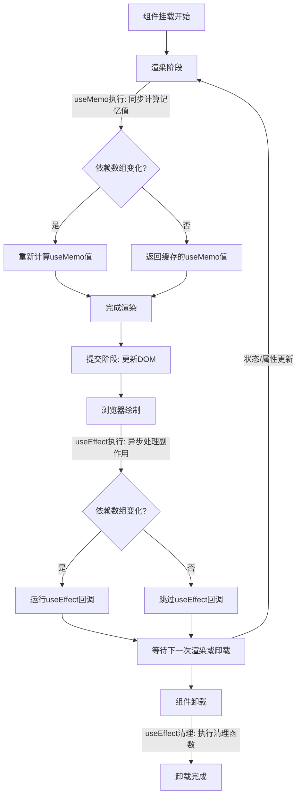

# React中的`useMemo`和`useEffect`

React 中，`useMemo` 和 `useEffect` 的执行行为取决于它们的依赖数组和组件的渲染机制。以下是对两者是否会执行多次的详细分析：

### 1. `useMemo` 是否会执行多次

- **基本行为**：
    - `useMemo` 是一个用于记忆计算结果的 Hook，它会在组件渲染时检查其依赖数组（`dependencies`）中的值是否发生变化。
    - 如果依赖数组中的值没有变化，`useMemo` 会返回缓存的结果，而不会重新执行其回调函数。
    - 如果依赖数组中的任意值发生变化，`useMemo` 会重新执行回调函数，并返回新的结果。
- **是否执行多次**：
    - `useMemo` 的回调函数只在以下情况下执行：
        1. 组件首次渲染时。
        2. 依赖数组中的值发生变化时。
    - 如果组件多次渲染但依赖数组中的值保持不变，`useMemo` 不会重新执行回调函数，而是直接返回缓存的值。
- **示例**：
  ```jsx
  const memoizedValue = useMemo(() => {
    console.log('useMemo executed');
    return expensiveCalculation(propA, propB);
  }, [propA, propB]);
  ```
    - 上述代码中，`useMemo` 的回调函数只在 `propA` 或 `propB` 变化时执行。如果组件多次渲染但 `propA` 和 `propB` 不变，
      `console.log` 不会重复触发。

### 2. `useEffect` 是否会执行多次

- **基本行为**：
    - `useEffect` 是一个用于处理副作用的 Hook，它会在组件渲染后执行其回调函数。
    - 与 `useMemo` 类似，`useEffect` 也依赖于一个依赖数组（`dependencies`）。
    - 如果依赖数组中的值发生变化，`useEffect` 会重新执行其回调函数。
    - 如果没有提供依赖数组，`useEffect` 会在每次渲染后都执行。
- **是否执行多次**：
    - `useEffect` 的回调函数会在以下情况下执行：
        1. 组件首次渲染时。
        2. 依赖数组中的任意值发生变化时。
        3. 如果没有依赖数组（`useEffect(() => {...})`），每次组件渲染后都会执行。
    - 如果依赖数组为空（`[]`），`useEffect` 只在组件挂载时执行一次，卸载时执行清理函数（如果有）。
- **示例**：
  ```jsx
  useEffect(() => {
    console.log('useEffect executed');
    return () => {
      console.log('useEffect cleanup');
    };
  }, [propA]);
  ```
    - 上述代码中，`useEffect` 的回调函数会在首次渲染和 `propA` 变化时执行。如果组件多次渲染但 `propA` 不变，
      `console.log('useEffect executed')` 不会重复触发。

### 总结

- **`useMemo`**：
    - 不会无故执行多次，只有在依赖数组中的值变化时才会重新执行回调函数。
    - 用于优化性能，避免重复计算昂贵的操作。
- **`useEffect`**：
    - 可能执行多次，具体取决于依赖数组：
        - 无依赖数组：每次渲染都执行。
        - 空依赖数组：仅在挂载和卸载时执行。
        - 有依赖值：依赖值变化时执行。
    - 用于处理副作用，如数据获取、订阅或 DOM 操作。

### 注意事项

- 确保依赖数组正确设置，避免遗漏或多余的依赖项，否则可能导致意外的多次执行或逻辑错误。
- 使用 ESLint 插件（如 `eslint-plugin-react-hooks`）可以帮助检测依赖数组的问题。
- 如果发现 `useMemo` 或 `useEffect` 执行次数不符合预期，检查依赖数组中的值是否稳定（例如，对象或函数是否每次渲染都创建新的引用）。

如果有具体代码或场景需要进一步分析，请提供更多细节，我可以帮你调试！

---

# 虽然 `useMemo` 和 `useEffect` 都是 React 的 Hook，且都依赖于依赖数组来控制行为，但它们的用途和执行时机有本质区别：

- **`useMemo`**：用于**记忆计算结果**，在组件渲染期间同步执行，优化性能，避免重复计算昂贵的操作。返回的是一个值。
- **`useEffect`**：用于处理**副作用**，在组件渲染完成后异步执行，适合执行与外部系统交互的操作（如数据请求、DOM 操作）。不返回值。

以下是一个示例，清晰展示两者的区别：

### 示例场景

假设我们有一个组件，显示一个基于输入的昂贵计算结果（比如 Fibonacci 数列），并且在每次计算结果变化时，发送日志到服务器。

```jsx
import React, {useState, useMemo, useEffect} from 'react';

const FibonacciCalculator = ({input}) => {
    // 昂贵的 Fibonacci 计算函数
    const calculateFibonacci = (n) => {
        console.log('Calculating Fibonacci...');
        if (n <= 1) return n;
        return calculateFibonacci(n - 1) + calculateFibonacci(n - 2);
    };

    // 使用 useMemo 记忆 Fibonacci 计算结果
    const fibResult = useMemo(() => {
        console.log('useMemo executed');
        return calculateFibonacci(input);
    }, [input]);

    // 使用 useEffect 记录计算结果到服务器
    useEffect(() => {
        console.log('useEffect executed');
        // 模拟发送日志到服务器
        fetch('/api/log', {
            method: 'POST',
            body: JSON.stringify({fibResult}),
        })
            .then(() => console.log('Log sent to server'))
            .catch((err) => console.error('Log failed:', err));
    }, [fibResult]);

    return (
        <div>
            <h1>Fibonacci Result for {input}: {fibResult}</h1>
        </div>
    );
};

// 使用组件
const App = () => {
    const [input, setInput] = useState(10);
    return (
        <div>
            <button onClick={() => setInput(input + 1)}>Increase Input</button>
            <FibonacciCalculator input={input}/>
        </div>
    );
};

export default App;
```

### 代码运行分析

1. **初始渲染（`input = 10`）**：
    - `useMemo` 执行：
        - 计算 `calculateFibonacci(10)`，输出 `Calculating Fibonacci...` 和 `useMemo executed`。
        - 返回结果（例如 `fibResult = 55`）并缓存。
    - `useEffect` 执行：
        - 输出 `useEffect executed`。
        - 发送 `fibResult`（55）到服务器，输出 `Log sent to server`。

2. **无关状态更新（组件重新渲染但 `input` 不变）**：
    - `useMemo`：
        - 检查依赖 `[input]`，发现 `input` 未变，直接返回缓存的 `fibResult`（55）。
        - **不输出** `Calculating Fibonacci...` 或 `useMemo executed`。
    - `useEffect`：
        - 检查依赖 `[fibResult]`，发现 `fibResult` 未变，不执行回调。
        - **不输出** `useEffect executed` 或发送请求。

3. **点击按钮，`input` 变为 `11`**：
    - `useMemo` 执行：
        - `input` 变化，重新计算 `calculateFibonacci(11)`，输出 `Calculating Fibonacci...` 和 `useMemo executed`。
        - 返回新结果（例如 `fibResult = 89`）并缓存。
    - `useEffect` 执行：
        - `fibResult` 变化，执行回调，输出 `useEffect executed`。
        - 发送新 `fibResult`（89）到服务器，输出 `Log sent to server`。

### 关键区别

| 特性         | `useMemo`                               | `useEffect`               |
|------------|-----------------------------------------|---------------------------|
| **用途**     | 记忆计算结果，优化性能，避免重复计算                      | 处理副作用，如数据请求、DOM 操作、订阅等    |
| **执行时机**   | 组件渲染期间同步执行                              | 组件渲染完成后异步执行（浏览器绘制后）       |
| **返回值**    | 返回一个缓存的值（如 `fibResult`）                 | 无返回值，仅执行副作用               |
| **依赖数组作用** | 控制是否重新计算并返回新值                           | 控制是否执行副作用回调               |
| **示例中的作用** | 缓存昂贵的 Fibonacci 计算结果，避免 `input` 不变时重复计算 | 在 `fibResult` 变化时发送日志到服务器 |

### 为什么不能互换？

- 如果用 `useEffect` 替代 `useMemo` 来计算 `fibResult`：
    - 计算会在渲染后异步进行，可能导致 UI 延迟或闪烁（因为 `fibResult` 不可立即用于渲染）。
    - 不符合 `useEffect` 的副作用处理语义，增加调试难度。
- 如果用 `useMemo` 替代 `useEffect` 来发送请求：
    - 请求会在渲染期间同步发送，可能阻塞渲染，降低性能。
    - `useMemo` 不能处理清理逻辑（如取消请求），而 `useEffect` 可以通过返回清理函数实现。

### 总结

- **`useMemo`** 适合需要同步返回值且计算昂贵的场景（如 Fibonacci 计算）。
- **`useEffect`** 适合处理异步副作用（如发送日志、订阅事件）。
- 示例中，`useMemo` 确保计算结果高效复用，`useEffect` 确保副作用在适当时候触发，两者配合完成不同任务。

如果有其他场景或疑问，请提供更多细节，我可以进一步定制示例！

---

为了使用 Mermaid 图表展示 `useMemo` 和 `useEffect` 在 React 组件生命周期中的位置，我们需要表示 React 函数组件的主要生命周期阶段，并标注这两个
Hook 的执行时机。React 函数组件的生命周期主要包括：

- **挂载（Mounting）**：组件被创建并插入 DOM。
- **渲染（Rendering）**：组件根据状态或属性变化进行渲染或重新渲染。
- **提交（Commit）**：DOM 更新完成，副作用被调度。
- **卸载（Unmounting）**：组件从 DOM 中移除。

### Hook 执行说明

- **`useMemo`**：在**渲染阶段**同步执行，作为组件计算输出的一部分。根据依赖数组记忆值，避免重复计算。
- **`useEffect`**：在**渲染和提交阶段之后**异步执行，在 DOM 更新并完成浏览器绘制后运行，处理副作用。

### Mermaid 图表

我们将使用 Mermaid 的流程图（flowchart）来描述 React 生命周期，并标注 `useMemo` 和 `useEffect` 的执行位置。以下是基于中文的
Mermaid 代码，展示生命周期流程和 Hook 位置。



### 图表说明

- **流程**：
    - 从“组件挂载开始”进入“渲染阶段”，`useMemo` 在此同步执行，检查依赖数组决定是否重新计算。
    - 渲染完成后进入“提交阶段”，更新 DOM，随后浏览器绘制。
    - 绘制后，`useEffect` 异步执行，检查依赖数组决定是否运行副作用回调。
    - 组件可能因状态/属性更新重新渲染，或进入卸载阶段，触发 `useEffect` 的清理函数。
- **标注**：
    - `useMemo` 标注在渲染阶段，强调其同步性。
    - `useEffect` 标注在浏览器绘制后，强调其异步副作用处理。
    - 清理函数在卸载时执行。

### 使用说明

- 该 Mermaid 代码可以在支持 Mermaid 的环境中渲染（如 Mermaid Live Editor 或支持 Mermaid 的 Markdown 渲染器）。
- 如果需要调整图表样式或添加更多细节（例如具体副作用类型），请告诉我，我可以进一步优化！

---

`useEffect` 自身**不会直接触发下一次渲染**，但它内部执行的代码可能会导致状态或属性的变化，从而间接触发渲染。以下是详细分析：

### 1. `useEffect` 的执行机制

- `useEffect` 是在**组件渲染完成后**（DOM 更新和浏览器绘制后）异步执行的。
- 它的主要作用是处理副作用（如数据获取、订阅、DOM 操作等），不直接影响组件的渲染流程。
- `useEffect` 的回调函数运行时，React 的渲染阶段已经完成，因此它不会直接导致当前渲染周期的重新渲染。

### 2. 间接触发渲染的情况

尽管 `useEffect` 本身不触发渲染，但其回调函数中可能会执行以下操作，导致状态或属性变化，进而触发下一次渲染：

- **更新状态（`setState`）**：
  如果在 `useEffect` 中调用了状态更新函数（如 `setState`），React 会检测到状态变化并调度一次新的渲染。
  ```jsx
  useEffect(() => {
    setCount(count + 1); // 更新状态，可能触发渲染
  }, [count]);
  ```
    - **注意**：这种代码可能导致无限渲染循环，因为 `count` 变化会触发新的 `useEffect` 执行，除非有适当的依赖控制或条件逻辑。
- **修改父组件传递的属性**：
  如果 `useEffect` 通过回调函数或其他方式修改了父组件的状态，父组件可能会重新渲染，从而导致子组件重新渲染。
  ```jsx
  const Parent = () => {
    const [value, setValue] = useState(0);
    return <Child onUpdate={() => setValue(value + 1)} />;
  };

  const Child = ({ onUpdate }) => {
    useEffect(() => {
      onUpdate(); // 修改父组件状态，触发父组件重新渲染
    }, [onUpdate]);
    return <div>Child</div>;
  };
  ```
- **外部数据变化**：
  如果 `useEffect` 发起异步操作（如 API 请求），并在响应后更新状态，也会触发渲染。
  ```jsx
  useEffect(() => {
    fetchData().then((data) => setData(data)); // 异步更新状态，触发渲染
  }, []);
  ```

### 3. 不会触发渲染的情况

如果 `useEffect` 的回调函数不修改状态、不影响父组件属性或不触发其他导致渲染的操作，它不会引发下一次渲染。例如：

```jsx
useEffect(() => {
    console.log('Effect ran'); // 仅打印日志，不影响状态
    document.title = 'Updated'; // 修改 DOM，不触发 React 渲染
}, []);
```

- 这种情况下，`useEffect` 仅执行副作用，React 不会调度新的渲染。

### 4. 避免无限渲染循环

当 `useEffect` 可能触发状态更新时，需要小心管理依赖数组和逻辑，以避免无限循环。例如：

```jsx
useEffect(() => {
    setCount(count + 1); // 错误：每次渲染后更新 count，导致无限循环
}, [count]);
```

**解决方法**：

- 使用条件逻辑：
  ```jsx
  useEffect(() => {
    if (count < 5) {
      setCount(count + 1); // 有限次更新
    }
  }, [count]);
  ```
- 移除不必要的依赖：
  ```jsx
  useEffect(() => {
    setCount((prev) => prev + 1); // 仅在特定条件下运行
  }, []); // 空依赖数组，运行一次
  ```

### 5. 对比 `useMemo`

与 `useMemo` 相比，`useMemo` 是同步执行于渲染阶段，其结果直接用于当前渲染。如果 `useMemo`
的计算中调用了状态更新函数，会导致立即重新渲染（通常是错误用法）。而 `useEffect` 的异步性质使其更适合处理可能触发状态更新的副作用。

### 示例：明确是否触发渲染

```jsx
import {useState, useEffect} from 'react';

const Example = () => {
    const [count, setCount] = useState(0);

    // 不会触发渲染
    useEffect(() => {
        console.log('Effect: No state update');
        document.title = `Count: ${count}`;
    }, [count]);

    // 可能触发渲染
    useEffect(() => {
        if (count < 3) {
            console.log('Effect: Updating state');
            setCount(count + 1); // 触发渲染，直到 count >= 3
        }
    }, [count]);

    console.log('Rendering');
    return <div>Count: {count}</div>;
};
```

**输出**：

```
Rendering
Effect: No state update
Effect: Updating state
Rendering
Effect: No state update
Effect: Updating state
Rendering
Effect: No state update
Effect: Updating state
Rendering
Effect: No state update
```

- 第一个 `useEffect` 不触发渲染，仅更新文档标题。
- 第二个 `useEffect` 更新状态，导致多次渲染，直到 `count` 达到 3。

### 总结

- **`useEffect` 自身不触发渲染**，它只执行副作用。
- **可能间接触发渲染**，如果其回调函数更新了状态、修改了父组件属性或引发其他导致重新渲染的操作。
- **避免无限循环**：通过条件逻辑、正确的依赖数组或限制状态更新来控制 `useEffect` 的行为。
- 如果需要进一步分析特定代码或场景，请提供代码，我可以帮你详细调试！

---

**`useMemo` 自身不会直接触发重复渲染**，它的作用是记忆计算结果以优化性能，避免在每次渲染时重复执行昂贵的计算。然而，
`useMemo` 的使用方式或其回调函数中的逻辑可能间接导致状态或属性的变化，从而触发渲染。以下是详细分析：

### 1. `useMemo` 的执行机制

- `useMemo` 在**组件渲染阶段**同步执行，检查其依赖数组（`dependencies`）中的值是否变化。
- 如果依赖数组中的值未变，`useMemo` 返回缓存的结果，不重新执行回调函数。
- 如果依赖数组中的值发生变化，`useMemo` 重新执行回调函数，生成新的结果。
- 它的主要目的是优化性能，避免重复计算，而不直接影响 React 的渲染调度。

### 2. 不会触发重复渲染的典型情况

在正常使用中，`useMemo` 仅返回一个值，供组件渲染使用，不会导致额外的渲染。例如：

```jsx
const memoizedValue = useMemo(() => {
    console.log('useMemo executed');
    return expensiveCalculation(propA, propB);
}, [propA, propB]);
```

- 每次组件渲染时，`useMemo` 检查 `[propA, propB]` 是否变化：
    - 如果未变，返回缓存值，不会重复执行 `expensiveCalculation`。
    - 如果变化，重新计算并返回新值，但这仅影响当前渲染，不触发额外渲染。
- 这种用法不会导致重复渲染，只是优化了当前渲染的性能。

### 3. 可能间接触发渲染的情况

尽管 `useMemo` 本身不触发渲染，其回调函数或返回值的使用可能导致状态/属性变化，间接触发渲染。以下是几种情况：

#### (1) 回调函数中更新状态

如果 `useMemo` 的回调函数直接或间接调用状态更新函数（如 `setState`），可能导致渲染：

```jsx
const [count, setCount] = useState(0);

const memoizedValue = useMemo(() => {
    setCount(count + 1); // 错误：直接在渲染阶段更新状态
    return count * 2;
}, [count]);
```

- **问题**：`setCount` 在渲染阶段（`useMemo` 执行时）触发状态更新，导致 React 重新渲染。
- **结果**：可能引发无限渲染循环，因为 `count` 变化会触发新的 `useMemo` 执行。
- **建议**：避免在 `useMemo` 中直接更新状态，这不符合其设计意图。状态更新通常应放在 `useEffect` 或事件处理函数中。

#### (2) 返回值引发状态更新

如果 `useMemo` 的返回值被用作触发状态更新的依据，也可能导致渲染：

```jsx
const [value, setValue] = useState(0);

const memoizedResult = useMemo(() => {
    return expensiveCalculation(propA);
}, [propA]);

useEffect(() => {
    setValue(memoizedResult); // memoizedResult 变化触发状态更新
}, [memoizedResult]);
```

- **分析**：`useMemo` 本身不触发渲染，但其结果（`memoizedResult`）变化时，`useEffect` 检测到依赖变化并更新状态，导致重新渲染。
- **注意**：这是 `useEffect` 的行为导致的渲染，而非 `useMemo` 直接触发。

#### (3) 依赖数组不稳定

如果 `useMemo` 的依赖数组包含不稳定的引用（例如每次渲染都创建的新对象或函数），可能导致 `useMemo` 频繁重新计算，间接影响性能或触发渲染：

```jsx
const memoizedValue = useMemo(() => {
    return someCalculation({data: propA}); // 对象每次渲染都是新引用
}, [{data: propA}]); // 错误：依赖数组包含不稳定引用
```

- **问题**：依赖数组中的 `{ data: propA }` 每次渲染都是新对象，导致 `useMemo` 每次都重新执行。
- **结果**：虽然不直接触发渲染，但频繁重新计算可能导致性能问题，或因返回值变化引发其他副作用（如 `useEffect` 触发状态更新）。
- **解决**：确保依赖值稳定，或使用 `useCallback` 记忆函数，使用原始值（如 `propA`）作为依赖。

### 4. 对比 `useEffect`

- **`useEffect`**：异步执行，适合处理副作用，可能通过状态更新间接触发渲染（见前述问题）。
- **`useMemo`**：同步执行于渲染阶段，旨在优化计算性能。如果在 `useMemo` 中更新状态，会立即影响当前渲染，可能导致错误或无限循环。
- **关键区别**：
    - `useMemo` 是渲染阶段的一部分，其结果直接用于当前渲染。
    - `useEffect` 在渲染后运行，适合处理可能触发后续渲染的副作用。

### 5. 示例：明确是否触发渲染

以下示例对比 `useMemo` 的正常使用和错误使用：

```jsx
import {useState, useMemo} from 'react';

const Example = () => {
    const [count, setCount] = useState(0);
    const [trigger, setTrigger] = useState(0);

    // 正常使用：不会触发渲染
    const memoizedValue = useMemo(() => {
        console.log('useMemo executed');
        return count * 2;
    }, [count]);

    // 错误使用：在 useMemo 中更新状态
    const badMemoizedValue = useMemo(() => {
        console.log('badMemoizedValue executed');
        setCount(count + 1); // 错误：触发渲染，可能无限循环
        return count * 3;
    }, [count]);

    console.log('Rendering');
    return (
        <div>
            <p>Memoized Value: {memoizedValue}</p>
            <p>Count: {count}</p>
            <button onClick={() => setTrigger(trigger + 1)}>Trigger Render</button>
        </div>
    );
};
```

**输出分析**：

- **初始渲染**：
  ```
  Rendering
  useMemo executed
  badMemoizedValue executed
  Rendering
  useMemo executed
  badMemoizedValue executed
  ...
  ```
    - `badMemoizedValue` 的 `setCount` 触发无限渲染循环（需避免）。
    - `memoizedValue` 正常计算，仅在 `count` 变化时重新执行。
- **点击按钮（`trigger` 变化）**：
  ```
  Rendering
  ```
    - `memoizedValue` 不重新计算（依赖 `[count]` 未变），不触发额外渲染。
    - `badMemoizedValue` 若未修复，会因 `count` 变化继续导致循环。

### 6. 避免问题的建议

- **不要在 `useMemo` 中更新状态**：状态更新应放在 `useEffect`、事件处理函数或其他适当位置。
- **确保依赖数组正确**：使用稳定的依赖值，避免不必要的重新计算。
- **检查返回值使用**：如果 `useMemo` 的结果触发 `useEffect` 或其他逻辑，确保这是预期的行为。
- **使用 ESLint 插件**：`eslint-plugin-react-hooks` 可以检测 `useMemo` 的依赖数组问题。

### 总结

- **`useMemo` 自身不触发重复渲染**，它仅在渲染阶段计算并返回记忆值，优化性能。
- **可能间接触发渲染**，如果：
    - 回调函数中错误地更新状态（不推荐）。
    - 返回值引发其他副作用（如 `useEffect` 检测到变化并更新状态）。
    - 依赖数组不稳定，导致频繁重新计算。
- **正确使用**：将 `useMemo` 限制于纯计算逻辑，确保依赖稳定，避免副作用。
- 如果有具体代码或场景需要分析，请提供细节，我可以帮你进一步调试或优化！