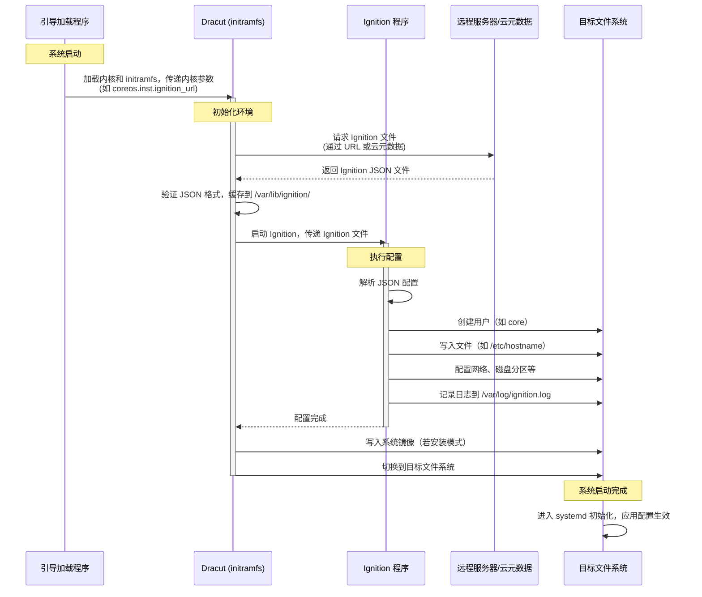

# Red Hat Enterprise Linux CoreOS (RHCOS) is a lightweight operating system launched by Red Hat, specifically designed for containerized workloads, mainly used to support OpenShift Container Platform (OCP). The following is a brief introduction to RHCOS:

### Core Features
1. **Immutable System**:
    - RHCOS adopts a read-only file system design, where operating system components cannot be directly modified. This "immutable" architecture updates by replacing the entire system image (rather than individual patches), ensuring consistency, stability, and security.[](https://juejin.cn/s/redhat%2520coreos)[](https://www.redhat.com/en/blog/red-hat-enterprise-linux-coreos-customization)
    - The update process is based on atomic operations, supporting rollback to previous versions, reducing update failure risks.[](https://dockone.io/article/1026)

2. **容器优化**：
    - RHCOS 专为运行容器化应用而设计，内置 CRI-O 容器运行时（替代 Docker），提供更小占用空间和更低攻击面，专为 Kubernetes 平台优化。[](https://docs.redhat.com/en/documentation/openshift_container_platform/4.8/html/architecture/architecture-rhcos)[](https://access.redhat.com/documentation/en-us/openshift_container_platform/4.8/html/architecture/architecture-rhcos)
    - 支持 podman 等容器工具，用于构建、管理和运行容器镜像。[](https://access.redhat.com/documentation/en-us/openshift_container_platform/4.8/html/architecture/architecture-rhcos)

3. **自动化更新**：
    - RHCOS 支持自动化的远程升级，基于 Google 的 Omaha 更新引擎，允许无缝、快速地部署新系统版本，减少应用中断。[](https://dockone.io/article/1026)[](https://www.zdnet.com/article/heres-what-happens-to-coreos-now-that-red-hat-owns-it/)
    - 更新策略灵活，例如可通过 locksmith 服务控制集群节点重启，保障高可用性。[](https://en.wikipedia.org/wiki/Container_Linux)

4. **与 OpenShift 深度集成**：
    - RHCOS 是 OpenShift Container Platform 的默认操作系统，且为控制平面（master）节点的唯一支持操作系统。工作节点（worker）可选择 RHEL，但 RHCOS 是首选。[](https://docs.redhat.com/en/documentation/openshift_container_platform/4.8/html/architecture/architecture-rhcos)[](https://www.redhat.com/en/blog/red-hat-enterprise-linux-coreos-customization)
    - 通过 Ignition 配置文件在首次启动时定制系统，配合 Machine Config Operator（MCO）简化集群节点管理。[](https://www.redhat.com/en/blog/red-hat-enterprise-linux-coreos-customization)

### 技术背景
- **起源**：RHCOS 融合了 CoreOS Container Linux 的自动化更新特性和 Red Hat Enterprise Linux（RHEL）的企业级质量标准。红帽于 2018 年收购 CoreOS 后，将其技术整合，推出 RHCOS 和 Fedora CoreOS。[](https://www.redhat.com/en/technologies/cloud-computing/openshift/what-was-coreos)[](https://www.zdnet.com/article/heres-what-happens-to-coreos-now-that-red-hat-owns-it/)
- **部署方式**：
    - 在 OpenShift 集群安装时，RHCOS 镜像会自动下载到目标平台，并通过 Ignition 文件配置节点。[](https://access.redhat.com/documentation/en-us/openshift_container_platform/4.8/html/architecture/architecture-rhcos)
    - 支持 Live ISO 镜像安装，便于裸机或特定硬件环境的部署。[](https://www.redhat.com/en/blog/red-hat-enterprise-linux-coreos-customization)

### 应用场景
- **云原生环境**：RHCOS 专为 Kubernetes 和 OpenShift 集群设计，适合大规模容器化应用的部署和管理。
- **混合云与多云**：通过容器化支持跨物理、虚拟、私有云和公有云的统一部署。[](https://www.redhat.com/en/about/press-releases/red-hat-acquire-coreos-expanding-its-kubernetes-and-containers-leadership)
- **高安全性需求**：不可变系统和 SELinux 集成增强了安全性，适合企业级工作负载。[](https://www.ithome.com.tw/news/135923)

### 局限性
- **定制限制**：RHCOS 不支持直接修改系统，需通过 Ignition 或 MachineConfig 进行配置，定制复杂性较高。[](https://www.redhat.com/en/blog/red-hat-enterprise-linux-coreos-customization)
- **仅限 OpenShift**：RHCOS 仅作为 OpenShift 组件受支持，不适用于独立使用。[](https://docs.redhat.com/en/documentation/openshift_container_platform/4.8/html/architecture/architecture-rhcos)
- **学习曲线**：对传统 Linux 管理员来说，适应不可变系统和新的管理工具（如 podman、Ignition）可能需要时间。[](https://www.zdnet.com/article/how-red-hat-just-quietly-radically-transformed-enterprise-server-linux/)

### 发展现状
- RHCOS 是 OpenShift 4.x 系列的核心组件，红帽持续优化其性能和工具集。
- CoreOS Container Linux 已于 2020 年 5 月停止支持，Fedora CoreOS 和 RHCOS 成为其继任者。[](https://www.redhat.com/en/technologies/cloud-computing/openshift/what-was-coreos)[](https://www.ithome.com.tw/news/135923)
- 红帽不完全支持自定义 ISO 镜像或非官方配置，需参考官方文档进行操作。[](https://www.redhat.com/en/blog/red-hat-enterprise-linux-coreos-customization)

### 总结
RHCOS 是一个面向云原生、容器化工作负载的现代化操作系统，凭借不可变架构、自动化更新和与 OpenShift 的深度集成，成为企业级 Kubernetes 部署的理想选择。它牺牲了部分灵活性以换取安全性和一致性，适合追求稳定和自动化的企业环境。

如需更深入的技术细节或具体配置指导，请告诉我！

---

# Red Hat Enterprise Linux CoreOS（RHCOS）使用 **Ignition** 文件来在系统首次启动时进行自动化配置。Ignition 是 RHCOS 的核心配置工具，负责设置文件系统、网络、用户、SSH 密钥、服务以及其他系统参数。以下是 RHCOS 如何使用和加载 Ignition 文件的详细过程：

### 1. **Ignition 文件简介**
- **格式**：Ignition 文件是 JSON 格式的配置文件，遵循 Ignition 规范（最新版本如 3.4.0）。它定义了系统的初始配置，例如：
    - 创建用户和设置 SSH 密钥
    - 配置网络（静态 IP、DNS 等）
    - 写入文件（如 systemd 单元文件）
    - 设置磁盘分区
    - 启用或禁用特定服务
- **一次性执行**：Ignition 文件仅在系统**首次启动**（first boot）时运行，之后不再执行，体现了 RHCOS 的不可变系统设计。
- **来源**：Ignition 文件可以从远程 URL、本地文件、云元数据服务（如 AWS EC2 的 user-data）或嵌入 ISO 镜像中获取。

### 2. **RHCOS 加载 Ignition 文件的过程**
RHCOS 在启动时通过以下步骤加载和应用 Ignition 文件：

#### （1）**引导阶段**
- **PXE 或 ISO 启动**：RHCOS 通常通过 PXE 网络引导、Live ISO 或预装镜像启动。在 OpenShift 环境中，RHCOS 镜像由集群的 bootstrap 节点或 installer 提供。
- **内核参数**：在启动时，RHCOS 的内核命令行（通过 GRUB 或其他引导加载程序）可以指定 Ignition 文件的来源。例如：
    - `coreos.inst.ignition_url=https://example.com/config.ign` 指定远程 Ignition 文件的 URL。
    - `coreos.inst.install_dev=/dev/sda` 指定目标安装磁盘。
- 如果使用云平台（如 AWS、GCP、Azure），Ignition 文件可以通过云元数据服务（如 user-data）传递。

#### （2）**Ignition 运行阶段**
- **Dracut 阶段**：在系统初始化（initramfs）阶段，RHCOS 的 Dracut 模块负责解析内核参数并获取 Ignition 文件。具体流程：
    1. **获取 Ignition 文件**：
        - 如果指定了远程 URL，Dracut 使用 `curl` 下载文件（需要网络配置）。
        - 如果通过云元数据服务提供，Dracut 从平台特定的元数据端点获取（例如 AWS 的 `http://169.254.169.254`）。
        - 如果嵌入 Live ISO 或本地文件，Dracut 直接读取。
    2. **验证文件**：Ignition 验证 JSON 文件的格式和版本是否符合规范。
    3. **缓存文件**：Ignition 文件被缓存到 `/var/lib/ignition/`，以便在安装过程中使用。

- **Ignition 执行**：
    - Ignition 程序在 initramfs 环境中运行，解析 JSON 配置并执行定义的任务，例如：
        - 创建用户（如 `core` 用户）并设置 SSH 密钥。
        - 写入文件到指定路径（如 `/etc/sysconfig/network-scripts/`）。
        - 配置 systemd 服务或网络设置。
        - 分区并格式化磁盘（如果需要安装到本地磁盘）。
    - 如果是安装模式，Ignition 会将 RHCOS 镜像写入目标磁盘（由 `coreos.inst.install_dev` 指定）。

#### （3）**完成配置并启动**
- **配置应用**：Ignition 完成所有配置后，系统继续启动，进入 systemd 初始化阶段。
- **持久化**：Ignition 的配置会写入目标文件系统，供后续使用。例如，SSH 密钥被写入 `/home/core/.ssh/authorized_keys`。
- **不可变性**：配置完成后，RHCOS 的根文件系统通常是只读的，防止直接修改。后续更改需通过 Machine Config Operator（MCO，OpenShift 环境）或重新部署。

### 3. **如何使用 Ignition 文件**
以下是在 RHCOS 中使用 Ignition 文件的典型步骤，结合 OpenShift 或裸机部署场景：

#### （1）**创建 Ignition 文件**
- **手动编写**：根据 Ignition 规范（参考 [Ignition 文档](https://coreos.github.io/ignition/)），手动创建 JSON 文件。例如：
  ```json
  {
    "ignition": { "version": "3.4.0" },
    "passwd": {
      "users": [
        {
          "name": "core",
          "sshAuthorizedKeys": [
            "ssh-rsa AAAAB3NzaC1yc2E..."
          ]
        }
      ]
    },
    "storage": {
      "files": [
        {
          "path": "/etc/hostname",
          "contents": { "source": "data:,node1.example.com" },
          "mode": 420
        }
      ]
    }
  }
  ```
- **工具生成**：
    - 在 OpenShift 中，`openshift-install` 工具会自动生成 Ignition 文件（`bootstrap.ign`、`master.ign`、`worker.ign`），基于用户提供的 `install-config.yaml`。
    - 使用 `butane` 工具将 YAML 配置（更易读）转换为 Ignition JSON：
      ```yaml
      variant: ignition
      version: 3.4.0
      passwd:
        users:
          - name: core
            sshAuthorizedKeys:
              - ssh-rsa AAAAB3NzaC1yc2E...
      storage:
        files:
          - path: /etc/hostname
            mode: 0644
            contents:
              source: data:,node1.example.com
      ```
      运行 `butane config.yaml > config.ign` 生成 JSON 文件。

#### （2）**提供 Ignition 文件**
- **OpenShift 环境**：
    - 在 OpenShift 安装时，`openshift-install create ignition-configs` 生成 Ignition 文件，存储在安装目录（如 `~/cluster/bootstrap.ign`）。
    - 这些文件通过 HTTP 服务器（由 bootstrap 节点提供）分发给集群节点，或者通过云平台的 user-data 传递。
- **裸机或自定义部署**：
    - 将 Ignition 文件托管在 HTTP/HTTPS 服务器上，并通过内核参数指定 URL：
      ```bash
      coreos.inst.ignition_url=https://example.com/config.ign
      ```
    - 或者，将 Ignition 文件嵌入 Live ISO（使用 `coreos-installer iso ignition embed` 命令）：
      ```bash
      coreos-installer iso ignition embed -i config.ign rhcos-live.iso
      ```

#### （3）**启动并应用**
- **PXE 引导**：配置 PXE 服务器，添加内核参数以指定 Ignition 文件 URL。
- **ISO 安装**：使用修改后的 Live ISO 启动，Ignition 会在安装过程中自动应用配置。
- **云环境**：通过云平台的 user-data 字段上传 Ignition 文件。例如，在 AWS EC2 中，将 Ignition 文件作为 user-data 传递给实例。
- **验证**：启动后，检查 `/var/log/ignition.log` 或使用 `journalctl -u ignition` 查看 Ignition 执行日志，确保配置正确应用。

### 4. **在 OpenShift 中的特殊使用**
- **Machine Config Operator（MCO）**：在 OpenShift 集群运行后，Ignition 文件的初始配置可以通过 MCO 进行动态更新。MCO 使用 MachineConfig 对象管理节点配置，生成新的 Ignition 文件并应用到节点。
- **集群安装**：
    - Bootstrap 节点使用 `bootstrap.ign` 初始化临时控制平面。
    - Master 和 worker 节点分别使用 `master.ign` 和 `worker.ign` 配置角色特定设置。
    - 这些文件由 `openshift-install` 自动生成，并通过临时 HTTP 服务器或云元数据服务分发。

### 5. **注意事项**
- **网络依赖**：如果 Ignition 文件来自远程 URL，节点启动时必须有网络连接，否则会失败。
- **安全性**：
    - 建议使用 HTTPS 提供 Ignition 文件，并验证 TLS 证书。
    - 敏感数据（如 SSH 密钥）应加密或通过安全通道传递。
- **调试**：
    - 如果 Ignition 失败，检查 `/var/log/ignition.log` 或 `journalctl`。
    - 使用 `ignition-validate config.ign` 验证 JSON 文件格式。
- **版本兼容性**：确保 Ignition 文件版本与 RHCOS 版本匹配（例如，RHCOS 4.14 使用 Ignition 3.4.0）。

### 6. **示例：加载 Ignition 文件的实际操作**
假设你在裸机上安装 RHCOS：
1. **准备 Ignition 文件**：
   ```bash
   butane config.yaml > config.ign
   ```
2. **托管文件**：
   将 `config.ign` 上传到 HTTP 服务器（例如 `https://example.com/config.ign`）。
3. **配置 PXE**：
   在 PXE 配置文件中添加内核参数：
   ```bash
   APPEND ip=dhcp rd.neednet=1 coreos.inst.install_dev=/dev/sda coreos.inst.ignition_url=https://example.com/config.ign
   ```
4. **启动节点**：
   节点通过 PXE 引导，下载并应用 Ignition 配置，完成安装和初始化。

### 总结
RHCOS 通过 Ignition 文件实现系统首次启动的自动化配置，流程包括从内核参数指定文件来源、在 initramfs 阶段获取和验证文件、执行配置任务并最终启动系统。Ignition 文件可以通过手动编写、butane 转换或 OpenShift 自动生成，适用于裸机、虚拟化或云环境。OpenShift 环境中，Ignition 与 MCO 结合，实现集群节点的动态管理。确保网络可用性和文件格式正确是成功加载的关键。

如需具体示例代码、调试帮助或 OpenShift 场景的进一步说明，请告诉我！

---

以下是一个基于 **Mermaid** 的 UML 时序图，描述了 RHCOS 在系统启动过程中如何使用和加载 **Ignition 文件**。时序图展示了从系统引导到应用 Ignition 配置的关键步骤，涉及的主要参与者包括引导加载程序、Dracut、Ignition 程序和目标文件系统。



### 说明
- **参与者**：
    - **引导加载程序**：负责加载 RHCOS 内核和 initramfs，传递 Ignition 文件的来源（如 URL）。
    - **Dracut (initramfs)**：在初始 RAM 文件系统环境中运行，获取并验证 Ignition 文件。
    - **Ignition 程序**：解析和执行 Ignition 配置，配置目标文件系统。
    - **远程服务器/云元数据**：提供 Ignition 文件（通过 HTTP/HTTPS 或云平台的 user-data）。
    - **目标文件系统**：最终接收 Ignition 配置的地方，存储用户、文件和系统设置。
- **流程**：
    1. 系统通过 PXE、ISO 或云实例启动，引导加载程序传递内核参数。
    2. Dracut 初始化环境，从远程或本地获取 Ignition 文件并验证。
    3. Ignition 解析 JSON 文件，执行配置任务（如创建用户、写入文件）。
    4. 配置完成后，Dracut 安装系统镜像（若需要），切换到目标文件系统。
    5. 系统完成启动，配置生效。
- **Mermaid 格式**：该时序图使用 Mermaid 语法，可在支持 Mermaid 的工具（如 Mermaid Live Editor 或 VS Code 插件）中渲染为图形。

如果需要进一步调整图表内容、添加具体配置示例，或将图表转换为其他格式（如 SVG），请告诉我！

---

Ignition 文件是 RHCOS（Red Hat Enterprise Linux CoreOS）在系统首次启动（first boot）时用于自动化配置的核心机制。它是一个 JSON 格式的配置文件，由 **Ignition 程序**解析和执行。本回答将详细解释 Ignition 文件的执行过程，聚焦于程序如何解析 JSON、处理配置指令以及将配置应用到系统的具体步骤。

### 1. **Ignition 文件概述**
- **格式**：Ignition 文件遵循特定的 JSON 模式（例如 Ignition 规范 3.4.0），包含以下主要部分：
    - `"ignition"`: 指定版本和全局设置（如代理、超时）。
    - `"storage"`: 定义文件、目录、磁盘分区和文件系统操作。
    - `"passwd"`: 配置用户、组和 SSH 密钥。
    - `"systemd"`: 管理 systemd 单元（服务启用、禁用、创建等）。
    - `"networkd"`: 配置网络接口（使用 systemd-networkd）。
- **执行时机**：Ignition 文件仅在系统首次启动的 initramfs 阶段运行，配置完成后不再重复执行。
- **目标**：将配置写入目标文件系统，确保系统以预期状态启动。

### 2. **Ignition 文件的执行流程**
Ignition 文件的执行由 **Ignition 程序**（一个 Go 语言编写的工具）在 initramfs 环境中完成。以下是详细的执行步骤：

#### （1）**获取 Ignition 文件**
- **上下文**：在 RHCOS 启动时，引导加载程序（GRUB 或其他）通过内核参数（如 `coreos.inst.ignition_url`）或云元数据服务（AWS user-data、GCP metadata 等）指定 Ignition 文件的来源。
- **Dracut 模块**：
    - Dracut（initramfs 环境中的初始化工具）解析内核参数，确定 Ignition 文件的获取方式。
    - 如果是远程 URL（如 `https://example.com/config.ign`），Dracut 使用 `curl` 下载文件（需要网络配置）。
    - 如果是云平台，Dracut 从元数据服务（如 AWS 的 `http://169.254.169.254`）获取 user-data。
    - 如果嵌入 ISO（如通过 `coreos-installer iso ignition embed`），文件直接从本地读取。
- **验证和缓存**：
    - Dracut 验证文件是否为有效的 JSON，并检查其是否符合 Ignition 规范（通过模式校验）。
    - 文件被缓存到 `/var/lib/ignition/`，供 Ignition 程序使用。

#### （2）**启动 Ignition 程序**
- **环境**：Ignition 程序在 initramfs 环境中运行，此时系统尚未切换到目标文件系统（即未挂载最终的 `/`）。
- **调用**：Dracut 执行 Ignition 二进制文件（通常位于 `/usr/libexec/ignition`），并传递缓存的 Ignition 文件路径。
- **日志**：Ignition 将执行日志写入 `/var/log/ignition.log`，并通过 `journald` 记录（可用 `journalctl -u ignition` 查看）。

#### （3）**解析 JSON 文件**
- **模式校验**：
    - Ignition 程序读取 JSON 文件，验证其是否符合指定的 Ignition 规范版本（例如 `"version": "3.4.0"`）。
    - 如果文件格式错误或版本不兼容，Ignition 会失败并记录错误，系统可能无法正常启动。
- **配置解析**：
    - Ignition 将 JSON 文件解析为内部数据结构（Go 结构体），提取各部分的配置指令。
    - 每个部分（如 `storage`、`passwd`）被映射到对应的处理逻辑。例如：
        - `"storage.files"` 对应文件创建操作。
        - `"passwd.users"` 对应用户和 SSH 密钥配置。
        - `"systemd.units"` 对应 systemd 单元管理。

#### （4）**执行配置指令**
Ignition 按照 JSON 文件中定义的顺序和依赖关系，逐一执行配置任务。以下是各部分的执行细节：

- **Storage（存储配置）**：
    - **文件操作**：
        - 创建或覆盖文件（如 `/etc/hostname`）。
        - 示例：
          ```json
          {
            "path": "/etc/hostname",
            "contents": { "source": "data:,node1.example.com" },
            "mode": 420
          }
          ```
        - Ignition 将 `node1.example.com` 写入 `/etc/hostname`，并设置权限为 `0644`（十进制 420）。
        - 如果 `contents.source` 是远程 URL，Ignition 会下载内容。
    - **目录操作**：创建目录并设置权限。
    - **磁盘分区**：
        - 配置分区表（如 GPT）、创建文件系统（如 ext4）。
        - 示例：
          ```json
          {
            "disks": [
              {
                "device": "/dev/sda",
                "partitions": [
                  { "label": "root", "sizeMiB": 8192 }
                ]
              }
            ]
          }
          ```
        - Ignition 调用 `parted` 或 `mkfs` 创建分区和文件系统。
    - **挂载**：挂载文件系统到指定路径。

- **Passwd（用户和组配置）**：
    - 创建用户和组，设置密码或 SSH 密钥。
    - 示例：
      ```json
      {
        "users": [
          {
            "name": "core",
            "sshAuthorizedKeys": [
              "ssh-rsa AAAAB3NzaC1yc2E..."
            ]
          }
        ]
      }
      ```
    - Ignition 在目标文件系统上创建用户 `core`，将 SSH 密钥写入 `/home/core/.ssh/authorized_keys`。
    - 如果指定了密码，Ignition 使用加密哈希（如 SHA512）设置密码。

- **Systemd（服务配置）**：
    - 创建或修改 systemd 单元文件（如 `.service` 文件）。
    - 示例：
      ```json
      {
        "units": [
          {
            "name": "example.service",
            "enabled": true,
            "contents": "[Service]\nType=oneshot\nExecStart=/usr/bin/echo Hello"
          }
        ]
      }
      ```
    - Ignition 将单元文件写入 `/etc/systemd/system/example.service`，并启用服务（创建符号链接到 `/etc/systemd/system/multi-user.target.wants/`）。

- **Networkd（网络配置）**：
    - 配置 systemd-networkd 的网络接口。
    - 示例：
      ```json
      {
        "units": [
          {
            "name": "00-eth0.network",
            "contents": "[Match]\nName=eth0\n[Network]\nAddress=192.168.1.100/24\nGateway=192.168.1.1"
          }
        ]
      }
      ```
    - Ignition 写入 `/etc/systemd/network/00-eth0.network`，配置静态 IP。

- **其他配置**：
    - 设置主机名（通过 `/etc/hostname` 或 `hostnamectl`）。
    - 配置代理（全局 HTTP/HTTPS 代理）。
    - 执行自定义脚本（通过 systemd 单元）。

- **依赖处理**：
    - Ignition 确保操作按依赖顺序执行。例如，文件系统必须在文件写入前创建，用户必须在 SSH 密钥写入前存在。
    - 如果某操作失败（例如无法下载远程文件），Ignition 会记录错误并中止执行。

#### （5）**写入目标文件系统**
- **挂载目标**：
    - 如果是安装模式（`coreos.inst.install_dev` 指定目标磁盘），Ignition 将 RHCOS 镜像写入磁盘，并挂载目标文件系统（如 `/mnt/sysroot`）。
    - 如果是 Live 模式，配置直接应用于临时文件系统。
- **持久化配置**：
    - Ignition 将配置写入目标文件系统的正确路径（如 `/etc`、`/home`）。
    - 例如，`/etc/hostname` 被写入目标系统的 `/mnt/sysroot/etc/hostname`。
- **只读文件系统兼容**：
    - RHCOS 的根文件系统通常是只读的，Ignition 确保配置写入持久化存储（如 `/etc` 的 writable overlay）。

#### （6）**完成和清理**
- **日志记录**：
    - Ignition 将执行结果（成功或失败）记录到 `/var/log/ignition.log` 和 systemd 日志。
    - 如果失败，错误信息会详细说明问题（如 JSON 解析错误、文件写入失败）。
- **退出**：
    - Ignition 程序退出，返回控制权给 Dracut。
    - Dracut 继续启动流程，切换到目标文件系统（pivot root），进入 systemd 初始化阶段。
- **不可变性**：
    - 配置完成后，Ignition 不再运行。后续更改需通过 Machine Config Operator（MCO，OpenShift 环境）或重新部署。

### 3. **关键实现细节**
- **Go 实现**：Ignition 是一个用 Go 编写的独立二进制文件，设计为轻量且无外部依赖，适合 initramfs 环境。
- **模块化**：
    - Ignition 使用模块化设计，每个配置部分（`storage`、`passwd` 等）由独立代码路径处理。
    - 例如，`storage.files` 使用 `os` 和 `ioutil` 包写入文件，`storage.disks` 调用 `parted` 或 `blkid` 处理分区。
- **错误处理**：
    - Ignition 采用“尽早失败”策略，如果 JSON 无效或某操作失败，整个执行会中止。
    - 错误日志详细，方便调试。
- **安全性**：
    - Ignition 支持 HTTPS 下载（通过 TLS 验证）和校验和验证（`contents.verification`），确保文件完整性。
    - 敏感数据（如密码哈希）以加密形式处理。
- **性能**：
    - Ignition 尽量减少 I/O 操作，批量执行文件写入和 systemd 配置。
    - 在典型场景下，执行时间为几秒到几十秒，具体取决于配置复杂度和网络延迟。

### 4. **示例：Ignition 文件执行**
以下是一个简单的 Ignition 文件及其执行过程：

```json
{
  "ignition": { "version": "3.4.0" },
  "passwd": {
    "users": [
      {
        "name": "core",
        "sshAuthorizedKeys": [
          "ssh-rsa AAAAB3NzaC1yc2E..."
        ]
      }
    ]
  },
  "storage": {
    "files": [
      {
        "path": "/etc/hostname",
        "contents": { "source": "data:,node1.example.com" },
        "mode": 420
      }
    ]
  }
}
```

**执行步骤**：
1. Dracut 下载或读取此 JSON 文件，缓存到 `/var/lib/ignition/config.ign`。
2. Ignition 启动，验证 JSON 符合 3.4.0 规范。
3. 解析 `passwd.users`：
    - 创建用户 `core`（调用 `useradd` 或直接修改 `/etc/passwd`）。
    - 写入 SSH 密钥到 `/mnt/sysroot/home/core/.ssh/authorized_keys`。
4. 解析 `storage.files`：
    - 写入 `node1.example.com` 到 `/mnt/sysroot/etc/hostname`，设置权限为 `0644`。
5. 记录日志到 `/var/log/ignition.log`。
6. 退出，Dracut 完成启动。

### 5. **OpenShift 环境中的特殊执行**
- **Machine Config Operator（MCO）**：
    - 在 OpenShift 集群中，初始 Ignition 文件（`bootstrap.ign`、`master.ign`、`worker.ign`）由 `openshift-install` 生成。
    - 集群运行后，MCO 动态生成新的 Ignition 文件（通过 MachineConfig 对象），用于更新节点配置。
    - MCO 将新 Ignition 文件分发给节点，节点重启时执行（类似首次启动）。
- **分层执行**：
    - Bootstrap 节点使用 Ignition 配置临时控制平面。
    - Master 和 worker 节点使用角色特定的 Ignition 文件，包含集群特有的证书、网络配置等。

### 6. **调试和验证**
- **日志**：检查 `/var/log/ignition.log` 或 `journalctl -u ignition` 获取执行详情。
- **验证工具**：
    - 使用 `ignition-validate config.ign` 检查 JSON 格式。
    - 使用 `butane` 转换 YAML 到 JSON，确保配置正确。
- **常见问题**：
    - JSON 格式错误：检查括号、引号和模式。
    - 网络问题：确保 URL 可达，网络配置正确。
    - 权限问题：验证目标路径是否可写。

### 7. **注意事项**
- **一次性执行**：Ignition 仅在首次启动运行，后续修改需通过 MCO 或重新部署。
- **依赖网络**：远程 Ignition 文件需要网络连接，建议配置静态 IP 或 DHCP。
- **版本兼容性**：确保 Ignition 文件版本与 RHCOS 版本匹配（例如，RHCOS 4.14 使用 Ignition 3.4.0）。
- **安全性**：使用 HTTPS 和校验和，保护 Ignition 文件免受篡改。

### 总结
Ignition 文件的执行由 Ignition 程序在 initramfs 环境中完成，涉及获取文件、解析 JSON、按模块执行配置（存储、用户、systemd、网络等）、写入目标文件系统以及日志记录。程序以模块化、原子化方式处理指令，确保配置一致性和系统不可变性。在 OpenShift 中，Ignition 与 MCO 结合，支持动态配置管理。调试时，日志和验证工具是关键。

如需更具体的代码示例、某部分配置的深入解析（如磁盘分区），或帮助调试 Ignition 失败，请告诉我！

---

# Ignition 文件是 RHCOS（Red Hat Enterprise Linux CoreOS）在系统首次启动（first boot）时用于自动化配置的核心机制。它是一个 JSON 格式的配置文件，由 **Ignition 程序**解析和执行。本回答将详细解释 Ignition 文件的执行过程，聚焦于程序如何解析 JSON、处理配置指令以及将配置应用到系统的具体步骤。

### 1. **Ignition 文件概述**
- **格式**：Ignition 文件遵循特定的 JSON 模式（例如 Ignition 规范 3.4.0），包含以下主要部分：
    - `"ignition"`: 指定版本和全局设置（如代理、超时）。
    - `"storage"`: 定义文件、目录、磁盘分区和文件系统操作。
    - `"passwd"`: 配置用户、组和 SSH 密钥。
    - `"systemd"`: 管理 systemd 单元（服务启用、禁用、创建等）。
    - `"networkd"`: 配置网络接口（使用 systemd-networkd）。
- **执行时机**：Ignition 文件仅在系统首次启动的 initramfs 阶段运行，配置完成后不再重复执行。
- **目标**：将配置写入目标文件系统，确保系统以预期状态启动。

### 2. **Ignition 文件的执行流程**
Ignition 文件的执行由 **Ignition 程序**（一个 Go 语言编写的工具）在 initramfs 环境中完成。以下是详细的执行步骤：

#### （1）**获取 Ignition 文件**
- **上下文**：在 RHCOS 启动时，引导加载程序（GRUB 或其他）通过内核参数（如 `coreos.inst.ignition_url`）或云元数据服务（AWS user-data、GCP metadata 等）指定 Ignition 文件的来源。
- **Dracut 模块**：
    - Dracut（initramfs 环境中的初始化工具）解析内核参数，确定 Ignition 文件的获取方式。
    - 如果是远程 URL（如 `https://example.com/config.ign`），Dracut 使用 `curl` 下载文件（需要网络配置）。
    - 如果是云平台，Dracut 从元数据服务（如 AWS 的 `http://169.254.169.254`）获取 user-data。
    - 如果嵌入 ISO（如通过 `coreos-installer iso ignition embed`），文件直接从本地读取。
- **验证和缓存**：
    - Dracut 验证文件是否为有效的 JSON，并检查其是否符合 Ignition 规范（通过模式校验）。
    - 文件被缓存到 `/var/lib/ignition/`，供 Ignition 程序使用。

#### （2）**启动 Ignition 程序**
- **环境**：Ignition 程序在 initramfs 环境中运行，此时系统尚未切换到目标文件系统（即未挂载最终的 `/`）。
- **调用**：Dracut 执行 Ignition 二进制文件（通常位于 `/usr/libexec/ignition`），并传递缓存的 Ignition 文件路径。
- **日志**：Ignition 将执行日志写入 `/var/log/ignition.log`，并通过 `journald` 记录（可用 `journalctl -u ignition` 查看）。

#### （3）**解析 JSON 文件**
- **模式校验**：
    - Ignition 程序读取 JSON 文件，验证其是否符合指定的 Ignition 规范版本（例如 `"version": "3.4.0"`）。
    - 如果文件格式错误或版本不兼容，Ignition 会失败并记录错误，系统可能无法正常启动。
- **配置解析**：
    - Ignition 将 JSON 文件解析为内部数据结构（Go 结构体），提取各部分的配置指令。
    - 每个部分（如 `storage`、`passwd`）被映射到对应的处理逻辑。例如：
        - `"storage.files"` 对应文件创建操作。
        - `"passwd.users"` 对应用户和 SSH 密钥配置。
        - `"systemd.units"` 对应 systemd 单元管理。

#### （4）**执行配置指令**
Ignition 按照 JSON 文件中定义的顺序和依赖关系，逐一执行配置任务。以下是各部分的执行细节：

- **Storage（存储配置）**：
    - **文件操作**：
        - 创建或覆盖文件（如 `/etc/hostname`）。
        - 示例：
          ```json
          {
            "path": "/etc/hostname",
            "contents": { "source": "data:,node1.example.com" },
            "mode": 420
          }
          ```
        - Ignition 将 `node1.example.com` 写入 `/etc/hostname`，并设置权限为 `0644`（十进制 420）。
        - 如果 `contents.source` 是远程 URL，Ignition 会下载内容。
    - **目录操作**：创建目录并设置权限。
    - **磁盘分区**：
        - 配置分区表（如 GPT）、创建文件系统（如 ext4）。
        - 示例：
          ```json
          {
            "disks": [
              {
                "device": "/dev/sda",
                "partitions": [
                  { "label": "root", "sizeMiB": 8192 }
                ]
              }
            ]
          }
          ```
        - Ignition 调用 `parted` 或 `mkfs` 创建分区和文件系统。
    - **挂载**：挂载文件系统到指定路径。

- **Passwd（用户和组配置）**：
    - 创建用户和组，设置密码或 SSH 密钥。
    - 示例：
      ```json
      {
        "users": [
          {
            "name": "core",
            "sshAuthorizedKeys": [
              "ssh-rsa AAAAB3NzaC1yc2E..."
            ]
          }
        ]
      }
      ```
    - Ignition 在目标文件系统上创建用户 `core`，将 SSH 密钥写入 `/home/core/.ssh/authorized_keys`。
    - 如果指定了密码，Ignition 使用加密哈希（如 SHA512）设置密码。

- **Systemd（服务配置）**：
    - 创建或修改 systemd 单元文件（如 `.service` 文件）。
    - 示例：
      ```json
      {
        "units": [
          {
            "name": "example.service",
            "enabled": true,
            "contents": "[Service]\nType=oneshot\nExecStart=/usr/bin/echo Hello"
          }
        ]
      }
      ```
    - Ignition 将单元文件写入 `/etc/systemd/system/example.service`，并启用服务（创建符号链接到 `/etc/systemd/system/multi-user.target.wants/`）。

- **Networkd（网络配置）**：
    - 配置 systemd-networkd 的网络接口。
    - 示例：
      ```json
      {
        "units": [
          {
            "name": "00-eth0.network",
            "contents": "[Match]\nName=eth0\n[Network]\nAddress=192.168.1.100/24\nGateway=192.168.1.1"
          }
        ]
      }
      ```
    - Ignition 写入 `/etc/systemd/network/00-eth0.network`，配置静态 IP。

- **其他配置**：
    - 设置主机名（通过 `/etc/hostname` 或 `hostnamectl`）。
    - 配置代理（全局 HTTP/HTTPS 代理）。
    - 执行自定义脚本（通过 systemd 单元）。

- **依赖处理**：
    - Ignition 确保操作按依赖顺序执行。例如，文件系统必须在文件写入前创建，用户必须在 SSH 密钥写入前存在。
    - 如果某操作失败（例如无法下载远程文件），Ignition 会记录错误并中止执行。

#### （5）**写入目标文件系统**
- **挂载目标**：
    - 如果是安装模式（`coreos.inst.install_dev` 指定目标磁盘），Ignition 将 RHCOS 镜像写入磁盘，并挂载目标文件系统（如 `/mnt/sysroot`）。
    - 如果是 Live 模式，配置直接应用于临时文件系统。
- **持久化配置**：
    - Ignition 将配置写入目标文件系统的正确路径（如 `/etc`、`/home`）。
    - 例如，`/etc/hostname` 被写入目标系统的 `/mnt/sysroot/etc/hostname`。
- **只读文件系统兼容**：
    - RHCOS 的根文件系统通常是只读的，Ignition 确保配置写入持久化存储（如 `/etc` 的 writable overlay）。

#### （6）**完成和清理**
- **日志记录**：
    - Ignition 将执行结果（成功或失败）记录到 `/var/log/ignition.log` 和 systemd 日志。
    - 如果失败，错误信息会详细说明问题（如 JSON 解析错误、文件写入失败）。
- **退出**：
    - Ignition 程序退出，返回控制权给 Dracut。
    - Dracut 继续启动流程，切换到目标文件系统（pivot root），进入 systemd 初始化阶段。
- **不可变性**：
    - 配置完成后，Ignition 不再运行。后续更改需通过 Machine Config Operator（MCO，OpenShift 环境）或重新部署。

### 3. **关键实现细节**
- **Go 实现**：Ignition 是一个用 Go 编写的独立二进制文件，设计为轻量且无外部依赖，适合 initramfs 环境。
- **模块化**：
    - Ignition 使用模块化设计，每个配置部分（`storage`、`passwd` 等）由独立代码路径处理。
    - 例如，`storage.files` 使用 `os` 和 `ioutil` 包写入文件，`storage.disks` 调用 `parted` 或 `blkid` 处理分区。
- **错误处理**：
    - Ignition 采用“尽早失败”策略，如果 JSON 无效或某操作失败，整个执行会中止。
    - 错误日志详细，方便调试。
- **安全性**：
    - Ignition 支持 HTTPS 下载（通过 TLS 验证）和校验和验证（`contents.verification`），确保文件完整性。
    - 敏感数据（如密码哈希）以加密形式处理。
- **性能**：
    - Ignition 尽量减少 I/O 操作，批量执行文件写入和 systemd 配置。
    - 在典型场景下，执行时间为几秒到几十秒，具体取决于配置复杂度和网络延迟。

### 4. **示例：Ignition 文件执行**
以下是一个简单的 Ignition 文件及其执行过程：

```json
{
  "ignition": { "version": "3.4.0" },
  "passwd": {
    "users": [
      {
        "name": "core",
        "sshAuthorizedKeys": [
          "ssh-rsa AAAAB3NzaC1yc2E..."
        ]
      }
    ]
  },
  "storage": {
    "files": [
      {
        "path": "/etc/hostname",
        "contents": { "source": "data:,node1.example.com" },
        "mode": 420
      }
    ]
  }
}
```

**执行步骤**：
1. Dracut 下载或读取此 JSON 文件，缓存到 `/var/lib/ignition/config.ign`。
2. Ignition 启动，验证 JSON 符合 3.4.0 规范。
3. 解析 `passwd.users`：
    - 创建用户 `core`（调用 `useradd` 或直接修改 `/etc/passwd`）。
    - 写入 SSH 密钥到 `/mnt/sysroot/home/core/.ssh/authorized_keys`。
4. 解析 `storage.files`：
    - 写入 `node1.example.com` 到 `/mnt/sysroot/etc/hostname`，设置权限为 `0644`。
5. 记录日志到 `/var/log/ignition.log`。
6. 退出，Dracut 完成启动。

### 5. **OpenShift 环境中的特殊执行**
- **Machine Config Operator（MCO）**：
    - 在 OpenShift 集群中，初始 Ignition 文件（`bootstrap.ign`、`master.ign`、`worker.ign`）由 `openshift-install` 生成。
    - 集群运行后，MCO 动态生成新的 Ignition 文件（通过 MachineConfig 对象），用于更新节点配置。
    - MCO 将新 Ignition 文件分发给节点，节点重启时执行（类似首次启动）。
- **分层执行**：
    - Bootstrap 节点使用 Ignition 配置临时控制平面。
    - Master 和 worker 节点使用角色特定的 Ignition 文件，包含集群特有的证书、网络配置等。

### 6. **调试和验证**
- **日志**：检查 `/var/log/ignition.log` 或 `journalctl -u ignition` 获取执行详情。
- **验证工具**：
    - 使用 `ignition-validate config.ign` 检查 JSON 格式。
    - 使用 `butane` 转换 YAML 到 JSON，确保配置正确。
- **常见问题**：
    - JSON 格式错误：检查括号、引号和模式。
    - 网络问题：确保 URL 可达，网络配置正确。
    - 权限问题：验证目标路径是否可写。

### 7. **注意事项**
- **一次性执行**：Ignition 仅在首次启动运行，后续修改需通过 MCO 或重新部署。
- **依赖网络**：远程 Ignition 文件需要网络连接，建议配置静态 IP 或 DHCP。
- **版本兼容性**：确保 Ignition 文件版本与 RHCOS 版本匹配（例如，RHCOS 4.14 使用 Ignition 3.4.0）。
- **安全性**：使用 HTTPS 和校验和，保护 Ignition 文件免受篡改。

### 总结
Ignition 文件的执行由 Ignition 程序在 initramfs 环境中完成，涉及获取文件、解析 JSON、按模块执行配置（存储、用户、systemd、网络等）、写入目标文件系统以及日志记录。程序以模块化、原子化方式处理指令，确保配置一致性和系统不可变性。在 OpenShift 中，Ignition 与 MCO 结合，支持动态配置管理。调试时，日志和验证工具是关键。

如需更具体的代码示例、某部分配置的深入解析（如磁盘分区），或帮助调试 Ignition 失败，请告诉我！

---

要回答关于 Ignition 程序的具体链接以及在 CoreOS（包括 Fedora CoreOS 和 RHCOS）中的相关代码的问题，我将提供以下内容：

1. **Ignition 程序的官方资源链接**：包括 GitHub 仓库、文档和相关工具。
2. **CoreOS 中与 Ignition 相关的代码**：重点介绍 Ignition 核心代码、配置文件处理逻辑以及在 RHCOS/Fedora CoreOS 中的集成实现。
3. **说明**：由于 RHCOS 是 OpenShift 的专用操作系统，部分实现细节可能依赖 OpenShift 的 Machine Config Operator（MCO），而 Fedora CoreOS 是开源的社区项目，代码更公开可查。我会尽量提供清晰的代码路径和示例。

以下是详细解答。

---

### 1. Ignition 程序的具体链接

Ignition 是由 CoreOS 团队开发的一个开源工具，用于在系统首次启动时进行配置。以下是与 Ignition 程序相关的核心链接：

- **GitHub 仓库**：
    - **核心仓库**：https://github.com/coreos/ignition
        - 这是 Ignition 的主要代码库，包含源代码、文档和问题跟踪。仓库包括 Ignition 的 Go 实现、配置文件解析逻辑以及测试用例。
        - 最近更新（截至 2025 年 7 月）：仓库活跃，持续维护，支持最新的 Fedora CoreOS 和 RHCOS 版本。
    - **分支**：`main` 分支包含最新开发代码，稳定版本可查看 `release-*` 分支或标签（如 `v2.19.0`）。
    - **相关文件**：
        - `config/`：定义 Ignition JSON 配置的模式（spec）和解析逻辑。
        - `internal/`：核心执行逻辑，包括文件写入、磁盘分区和 systemd 配置。
        - `docs/`：开发和使用文档，如 `getting-started.md` 和 `operator-notes.md`。

- **官方文档**：
    - **Ignition 文档主页**：https://coreos.github.io/ignition/
        - 提供入门指南、配置规范（spec）、示例和操作说明。
        - 关键页面：
            - [Getting Started](https://coreos.github.io/ignition/getting-started/)：介绍 Ignition 的基本使用和配置传递方式。
            - [Configuration Specification](https://coreos.github.io/ignition/specs/)：详细说明 JSON 配置的格式（如版本 3.4.0）。
            - [Operator Notes](https://coreos.github.io/ignition/operator-notes/)：深入说明符号链接处理、文件系统操作等技术细节。
    - **Fedora CoreOS 文档**：https://docs.fedoraproject.org/en-US/fedora-coreos/
        - 包含 Ignition 在 Fedora CoreOS 中的使用指南，如[Producing an Ignition Config](https://docs.fedoraproject.org/en-US/fedora-coreos/producing-ign/)。
    - **Red Hat OpenShift 文档**（RHCOS 相关）：https://docs.redhat.com/en/documentation/openshift_container_platform/
        - 例如，[RHCOS 架构](https://docs.redhat.com/en/documentation/openshift_container_platform/4.15/html/architecture/architecture-rhcos) 描述了 Ignition 在 OpenShift 集群中的作用。

- **相关工具**：
    - **Butane**（配置转换工具）：
        - GitHub：https://github.com/coreos/butane
        - 文档：https://coreos.github.io/butane/
        - Butane 将人类友好的 YAML 配置文件转换为 Ignition JSON 文件，常用于生成 RHCOS 和 Fedora CoreOS 的 Ignition 配置。
        - 容器镜像：`quay.io/coreos/butane:release`
    - **ignition-validate**（配置验证工具）：
        - 容器镜像：`quay.io/coreos/ignition-validate:release`
        - 用于验证 Ignition JSON 文件的格式和规范，示例命令：
          ```bash
          podman run --pull=always --rm -i quay.io/coreos/ignition-validate:release - < myconfig.ign
          ```
        - 二进制文件可在 Ignition GitHub 发布页面下载：https://github.com/coreos/ignition/releases。[](https://github.com/coreos/ignition)[](https://coreos.github.io/ignition/getting-started/)
    - **coreos-installer**（安装工具）：
        - GitHub：https://github.com/coreos/coreos-installer
        - 文档：https://coreos.github.io/coreos-installer/
        - 用于在裸机或虚拟机上安装 Fedora CoreOS/RHCOS，支持嵌入 Ignition 文件到 ISO 或 PXE 镜像。

- **社区和问题跟踪**：
    - **GitHub Issues**：https://github.com/coreos/ignition/issues
        - 用于报告 bug、提出功能请求或查看已知问题（如符号链接处理、文件模式解析等）。[](https://github.com/coreos/ignition/issues/608)[](https://github.com/coreos/bugs/issues/2156)
    - **Fedora CoreOS 社区**：https://discussion.fedoraproject.org/c/server/coreos/9
        - 讨论 Ignition 和 Fedora CoreOS 的使用。
    - **Reddit 讨论**：https://www.reddit.com/r/Fedora/comments/g3e9t3/getting_started_with_coreos_ignition_file/
        - 示例讨论 Ignition 文件的初学者问题。[](https://www.reddit.com/r/Fedora/comments/g3h2bh/getting_started_with_coreos_ignition_file/)

---

### 2. CoreOS 中与 Ignition 相关的代码

Ignition 在 CoreOS（包括 Fedora CoreOS 和 RHCOS）中的实现主要分为两部分：
1. **Ignition 核心代码**：独立于操作系统，处理 JSON 解析和配置应用。
2. **CoreOS 集成代码**：在 Fedora CoreOS 和 RHCOS 中，Ignition 与 Dracut、coreos-installer 和 OpenShift 的 MCO 集成。

以下是具体代码路径和相关实现细节：

#### （1）Ignition 核心代码
Ignition 是一个用 Go 语言编写的工具，运行在 initramfs 环境中。以下是核心代码的结构和功能：

- **仓库**：https://github.com/coreos/ignition
- **核心目录**：
    - **`config/`**：定义 Ignition 配置的 JSON 模式和解析逻辑。
        - 文件：`config/v3_4/types/`（对应规范 3.4.0）
            - 包含 Go 结构体，如 `Config`、`Storage`、`Passwd`、`Systemd` 等，用于解析 JSON 配置。
            - 示例：`config/v3_4/types/file.go` 定义了文件操作的结构体：
              ```go
              type File struct {
                  Node
                  Contents FileContents `json:"contents"`
                  Mode     *int         `json:"mode"`
              }
              ```
        - 解析逻辑：`config/v3_4/validate.go` 实现 JSON 校验，确保配置符合规范。
    - **`internal/`**：核心执行逻辑。
        - **`internal/exec/`**：执行配置的入口。
            - `exec.go`：主执行函数，调用各模块（如 `stage/files.go`、`stage/disks.go`）。
            - 示例：`stage/files.go` 实现文件写入：
              ```go
              func (s *FilesStage) createFiles() error {
                  for _, file := range s.Config.Storage.Files {
                      if err := s.writeFile(file); err != nil {
                          return fmt.Errorf("failed to create file %q: %v", file.Path, err)
                      }
                  }
                  return nil
              }
              ```
        - **`internal/resource/`**：处理远程资源（如从 URL 下载文件）。
            - `http.go`：实现 HTTP/HTTPS 下载，支持重试和校验和验证。[](https://coreos.github.io/ignition/operator-notes/)
            - 示例：`Fetch` 函数处理资源获取：
              ```go
              func (c *HttpClient) Fetch(url string, opts FetchOptions) ([]byte, error) {
                  // 实现 HTTP 请求，重试逻辑
              }
              ```
        - **`internal/distro/`**：平台特定的适配逻辑（如 AWS、VMware）。
            - `platform.go`：定义支持的平台（如 `openstack`、`vmware`），用于从云元数据获取 Ignition 配置。
    - **`tests/`**：单元测试和集成测试。
        - 示例：`tests/config/` 包含测试用例，验证文件写入、磁盘分区等功能。

- **执行流程**（代码视角）：
    1. **入口**：`main.go` 调用 `internal/exec/run.go` 的 `Run` 函数，初始化执行环境。
    2. **配置解析**：`config/parse.go` 解析 JSON 文件，生成 `Config` 结构体。
    3. **阶段执行**：
        - `fetch` 阶段：从 URL 或元数据获取配置（`internal/resource/http.go`）。
        - `disks` 阶段：创建分区和文件系统（`internal/exec/stage/disks.go`）。
        - `files` 阶段：写入文件、创建用户等（`internal/exec/stage/files.go`）。
        - `mount` 阶段：挂载文件系统（`internal/exec/stage/mount.go`）。
    4. **日志**：`internal/log/log.go` 记录执行日志到 `/var/log/ignition.log`。

- **关键特性**：
    - **符号链接处理**：`internal/exec/stage/files.go` 遵循符号链接（除最后一个路径元素），避免跨文件系统访问。[](https://coreos.github.io/ignition/operator-notes/)
    - **文件模式**：文件权限以十进制指定（如 `420` 表示 `0644`），修复了早期八进制/十进制混淆问题。[](https://github.com/coreos/bugs/issues/2389)
    - **错误处理**：严格验证配置，失败时中止执行，返回详细错误日志。

#### （2）Fedora CoreOS 中的 Ignition 集成
Fedora CoreOS 是开源的 CoreOS 变种，Ignition 是其核心组件。以下是相关代码和实现：

- **仓库**：https://github.com/coreos/fedora-coreos-config
    - 包含 Fedora CoreOS 的默认配置和 Ignition 集成逻辑。
    - 关键目录：
        - `manifests/`：定义默认 Ignition 配置（如默认用户 `core`）。
        - `overlay.d/`：定制系统文件，包括 Ignition 相关补丁。
    - 示例：`overlay.d/05core/usr/lib/dracut/modules.d/30ignition/`
        - Dracut 模块，负责在 initramfs 中调用 Ignition。
        - `module-setup.sh`：安装 Ignition 二进制和依赖。
        - `ignition-setup.sh`：解析内核参数，获取 Ignition 文件：
          ```bash
          if [ -n "$ignition_url" ]; then
              curl -o /ignition/config.ign "$ignition_url"
          fi
          ```

- **coreos-installer** 集成：
    - 仓库：https://github.com/coreos/coreos-installer
    - 路径：`src/ignition.rs`
        - 实现 Ignition 文件的嵌入和验证逻辑。
        - 示例：`embed_ignition` 函数将 Ignition 文件注入 ISO：
          ```rust
          pub fn embed_ignition(iso: &mut Iso, ignition: &Path) -> Result<()> {
              // 将 Ignition 文件写入 ISO 的 /ignition/config.ign
          }
          ```
    - 文档：https://coreos.github.io/coreos-installer/customizing-install/
        - 说明如何通过 `coreos-installer iso ignition embed` 定制 ISO。[](https://github.com/coreos/fedora-coreos-docs/issues/245)[](https://docs.fedoraproject.org/en-US/fedora-coreos/bare-metal/)

- **Butane 集成**：
    - 仓库：https://github.com/coreos/butane
    - 路径：`internal/config/`（如 `v3_4.go`）
        - 实现 YAML 到 JSON 的转换逻辑。
        - 示例：`Translate` 函数将 Butane YAML 转换为 Ignition JSON：
          ```go
          func (c Config) Translate() (interface{}, error) {
              // 转换逻辑
          }
          ```

#### （3）RHCOS 中的 Ignition 集成
RHCOS 是 OpenShift 的专用操作系统，Ignition 与 OpenShift 的 Machine Config Operator（MCO）紧密集成。RHCOS 的源代码部分闭源，但以下是公开可查的实现：

- **OpenShift Machine Config Operator**：
    - 仓库：https://github.com/openshift/machine-config-operator
    - 关键目录：
        - `pkg/operator/`：MCO 核心逻辑，生成和分发 Ignition 配置。
        - `pkg/controller/`：控制器（如 `machineconfig`），将 MachineConfig 对象转换为 Ignition 文件。
    - 示例：`pkg/controller/render/render_controller.go`
        - `renderConfig` 函数生成 Ignition JSON：
          ```go
          func (c *Controller) renderConfig(mc *mcfgv1.MachineConfig) (*ign3types.Config, error) {
              // 将 MachineConfig 转换为 Ignition 配置
          }
          ```
    - 文档：https://docs.redhat.com/en/documentation/openshift_container_platform/4.15/html/architecture/machine-configuration-operator
        - 说明 MCO 如何管理 RHCOS 节点的 Ignition 配置。

- **RHCOS 镜像**：
    - RHCOS 镜像包含预编译的 Ignition 二进制，位于 initramfs 的 `/usr/libexec/ignition`。
    - 镜像下载：https://mirror.openshift.com/pub/openshift-v4/dependencies/rhcos/
    - 集成逻辑：
        - Dracut 模块（类似 Fedora CoreOS）解析内核参数，调用 Ignition。
        - 内核参数示例：`coreos.inst.ignition_url=https://mcs.cluster.local/bootstrap.ign`。

- **定制示例**：
    - Red Hat 提供指南定制 RHCOS 的 Ignition 文件：
        - [Provision RHCOS Machines With Custom V3 Ignition Files](https://www.redhat.com/en/blog/provision-red-hat-coreos-rhcos-machines-custom-v3-ignition-files)。[](https://www.redhat.com/en/blog/provision-red-hat-coreos-rhcos-machines-with-custom-v3-ignition-files)
        - 示例：添加网络配置到 Ignition 文件：
          ```json
          {
            "ignition": { "version": "3.4.0" },
            "storage": {
              "files": [
                {
                  "path": "/etc/hostname",
                  "contents": { "source": "data:,node1.ocp4.example.com" },
                  "mode": 420
                },
                {
                  "path": "/etc/sysconfig/network-scripts/ifcfg-ens192",
                  "contents": { "source": "data:text/plain;charset=utf-8,TYPE=Ethernet\nIPADDR=192.168.1.100" },
                  "mode": 420
                }
              ]
            }
          }
          ```

#### （4）相关问题和已知代码问题
以下是从 GitHub 问题中提取的与 Ignition 代码相关的内容：
- **文件模式解析**（Issue #2389）：早期版本中，文件模式（如 `644`）被误解为八进制，实际需为十进制（如 `420`）。已修复，当前代码正确处理。[](https://github.com/coreos/bugs/issues/2389)
    - 代码修复：`config/v3_4/types/file.go` 中的 `Mode` 字段校验。
- **符号链接处理**（Issue #608）：Ignition 对文件、目录和链接的执行顺序未明确定义，当前实现为目录 > 文件 > 链接，确保依赖正确。[](https://github.com/coreos/ignition/issues/608)
    - 代码位置：`internal/exec/stage/files.go` 的 `createFilesystems` 函数。
- **文件系统验证**（Issue #2156）：早期版本未对目录和链接调用 `ValidateFilesystem`，导致潜在错误。已修复，当前版本严格校验。[](https://github.com/coreos/bugs/issues/2156)
    - 代码位置：`config/v2_1/types/node.go` 的 `ValidateFilesystem` 函数。

---

### 3. 示例：Ignition 代码片段
以下是一个简化的 Ignition 执行流程的伪代码，基于 `internal/exec/run.go`：

```go
func Run(configPath string) error {
    // 读取 Ignition JSON 文件
    configData, err := os.ReadFile(configPath)
    if err != nil {
        return fmt.Errorf("failed to read config: %v", err)
    }

    // 解析配置
    config, err := config.Parse(configData, "3.4.0")
    if err != nil {
        return fmt.Errorf("failed to parse config: %v", err)
    }

    // 初始化执行阶段
    stages := []stage{
        &fetchStage{Config: config},
        &disksStage{Config: config},
        &filesStage{Config: config},
        &mountStage{Config: config},
    }

    // 按阶段执行
    for _, s := range stages {
        if err := s.Run(); err != nil {
            log.Errorf("stage %s failed: %v", s.Name(), err)
            return err
        }
    }

    // 写入日志
    log.Info("Ignition completed successfully")
    return nil
}
```

---

### 4. 总结
- **Ignition 程序链接**：
    - 核心仓库：https://github.com/coreos/ignition
    - 文档：https://coreos.github.io/ignition/
    - 工具：Butane (https://github.com/coreos/butane)、ignition-validate (`quay.io/coreos/ignition-validate`)。
- **CoreOS 相关代码**：
    - Ignition 核心：`config/`（解析）、`internal/exec/`（执行）。
    - Fedora CoreOS：`fedora-coreos-config` 的 Dracut 模块和 `coreos-installer`。
    - RHCOS：`machine-config-operator` 生成和分发 Ignition 配置。
- **注意事项**：
    - RHCOS 的部分实现因 OpenShift 的专有性质不完全开源，但 MCO 和公开文档提供了足够参考。
    - Fedora CoreOS 的代码完全开源，适合深入研究 Ignition 集成。

如果需要特定代码片段（如某阶段的完整实现）、调试某个 Issue 的代码补丁，或更详细的 OpenShift MCO 集成说明，请告诉我！我也可以提供更具体的 GitHub 提交或文件链接。

---

# 是的，OpenShift 在其核心架构中依赖于 Red Hat CoreOS (RHCOS)。以下是具体原因和背景：

1. **RHCOS 作为默认操作系统**：  
   OpenShift Container Platform (OCP) 使用 RHCOS 作为其节点（包括控制平面节点和工作节点）的默认操作系统。RHCOS 是一个轻量级、容器优化的操作系统，专门为运行容器化工作负载设计，与 OpenShift 的 Kubernetes 架构高度集成。

2. **不可变基础设施**：  
   RHCOS 采用不可变基础设施模型，系统通过原子更新（Atomic Updates）进行管理，确保一致性和可靠性。这种设计与 OpenShift 的自动化运维和集群管理理念一致。

3. **集成与优化**：  
   RHCOS 包含 OpenShift 所需的特定工具和配置，例如 CRI-O 容器运行时、Ignition（用于初始系统配置）以及与 Red Hat 生态系统的紧密集成。这些特性使 RHCOS 成为 OpenShift 的首选操作系统。

4. **支持其他操作系统**：  
   虽然 RHCOS 是默认和推荐的操作系统，OpenShift 也支持在某些场景下使用其他操作系统（如 Red Hat Enterprise Linux, RHEL）作为工作节点，但控制平面节点通常仍需运行 RHCOS。此外，使用非 RHCOS 系统可能需要额外配置，且支持范围有限。

5. **版本兼容性**：  
   OpenShift 的版本与 RHCOS 的版本密切相关，每次 OpenShift 升级通常伴随着 RHCOS 的更新，以确保兼容性和功能支持。

### 总结
OpenShift 高度依赖 RHCOS，特别是在其核心功能和默认部署中。RHCOS 提供了容器优化、不可变基础设施以及与 OpenShift 生态系统的无缝集成。虽然在某些情况下可以使用其他操作系统，但 RHCOS 是运行 OpenShift 集群的推荐和最优选择。

如果你有更具体的需求或场景（例如混合部署或特定版本），可以提供更多细节，我可以进一步为你解答！

---

不可变基础设施（Immutable Infrastructure）是一种现代 IT 架构和管理理念，强调基础设施的组件（例如服务器、操作系统、配置等）一旦部署后就不再被修改，而是通过替换全新的、预定义的实例来实现更新或变更。以下是对不可变基础设施的详细解释：

### 1. **核心概念**
- **不可变性**：基础设施的组件（如虚拟机、容器镜像或操作系统）在部署后不会被修改。如果需要更新、修复或配置更改，会创建一个新的实例（包含所有更新），然后用新实例替换旧实例，而不是直接修改现有实例。
- **原子性**：每次变更都以完整、独立的方式应用，避免部分更新导致的不一致状态。
- **声明式配置**：基础设施的状态通过代码或配置文件（如 Ignition、Terraform）预定义，确保每次部署的结果可预测且一致。

### 2. **与传统可变基础设施的对比**
- **传统可变基础设施**：
    - 服务器或系统部署后，通过 SSH 登录、运行脚本或手动更改配置来更新（如安装补丁、修改配置文件）。
    - 问题：长期运行的系统可能因为手动操作、配置漂移（Configuration Drift）或未记录的变更导致状态不可预测，难以调试或复制。
- **不可变基础设施**：
    - 系统以镜像或模板形式预构建，包含所有必要的软件、配置和依赖。
    - 更新时，生成新的镜像，部署新实例，旧实例被销毁或逐步淘汰。
    - 优势：一致性高、易于自动化、便于回滚。

### 3. **不可变基础设施的工作原理**
以 Red Hat CoreOS (RHCOS) 和 OpenShift 为例：
- **镜像为基础**：RHCOS 使用预构建的操作系统镜像，包含核心组件和配置。镜像通过版本控制（如 4.12、4.13）管理。
- **声明式初始化**：RHCOS 使用 Ignition 文件在启动时配置节点（例如网络、存储、用户），确保节点以预期状态启动。
- **原子更新**：当需要升级或修补时，RHCOS 下载新的镜像，通过 OSTree 技术以原子方式应用更新，节点重启后运行新镜像。
- **替换而非修改**：如果集群需要扩展或更新，OpenShift 会启动新的 RHCOS 节点（基于最新镜像），并将旧节点逐步下线。

### 4. **不可变基础设施的优势**
- **一致性**：所有实例基于相同的镜像，消除了配置漂移问题，确保生产、测试和开发环境一致。
- **可重复性**：通过版本化的镜像和声明式配置，可以轻松复制或重建基础设施。
- **可靠性**：原子更新降低了更新失败的风险，失败时可快速回滚到旧版本。
- **安全性**：不可变系统减少了运行时修改的机会，降低了被恶意篡改的风险。补丁通过新镜像应用，避免了手动修补的漏洞。
- **自动化友好**：与 CI/CD 管道、基础设施即代码（IaC）结合紧密，适合 DevOps 实践。

### 5. **挑战与局限性**
- **存储开销**：每次更新都需要新的镜像，可能增加存储需求。
- **初始复杂性**：需要建立自动化管道（如镜像构建、部署流程），前期投入较高。
- **状态管理**：不可变基础设施更适合无状态应用，对于需要持久化数据的应用（如数据库），需要额外的状态管理机制（如外部存储卷）。
- **学习曲线**：团队需要适应新的工具和流程，如容器化、IaC 或声明式配置。

### 6. **在 OpenShift 和 RHCOS 中的体现**
- **RHCOS 的不可变性**：RHCOS 是一个只读根文件系统，核心配置通过 Ignition 在启动时应用。系统更新通过 OSTree 实现，下载新镜像并在重启时切换。
- **OpenShift 的集群管理**：OpenShift 使用 MachineConfig Operator 管理节点配置，任何配置变更都会触发新节点的创建和旧节点的替换。
- **容器化工作负载**：OpenShift 上的应用以容器运行，容器本身就是不可变的，每次更新生成新容器镜像，符合不可变基础设施理念。

### 7. **实际应用场景**
- **集群升级**：OpenShift 集群升级时，RHCOS 节点逐一替换为新版本镜像，确保集群状态一致。
- **故障恢复**：如果节点故障，OpenShift 自动用基于相同镜像的新节点替换，无需手动修复。
- **CI/CD 集成**：开发团队推送新应用版本时，构建新容器镜像，部署到 OpenShift，旧版本容器被替换。

### 总结
不可变基础设施通过将基础设施视为不可修改的、版本化的组件，实现了更高的可靠性、一致性和自动化能力。在 OpenShift 和 RHCOS 中，这种理念通过只读镜像、原子更新和声明式配置得以实现，使集群管理更高效、安全。如果你有具体场景（如如何在 OpenShift 中实现不可变部署或处理持久化数据），可以进一步讨论！

---

# rpm-ostree 是一个用于管理基于 Linux 的操作系统的混合镜像/包管理工具，主要用于**原子化更新**和**不可变操作系统**的设计。它结合了 RPM 包管理和 OSTree 技术，广泛应用于 Fedora 衍生系统（如 Fedora Silverblue、Fedora CoreOS）和 Red Hat Enterprise Linux（RHEL）的一些场景。

### 核心特点
1. **原子化更新**：
    - 系统以镜像（image）为单位进行更新，而不是逐个安装或升级 RPM 包。
    - 更新是**事务性**的，要么全部成功，要么回滚，减少系统损坏风险。
    - 支持版本回滚，用户可轻松切换到之前的系统状态。

2. **不可变根文件系统**：
    - 根文件系统是只读的，核心系统组件不可直接修改，增强了安全性和稳定性。
    - 用户数据和配置通常存储在可写目录（如 `/home` 或 `/var`）。

3. **基于 OSTree 的版本控制**：
    - OSTree 是一个类似 Git 的工具，用于管理文件系统快照。
    - rpm-ostree 使用 OSTree 来存储和分发系统镜像，允许高效的增量更新。

4. **RPM 包集成**：
    - 虽然系统以镜像形式管理，但仍支持 RPM 包的安装。
    - 用户可以通过“层化（layering）”方式将额外的 RPM 包叠加到系统镜像上。
    - 也可以通过容器化工具（如 Podman）运行应用，减少对系统本身的修改。

5. **容器化工作流**：
    - rpm-ostree 鼓励使用容器（如 Flatpak 或 Podman）来安装和管理用户应用程序，与不可变系统的理念相辅相成。

### 工作原理
- **镜像构建**：rpm-ostree 从预定义的系统镜像开始，包含核心操作系统和预装软件。
- **更新流程**：
    1. 下载新的系统镜像（或增量更新）。
    2. 在后台准备新的系统部署（deployment）。
    3. 重启后切换到新部署，旧部署保留以备回滚。
- **层化安装**：如果需要额外软件，rpm-ostree 将 RPM 包“层化”到当前镜像，生成新的部署。
- **回滚**：通过 `rpm-ostree rollback` 命令，用户可以切换到之前的系统版本。

### 典型使用场景
- **Fedora Silverblue**：面向桌面用户的不可变系统，强调容器化应用和原子更新。
- **Fedora CoreOS**：面向容器化工作负载的服务器操作系统，适合 Kubernetes 集群。
- **RHEL for Edge**：用于边缘计算场景，提供可靠的原子更新和最小化系统。

### 常用命令
- `rpm-ostree upgrade`：检查并应用系统更新。
- `rpm-ostree rollback`：回滚到上一个系统版本。
- `rpm-ostree install <package>`：层化安装 RPM 包。
- `rpm-ostree status`：查看当前部署状态和可用版本。
- `rpm-ostree rebase`：切换到不同的系统分支或镜像。

### 优势
- **稳定性**：原子更新和只读根文件系统降低配置错误或更新失败的风险。
- **安全性**：不可变设计减少攻击面，更新快速修复漏洞。
- **可维护性**：支持版本控制和回滚，简化系统管理。
- **一致性**：跨设备部署一致的系统镜像，适合大规模环境。

### 局限性
- **学习曲线**：与传统包管理（如 dnf、apt）相比，rpm-ostree 的工作流需要适应。
- **灵活性受限**：不可变系统限制了直接修改系统文件的能力。
- **层化开销**：频繁层化 RPM 包可能导致镜像膨胀，需重新生成基础镜像。
- **生态依赖**：最佳体验需配合容器化工具（如 Flatpak、Podman）。

### 总结
rpm-ostree 是一种现代化的系统管理工具，结合了 RPM 的包管理灵活性和 OSTree 的原子化更新能力，适合追求稳定性、安全性和可维护性的桌面、服务器或边缘计算场景。它推动了不可变操作系统的普及，尤其在 Fedora 和 RHEL 生态中表现突出。如果你对容器化工作流或原子更新感兴趣，rpm-ostree 是一个值得探索的技术。

如果需要更详细的解释、命令示例或特定用例分析，请告诉我！

---

# CRI-O 是一个轻量级的容器运行时，专为 Kubernetes 设计，符合容器运行时接口（CRI）标准。以下是其主要特点和介绍：

### 什么是 CRI-O？
CRI-O 是 Kubernetes 社区开发的一个开源项目，旨在提供一种简洁、专注于 Kubernetes 的容器运行时替代方案。它直接与 Kubernetes 的 CRI 交互，取代了传统上使用的 Docker 或其他运行时。

### 主要特点
1. **轻量高效**：
    - CRI-O 专注于 Kubernetes 的核心需求，去掉了不必要的工具和功能（如 Docker CLI），减少了资源占用。
    - 相比 Docker，它更轻量，启动速度更快。

2. **原生支持 CRI**：
    - CRI-O 直接实现 Kubernetes CRI 接口，无需额外的适配层（如 Dockershim），降低了复杂性和潜在的性能开销。

3. **模块化设计**：
    - 采用容器标准（如 OCI），支持任何符合 OCI 标准的容器镜像。
    - 使用 CNI（容器网络接口）进行网络配置，支持多种网络插件。
    - 支持多种存储后端（如 overlayfs、devicemapper）。

4. **安全性**：
    - 支持 SELinux、AppArmor 等安全机制。
    - 通过 runc 或其他 OCI 兼容的运行时（如 Kata Containers）执行容器，提供隔离性。

5. **与 Kubernetes 紧密集成**：
    - 专为 Kubernetes 优化，支持所有 Kubernetes 功能，如 Pod 生命周期管理、资源限制等。
    - 与 kubelet 无缝协作，简化集群部署。

### 架构
CRI-O 的架构分为以下几个核心组件：
- **CRI-O Daemon**：负责与 kubelet 通信，处理 CRI 请求，管理 Pod 和容器生命周期。
- **容器运行时**：使用 runc（默认）或其他 OCI 运行时来启动和管理容器。
- **镜像管理**：通过 containers/image 库拉取和存储镜像，支持 Docker Hub、Quay.io 等镜像仓库。
- **网络和存储**：通过 CNI 插件管理网络，通过 containers/storage 管理镜像和容器存储。

### 与 Docker 的对比
| 特性                  | CRI-O                     | Docker                     |
|----------------------|---------------------------|----------------------------|
| **主要用途**          | 专为 Kubernetes 设计       | 通用容器平台               |
| **CRI 支持**          | 原生支持 CRI              | 需要 Dockershim 适配       |
| **资源占用**          | 轻量                      | 较重（包含 CLI 等工具）    |
| **功能复杂度**        | 专注于容器运行时           | 提供完整容器生态系统       |
| **社区支持**          | Kubernetes 社区            | 广泛的通用容器社区         |

### 使用场景
- **Kubernetes 集群**：CRI-O 是 Kubernetes 集群的推荐运行时之一，尤其适合追求性能和简洁的场景。
- **生产环境**：许多大型 Kubernetes 部署（如 Red Hat OpenShift）默认使用 CRI-O。
- **边缘计算**：轻量特性使其适合资源受限的边缘设备。

### 安装与使用
CRI-O 通常与 Kubernetes 一起部署，安装步骤包括：
1. 安装 CRI-O 软件包（支持主流 Linux 发行版，如 Ubuntu、CentOS）。
2. 配置 CRI-O（调整存储、网络插件等）。
3. 配置 kubelet 使用 CRI-O 作为运行时。
4. 启动 CRI-O 服务并验证与 Kubernetes 的集成。

示例安装命令（以 Ubuntu 为例）：
```bash
sudo apt-get install cri-o cri-o-runc
sudo systemctl enable crio
sudo systemctl start crio
```

### 社区与支持
- **项目主页**：https://cri-o.io/
- **GitHub**：https://github.com/cri-o/cri-o
- **支持者**：Red Hat、Intel、SUSE 等公司积极贡献。
- **版本**：与 Kubernetes 版本保持同步（如 CRI-O 1.28 支持 Kubernetes 1.28）。

### 总结
CRI-O 是一个为 Kubernetes 量身定制的容器运行时，以轻量、高效和原生 CRI 支持著称。它简化了 Kubernetes 的容器运行时架构，适合生产级和边缘计算场景。如果你正在部署 Kubernetes 集群，CRI-O 是一个值得考虑的运行时选择。

如果需要更详细的配置指南或与其他运行时（如 containerd）的对比，请告诉我！

