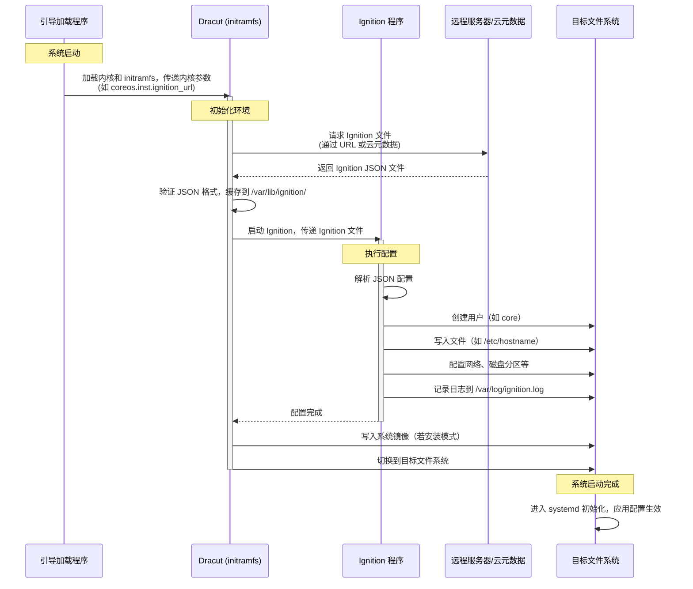

# Red Hat Enterprise Linux CoreOS（RHCOS）是红帽公司推出的一种轻量级、专为容器化工作负载设计的操作系统，主要用于支持 OpenShift Container Platform（OCP）。以下是对 RHCOS 的简要介绍：

### 核心特点
1. **不可变系统（Immutable System）**：
    - RHCOS 采用只读文件系统设计，操作系统组件不可直接修改。这种“不可变”架构通过替换整个系统镜像（而非逐个补丁）进行更新，确保一致性、稳定性和安全性。[](https://juejin.cn/s/redhat%2520coreos)[](https://www.redhat.com/en/blog/red-hat-enterprise-linux-coreos-customization)
    - 更新过程基于原子操作，支持回滚到先前版本，降低更新失败风险。[](https://dockone.io/article/1026)

2. **容器优化**：
    - RHCOS 专为运行容器化应用而设计，内置 CRI-O 容器运行时（替代 Docker），提供更小占用空间和更低攻击面，专为 Kubernetes 平台优化。[](https://docs.redhat.com/en/documentation/openshift_container_platform/4.8/html/architecture/architecture-rhcos)[](https://access.redhat.com/documentation/en-us/openshift_container_platform/4.8/html/architecture/architecture-rhcos)
    - 支持 podman 等容器工具，用于构建、管理和运行容器镜像。[](https://access.redhat.com/documentation/en-us/openshift_container_platform/4.8/html/architecture/architecture-rhcos)

3. **自动化更新**：
    - RHCOS 支持自动化的远程升级，基于 Google 的 Omaha 更新引擎，允许无缝、快速地部署新系统版本，减少应用中断。[](https://dockone.io/article/1026)[](https://www.zdnet.com/article/heres-what-happens-to-coreos-now-that-red-hat-owns-it/)
    - 更新策略灵活，例如可通过 locksmith 服务控制集群节点重启，保障高可用性。[](https://en.wikipedia.org/wiki/Container_Linux)

4. **与 OpenShift 深度集成**：
    - RHCOS 是 OpenShift Container Platform 的默认操作系统，且为控制平面（master）节点的唯一支持操作系统。工作节点（worker）可选择 RHEL，但 RHCOS 是首选。[](https://docs.redhat.com/en/documentation/openshift_container_platform/4.8/html/architecture/architecture-rhcos)[](https://www.redhat.com/en/blog/red-hat-enterprise-linux-coreos-customization)
    - 通过 Ignition 配置文件在首次启动时定制系统，配合 Machine Config Operator（MCO）简化集群节点管理。[](https://www.redhat.com/en/blog/red-hat-enterprise-linux-coreos-customization)

### 技术背景
- **起源**：RHCOS 融合了 CoreOS Container Linux 的自动化更新特性和 Red Hat Enterprise Linux（RHEL）的企业级质量标准。红帽于 2018 年收购 CoreOS 后，将其技术整合，推出 RHCOS 和 Fedora CoreOS。[](https://www.redhat.com/en/technologies/cloud-computing/openshift/what-was-coreos)[](https://www.zdnet.com/article/heres-what-happens-to-coreos-now-that-red-hat-owns-it/)
- **部署方式**：
    - 在 OpenShift 集群安装时，RHCOS 镜像会自动下载到目标平台，并通过 Ignition 文件配置节点。[](https://access.redhat.com/documentation/en-us/openshift_container_platform/4.8/html/architecture/architecture-rhcos)
    - 支持 Live ISO 镜像安装，便于裸机或特定硬件环境的部署。[](https://www.redhat.com/en/blog/red-hat-enterprise-linux-coreos-customization)

### 应用场景
- **云原生环境**：RHCOS 专为 Kubernetes 和 OpenShift 集群设计，适合大规模容器化应用的部署和管理。
- **混合云与多云**：通过容器化支持跨物理、虚拟、私有云和公有云的统一部署。[](https://www.redhat.com/en/about/press-releases/red-hat-acquire-coreos-expanding-its-kubernetes-and-containers-leadership)
- **高安全性需求**：不可变系统和 SELinux 集成增强了安全性，适合企业级工作负载。[](https://www.ithome.com.tw/news/135923)

### 局限性
- **定制限制**：RHCOS 不支持直接修改系统，需通过 Ignition 或 MachineConfig 进行配置，定制复杂性较高。[](https://www.redhat.com/en/blog/red-hat-enterprise-linux-coreos-customization)
- **仅限 OpenShift**：RHCOS 仅作为 OpenShift 组件受支持，不适用于独立使用。[](https://docs.redhat.com/en/documentation/openshift_container_platform/4.8/html/architecture/architecture-rhcos)
- **学习曲线**：对传统 Linux 管理员来说，适应不可变系统和新的管理工具（如 podman、Ignition）可能需要时间。[](https://www.zdnet.com/article/how-red-hat-just-quietly-radically-transformed-enterprise-server-linux/)

### 发展现状
- RHCOS 是 OpenShift 4.x 系列的核心组件，红帽持续优化其性能和工具集。
- CoreOS Container Linux 已于 2020 年 5 月停止支持，Fedora CoreOS 和 RHCOS 成为其继任者。[](https://www.redhat.com/en/technologies/cloud-computing/openshift/what-was-coreos)[](https://www.ithome.com.tw/news/135923)
- 红帽不完全支持自定义 ISO 镜像或非官方配置，需参考官方文档进行操作。[](https://www.redhat.com/en/blog/red-hat-enterprise-linux-coreos-customization)

### 总结
RHCOS 是一个面向云原生、容器化工作负载的现代化操作系统，凭借不可变架构、自动化更新和与 OpenShift 的深度集成，成为企业级 Kubernetes 部署的理想选择。它牺牲了部分灵活性以换取安全性和一致性，适合追求稳定和自动化的企业环境。

如需更深入的技术细节或具体配置指导，请告诉我！

---

以下是一个基于 **Mermaid** 的 UML 时序图，描述了 RHCOS 在系统启动过程中如何使用和加载 **Ignition 文件**。时序图展示了从系统引导到应用 Ignition 配置的关键步骤，涉及的主要参与者包括引导加载程序、Dracut、Ignition 程序和目标文件系统。



### 说明
- **参与者**：
    - **引导加载程序**：负责加载 RHCOS 内核和 initramfs，传递 Ignition 文件的来源（如 URL）。
    - **Dracut (initramfs)**：在初始 RAM 文件系统环境中运行，获取并验证 Ignition 文件。
    - **Ignition 程序**：解析和执行 Ignition 配置，配置目标文件系统。
    - **远程服务器/云元数据**：提供 Ignition 文件（通过 HTTP/HTTPS 或云平台的 user-data）。
    - **目标文件系统**：最终接收 Ignition 配置的地方，存储用户、文件和系统设置。
- **流程**：
    1. 系统通过 PXE、ISO 或云实例启动，引导加载程序传递内核参数。
    2. Dracut 初始化环境，从远程或本地获取 Ignition 文件并验证。
    3. Ignition 解析 JSON 文件，执行配置任务（如创建用户、写入文件）。
    4. 配置完成后，Dracut 安装系统镜像（若需要），切换到目标文件系统。
    5. 系统完成启动，配置生效。
- **Mermaid 格式**：该时序图使用 Mermaid 语法，可在支持 Mermaid 的工具（如 Mermaid Live Editor 或 VS Code 插件）中渲染为图形。

如果需要进一步调整图表内容、添加具体配置示例，或将图表转换为其他格式（如 SVG），请告诉我！

---

# 是的，OpenShift 在其核心架构中依赖于 Red Hat CoreOS (RHCOS)。以下是具体原因和背景：

1. **RHCOS 作为默认操作系统**：  
   OpenShift Container Platform (OCP) 使用 RHCOS 作为其节点（包括控制平面节点和工作节点）的默认操作系统。RHCOS 是一个轻量级、容器优化的操作系统，专门为运行容器化工作负载设计，与 OpenShift 的 Kubernetes 架构高度集成。

2. **不可变基础设施**：  
   RHCOS 采用不可变基础设施模型，系统通过原子更新（Atomic Updates）进行管理，确保一致性和可靠性。这种设计与 OpenShift 的自动化运维和集群管理理念一致。

3. **集成与优化**：  
   RHCOS 包含 OpenShift 所需的特定工具和配置，例如 CRI-O 容器运行时、Ignition（用于初始系统配置）以及与 Red Hat 生态系统的紧密集成。这些特性使 RHCOS 成为 OpenShift 的首选操作系统。

4. **支持其他操作系统**：  
   虽然 RHCOS 是默认和推荐的操作系统，OpenShift 也支持在某些场景下使用其他操作系统（如 Red Hat Enterprise Linux, RHEL）作为工作节点，但控制平面节点通常仍需运行 RHCOS。此外，使用非 RHCOS 系统可能需要额外配置，且支持范围有限。

5. **版本兼容性**：  
   OpenShift 的版本与 RHCOS 的版本密切相关，每次 OpenShift 升级通常伴随着 RHCOS 的更新，以确保兼容性和功能支持。

### 总结
OpenShift 高度依赖 RHCOS，特别是在其核心功能和默认部署中。RHCOS 提供了容器优化、不可变基础设施以及与 OpenShift 生态系统的无缝集成。虽然在某些情况下可以使用其他操作系统，但 RHCOS 是运行 OpenShift 集群的推荐和最优选择。

如果你有更具体的需求或场景（例如混合部署或特定版本），可以提供更多细节，我可以进一步为你解答！

---

不可变基础设施（Immutable Infrastructure）是一种现代 IT 架构和管理理念，强调基础设施的组件（例如服务器、操作系统、配置等）一旦部署后就不再被修改，而是通过替换全新的、预定义的实例来实现更新或变更。以下是对不可变基础设施的详细解释：

### 1. **核心概念**
- **不可变性**：基础设施的组件（如虚拟机、容器镜像或操作系统）在部署后不会被修改。如果需要更新、修复或配置更改，会创建一个新的实例（包含所有更新），然后用新实例替换旧实例，而不是直接修改现有实例。
- **原子性**：每次变更都以完整、独立的方式应用，避免部分更新导致的不一致状态。
- **声明式配置**：基础设施的状态通过代码或配置文件（如 Ignition、Terraform）预定义，确保每次部署的结果可预测且一致。

### 2. **与传统可变基础设施的对比**
- **传统可变基础设施**：
    - 服务器或系统部署后，通过 SSH 登录、运行脚本或手动更改配置来更新（如安装补丁、修改配置文件）。
    - 问题：长期运行的系统可能因为手动操作、配置漂移（Configuration Drift）或未记录的变更导致状态不可预测，难以调试或复制。
- **不可变基础设施**：
    - 系统以镜像或模板形式预构建，包含所有必要的软件、配置和依赖。
    - 更新时，生成新的镜像，部署新实例，旧实例被销毁或逐步淘汰。
    - 优势：一致性高、易于自动化、便于回滚。

### 3. **不可变基础设施的工作原理**
以 Red Hat CoreOS (RHCOS) 和 OpenShift 为例：
- **镜像为基础**：RHCOS 使用预构建的操作系统镜像，包含核心组件和配置。镜像通过版本控制（如 4.12、4.13）管理。
- **声明式初始化**：RHCOS 使用 Ignition 文件在启动时配置节点（例如网络、存储、用户），确保节点以预期状态启动。
- **原子更新**：当需要升级或修补时，RHCOS 下载新的镜像，通过 OSTree 技术以原子方式应用更新，节点重启后运行新镜像。
- **替换而非修改**：如果集群需要扩展或更新，OpenShift 会启动新的 RHCOS 节点（基于最新镜像），并将旧节点逐步下线。

### 4. **不可变基础设施的优势**
- **一致性**：所有实例基于相同的镜像，消除了配置漂移问题，确保生产、测试和开发环境一致。
- **可重复性**：通过版本化的镜像和声明式配置，可以轻松复制或重建基础设施。
- **可靠性**：原子更新降低了更新失败的风险，失败时可快速回滚到旧版本。
- **安全性**：不可变系统减少了运行时修改的机会，降低了被恶意篡改的风险。补丁通过新镜像应用，避免了手动修补的漏洞。
- **自动化友好**：与 CI/CD 管道、基础设施即代码（IaC）结合紧密，适合 DevOps 实践。

### 5. **挑战与局限性**
- **存储开销**：每次更新都需要新的镜像，可能增加存储需求。
- **初始复杂性**：需要建立自动化管道（如镜像构建、部署流程），前期投入较高。
- **状态管理**：不可变基础设施更适合无状态应用，对于需要持久化数据的应用（如数据库），需要额外的状态管理机制（如外部存储卷）。
- **学习曲线**：团队需要适应新的工具和流程，如容器化、IaC 或声明式配置。

### 6. **在 OpenShift 和 RHCOS 中的体现**
- **RHCOS 的不可变性**：RHCOS 是一个只读根文件系统，核心配置通过 Ignition 在启动时应用。系统更新通过 OSTree 实现，下载新镜像并在重启时切换。
- **OpenShift 的集群管理**：OpenShift 使用 MachineConfig Operator 管理节点配置，任何配置变更都会触发新节点的创建和旧节点的替换。
- **容器化工作负载**：OpenShift 上的应用以容器运行，容器本身就是不可变的，每次更新生成新容器镜像，符合不可变基础设施理念。

### 7. **实际应用场景**
- **集群升级**：OpenShift 集群升级时，RHCOS 节点逐一替换为新版本镜像，确保集群状态一致。
- **故障恢复**：如果节点故障，OpenShift 自动用基于相同镜像的新节点替换，无需手动修复。
- **CI/CD 集成**：开发团队推送新应用版本时，构建新容器镜像，部署到 OpenShift，旧版本容器被替换。

### 总结
不可变基础设施通过将基础设施视为不可修改的、版本化的组件，实现了更高的可靠性、一致性和自动化能力。在 OpenShift 和 RHCOS 中，这种理念通过只读镜像、原子更新和声明式配置得以实现，使集群管理更高效、安全。如果你有具体场景（如如何在 OpenShift 中实现不可变部署或处理持久化数据），可以进一步讨论！

---

# rpm-ostree 是一个用于管理基于 Linux 的操作系统的混合镜像/包管理工具，主要用于**原子化更新**和**不可变操作系统**的设计。它结合了 RPM 包管理和 OSTree 技术，广泛应用于 Fedora 衍生系统（如 Fedora Silverblue、Fedora CoreOS）和 Red Hat Enterprise Linux（RHEL）的一些场景。

### 核心特点
1. **原子化更新**：
    - 系统以镜像（image）为单位进行更新，而不是逐个安装或升级 RPM 包。
    - 更新是**事务性**的，要么全部成功，要么回滚，减少系统损坏风险。
    - 支持版本回滚，用户可轻松切换到之前的系统状态。

2. **不可变根文件系统**：
    - 根文件系统是只读的，核心系统组件不可直接修改，增强了安全性和稳定性。
    - 用户数据和配置通常存储在可写目录（如 `/home` 或 `/var`）。

3. **基于 OSTree 的版本控制**：
    - OSTree 是一个类似 Git 的工具，用于管理文件系统快照。
    - rpm-ostree 使用 OSTree 来存储和分发系统镜像，允许高效的增量更新。

4. **RPM 包集成**：
    - 虽然系统以镜像形式管理，但仍支持 RPM 包的安装。
    - 用户可以通过“层化（layering）”方式将额外的 RPM 包叠加到系统镜像上。
    - 也可以通过容器化工具（如 Podman）运行应用，减少对系统本身的修改。

5. **容器化工作流**：
    - rpm-ostree 鼓励使用容器（如 Flatpak 或 Podman）来安装和管理用户应用程序，与不可变系统的理念相辅相成。

### 工作原理
- **镜像构建**：rpm-ostree 从预定义的系统镜像开始，包含核心操作系统和预装软件。
- **更新流程**：
    1. 下载新的系统镜像（或增量更新）。
    2. 在后台准备新的系统部署（deployment）。
    3. 重启后切换到新部署，旧部署保留以备回滚。
- **层化安装**：如果需要额外软件，rpm-ostree 将 RPM 包“层化”到当前镜像，生成新的部署。
- **回滚**：通过 `rpm-ostree rollback` 命令，用户可以切换到之前的系统版本。

### 典型使用场景
- **Fedora Silverblue**：面向桌面用户的不可变系统，强调容器化应用和原子更新。
- **Fedora CoreOS**：面向容器化工作负载的服务器操作系统，适合 Kubernetes 集群。
- **RHEL for Edge**：用于边缘计算场景，提供可靠的原子更新和最小化系统。

### 常用命令
- `rpm-ostree upgrade`：检查并应用系统更新。
- `rpm-ostree rollback`：回滚到上一个系统版本。
- `rpm-ostree install <package>`：层化安装 RPM 包。
- `rpm-ostree status`：查看当前部署状态和可用版本。
- `rpm-ostree rebase`：切换到不同的系统分支或镜像。

### 优势
- **稳定性**：原子更新和只读根文件系统降低配置错误或更新失败的风险。
- **安全性**：不可变设计减少攻击面，更新快速修复漏洞。
- **可维护性**：支持版本控制和回滚，简化系统管理。
- **一致性**：跨设备部署一致的系统镜像，适合大规模环境。

### 局限性
- **学习曲线**：与传统包管理（如 dnf、apt）相比，rpm-ostree 的工作流需要适应。
- **灵活性受限**：不可变系统限制了直接修改系统文件的能力。
- **层化开销**：频繁层化 RPM 包可能导致镜像膨胀，需重新生成基础镜像。
- **生态依赖**：最佳体验需配合容器化工具（如 Flatpak、Podman）。

### 总结
rpm-ostree 是一种现代化的系统管理工具，结合了 RPM 的包管理灵活性和 OSTree 的原子化更新能力，适合追求稳定性、安全性和可维护性的桌面、服务器或边缘计算场景。它推动了不可变操作系统的普及，尤其在 Fedora 和 RHEL 生态中表现突出。如果你对容器化工作流或原子更新感兴趣，rpm-ostree 是一个值得探索的技术。

如果需要更详细的解释、命令示例或特定用例分析，请告诉我！

---

# CRI-O 是一个轻量级的容器运行时，专为 Kubernetes 设计，符合容器运行时接口（CRI）标准。以下是其主要特点和介绍：

### 什么是 CRI-O？
CRI-O 是 Kubernetes 社区开发的一个开源项目，旨在提供一种简洁、专注于 Kubernetes 的容器运行时替代方案。它直接与 Kubernetes 的 CRI 交互，取代了传统上使用的 Docker 或其他运行时。

### 主要特点
1. **轻量高效**：
    - CRI-O 专注于 Kubernetes 的核心需求，去掉了不必要的工具和功能（如 Docker CLI），减少了资源占用。
    - 相比 Docker，它更轻量，启动速度更快。

2. **原生支持 CRI**：
    - CRI-O 直接实现 Kubernetes CRI 接口，无需额外的适配层（如 Dockershim），降低了复杂性和潜在的性能开销。

3. **模块化设计**：
    - 采用容器标准（如 OCI），支持任何符合 OCI 标准的容器镜像。
    - 使用 CNI（容器网络接口）进行网络配置，支持多种网络插件。
    - 支持多种存储后端（如 overlayfs、devicemapper）。

4. **安全性**：
    - 支持 SELinux、AppArmor 等安全机制。
    - 通过 runc 或其他 OCI 兼容的运行时（如 Kata Containers）执行容器，提供隔离性。

5. **与 Kubernetes 紧密集成**：
    - 专为 Kubernetes 优化，支持所有 Kubernetes 功能，如 Pod 生命周期管理、资源限制等。
    - 与 kubelet 无缝协作，简化集群部署。

### 架构
CRI-O 的架构分为以下几个核心组件：
- **CRI-O Daemon**：负责与 kubelet 通信，处理 CRI 请求，管理 Pod 和容器生命周期。
- **容器运行时**：使用 runc（默认）或其他 OCI 运行时来启动和管理容器。
- **镜像管理**：通过 containers/image 库拉取和存储镜像，支持 Docker Hub、Quay.io 等镜像仓库。
- **网络和存储**：通过 CNI 插件管理网络，通过 containers/storage 管理镜像和容器存储。

### 与 Docker 的对比
| 特性                  | CRI-O                     | Docker                     |
|----------------------|---------------------------|----------------------------|
| **主要用途**          | 专为 Kubernetes 设计       | 通用容器平台               |
| **CRI 支持**          | 原生支持 CRI              | 需要 Dockershim 适配       |
| **资源占用**          | 轻量                      | 较重（包含 CLI 等工具）    |
| **功能复杂度**        | 专注于容器运行时           | 提供完整容器生态系统       |
| **社区支持**          | Kubernetes 社区            | 广泛的通用容器社区         |

### 使用场景
- **Kubernetes 集群**：CRI-O 是 Kubernetes 集群的推荐运行时之一，尤其适合追求性能和简洁的场景。
- **生产环境**：许多大型 Kubernetes 部署（如 Red Hat OpenShift）默认使用 CRI-O。
- **边缘计算**：轻量特性使其适合资源受限的边缘设备。

### 安装与使用
CRI-O 通常与 Kubernetes 一起部署，安装步骤包括：
1. 安装 CRI-O 软件包（支持主流 Linux 发行版，如 Ubuntu、CentOS）。
2. 配置 CRI-O（调整存储、网络插件等）。
3. 配置 kubelet 使用 CRI-O 作为运行时。
4. 启动 CRI-O 服务并验证与 Kubernetes 的集成。

示例安装命令（以 Ubuntu 为例）：
```bash
sudo apt-get install cri-o cri-o-runc
sudo systemctl enable crio
sudo systemctl start crio
```

### 社区与支持
- **项目主页**：https://cri-o.io/
- **GitHub**：https://github.com/cri-o/cri-o
- **支持者**：Red Hat、Intel、SUSE 等公司积极贡献。
- **版本**：与 Kubernetes 版本保持同步（如 CRI-O 1.28 支持 Kubernetes 1.28）。

### 总结
CRI-O 是一个为 Kubernetes 量身定制的容器运行时，以轻量、高效和原生 CRI 支持著称。它简化了 Kubernetes 的容器运行时架构，适合生产级和边缘计算场景。如果你正在部署 Kubernetes 集群，CRI-O 是一个值得考虑的运行时选择。

如果需要更详细的配置指南或与其他运行时（如 containerd）的对比，请告诉我！

