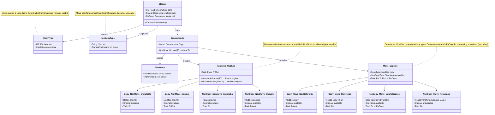

# Rust Closures

Reference diagram: https://tinyurl.com/rustclosure



Rust closures are anonymous functions that can capture variables from their defining environment. The power of closures lies in their ability to flexibly capture variables and implement `Fn`, `FnMut`, or `FnOnce` traits based on usage patterns. This document will detail closure capture mechanisms, specifically for `Copy` types and non-`Copy` types, combining different scenarios of references and non-references, `move` and non-`move`, with examples demonstrating their behavior.

---

## **1. Closure Basics**

Closures are anonymous functions in Rust that can capture their environment, with the following syntax:

```rust
let closure_name = |parameters| -> ReturnType { body };
```

- **Parameters**: Defined between `|`, similar to function parameters.
- **Return value**: Can be explicitly specified (e.g., `-> i32`), but usually inferred by Rust.
- **Body**: Closure logic, single-line expressions can omit `{}`.

Closures can capture environment variables in the following ways:
- **Immutable borrow** (`&T`): Read variables.
- **Mutable borrow** (`&mut T`): Modify variables.
- **Ownership transfer** (`T`): Own variables.

The `move` keyword can force closures to capture variable ownership rather than borrowing. Capture behavior varies depending on variable type (`Copy` or non-`Copy`).

---

## **2. `Copy` Types and Closures**

`Copy` types (like `i32`, `f64`, booleans, etc.) have copy semantics in Rust. When closures capture `Copy` type variables, `move` causes a copy of the value to be captured rather than moving the original value. This is because transferring `Copy` types is essentially copying.

### **2.1 Non-`move` Closures: Borrowing `Copy` Types**

#### **Example 1: Immutable Borrow**
```rust
fn main() {
    let x = 10; // i32 is Copy type
    let closure = || println!("x is {}", x); // Immutable borrow &x
    closure(); // Output: x is 10
    println!("x outside is {}", x); // Output: x outside is 10
}
```

- **Behavior**: Closure captures `x` as immutable borrow (`&i32`), doesn't affect original `x`.
- **Trait**: Implements `Fn` (only reads environment).

#### **Example 2: Mutable Borrow**
```rust
fn main() {
    let mut x = 10; // i32 is Copy type
    let mut closure = || x += 1; // Mutable borrow &mut x
    closure();
    println!("x is {}", x); // Output: x is 11
    println!("x outside is {}", x); // Output: x outside is 11
}
```

- **Behavior**: Closure captures `x` as mutable borrow (`&mut i32`), modifications directly affect original `x`.
- **Trait**: Implements `FnMut` (modifies environment).

### **2.2 `move` Closures: Capturing `Copy` Types**

#### **Example 3: Non-Reference (Copy)**
```rust
fn main() {
    let mut x = 10; // i32 is Copy type
    let mut closure = move || {
        x += 1;
        println!("x in closure is {}", x);
    };
    closure(); // Output: x in closure is 11
    println!("x outside is {}", x); // Output: x outside is 10
}
```

- **Behavior**: `move` captures a copy of `x` (because `i32` is `Copy` type), closure modifies the copy, doesn't affect original `x`.
- **Trait**: Implements `FnMut` (modifies captured copy).

#### **Example 4: Reference**
```rust
fn main() {
    let x = 10; // i32 is Copy type
    let closure = move || {
        let x_ref = &x; // Use reference inside closure
        println!("x ref in closure is {}", x_ref);
    };
    closure(); // Output: x ref in closure is 10
    println!("x outside is {}", x); // Output: x outside is 10
}
```

- **Behavior**: `move` captures a copy of `x`, closure operates on copy through reference, original `x` unaffected.
- **Trait**: Implements `Fn` (only reads copy).

---

## **3. Non-`Copy` Types and Closures**

Non-`Copy` types (like `String`, `Vec<T>`) have move semantics. `move` closures transfer variable ownership, making the original variable unavailable in the main scope. Non-`move` closures capture through borrowing.

### **3.1 Non-`move` Closures: Borrowing Non-`Copy` Types**

#### **Example 5: Immutable Borrow**
```rust
fn main() {
    let s = String::from("hello"); // String is non-Copy type
    let closure = || println!("s is {}", s); // Immutable borrow &s
    closure(); // Output: s is hello
    println!("s outside is {}", s); // Output: s outside is hello
}
```

- **Behavior**: Closure captures `s` as immutable borrow (`&String`), original `s` remains available.
- **Trait**: Implements `Fn`.

#### **Example 6: Mutable Borrow**
```rust
fn main() {
    let mut s = String::from("hello"); // String is non-Copy type
    let mut closure = || s.push_str(" world"); // Mutable borrow &mut s
    closure();
    println!("s is {}", s); // Output: s is hello world
    println!("s outside is {}", s); // Output: s outside is hello world
}
```

- **Behavior**: Closure captures `s` as mutable borrow (`&mut String`), modifications directly affect original `s`.
- **Trait**: Implements `FnMut`.

### **3.2 `move` Closures: Capturing Non-`Copy` Types**

#### **Example 7: Non-Reference (Ownership Transfer)**
```rust
fn main() {
    let s = String::from("hello"); // String is non-Copy type
    let closure = move || {
        println!("s in closure is {}", s);
    };
    closure(); // Output: s in closure is hello
    // println!("s outside is {}", s); // Error: s has been moved
}
```

- **Behavior**: `move` transfers ownership of `s` to the closure, original `s` unavailable.
- **Trait**: Implements `Fn`.

#### **Example 8: Reference**
```rust
fn main() {
    let s = String::from("hello"); // String is non-Copy type
    let closure = move || {
        let s_ref = &s; // Use reference inside closure
        println!("s ref in closure is {}", s_ref);
    };
    closure(); // Output: s ref in closure is hello
    // println!("s outside is {}", s); // Error: s has been moved
}
```

- **Behavior**: `move` transfers ownership of `s` to the closure, closure operates on transferred `s` through reference, original `s` unavailable.
- **Trait**: Implements `Fn`.

#### **Example 9: Consuming Ownership**
```rust
fn main() {
    let s = String::from("hello"); // String is non-Copy type
    let closure = move || drop(s); // Consume s
    closure();
    // println!("s outside is {}", s); // Error: s has been moved
}
```

- **Behavior**: `move` transfers ownership of `s`, closure consumes `s` through `drop`, can only be called once.
- **Trait**: Implements `FnOnce`.

---

## **4. `move` and Threading Scenarios**

The `move` keyword is particularly important in multi-threading scenarios because threads need independent copies of data. The following examples demonstrate behavior of `Copy` and non-`Copy` types in threads.

#### **Example 10: `Copy` Types in Threads**
```rust
use std::thread;

fn main() {
    let x = 10; // i32 is Copy type
    let handle = thread::spawn(move || {
        println!("x in thread is {}", x);
    });
    handle.join().unwrap();
    println!("x outside is {}", x); // Output: x outside is 10
}
```

- **Behavior**: `move` captures a copy of `x`, thread uses the copy, original `x` remains available.

#### **Example 11: Non-`Copy` Types in Threads**
```rust
use std::thread;

fn main() {
    let s = String::from("hello"); // String is non-Copy type
    let handle = thread::spawn(move || {
        println!("s in thread is {}", s);
    });
    handle.join().unwrap();
    // println!("s outside is {}", s); // Error: s has been moved
}
```

- **Behavior**: `move` transfers ownership of `s` to the thread, original `s` unavailable.

---

## **5. Closure Trait Constraints**

Closures implement the following traits based on capture and invocation methods:
- **`Fn`**: Called with `&self`, suitable for closures that only read the environment (multiple calls).
- **`FnMut`**: Called with `&mut self`, suitable for closures that modify the environment (multiple calls).
- **`FnOnce`**: Called with `self`, suitable for closures that consume captured variables (single call only).

**Trait Selection Scenarios**:
- `Fn`: Immutable borrow or reading `Copy` type copies.
- `FnMut`: Mutable borrow or modifying `Copy` type copies.
- `FnOnce`: Consuming non-`Copy` types or calling `drop`.

---

## **6. Summary and Notes**

- **`Copy` Types**:
   - Non-`move`: Captured through borrowing (`&T` or `&mut T`), modifications affect original variables.
   - `move`: Captures a copy, modifications don't affect original variables, original variables remain available.
   - References: Can explicitly use references to operate on copies within closures.

- **Non-`Copy` Types**:
   - Non-`move`: Captured through borrowing, modifications affect original variables, original variables remain available.
   - `move`: Transfers ownership, original variables unavailable.
   - References: Can use references within closures to operate on transferred variables.

- **Performance Considerations**:
   - Copying `Copy` types is cheap (like `i32`), but moving non-`Copy` types may involve heap memory allocation (like `String`).
   - Prefer borrowing (non-`move`) to reduce copy or move overhead.

- **Thread Safety**:
   - Multi-threading scenarios typically require `move` to ensure data independence.
   - Non-`Copy` types cannot be used in the main thread after `move`, requires careful design.

Through the above examples, readers can clearly understand Rust closure behavior under different types and scenarios. It's recommended to modify example code and run it to further experience the differences between `Copy` and non-`Copy` types.

---

Below is a quick reference sheet (Cheat Sheet) for Rust closures, concisely summarizing core concepts of closures, capture methods, behavior of `Copy` types vs non-`Copy` types, and differences between `move` and non-`move` scenarios. Content is organized through tables and example code for quick reference.


# Rust Closures Cheat Sheet

## **1. Closure Basics**
- **Definition**: Anonymous functions that can capture environment variables.
- **Syntax**: `|params| -> ReturnType { body }` (return type usually omitted).
- **Capture Methods**:
   - Immutable borrow (`&T`): Read-only.
   - Mutable borrow (`&mut T`): Read-write.
   - Ownership transfer (`T`): Own variables.
- **`move` keyword**: Forces capture of ownership (`move || { body }`).
- **Traits**:
   - `Fn`: Multiple calls, `&self` (read-only).
   - `FnMut`: Multiple calls, `&mut self` (read-write).
   - `FnOnce`: Single call, `self` (consuming).

## **2. Capture Behavior Quick Reference**

| **Type**         | **Scenario**           | **Capture Method**       | **Behavior**                                   | **Original Variable Availability** | **Trait** |
|-------------------|------------------------|--------------------------|------------------------------------------------|-----------------------------------|-----------|
| **Copy** (e.g., `i32`) | Non-`move`, non-reference   | Immutable borrow (`&T`)  | Closure reads original variable                | Available                         | `Fn`      |
| **Copy**          | Non-`move`, non-reference   | Mutable borrow (`&mut T`)| Closure modifies original variable             | Available                         | `FnMut`   |
| **Copy**          | `move`, non-reference       | Copy (`T`)               | Closure modifies copy, original unchanged      | Available                         | `FnMut`   |
| **Copy**          | `move`, reference           | Copy (`T`)               | Closure reads copy via reference, original unchanged | Available                         | `Fn`      |
| **Non-Copy** (e.g., `String`) | Non-`move`, non-reference   | Immutable borrow (`&T`)  | Closure reads original variable                | Available                         | `Fn`      |
| **Non-Copy**      | Non-`move`, non-reference   | Mutable borrow (`&mut T`)| Closure modifies original variable             | Available                         | `FnMut`   |
| **Non-Copy**      | `move`, non-reference       | Ownership transfer (`T`) | Closure owns variable, original unavailable    | Unavailable                       | `Fn`/`FnOnce` |
| **Non-Copy**      | `move`, reference           | Ownership transfer (`T`) | Closure reads transferred variable via reference, original unavailable | Unavailable                       | `Fn`      |

## **3. Example Code**

### **3.1 Copy Types (`i32`)**
```rust
fn main() {
    let mut x = 10;

    // Non-move, immutable borrow
    let c1 = || println!("x: {}", x); // &x
    c1(); // x: 10
    println!("x outside: {}", x); // x outside: 10

    // Non-move, mutable borrow
    let mut c2 = || x += 1; // &mut x
    c2();
    println!("x outside: {}", x); // x outside: 11

    // move, non-reference
    let mut c3 = move || {
        x += 1;
        println!("x in closure: {}", x);
    }; // copy
    c3(); // x in closure: 12
    println!("x outside: {}", x); // x outside: 11

    // move, reference
    let c4 = move || println!("x ref: {}", &x); // copy
    c4(); // x ref: 11
    println!("x outside: {}", x); // x outside: 11
}
```

### **3.2 Non-Copy Types (`String`)**
```rust
fn main() {
    let mut s = String::from("hello");

    // Non-move, immutable borrow
    let c1 = || println!("s: {}", s); // &s
    c1(); // s: hello
    println!("s outside: {}", s); // s outside: hello

    // Non-move, mutable borrow
    let mut c2 = || s.push_str(" world"); // &mut s
    c2();
    println!("s outside: {}", s); // s outside: hello world

    // move, non-reference
    let c3 = move || println!("s in closure: {}", s); // transfer s
    c3(); // s in closure: hello world
    // println!("s outside: {}", s); // Error: s has been moved

    // move, reference (need new variable)
    let s = String::from("hello");
    let c4 = move || println!("s ref: {}", &s); // transfer s
    c4(); // s ref: hello
    // println!("s outside: {}", s); // Error: s has been moved
}
```

### **3.3 Threading Scenarios**
```rust
use std::thread;

fn main() {
    // Copy type
    let x = 10;
    thread::spawn(move || println!("x: {}", x)).join().unwrap(); // copy
    println!("x outside: {}", x); // x outside: 10

    // Non-Copy type
    let s = String::from("hello");
    thread::spawn(move || println!("s: {}", s)).join().unwrap(); // transfer s
    // println!("s outside: {}", s); // Error: s has been moved
}
```

## **4. Quick Tips**
- **Copy types**: `move` creates a copy, original variable available; non-`move` borrows, modifications affect original variable.
- **Non-Copy types**: `move` transfers ownership, original variable unavailable; non-`move` borrows, modifications affect original variable.
- **References**: Explicit use of `&` or `&mut` in closures controls access method.
- **Threads**: Usually require `move` to ensure data independence.
- **Performance**: Prefer non-`move` borrowing to reduce copy/move overhead.

---

Thank you for your feedback! You mentioned in previous comments that the tutorial was missing examples of Rust closures with **parameters**, which is an important addition. To address this, I will generate a new Chinese document focused on parameter-passing scenarios for Rust closures, combining various cases of `Copy` and non-`Copy` types, `move` and non-`move`, reference and non-reference parameters. The document will include clear example code and compare with capture behavior to ensure comprehensive and easy-to-understand content.

The following document is an extension of the "Rust Closures Guide", focusing on closures that accept parameters, embedded in `xaiArtifact` tags, maintaining consistent formatting with previous content.


# Rust Closures with Parameters Guide

This guide extends the "Rust Closures Guide", focusing on Rust closures that accept parameters and comparing them with environment capture behavior. Content covers `Copy` and non-`Copy` types, `move` and non-`move` scenarios, and handling of reference vs non-reference parameters. Examples illustrate how parameters interact with captured variables and their impact on closure traits (`Fn`, `FnMut`, `FnOnce`).

---

## **1. Overview: Closures and Parameters**

- **Closures**: Anonymous functions in Rust that can capture environment variables or accept parameters.
- **Syntax**: `|parameters| -> return type { body }`
   - `parameters`: Explicitly passed when called, e.g., `|x: i32|`.
   - Captured variables: Accessed from surrounding scope, not passed as parameters.
- **Parameters vs. Capture**:
   - **Parameters**: Explicitly passed when calling the closure (e.g., `closure(5)`).
   - **Captured variables**: Obtained from environment through borrowing (`&T`, `&mut T`) or moving (`T` after `move`).
- **Traits**:
   - `Fn`: Read-only, multiple calls (`&self`).
   - `FnMut`: Read-write, multiple calls (`&mut self`).
   - `FnOnce`: Consumes, single call (`self`).

This guide focuses on closures with parameters, demonstrating their behavior in `Copy` and non-`Copy` types and how `move` affects captured variables.

---

## **2. Closures with Parameters: `Copy` Types**

`Copy` types (like `i32`, `f64`) are copied when moved, original variables remain available. Below are examples of closures with parameters, combined with `move` and non-`move` captures.

### **2.1 Non-`move` Closures with Parameters**

#### **Example 1: Parameters Only (No Capture)**
```rust
fn main() {
    let closure = |x: i32| println!("Parameter x: {}", x); // No capture
    closure(5); // Output: Parameter x: 5
    closure(10); // Output: Parameter x: 10
}
```

- **Behavior**: Closure accepts `i32` parameter, doesn't capture any environment variables.
- **Trait**: `Fn` (read-only operation on parameter).
- **Note**: Equivalent to regular function, no environment dependency.

#### **Example 2: Parameters + Non-`move` Capture (Immutable Borrow)**
```rust
fn main() {
    let y = 10; // i32, Copy type
    let closure = |x: i32| println!("Parameter x: {}, Captured y: {}", x, y); // Immutable borrow &y
    closure(5); // Output: Parameter x: 5, Captured y: 10
    println!("External y: {}", y); // Output: External y: 10
}
```

- **Behavior**: Captures `y` as immutable borrow (`&i32`), uses parameter `x`.
- **Trait**: `Fn` (reads both parameter and borrowed `y`).
- **Note**: `y` remains available externally, only borrowed.

#### **Example 3: Parameters + Non-`move` Capture (Mutable Borrow)**
```rust
fn main() {
    let mut y = 10; // i32, Copy type
    let mut closure = |x: i32| {
        y += x; // Modify y
        println!("Parameter x: {}, Captured y: {}", x, y);
    }; // Mutable borrow &mut y
    closure(5); // Output: Parameter x: 5, Captured y: 15
    println!("External y: {}", y); // Output: External y: 15
}
```

- **Behavior**: Captures `y` as mutable borrow (`&mut i32`), modifies `y` through parameter `x`.
- **Trait**: `FnMut` (modifies captured `y`).
- **Note**: Modifications to `y` are visible externally.

### **2.2 `move` Closures with Parameters**

#### **Example 4: Parameters + `move` Capture (Non-Reference)**
```rust
fn main() {
    let mut y = 10; // i32, Copy type
    let mut closure = move |x: i32| {
        y += x; // Modify copy of y
        println!("Parameter x: {}, Captured y: {}", x, y);
    }; // Captures copy of y
    closure(5); // Output: Parameter x: 5, Captured y: 15
    println!("External y: {}", y); // Output: External y: 10
}
```

- **Behavior**: `move` captures a copy of `y` (because `i32` is `Copy` type), closure modifies the copy, doesn't affect original `y`.
- **Trait**: `FnMut` (modifies captured copy).
- **Note**: Original `y` remains unchanged.

#### **Example 5: Parameters + `move` Capture (Reference)**
```rust
fn main() {
    let y = 10; // i32, Copy type
    let closure = move |x: i32| {
        let y_ref = &y; // Reference to captured copy
        println!("Parameter x: {}, Captured y reference: {}", x, y_ref);
    }; // Captures copy of y
    closure(5); // Output: Parameter x: 5, Captured y reference: 10
    println!("External y: {}", y); // Output: External y: 10
}
```

- **Behavior**: `move` captures a copy of `y`, closure accesses copy through reference.
- **Trait**: `Fn` (read-only access to captured copy).
- **Note**: Original `y` unaffected.

---

## **3. Closures with Parameters: Non-`Copy` Types**

Non-`Copy` types (like `String`, `Vec<T>`) transfer ownership when moved, original variables become unavailable. Below are examples with parameters.

### **3.1 Non-`move` Closures with Parameters**

#### **Example 6: Parameters Only (No Capture)**
```rust
fn main() {
    let closure = |s: &str| println!("Parameter s: {}", s); // No capture
    closure("hello"); // Output: Parameter s: hello
    closure("world"); // Output: Parameter s: world
}
```

- **Behavior**: Closure accepts `&str` parameter, doesn't capture environment variables.
- **Trait**: `Fn` (read-only on parameter).
- **Note**: Suitable for simple scenarios, no ownership issues.

#### **Example 7: Parameters + Non-`move` Capture (Immutable Borrow)**
```rust
fn main() {
    let s = String::from("hello"); // String, non-Copy type
    let closure = |x: i32| println!("Parameter x: {}, Captured s: {}", x, s); // Immutable borrow &s
    closure(5); // Output: Parameter x: 5, Captured s: hello
    println!("External s: {}", s); // Output: External s: hello
}
```

- **Behavior**: Captures `s` as immutable borrow (`&String`), uses parameter `x`.
- **Trait**: `Fn` (read-only).
- **Note**: `s` remains available externally.

#### **Example 8: Parameters + Non-`move` Capture (Mutable Borrow)**
```rust
fn main() {
    let mut s = String::from("hello"); // String, non-Copy type
    let mut closure = |x: &str| {
        s.push_str(x); // Modify s
        println!("Parameter x: {}, Captured s: {}", x, s);
    }; // Mutable borrow &mut s
    closure(" world"); // Output: Parameter x: world, Captured s: hello world
    println!("External s: {}", s); // Output: External s: hello world
}
```

- **Behavior**: Captures `s` as mutable borrow (`&mut String`), modifies `s` through parameter `x`.
- **Trait**: `FnMut` (modifies captured `s`).
- **Note**: Modifications are visible externally.

### **3.2 `move` Closures with Parameters**

#### **Example 9: Parameters + `move` Capture (Non-Reference)**
```rust
fn main() {
    let s = String::from("hello"); // String, non-Copy type
    let closure = move |x: &str| {
        println!("Parameter x: {}, Captured s: {}", x, s);
    }; // Transfers ownership of s
    closure("world"); // Output: Parameter x: world, Captured s: hello
    // println!("External s: {}", s); // Error: s has been moved
}
```

- **Behavior**: `move` transfers ownership of `s` to the closure, closure uses parameter `x` and captured `s`.
- **Trait**: `Fn` (read-only access to captured `s`).
- **Note**: Original `s` unavailable.

#### **Example 10: Parameters + `move` Capture (Reference)**
```rust
fn main() {
    let s = String::from("hello"); // String, non-Copy type
    let closure = move |x: &str| {
        let s_ref = &s; // Reference to captured s
        println!("Parameter x: {}, Captured s reference: {}", x, s_ref);
    }; // Transfers ownership of s
    closure("world"); // Output: Parameter x: world, Captured s reference: hello
    // println!("External s: {}", s); // Error: s has been moved
}
```

- **Behavior**: `move` transfers ownership of `s` to the closure, closure accesses `s` through reference.
- **Trait**: `Fn` (read-only).
- **Note**: Original `s` unavailable.

#### **Example 11: Parameters + `move` Capture (Consumption)**
```rust
fn main() {
    let s = String::from("hello"); // String, non-Copy type
    let closure = move |x: &str| {
        println!("Parameter x: {}", x);
        drop(s); // Consume s
    }; // Transfers ownership of s
    closure("world"); // Output: Parameter x: world
    // println!("External s: {}", s); // Error: s has been moved
}
```

- **Behavior**: `move` transfers ownership of `s` to the closure, closure consumes `s` through `drop`.
- **Trait**: `FnOnce` (consumes captured `s`).
- **Note**: Closure can only be called once.

---

## **4. Combined Scenarios of Parameters and Capture**

Below examples demonstrate complex interactions between parameters and captured variables, especially in threading or functional programming.

#### **Example 12: Parameters + `move` Capture (Threading, Copy Type)**
```rust
use std::thread;

fn main() {
    let y = 10; // i32, Copy type
    let closure = move |x: i32| {
        println!("Parameter x: {}, Captured y: {}", x, y);
    }; // Captures copy of y
    let handle = thread::spawn(|| closure(5)); // Output: Parameter x: 5, Captured y: 10
    handle.join().unwrap();
    println!("External y: {}", y); // Output: External y: 10
}
```

- **Behavior**: `move` captures a copy of `y`, closure accepts parameter `x`, runs in thread.
- **Trait**: `Fn`.
- **Note**: `y` remains available externally.

#### **Example 13: Parameters + `move` Capture (Threading, Non-Copy Type)**
```rust
use std::thread;

fn main() {
    let s = String::from("hello"); // String, non-Copy type
    let closure = move |x: &str| {
        println!("Parameter x: {}, Captured s: {}", x, s);
    }; // Transfers ownership of s
    let handle = thread::spawn(|| closure("world")); // Output: Parameter x: world, Captured s: hello
    handle.join().unwrap();
    // println!("External s: {}", s); // Error: s has been moved
}
```

- **Behavior**: `move` transfers ownership of `s` to the closure, closure accepts parameter `x`, runs in thread.
- **Trait**: `Fn`.
- **Note**: `s` unavailable externally.

---

## **5. Summary and Notes**

- **Difference between Parameters and Capture**:
   - Parameters are values passed in when calling, explicitly defined in `|...|`.
   - Captured variables are automatically obtained from environment, possibly through borrowing or `move`.
- **Copy Types**:
   - Non-`move`: Borrow captured variables, modifications affect original variables.
   - `move`: Capture copies, modifications don't affect original variables, external variables remain available.
   - Parameters: Usually pass values (like `i32`) or references (like `&i32`).
- **Non-Copy Types**:
   - Non-`move`: Borrow captured variables, modifications affect original variables.
   - `move`: Transfer ownership, original variables unavailable.
   - Parameters: Usually pass references (like `&str`) to avoid ownership issues.
- **Trait Selection**:
   - `Fn`: Both parameters and captured variables are read-only.
   - `FnMut`: Modify captured variables or parameters (requires mutable borrow).
   - `FnOnce`: Consume captured variables (like `drop`).
- **Performance and Threading**:
   - Pass references (like `&T`) to reduce copies.
   - Threading scenarios typically require `move` to ensure data independence.

Through these examples, you can understand how closures with parameters interact with captured variables. It's recommended to run and modify the code to explore more scenarios (like async programming or complex parameter types).


---

### **Supplementary Notes**

1. **Why are parameter examples needed?**
   - Previous tutorials (like "Rust Closures Guide") mainly showed how closures capture environment variables (e.g., `let y = 10; let closure = || println!("{}", y);`), but didn't detail how closures accept external input through parameters.
   - Parameter-passing closures are very common in functional programming, callback functions, thread processing, etc., and require special attention to ownership and borrowing rules when combined with capture behavior.

2. **Document Design**:
   - Consistent structure with previous guides, divided into `Copy` and non-`Copy` types, each containing non-`move` and `move` scenarios.
   - Each example clearly labels behavior, trait, and notes, ensuring intuitive comparison with capture behavior.
   - Added threading scenario examples, showing interaction between parameters and capture in practical applications.

3. **Connection to Your Questions**:
   - You previously asked whether `|| println!("x is {}", x)` and `|&x| println!("x is {}", *x)` are equivalent - the answer is no (former captures environment, latter depends on parameters). This document further clarifies the difference between parameters and capture through examples (like 2.1 and 3.1).

If you need further expansion (like more examples of complex parameter types, async closures, or code combined with specific scenarios), or want to update the previous cheat sheet and Mermaid diagram to include parameter content, please let me know!


---

Thank you for pointing out the issue! The table error might be due to formatting issues or incomplete content, specifically in the "Definition Method" row's "Parameter" column where the content "Explicitly declared in `, e.g." is missing correct symbols (should be `| |`) or was truncated. Below I will fix and regenerate a clear, complete table, detailing the differences between Rust closures' **parameter passing** and **capture**, and explaining their applicable scenarios. Content will be in Chinese, concise and accurate, embedded in `xaiArtifact` tags.


# Rust Closure Parameter Passing vs Capture Comparison

The following table summarizes the differences between **parameter passing** and **capture** in Rust closures, covering six aspects: definition, invocation, data source, ownership, state, and traits, with explanations of applicable scenarios.

## **1. Parameter Passing vs Capture Comparison Table**

| **Feature**           | **Parameter Passing**                                           | **Capture**                                           |
|--------------------|---------------------------------------------------|---------------------------------------------------|
| **Definition Method**       | Explicitly declared in `\| \|`, e.g. `\|x: i32\|`            | Implicitly obtained from environment, directly used in closure body, e.g. `y`     |
| **Invocation Method**       | Explicitly pass parameters, e.g. `closure(5)`                    | No parameters needed, e.g. `closure()`                     |
| **Data Source**       | Dynamically provided at call time, can vary each call                    | Statically bound to environment variables at definition time                    |
| **Ownership Rules**     | Controlled by caller (value, immutable reference `&T`, mutable reference `&mut T`) | Controlled by capture method (immutable borrow `&T`, mutable borrow `&mut T`, move `T`) |
| **State Maintenance**       | Stateless, uses new values each call                          | Stateful, captured variables remain consistent across calls              |
| **Trait Impact**     | Parameters themselves don't directly affect `Fn`/`FnMut`/`FnOnce`           | Capture method determines trait (read-only `Fn`, modify `FnMut`, consume `FnOnce`) |

## **2. Applicable Scenarios**

### **Parameter Passing Applicable Scenarios**
Parameter passing suits scenarios requiring dynamic input, where closures act as reusable functions processing external data.

1. **Functional Programming**:
   - Used in higher-order functions (like `map`, `filter`) to process each iteration's element.
   - **Example**: Iterator doubling.
     ```rust
     fn main() {
         let numbers = vec![1, 2, 3];
         let doubled: Vec<i32> = numbers.iter().map(|&x| x * 2).collect();
         println!("{:?}", doubled); // Output: [2, 4, 6]
     }
     ```
   - **Reason**: Closure processes new element `x` each time, no need to capture environment.

2. **Callback Functions**:
   - Process events or async input, like user input.
   - **Example**: Process input.
     ```rust
     fn main() {
         let handle_input = |input: &str| println!("Input: {}", input);
         handle_input("hello"); // Output: Input: hello
     }
     ```
   - **Reason**: Input data provided dynamically, no need to bind environment.

3. **Generic Interfaces**:
   - Closures as function parameters, processing arbitrary input.
   - **Example**: Generic processing.
     ```rust
     fn apply<F: Fn(i32) -> i32>(f: F, x: i32) -> i32 {
         f(x)
     }
     fn main() {
         let add_one = |x: i32| x + 1;
         let result = apply(add_one, 5);
         println!("Result: {}", result); // Output: Result: 6
     }
     ```
   - **Reason**: Closure processes external `x`, maintains flexibility.

### **Capture Applicable Scenarios**
Capture suits scenarios requiring maintenance of environment state or context, where closures remember variables defined at creation time.

1. **State Maintenance**:
   - Closures maintain state, like counters.
   - **Example**: Counter.
     ```rust
     fn main() {
         let mut count = 0;
         let mut increment = || {
             count += 1;
             println!("Count: {}", count);
         };
         increment(); // Output: Count: 1
         increment(); // Output: Count: 2
     }
     ```
   - **Reason**: `count` remains as state between calls.

2. **Threading and Async Programming**:
   - Closures carry environment data to threads or async tasks.
   - **Example**: Thread transfer.
     ```rust
     use std::thread;
     fn main() {
         let data = String::from("hello");
         let handle = thread::spawn(move || {
             println!("Thread data: {}", data);
         });
         handle.join().unwrap();
     }
     ```
   - **Reason**: `data` needs to be transferred to thread, closure captures its ownership.

3. **Context Dependency**:
   - Closures access external configuration or resources.
   - **Example**: Log prefix.
     ```rust
     fn main() {
         let prefix = String::from("LOG: ");
         let log = || println!("{}message", prefix);
         log(); // Output: LOG: message
     }
     ```
   - **Reason**: `prefix` is reused as context.

## **3. Combined Examples**

Parameter passing and capture are often combined to handle dynamic input and static state.

#### **Example: Parameter Passing + Capture (Copy Type)**
```rust
fn main() {
    let mut y = 10; // i32, Copy type
    let mut closure = |x: i32| {
        y += x;
        println!("Parameter x: {}, Captured y: {}", x, y);
    };
    closure(5); // Output: Parameter x: 5, Captured y: 15
    println!("External y: {}", y); // Output: External y: 15
}
```

- **Scenario**: Update state `y` based on parameter `x`, like an accumulator.

#### **Example: Parameter Passing + Capture (Non-Copy Type, Threading)**
```rust
use std::thread;

fn main() {
    let s = String::from("hello"); // String, non-Copy type
    let closure = move |x: &str| {
        println!("Parameter x: {}, Captured s: {}", x, s);
    };
    let handle = thread::spawn(|| closure("world")); // Output: Parameter x: world, Captured s: hello
    handle.join().unwrap();
}
```

- **Scenario**: Process dynamic input `x` and captured `s` in thread.

## **4. Notes**

- **Ownership**:
   - Parameter passing: Pass through value, reference, or mutable reference, flexible control.
   - Capture: Non-`move` borrows, `move` transfers (`Copy` types copy, non-`Copy` types unavailable).
- **Performance**:
   - Pass references (like `&T`) to reduce copies.
   - Capturing non-`Copy` types with `move` may cause ownership issues.
- **Traits**:
   - Parameter passing doesn't directly affect traits.
   - Capture determines traits (`Fn` read-only, `FnMut` modify, `FnOnce` consume).
- **Threading**:
   - Capture commonly used with `move` to threads.
   - Parameter passing suits dynamic processing within threads.

## **5. Summary**

- **Parameter Passing**: Dynamic, stateless, suits functional programming, callbacks, generic interfaces.
- **Capture**: Static, stateful, suits state maintenance, threading, context dependency.
- **Selection**: Decide based on whether state (capture) or dynamic input (parameter) is needed; complex scenarios can combine both.


---

### **Fix Notes**

1. **Table Error Fix**:
   - The original table's "Definition Method" column for "Parameter Passing" had incomplete content ("Explicitly declared in `, e.g."), corrected to "Explicitly declared in `\| \|`, e.g. `\|x: i32\|`".
   - Ensured table content is clear, complete, with all columns aligned and accurate.

2. **Content Supplement**:
   - Table detailed comparison of six key characteristics between parameter passing and capture (definition method, invocation method, data source, ownership rules, state maintenance, trait impact).
   - Added detailed explanations of applicable scenarios, including example code and selection rationale.

3. **Format Optimization**:
   - Used Markdown tables for clear rendering.
   - Example code is concise with comments explaining output results.

---

### **Further Answer to Your Question: Differences and Applicable Scenarios of Parameter Passing vs Capture**

- **Differences**:
   - **Parameter Passing** is explicit and dynamic, suitable for processing external input, closures run independently like functions.
   - **Capture** is implicit and static, suitable for maintaining state or context, closures are tightly bound to environment.
   - "State maintenance" in the table is the core difference: parameter passing is stateless, capture is stateful.

- **Applicable Scenarios**:
   - **Parameter Passing**: When you need closures to process different data each call, like iterator operations or callback functions.
   - **Capture**: When closures need to remember environment variables, like passing data in multi-threading or maintaining counters.
   - **Combination**: When both are needed, like updating captured state based on dynamic input.

If you need more specific examples (e.g., async closures, complex parameter combinations), or want to update the previous cheat sheet/Mermaid diagram to include parameter scenarios, or make further adjustments to table content, please let me know!

---

In Rust, `FnOnce` is one of three traits that closures may implement (the others being `Fn` and `FnMut`), indicating the closure **can only be called once**, because the call consumes the closure or its captured variables. `FnOnce` is very useful in specific scenarios, especially involving ownership transfer, resource cleanup, or single-execution logic. Below is a detailed explanation of `FnOnce` uses, including its definition, applicable scenarios, comparison with `Fn`/`FnMut`, and example code, all in Chinese.

The document will be embedded in `xaiArtifact` tags, focusing on `FnOnce` uses, combined with parameter passing and capture scenarios.


# Rust FnOnce Closure Uses Guide

`FnOnce` is a trait for Rust closures indicating they can only be called once, usually because they consume captured variables or themselves. This guide details `FnOnce` uses, analyzes applicable scenarios, and demonstrates applications in parameter passing and capture through examples.

---

## **1. What is `FnOnce`?**

- **Definition**: The `FnOnce` trait indicates closures are called with `self` as parameter, after which the closure or its captured variables are consumed, cannot be called again.
- **Signature**:
  ```rust
  pub trait FnOnce<Args> {
      type Output;
      fn call_once(self, args: Args) -> Self::Output;
  }
  ```
   - `self`: The closure itself is moved into the call.
   - `call_once`: Emphasizes it can only be called once.
- **Comparison with `Fn`/`FnMut`**:
   - `Fn`: Called with `&self`, multiple calls, read-only access to captured variables.
   - `FnMut`: Called with `&mut self`, multiple calls, can modify captured variables.
   - `FnOnce`: Called with `self`, only once, consumes captured variables or closure.
- **Auto-derivation**: Rust automatically determines implemented traits based on closure behavior. If closure consumes captured variables (e.g., through `drop` or move), it only implements `FnOnce`.

---

## **2. Uses of FnOnce**

`FnOnce` is very useful in these scenarios:

### **2.1 Consuming Captured Variables**
When closures need to completely take over ownership of captured variables and destroy or transfer them, `FnOnce` is the only choice.

- **Scenario**: Resource cleanup, one-time data processing.
- **Example**: Destroy captured `String`.
  ```rust
  fn main() {
      let s = String::from("hello"); // Non-Copy type
      let closure = move || {
          drop(s); // Consume s
          println!("s destroyed");
      };
      closure(); // Output: s destroyed
      // closure(); // Error: closure consumed
  }
  ```
   - **Why `FnOnce`**: `drop(s)` consumes captured `s`, closure can only be called once.

### **2.2 Transferring Ownership of Captured Variables**
When closures need to move captured variables elsewhere (e.g., return or pass to another owner), `FnOnce` ensures variables are only used once.

- **Scenario**: Data ownership transfer, constructing new objects.
- **Example**: Move captured `String` to `Vec`.
  ```rust
  fn main() {
      let s = String::from("hello");
      let mut vec = Vec::new();
      let closure = move || vec.push(s); // Move s to vec
      closure(); // s moved to vec
      // closure(); // Error: s consumed
      println!("Vec: {:?}", vec); // Output: Vec: ["hello"]
  }
  ```
   - **Why `FnOnce`**: Ownership of `s` transferred to `vec`, closure cannot use `s` again.

### **2.3 Single-Execution Logic**
When closures are designed to execute only once, like initialization, configuration, or triggering events, `FnOnce` makes semantics clear and prevents repeated calls.

- **Scenario**: Initialization, one-time tasks.
- **Example**: Initialize configuration.
  ```rust
  fn main() {
      let config = String::from("setting");
      let init = move || {
          println!("Initializing config: {}", config);
          // Assume initialization logic consumes config
      };
      init(); // Output: Initializing config: setting
      // init(); // Error: init consumed
  }
  ```
   - **Why `FnOnce`**: Ensures initialization logic only runs once.

### **2.4 Single Execution in Threads or Async Tasks**
In multi-threading or async programming, closures may need to transfer ownership and execute once, `FnOnce` suits this scenario.

- **Scenario**: Thread tasks, async callbacks.
- **Example**: Consume data in thread.
  ```rust
  use std::thread;

  fn main() {
      let data = String::from("hello");
      let closure = move || {
          println!("Thread processing: {}", data);
          drop(data); // Consume data
      };
      let handle = thread::spawn(closure);
      handle.join().unwrap();
      // closure(); // Error: closure moved to thread
  }
  ```
   - **Why `FnOnce`**: Closure moved to thread, destroyed after execution.

### **2.5 Cooperating with Higher-Order Functions**
Many higher-order functions (like `std::mem::drop`, some async APIs) accept `FnOnce` closures because they only need to call once.

- **Scenario**: Functional programming, API design.
- **Example**: Custom executor.
  ```rust
  fn execute_once<F: FnOnce()>(f: F) {
      f();
  }

  fn main() {
      let s = String::from("hello");
      let closure = move || println!("Executing: {}", s);
      execute_once(closure); // Output: Executing: hello
      // execute_once(closure); // Error: closure consumed
  }
  ```
   - **Why `FnOnce`**: `execute_once` only needs to call closure once, allows consumption.

---

## **3. FnOnce Combined with Parameter Passing and Capture**

`FnOnce` is usually related to consuming captured variables, but can also combine with parameter passing. Below examples demonstrate applications of parameter passing and capture in `FnOnce`.

### **3.1 Parameter Passing + Capture (Consuming Captured Variables)**
```rust
fn main() {
    let s = String::from("hello"); // Non-Copy type
    let closure = move |x: &str| {
        println!("Parameter x: {}", x);
        drop(s); // Consume s
    };
    closure("world"); // Output: Parameter x: world
    // closure("again"); // Error: s consumed
}
```

- **Behavior**: Closure captures `s` and consumes it, accepts parameter `x` for additional processing.
- **Use**: Combine dynamic input and static state in single operation.

### **3.2 Parameters Only (No Capture, Consuming Parameters)**
```rust
fn main() {
    let closure = |s: String| {
        println!("Parameter s: {}", s);
        drop(s); // Consume parameter s
    };
    closure(String::from("hello")); // Output: Parameter s: hello
    closure(String::from("world")); // Output: Parameter s: world (can be called multiple times)
}
```

- **Behavior**: Closure accepts and consumes parameter `s`, but doesn't capture environment variables.
- **Use**: One-time operations on dynamic input, closure itself can be called multiple times (with new parameters).

---

## **4. FnOnce vs. Fn/FnMut**

| **Feature**           | **FnOnce**                              | **Fn**                              | **FnMut**                              |
|--------------------|----------------------------------------|------------------------------------|---------------------------------------|
| **Call Count**       | Only once                                 | Multiple                               | Multiple                                  |
| **Call Method**       | `self` (consuming)                         | `&self` (read-only)                    | `&mut self` (read-write)                   |
| **Capture Behavior**       | Usually consumes captured variables (e.g., `drop`, move)     | Read-only captured variables                       | Modify captured variables                          |
| **Applicable Scenarios**       | Resource cleanup, ownership transfer, single tasks         | Multiple reads, stateless operations               | Multiple modifications, stateful operations                  |
| **Example**           | `move || drop(s)`                     | `|| println!("{}", y)`             | `|| y += 1`                           |

- **Why Choose `FnOnce`**:
   - When closure must consume captured variables or itself (e.g., `drop`, move to other owner).
   - When logic clearly only needs to execute once (e.g., initialization, thread tasks).
   - When API requires `FnOnce` (e.g., some async or higher-order functions).

---

## **5. Notes**

- **Performance**:
   - `FnOnce` involving ownership transfer (non-`Copy` types) may cause heap memory operations, need to watch overhead.
   - Prefer `Fn` or `FnMut` to reuse closures, unless consumption is required.
- **Ownership**:
   - After capturing non-`Copy` types, `move` and `FnOnce` make original variables unavailable.
   - Parameter passing can pass references (like `&T`) to avoid consumption, but captured variable consumption is determined by closure body.
- **Thread Safety**:
   - `FnOnce` commonly used in threads, because `move` ensures data independence.
   - Ensure closure is only called once, avoid repeated move errors.
- **Trait Constraints**:
   - If function accepts `FnOnce`, closure must support consumption (e.g., `move || drop(s)`).
   - `Fn` and `FnMut` closures also implement `FnOnce`, but `FnOnce` closures don't necessarily implement `Fn`/`FnMut`.

---

## **6. Summary**

`FnOnce` is useful for handling **single execution** and **consuming operations**, especially suitable for:
- Consuming captured variables (resource cleanup, ownership transfer).
- Single tasks (initialization, thread execution).
- Higher-order functions or async APIs requiring single calls.

By making `FnOnce`'s consuming semantics explicit, developers can design safer, clearer code, avoiding accidental multiple calls. If multiple calls are needed, consider `Fn` or `FnMut`.


---

### **Supplementary Notes: Relationship with Parameter Passing and Capture**

- **Parameter Passing and `FnOnce`**:
   - Parameter passing itself doesn't directly lead to `FnOnce`, but if closure consumes passed parameters (e.g., `drop(s: String)`), new parameters are needed to call again.
   - Example: `let closure = |s: String| drop(s);` is `FnOnce` (consumes parameter each call), but closure is reusable.
- **Capture and `FnOnce`**:
   - Consuming captured variables (e.g., `drop(s)` or moving to other owner) is the main reason for `FnOnce`.
   - Example: `let closure = move || drop(s);` is `FnOnce`, because `s` is consumed, closure itself is not reusable.

### **Why Important?**
`FnOnce` is crucial in Rust's ownership model, ensuring resources (like non-`Copy` types) aren't accidentally reused, complying with Rust's memory safety guarantees. Its single-call semantics also simplify certain API designs, like async tasks or one-time initialization.

If you need more specific `FnOnce` examples (e.g., applications in async programming, integration with specific libraries), or want to expand the previous cheat sheet/Mermaid diagram to highlight `FnOnce`, please let me know!

---

In Rust, determining whether a closure is `FnOnce` (rather than `Fn` or `FnMut`) requires analyzing the closure's behavior, especially how it handles **captured variables** and **itself**. `FnOnce` means the closure **can only be called once**, usually because the call consumes the closure or its captured variables. Below is a detailed explanation of how to determine if a closure is `FnOnce`, combined with parameter passing and capture scenarios, all in Chinese.

The document will be embedded in `xaiArtifact` tags, focusing on rules and examples for determining `FnOnce`.


# Determining Rust Closure FnOnce Guide

In Rust, closures may implement `Fn`, `FnMut`, or `FnOnce` traits, where `FnOnce` means the closure can only be called once. This guide details how to determine if a closure is `FnOnce`, analyzing behavior of captured variables and parameter passing, providing rules and examples.

---

## **1. Background: Closure Traits**

- **Fn**: Called with `&self`, multiple calls, read-only captured variables.
- **FnMut**: Called with `&mut self`, multiple calls, can modify captured variables.
- **FnOnce**: Called with `self`, only once, usually consumes captured variables or closure.
- **Relationship**:
   - All closures implement `FnOnce` (because they can be called at least once).
   - If closure only implements `FnOnce` (not `Fn` or `FnMut`), it's "pure `FnOnce`", can only be called once.
- **Key**: Determining if closure is "pure `FnOnce`" depends on whether it **consumes** captured variables or the closure itself.

---

## **2. Rules for Determining Closure FnOnce**

A closure is "pure `FnOnce`" (i.e., only implements `FnOnce`, not `Fn` or `FnMut`) when:

1. **Consumes captured variables**:
   - Closure captures non-`Copy` type variables through `move`, and moves variables elsewhere during call (e.g., `drop`, return, or pass to another owner).
   - Non-`Copy` types (like `String`) can't be reused after move, causing closure to only be callable once.

2. **Closure itself is consumed**:
   - Closure is moved during call (e.g., passed to another function or thread), can't be called again.
   - Usually occurs when closure is passed to APIs that only accept `FnOnce`.

3. **Not modifying or only reading captured variables**:
   - If closure only reads or modifies captured variables (without consuming), it may implement `Fn` or `FnMut`, not pure `FnOnce`.
   - E.g., closures reading `&T` or modifying `&mut T` can be called multiple times.

4. **Impact of parameter passing**:
   - Parameter passing itself doesn't directly determine `FnOnce`, but if closure consumes passed non-`Copy` parameters, new parameters are needed to call again.
   - Consuming captured variables is the main reason for `FnOnce`.

### **Summary Rules**
- **Pure `FnOnce`**: Closure consumes captured non-`Copy` variables during call (e.g., `drop(s)` or moving `String`), or closure itself is moved.
- **Non-pure `FnOnce`**: Closure only reads (`Fn`) or modifies (`FnMut`) captured variables without consuming them; or only handles `Copy` type variables.

---

## **3. Determination Methods and Examples**

Below demonstrates how to analyze closure code to determine if it's `FnOnce` through examples.

### **3.1 Example 1: Consuming Captured Variables (Pure `FnOnce`)**
```rust
fn main() {
    let s = String::from("hello"); // Non-Copy type
    let closure = move || {
        drop(s); // Consume s
        println!("s destroyed");
    };
    closure(); // Output: s destroyed
    // closure(); // Error: s consumed
}
```

- **Analysis**:
   - **Capture**: `move` captures `s` (`String`, non-`Copy`).
   - **Behavior**: `drop(s)` consumes `s`, `s` can't be reused.
   - **Determination**: Closure is pure `FnOnce`, because captured variable is consumed, can only be called once.
- **Trait**: Only `FnOnce`.

### **3.2 Example 2: Moving Captured Variables (Pure `FnOnce`)**
```rust
fn main() {
    let s = String::from("hello");
    let mut vec = Vec::new();
    let closure = move || vec.push(s); // Move s to vec
    closure(); // s moved
    // closure(); // Error: s consumed
    println!("Vec: {:?}", vec); // Output: Vec: ["hello"]
}
```

- **Analysis**:
   - **Capture**: `move` captures `s`.
   - **Behavior**: `s` is moved to `vec`, can't be reused.
   - **Determination**: Closure is pure `FnOnce`, because `s` is consumed.
- **Trait**: Only `FnOnce`.

### **3.3 Example 3: Read-Only Captured Variables (Not `FnOnce`)**
```rust
fn main() {
    let s = String::from("hello");
    let closure = || println!("s: {}", s); // Immutable borrow &s
    closure(); // Output: s: hello
    closure(); // Output: s: hello (can be called multiple times)
}
```

- **Analysis**:
   - **Capture**: Immutable borrow `&s`.
   - **Behavior**: Only reads `s`, doesn't consume.
   - **Determination**: Closure implements `Fn` (multiple calls), not pure `FnOnce`.
- **Trait**: `Fn` (also implements `FnOnce`, but not pure `FnOnce`).

### **3.4 Example 4: Modifying Captured Variables (Not `FnOnce`)**
```rust
fn main() {
    let mut s = String::from("hello");
    let mut closure = || {
        s.push_str(" world"); // Modify s
        println!("s: {}", s);
    };
    closure(); // Output: s: hello world
    closure(); // Output: s: hello world world (can be called multiple times)
}
```

- **Analysis**:
   - **Capture**: Mutable borrow `&mut s`.
   - **Behavior**: Modifies `s`, but doesn't consume.
   - **Determination**: Closure implements `FnMut` (multiple calls), not pure `FnOnce`.
- **Trait**: `FnMut` (also implements `FnOnce`, but not pure `FnOnce`).

### **3.5 Example 5: Parameter Passing + Consuming Captured Variables (Pure `FnOnce`)**
```rust
fn main() {
    let s = String::from("hello");
    let closure = move |x: &str| {
        println!("Parameter x: {}", x);
        drop(s); // Consume s
    };
    closure("world"); // Output: Parameter x: world
    // closure("again"); // Error: s consumed
}
```

- **Analysis**:
   - **Capture**: `move` captures `s`.
   - **Parameter passing**: Accepts `x: &str`.
   - **Behavior**: Consumes `s`, parameter `x` doesn't affect `FnOnce`.
   - **Determination**: Closure is pure `FnOnce`, because `s` is consumed.
- **Trait**: Only `FnOnce`.

### **3.6 Example 6: Parameters Only, Consuming Parameters (Not Pure `FnOnce`)**
```rust
fn main() {
    let closure = |s: String| {
        println!("Parameter s: {}", s);
        drop(s); // Consume parameter s
    };
    closure(String::from("hello")); // Output: Parameter s: hello
    closure(String::from("world")); // Output: Parameter s: world (can be called multiple times)
}
```

- **Analysis**:
   - **Capture**: No capture.
   - **Parameter passing**: Accepts and consumes `String` parameter.
   - **Behavior**: Consumes parameter `s`, but closure itself isn't consumed, can be called again (with new parameter).
   - **Determination**: Closure implements `Fn` (can be called multiple times with new parameters), not pure `FnOnce`.
- **Trait**: `Fn` (also implements `FnOnce`, but not pure `FnOnce`).

### **3.7 Example 7: Closure Itself Consumed (Pure `FnOnce`)**
```rust
fn execute_once<F: FnOnce()>(f: F) {
    f();
}

fn main() {
    let s = String::from("hello");
    let closure = move || println!("s: {}", s);
    execute_once(closure); // Output: s: hello
    // closure(); // Error: closure moved to execute_once
}
```

- **Analysis**:
   - **Capture**: `move` captures `s`.
   - **Behavior**: Closure is moved to `execute_once`, can't be reused.
   - **Determination**: Closure is pure `FnOnce`, because it's consumed (though `s` isn't `drop`ped).
- **Trait**: Only `FnOnce` (constrained by `execute_once`).

---

## **4. Steps to Determine FnOnce**

1. **Check captured variables**:
   - Does it use `move` to capture non-`Copy` type variables?
   - Are captured variables consumed (`drop`ped, moved to other owner)?

2. **Analyze closure body**:
   - Does closure only read (`&T`) or modify (`&mut T`) captured variables? If yes, might be `Fn` or `FnMut`.
   - Does closure perform consuming operations (like `drop`, return variable)? If yes, it's `FnOnce`.

3. **Look at parameter passing**:
   - Are parameters consumed? If only parameters are consumed, closure might still be `Fn` (can be called multiple times).
   - Parameter passing doesn't directly lead to `FnOnce`, unless combined with captured variable consumption.

4. **Check call context**:
   - Is closure passed to functions that only accept `FnOnce` (like `thread::spawn`, `execute_once`)?
   - Is closure moved to context where it can't be accessed again?

5. **Try compiler verification**:
   - Try calling closure multiple times (`closure(); closure();`), if compiler errors ("value moved"), it's pure `FnOnce`.
   - Test with `execute_once` function:
     ```rust
     fn execute_once<F: FnOnce()>(f: F) { f(); }
     execute_once(closure); // If compiles, closure is at least FnOnce
     ```

---

## **5. Notes**

- **All closures implement `FnOnce`**:
   - Even `Fn` or `FnMut` closures can be called as `FnOnce` once.
   - Pure `FnOnce` means only implements `FnOnce`, doesn't implement `Fn` or `FnMut`.

- **Impact of Copy types**:
   - `Copy` types (like `i32`) are copied when captured, won't cause pure `FnOnce`, because copies don't affect original variables.
   - Example: `move || y += 1` (`y: i32`) is `FnMut`, not pure `FnOnce`.

- **Compiler derivation**:
   - Rust compiler automatically derives traits based on closure body, no need to specify explicitly.
   - If closure is called multiple times, compiler will error suggesting it might be `FnOnce`.

- **Performance**:
   - Pure `FnOnce` closures usually involve moving non-`Copy` types, watch for heap memory overhead.
   - Non-pure `FnOnce` (`Fn`/`FnMut`) can be reused, better performance.

---

## **6. Summary**

The key to determining whether a closure is `FnOnce` (pure `FnOnce`) is:
- **Consuming captured variables**: `move` captures non-`Copy` types and consumes them (like `drop`, move).
- **Closure itself consumed**: Closure is moved to context that only calls once.
- **Non-`FnOnce` cases**: Only read (`Fn`) or modify (`FnMut`) captured variables, or only consume parameters.

By analyzing closure capture, parameter passing, and call context, you can accurately determine its trait. Using compiler tests (multiple calls or `FnOnce` constraints) is a quick verification method.


---

### **Supplementary Notes: Relationship with Parameter Passing and Capture**

- **Parameter Passing**:
   - Consuming parameters (like `drop(s: String)`) doesn't directly lead to pure `FnOnce`, because closure can be called again with new parameters.
   - Example 6 shows a closure that only consumes parameters is `Fn`, because no captured variables limit it.
- **Capture**:
   - Consuming captured non-`Copy` types (`drop`, move) is the typical reason for pure `FnOnce`.
   - Examples 1, 2, 5, 7 show how consuming captured variables leads to `FnOnce`.
- **Combination**:
   - When parameter passing and capture are combined, check if captured variables are consumed. Like in Example 5, parameter `x` doesn't affect `FnOnce`, but `drop(s)` leads to pure `FnOnce`.

### **Practical Suggestions**
- **Quick determination**: In code try `closure(); closure();`, if compiler errors "value moved" or "use of moved value", the closure is pure `FnOnce`.
- **API constraints**: If closure is passed to functions that only accept `FnOnce` (like `thread::spawn`), it must be at least `FnOnce`, check if variables are consumed to confirm if it's pure `FnOnce`.
- **Debugging**: Use `execute_once` function or similar tools to test closure traits.

If you need more complex `FnOnce` determination examples (e.g., async closures, specific library usage), or want to update the previous cheat sheet/Mermaid diagram to highlight `FnOnce` determination rules, please let me know!

---

In Rust, the `drop` function (`std::mem::drop`) is a standard library function for **explicitly destroying a value**, i.e., making the value go out of scope immediately and calling its destructor (`Drop` trait's `drop` method). It's commonly used in closures to trigger `FnOnce` behavior because it consumes captured variables (like non-`Copy` types). Below is a detailed explanation of `drop` function implementation, principles, and its role in closures, all in Chinese, with examples clarifying its relationship with `FnOnce`.

The document will be embedded in `xaiArtifact` tags, focusing on `drop` implementation and uses.


# Rust drop Function Implementation and Uses

`std::mem::drop` is a simple but important function in Rust standard library for explicitly destroying values, often used in closures to trigger `FnOnce` behavior. This guide analyzes `drop` implementation, principles, relationship with closures, and applications in parameter passing and capture.

---

## **1. drop Function Definition**

- **Signature**:
  ```rust
  pub fn drop<T>(_x: T) { }
  ```
   - **Parameter**: `_x: T`, generic parameter, accepts any type `T` value.
   - **Return**: None (empty `{}`).
   - **Purpose**: Moves `_x` into function and lets it go out of scope, triggering destruction.

- **Module**: Located in `std::mem` module, needs `use std::mem::drop;` import (but usually pre-imported in standard library).

- **Key Points**:
   - `drop` is an empty function, doesn't perform any logic itself.
   - Its purpose is through **ownership move** to let value `_x` go out of scope in function body, triggering value's destruct logic (if `Drop` trait is implemented).

---

## **2. drop Implementation Principle**

### **2.1 Source Code Analysis**
`std::mem::drop` implementation is very simple, Rust standard library (2025 version) code:

```rust
pub fn drop<T>(_x: T) { }
```

- **Why so simple?**
   - Rust's ownership system states when value is moved into function and goes out of scope, it automatically calls destructor (if `Drop` trait implemented) or releases memory (for types without `Drop`).
   - `drop` uses this mechanism, by accepting `_x: T` (moving ownership) and immediately letting `_x` go out of scope, ensuring value is destroyed.
   - Underscore `_x` indicates parameter isn't used in function body, only for moving.

### **2.2 Cooperation with Drop Trait**
- **Drop trait**:
  ```rust
  pub trait Drop {
      fn drop(&mut self);
  }
  ```
   - Types implementing `Drop` (like `String`, `Vec`) execute custom cleanup logic when destroyed (e.g., releasing heap memory).
   - Types without `Drop` directly release stack memory.

- **drop function's role**:
   - Calling `drop(x)` equals letting `x` go out of scope, triggers `Drop::drop` (if exists) or memory release.
   - E.g., `String`'s `Drop` implementation releases its heap memory.

### **2.3 Memory Management**
- For **non-`Copy` types** (like `String`), `drop` moves ownership, destroys heap memory.
- For **`Copy` types** (like `i32`), `drop` copies value, destroys copy, original unaffected.
- **Safety**: Rust ensures `drop` won't cause double-free or undefined behavior.

---

## **3. drop's Role in Closures (Relationship with FnOnce)**

In closures, `drop` is often used to consume captured non-`Copy` type variables, making closures become pure `FnOnce` (can only be called once). Below is detailed analysis.

### **3.1 Why Leads to FnOnce?**
- `FnOnce` means closure call consumes itself or captured variables.
- When closure captures non-`Copy` types (like `String`) through `move` and calls `drop`, captured variables are destroyed, closure can't be reused, because variables are unavailable.
- This makes closure only implement `FnOnce`, not `Fn` or `FnMut`.

### **3.2 Example: drop Triggers FnOnce**
```rust
fn main() {
    let s = String::from("hello"); // Non-Copy type
    let closure = move || {
        drop(s); // Consume s
        println!("s destroyed");
    };
    closure(); // Output: s destroyed
    // closure(); // Error: s consumed
}
```

- **Analysis**:
   - **Capture**: `move` captures ownership of `s`.
   - **drop(s)**: Destroys `s`, releases its heap memory.
   - **Result**: Closure is pure `FnOnce`, because `s` is consumed, can only be called once.
- **Trait**: Only `FnOnce`.

### **3.3 Example: drop and Parameter Passing**
```rust
fn main() {
    let closure = |s: String| {
        drop(s); // Consume parameter s
        println!("Parameter s destroyed");
    };
    closure(String::from("hello")); // Output: Parameter s destroyed
    closure(String::from("world")); // Output: Parameter s destroyed (can be called multiple times)
}
```

- **Analysis**:
   - **Parameter passing**: Accepts and consumes `String` parameter.
   - **drop(s)**: Destroys parameter `s`, but closure doesn't capture variables.
   - **Result**: Closure is `Fn`, because each call can provide new parameter, not limited by `drop`.
- **Trait**: `Fn` (also implements `FnOnce`, but not pure `FnOnce`).

### **3.4 Example: drop and Copy Types**
```rust
fn main() {
    let x = 10; // i32, Copy type
    let closure = move || {
        drop(x); // Destroy copy of x
        println!("x destroyed");
    };
    closure(); // Output: x destroyed
    closure(); // Output: x destroyed (can be called multiple times)
    println!("External x: {}", x); // Output: External x: 10
}
```

- **Analysis**:
   - **Capture**: `move` captures copy of `x` (because `i32` is `Copy`).
   - **drop(x)**: Destroys copy, original `x` unaffected.
   - **Result**: Closure is `Fn`, because copies don't limit multiple calls.
- **Trait**: `Fn` (also implements `FnOnce`, but not pure `FnOnce`).

---

## **4. Applicable Scenarios for drop**

`drop` is very useful in these scenarios, especially in closures:

1. **Explicit Resource Cleanup**:
   - Destroy values early, avoid waiting until scope ends.
   - Example: Release large memory objects.
     ```rust
     fn main() {
         let large_data = vec![0; 1_000_000];
         drop(large_data); // Release memory immediately
         println!("Memory released");
     }
     ```

2. **Trigger FnOnce Behavior**:
   - Consume non-`Copy` type variables in closures, making closures pure `FnOnce`.
   - Example: Thread task.
     ```rust
     use std::thread;

     fn main() {
         let s = String::from("hello");
         let closure = move || drop(s);
         thread::spawn(closure).join().unwrap();
     }
     ```

3. **Ownership Management**:
   - Force moving values to `drop`, avoid misuse by other code.
   - Example: Ensure data isn't reused.
     ```rust
     fn main() {
         let s = String::from("secret");
         let closure = move || drop(s);
         closure(); // s destroyed
         // Can't access s again
     }
     ```

4. **Testing and Debugging**:
   - Verify destruct logic or ownership transfer.
   - Example: Check `Drop` implementation.
     ```rust
     struct MyType(String);
     impl Drop for MyType {
         fn drop(&mut self) {
             println!("Destroyed: {}", self.0);
         }
     }
     fn main() {
         let x = MyType(String::from("test"));
         drop(x); // Output: Destroyed: test
     }
     ```

---

## **5. drop Implementation Details and Notes**

### **5.1 Implementation Details**
- **Empty function**: `drop` doesn't perform any explicit logic, only relies on Rust's ownership and scope mechanism.
- **Drop trait**: Actual cleanup handled by type's `Drop::drop` method (e.g., `String` releases heap memory).
- **Performance**: `drop` itself has no overhead, time consumption depends on type's destruct logic.

### **5.2 Notes**
- **Non-`Copy` types**:
   - `drop` consumes non-`Copy` types (like `String`), makes variables unavailable.
   - In closures, `drop` triggers `FnOnce`.
- **`Copy` types**:
   - `drop` only destroys copies, originals remain available, doesn't lead to pure `FnOnce`.
- **Alternative**:
   - Don't explicitly call `drop`, let values naturally go out of scope to be destroyed.
   - Example: `let s = String::from("hello");` is automatically destroyed when scope ends.
- **Safety**:
   - Rust ensures `drop` won't cause double-free.
   - Manually calling `Drop::drop` (like `s.drop()`) is wrong, `std::mem::drop` is the correct way.

---

## **6. Summary**

- **`drop` implementation**:
   - An empty function `pub fn drop<T>(_x: T) { }`, triggers destruct by moving ownership to let value go out of scope.
   - Depends on `Drop` trait or memory release mechanism.
- **Role in closures**:
   - Consume captured non-`Copy` type variables, making closures pure `FnOnce`.
   - Cooperate with `move` to implement resource cleanup or single execution.
- **Uses**:
   - Explicit resource cleanup, trigger `FnOnce`, manage ownership, test destruct.
- **Determining `FnOnce`**:
   - If closure calls `drop` to consume captured non-`Copy` variables, it's pure `FnOnce`.
   - Only consuming parameters or `Copy` types doesn't lead to pure `FnOnce`.

By understanding `drop`'s simple implementation and powerful role, you can better design closures and resource management logic.


---

### **Supplementary Notes: Relationship with `FnOnce` and Closures**

- **Why is `drop` commonly used for `FnOnce`?**
   - `drop` consumes non-`Copy` type variables (like `String`), making captured variables unusable again, causing closures to only be callable once (pure `FnOnce`).
   - Example 3.2 demonstrates how `drop(s)` makes a closure `FnOnce`.

- **Parameter Passing vs. Capture**:
   - **Parameter Passing**: `drop` consumes parameters (like Example 3.3), but closures can be called again with new parameters, not necessarily pure `FnOnce`.
   - **Capture**: `drop` consumes captured variables (like Example 3.2), leading to pure `FnOnce`, because closures can't be reused.

- **Practical Applications**:
   - In closures, `drop` is often used to test `FnOnce` behavior, clean up resources (like releasing data in threads), or ensure single execution.
   - Example: `let closure = move || drop(s);` is a typical `FnOnce` test case.

### **FAQ**

1. **Can we destroy without using `drop`?**
   - Yes, values are automatically destroyed when going out of scope. E.g.:
     ```rust
     fn main() {
         let s = String::from("hello");
     } // s automatically destroyed
     ```
   - But `drop` provides explicit control, suitable for early destruction or closure scenarios.

2. **Why is `drop` an empty function?**
   - Rust's ownership system automatically handles destruction, `drop` only needs to move value to function scope, triggers cleanup when exceeded.

3. **How to verify `drop` effects?**
   - Implement `Drop` trait for type, add print statements:
     ```rust
     struct MyType(String);
     impl Drop for MyType {
         fn drop(&mut self) {
             println!("Destroyed: {}", self.0);
         }
     }
     fn main() {
         let x = MyType(String::from("test"));
         drop(x); // Output: Destroyed: test
     }
     ```

If you need deeper `drop` analysis (e.g., interaction with specific types or async closures), source code comparison, or want to update the previous cheat sheet/Mermaid diagram to include `drop`'s role, please let me know!