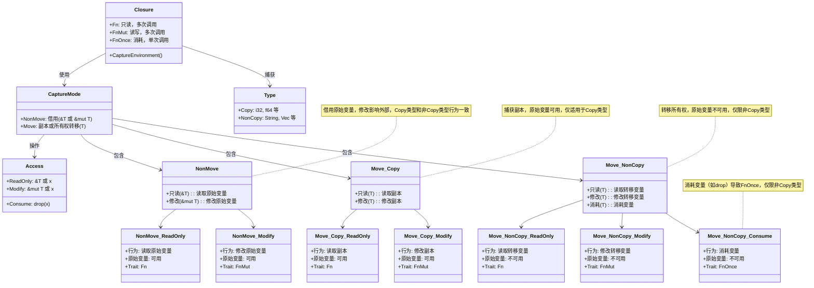

# 修订Rust闭包捕获行为速查表



## 1. 分析现有速查表的不足

### 1.1 缺失的分类
原表未完全覆盖以下情况：
- **非`move`、引用**：
    - 原表只列出“非引用”场景（直接使用变量），未包含闭包内显式使用`&T`或`&mut T`的场景。
    - 例如，`|| { let x_ref = &x; println!("{}", x_ref); }`（只读引用）或`|| { let x_ref = &mut x; x_ref.push_str(" world"); }`（可变引用）。
- **非`Copy`类型、消耗变量**：
    - 非`Copy`类型在`move`、`非引用`场景中，trait标注为`Fn/FnOnce`，未明确区分消耗变量（如`drop(x)`，纯`FnOnce`）与非消耗（如`println!("{}", x)`，`Fn`）的情况。
- **参数与捕获的组合**：
    - 原表未考虑闭包同时接受参数（如`|y: i32|`）和捕获变量的场景，参数可能影响trait。
- **可变性声明的影响**：
    - 未区分变量是否声明为`mut`（如`let x` vs. `let mut x`），这影响可变借用和修改行为。

### 1.2 可合并的场景
- **Copy、非`move`、不可变借用与非`Copy`、非`move`、不可变借用**：
    - 两者行为一致（读取原始变量，变量可用，`Fn`），可合并为“非`move`、不可变借用”。
- **Copy、非`move`、可变借用与非`Copy`、非`move`、可变借用**：
    - 两者都修改原始变量，变量可用，`FnMut`，可合并为“非`move`、可变借用”。
- **引用与非引用在某些场景下**：
    - 非`move`场景中，`x`（非引用）和`&x`（引用）功能等价（`println!`自动解引用），可合并描述，注明风格差异。
    - `move`场景中，非`Copy`类型的`Fn/FnOnce`可明确消耗与非消耗行为，减少歧义。

## 2. 修订速查表

以下是修订后的速查表，覆盖所有捕获场景，合并冗余项，明确`Copy`和非`Copy`类型、`move`与非`move`、引用与非引用、可变性等情况：

| 场景 | 捕获方式 | 行为 | 原始变量可用性 | Trait | 备注 |
|------|----------|------|----------------|-------|------|
| 非move, 只读 | 不可变借用 (&T) | 闭包读取原始变量 | 可用 | Fn | 适用Copy和非Copy，x或&x等价，let x或let mut x均可[1] |
| 非move, 修改 | 可变借用 (&mut T) | 闭包修改原始变量 | 可用 | FnMut | 适用Copy和非Copy，需let mut x，x或&mut x等价[2] |
| move, Copy, 只读 | 副本 (T) | 闭包读取副本 | 可用 | Fn | x或&x等价[3] |
| move, Copy, 修改 | 副本 (T) | 闭包修改副本 | 可用 | FnMut | 需let mut x，x或&mut x等价[4] |
| move, 非Copy, 只读 | 所有权转移 (T) | 闭包读取转移变量 | 不可用 | Fn | x或&x等价[5] |
| move, 非Copy, 修改 | 所有权转移 (T) | 闭包修改转移变量 | 不可用 | FnMut | 需let mut x，x或&mut x等价[6] |
| move, 非Copy, 消耗 | 所有权转移 (T) | 闭包消耗转移变量 | 不可用 | FnOnce | 仅一次调用[7] |

[1]: 示例：`|| println!("{}", x)` 或 `|| { let x_ref = &x; println!("{}", x_ref); }`，`println!` 自动解引用。  
[2]: 示例：`|| x += 1` 或 `|| { let x_ref = &mut x; *x_ref += 1; }`，需 `mut` 变量。  
[3]: 示例：`move || println!("{}", x)` 或 `move || { let x_ref = &x; println!("{}", x_ref); }`，操作副本。  
[4]: 示例：`move || x += 1` 或 `move || { let x_ref = &mut x; *x_ref += 1; }`，修改副本。  
[5]: 示例：`move || println!("{}", x)` 或 `move || { let x_ref = &x; println!("{}", x_ref); }`，外部不可用。  
[6]: 示例：`move || x.push_str(" world")` 或 `move || { let x_ref = &mut x; x_ref.push_str(" world"); }`，外部不可用。  
[7]: 示例：`move || drop(x)`，消耗变量如 `drop`。

## 3. 修订说明

### 3.1 新增的分类
- **非`move`、引用**：显式使用`&x`或`&mut x`，与非引用行为等价，但语义更清晰。
- **非`Copy`、消耗**：明确`move`时消耗变量（如`drop`）导致纯`FnOnce`。
- **可变性**：区分`let x`（只读）和`let mut x`（修改），影响可变借用和`FnMut`。

### 3.2 合并的场景
- **非`move`、不可变借用**：`Copy`和非`Copy`合并，因行为一致（读取原始变量，`Fn`）。
- **非`move`、可变借用**：`Copy`和非`Copy`合并，因都修改原始变量（`FnMut`）。
- **引用与非引用**：在同一场景下，`x`和`&x`（或`&mut x`）合并，注明风格差异（`x` 简洁，`&x` 明确）。

### 3.3 参数的处理
- 表未列出参数场景（如`|y: i32| x += y`），因为参数不直接影响捕获方式和trait，但可能间接影响：
    - 参数只读：不改变trait（仍为`Fn`或`FnMut`）。
    - 参数消耗（如`drop(y: String)`）：闭包仍可多次调用（新参数），不导致`FnOnce`。
- 若需包含参数，可扩展表，但当前聚焦捕获行为。

## 4. 示例补充

为清晰展示所有场景，以下是典型示例：

- **非`move`, 只读**：
  ```rust
  let x = String::from("hello");
  let closure = || println!("{}", x); // 或 || { let x_ref = &x; println!("{}", x_ref); }
  closure(); // 输出：hello
  println!("x: {}", x); // 可用
  ```

- **非`move`, 修改**：
  ```rust
  let mut x = String::from("hello");
  let mut closure = || x.push_str(" world"); // 或 || { let x_ref = &mut x; x_ref.push_str(" world"); }
  closure();
  println!("x: {}", x); // 输出：hello world
  ```

- **`move`, Copy, 只读**：
  ```rust
  let x = 10;
  let closure = move || println!("{}", x); // 或 || { let x_ref = &x; println!("{}", x_ref); }
  closure();
  println!("x: {}", x); // 输出：10
  ```

- **`move`, Copy, 修改**：
  ```rust
  let mut x = 10;
  let mut closure = move || x += 1; // 或 || { let x_ref = &mut x; *x_ref += 1; }
  closure();
  println!("x: {}", x); // 输出：10
  ```

- **`move`, 非Copy, 只读**：
  ```rust
  let x = String::from("hello");
  let closure = move || println!("{}", x); // 或 || { let x_ref = &x; println!("{}", x_ref); }
  closure();
  // println!("x: {}", x); // 错误：x 已移动
  ```

- **`move`, 非Copy, 修改**：
  ```rust
  let mut x = String::from("hello");
  let mut closure = move || x.push_str(" world"); // 或 || { let x_ref = &mut x; x_ref.push_str(" world"); }
  closure();
  // println!("x: {}", x); // 错误：x 已移动
  ```

- **`move`, 非Copy, 消耗**：
  ```rust
  let x = String::from("hello");
  let closure = move || drop(x);
  closure();
  // closure(); // 错误：x 已消耗
  ```

## 5. 总结

修订后的速查表：
- **全面性**：涵盖非`move`和`move`、只读和修改、引用和非引用、消耗和非消耗场景。
- **精简性**：合并`Copy`和非`Copy`的相同行为，注明引用风格差异。
- **清晰性**：明确trait（`Fn`、`FnMut`、`FnOnce`）和可变性要求。

若需进一步扩展（如参数场景、异步闭包），或更新Mermaid图以反映新表，请告诉我！

---

