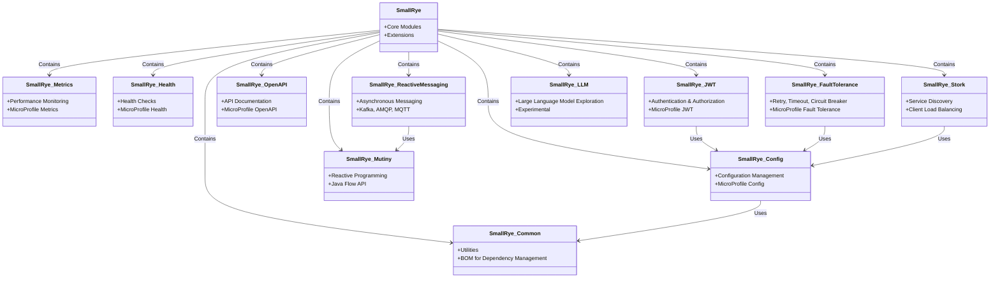

# SmallRye: Open Source Project for Cloud-Native Java Development

SmallRye is an open source project focused on providing lightweight Java libraries and tools for cloud-native development. It primarily implements various APIs of the Eclipse MicroProfile specification and also provides some independent functional extensions. It aims to enhance developers' cloud environment development experience, suitable for containerized deployment, and integrates with runtimes or application servers such as Quarkus, WildFly, Open Liberty, and TomEE, and can also be used as a standalone library in any Java application.

## Core Features

1. **MicroProfile Specification Implementation**: SmallRye provides implementations of Eclipse MicroProfile specifications, such as Config, Metrics, Health, OpenAPI, Fault Tolerance, and JWT, following microservice architecture standards.

2. **Cloud-Native Optimization**: Designed specifically for container environments, supporting lightweight runtimes, suitable for Kubernetes and other cloud platforms.

3. **Flexibility**: Can be deeply integrated with frameworks like Quarkus, or used independently, adapting to various Java application scenarios.

4. **Open Source Community Driven**: Uses Apache 2.0 license, hosted on GitHub, encouraging community contributions including bug reports, feature requests, and documentation improvements.

5. **Modern Technologies**: Supports reactive programming (through SmallRye Mutiny), service discovery (SmallRye Stork), and other modern development needs.

## Main Components

SmallRye includes multiple sub-projects covering configuration, monitoring, communication, and other development needs:

- **SmallRye Config**: A flexible configuration library following the MicroProfile Config specification, supporting configuration sources such as environment variables and properties files, and extending more advanced configuration features.

- **SmallRye Metrics**: Implements the MicroProfile Metrics specification for monitoring application performance metrics.

- **SmallRye Health**: Provides health check functionality, supporting the MicroProfile Health specification for reporting application status.

- **SmallRye Fault Tolerance**: Implements the MicroProfile Fault Tolerance specification, supporting retry, timeout, circuit breaker, and other fault tolerance modes, previously based on Hystrix, now optimized.

- **SmallRye OpenAPI**: Implements the MicroProfile OpenAPI specification, automatically generating OpenAPI documentation.

- **SmallRye Mutiny**: An intuitive event-driven reactive programming library, supporting the Java Flow API, upgraded from Reactive Streams to modern API.

- **SmallRye Stork**: A service discovery and client load balancing framework, simplifying microservice communication.

- **SmallRye Reactive Messaging**: Supports asynchronous message processing, integrating protocols such as Kafka, AMQP, MQTT.

- **SmallRye JWT**: Implements JWT authentication and authorization, supporting the MicroProfile JWT specification.

- **SmallRye Common**: Provides common tools and BOM (Bill of Materials), simplifying dependency management.

- **SmallRye LLM**: An emerging project exploring features related to large language models (specific details are still evolving).

## Usage Scenarios

- **Microservice Development**: Through MicroProfile implementation, SmallRye provides standardized microservice capabilities such as configuration management, monitoring, and fault tolerance.

- **Cloud-Native Applications**: Combined with frameworks like Quarkus, SmallRye optimizes application startup time and memory usage, suitable for containerized deployment.

- **Standalone Library**: Developers can choose individual SmallRye components (such as SmallRye Config or Mutiny) for non-MicroProfile projects.

## Getting Started

1. **Add Dependencies**: Add the required SmallRye modules through Maven or Gradle:
   ```xml
   <dependency>
       <groupId>io.smallrye.config</groupId>
       <artifactId>smallrye-config</artifactId>
       <version>3.12.5-SNAPSHOT</version>
   </dependency>
   ```
   You can use `smallrye-common-bom` to manage versions.

2. **Access Documentation**: The SmallRye official website (smallrye.io) provides detailed sub-project documentation and usage guides.

3. **Join the Community**: Participate in contributions through GitHub (github.com/smallrye) or Google Groups, submit issues or PRs.

## Latest Updates

- Some components are planned to support Java 17 as the minimum version, reflecting modernization trends.

- SmallRye JWT continues to be updated, with the latest version (such as 3.6.1) already supporting Jakarta IdentityStore integration.

- The latest releases of SmallRye Health and Fault Tolerance were in January and April 2025 respectively, maintaining active development.

## Summary

SmallRye is a feature-rich, lightweight, and flexible Java ecosystem project, particularly suitable for cloud-native and microservice development. It simplifies developers' work by implementing MicroProfile specifications and providing extended features, while maintaining the vitality of the open source community. Whether building Quarkus applications or standalone Java projects, SmallRye is a toolset worth considering.

More information can be found at the [SmallRye official website](https://smallrye.io) or [GitHub organization](https://github.com/smallrye).

