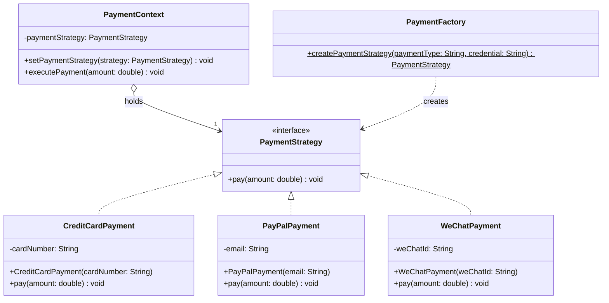

# Factory Pattern vs Strategy Pattern

Factory Pattern and Strategy Pattern are two common design patterns that solve different problems and are used in different scenarios.

## 1. **Factory Pattern**

- **Definition**: Factory Pattern belongs to **creational patterns**, used for creating objects. It encapsulates object creation logic by defining a factory class or method, so clients don't need to care about the instantiation process of specific classes.

- **Core Idea**: Separate object creation from usage, clients obtain objects through the factory without directly calling constructors.

- **Main Components**:
    - **Abstract Product**: Defines the interface or abstract class of the product.
    - **Concrete Product**: Implements the specific class of the abstract product.
    - **Factory**: Responsible for creating instances of concrete products based on input parameters or conditions.

- **Application Scenarios**:
    - Need to create different types of objects based on conditions.
    - Object creation process is complex or needs unified management.
    - Example: Create different types of database connections (MySQL, PostgreSQL) based on user input.

- **Code Example** (Simple Factory):
  ```java
  interface Product {
      void use();
  }

  class ConcreteProductA implements Product {
      public void use() { System.out.println("Using Product A"); }
  }

  class ConcreteProductB implements Product {
      public void use() { System.out.println("Using Product B"); }
  }

  class Factory {
      public static Product createProduct(String type) {
          if ("A".equals(type)) return new ConcreteProductA();
          if ("B".equals(type)) return new ConcreteProductB();
          return null;
      }
  }

  public class Main {
      public static void main(String[] args) {
          Product product = Factory.createProduct("A");
          product.use(); // Output: Using Product A
      }
  }
  ```

## 2. **Strategy Pattern**

- **Definition**: Strategy Pattern belongs to **behavioral patterns**, used to define a series of algorithms or behaviors, encapsulate them into independent strategy classes, making them interchangeable.

- **Core Idea**: Abstract algorithms or behaviors, allowing clients to dynamically choose different strategies to perform tasks without changing the context structure.

- **Main Components**:
    - **Strategy Interface**: Defines abstract methods for strategies.
    - **Concrete Strategy**: Implements specific algorithms or behaviors of the strategy interface.
    - **Context**: Holds a strategy object and is responsible for calling the strategy's methods.

- **Application Scenarios**:
    - Need to dynamically choose different algorithms or behaviors based on situations.
    - Avoid using large amounts of conditional statements (like if-else) to switch behaviors.
    - Example: In a payment system, choose different payment logic based on payment method (credit card, PayPal).

- **Code Example**:
  ```java
  interface Strategy {
      void execute();
  }

  class ConcreteStrategyA implements Strategy {
      public void execute() { System.out.println("Executing Strategy A"); }
  }

  class ConcreteStrategyB implements Strategy {
      public void execute() { System.out.println("Executing Strategy B"); }
  }

  class Context {
      private Strategy strategy;

      public void setStrategy(Strategy strategy) {
          this.strategy = strategy;
      }

      public void executeStrategy() {
          strategy.execute();
      }
  }

  public class Main {
      public static void main(String[] args) {
          Context context = new Context();
          context.setStrategy(new ConcreteStrategyA());
          context.executeStrategy(); // Output: Executing Strategy A
      }
  }
  ```

## 3. **Differences Between Factory Pattern and Strategy Pattern**

| **Dimension**            | **Factory Pattern**                              | **Strategy Pattern**                              |
|---------------------|------------------------------------------|------------------------------------------|
| **Type**            | Creational Pattern                               | Behavioral Pattern                               |
| **Main Goal**        | Encapsulate object creation process                       | Encapsulate algorithms or behaviors, allow dynamic switching             |
| **Focus**          | How to create objects                             | How to execute different algorithms or behaviors                 |
| **Use Cases**        | Need to create a series of related objects                   | Need to dynamically choose different algorithms or behaviors at runtime         |
| **Typical Structure**        | Factory class returns different types of objects                 | Context class calls different implementations through strategy interface         |
| **Client Interaction**      | Clients obtain objects through factory                   | Clients switch strategies through context                 |
| **Code Complexity**      | Focus on object instantiation logic                     | Focus on algorithm replacement and behavior logic                 |
| **Examples**            | Create different types of database connections                 | Choose different payment logic based on payment method           |

## 4. **Summary**

- **Factory Pattern** solves **object creation** problems, suitable for scenarios where different object instances need to be generated based on conditions.
- **Strategy Pattern** solves **behavior switching** problems, suitable for scenarios where different algorithms or behaviors need to be dynamically selected.
- **Combined Use**: In actual development, factory pattern and strategy pattern can be used together. For example, factory pattern can be used to create strategy objects, and then strategy pattern can be used to dynamically select the strategy to execute.

If you have more specific scenarios or need more detailed code examples, please let me know!

---

Next, I will demonstrate how to combine **Factory Pattern** and **Strategy Pattern** in a Java code example, showing how these two design patterns work together in actual scenarios. The example scenario is simulating a **payment system**, where the factory pattern is used to create different payment strategy objects, and the strategy pattern is used to dynamically select and execute different payment methods.

### Scenario Description

Suppose we have a payment system that supports multiple payment methods (such as credit card, PayPal, WeChat Pay). We hope to:

1. Use **Factory Pattern** to dynamically create different payment strategy objects based on user input.
2. Use **Strategy Pattern** to allow clients to dynamically switch payment methods and execute payment logic.

### Design Approach

- **Strategy Pattern**: Define a `PaymentStrategy` interface containing payment methods. Different payment methods (such as credit card, PayPal) implement this interface, providing specific payment logic.
- **Factory Pattern**: Define a `PaymentFactory` class that creates corresponding payment strategy objects based on input payment types (such as "credit", "paypal").
- **Context**: Define a `PaymentContext` class that holds a payment strategy object and calls its payment method.
- **Combination**: Clients obtain payment strategy objects through the factory, set them in the context, and the context executes specific payment logic.

### Code Implementation

Here is the complete Java code example:

```java
// Payment Strategy Interface (Strategy Pattern)
interface PaymentStrategy {
    void pay(double amount);
}

// Concrete Strategy: Credit Card Payment
class CreditCardPayment implements PaymentStrategy {
    private String cardNumber;

    public CreditCardPayment(String cardNumber) {
        this.cardNumber = cardNumber;
    }

    @Override
    public void pay(double amount) {
        System.out.println("Paying " + amount + " yuan with credit card, card number: " + cardNumber);
    }
}

// Concrete Strategy: PayPal Payment
class PayPalPayment implements PaymentStrategy {
    private String email;

    public PayPalPayment(String email) {
        this.email = email;
    }

    @Override
    public void pay(double amount) {
        System.out.println("Paying " + amount + " yuan with PayPal, email: " + email);
    }
}

// Concrete Strategy: WeChat Payment
class WeChatPayment implements PaymentStrategy {
    private String weChatId;

    public WeChatPayment(String weChatId) {
        this.weChatId = weChatId;
    }

    @Override
    public void pay(double amount) {
        System.out.println("Paying " + amount + " yuan with WeChat, WeChat ID: " + weChatId);
    }
}

// Payment Factory (Factory Pattern)
class PaymentFactory {
    public static PaymentStrategy createPaymentStrategy(String paymentType, String credential) {
        switch (paymentType.toLowerCase()) {
            case "credit":
                return new CreditCardPayment(credential);
            case "paypal":
                return new PayPalPayment(credential);
            case "wechat":
                return new WeChatPayment(credential);
            default:
                throw new IllegalArgumentException("Unsupported payment type: " + paymentType);
        }
    }
}

// Payment Context (Strategy Pattern Context)
class PaymentContext {
    private PaymentStrategy paymentStrategy;

    public void setPaymentStrategy(PaymentStrategy paymentStrategy) {
        this.paymentStrategy = paymentStrategy;
    }

    public void executePayment(double amount) {
        if (paymentStrategy == null) {
            throw new IllegalStateException("Payment strategy not set");
        }
        paymentStrategy.pay(amount);
    }
}

// Main Program: Testing the Combination of Factory Pattern and Strategy Pattern
public class PaymentSystem {
    public static void main(String[] args) {
        // Create payment context
        PaymentContext context = new PaymentContext();

        // Use factory pattern to create payment strategies
        // Scenario 1: User chooses credit card payment
        PaymentStrategy creditCardStrategy = PaymentFactory.createPaymentStrategy("credit", "1234-5678-9012-3456");
        context.setPaymentStrategy(creditCardStrategy);
        context.executePayment(100.0);

        // Scenario 2: User switches to PayPal payment
        PaymentStrategy payPalStrategy = PaymentFactory.createPaymentStrategy("paypal", "user@example.com");
        context.setPaymentStrategy(payPalStrategy);
        context.executePayment(200.0);

        // Scenario 3: User switches to WeChat payment
        PaymentStrategy weChatStrategy = PaymentFactory.createPaymentStrategy("wechat", "wx_user123");
        context.setPaymentStrategy(weChatStrategy);
        context.executePayment(300.0);
    }
}
```

### Code Execution Results

Running the above code will produce the following output:
```
Paying 100.0 yuan with credit card, card number: 1234-5678-9012-3456
Paying 200.0 yuan with PayPal, email: user@example.com
Paying 300.0 yuan with WeChat, WeChat ID: wx_user123
```

### Code Explanation

1. **Strategy Pattern Part**:
    - The `PaymentStrategy` interface defines the payment method `pay`, and all specific payment methods (such as `CreditCardPayment`, `PayPalPayment`, `WeChatPayment`) implement this interface.
    - Each concrete strategy class encapsulates the logic of a specific payment method, such as credit card payment requiring card number, PayPal payment requiring email.
    - `PaymentContext` is the context of the strategy pattern, responsible for holding the current payment strategy and calling its `pay` method. Clients can dynamically switch payment methods through `setPaymentStrategy`.

2. **Factory Pattern Part**:
    - `PaymentFactory` is a simple factory class that provides a static method `createPaymentStrategy` which creates corresponding payment strategy objects based on input payment types (such as "credit", "paypal") and credentials (such as card number, email).
    - The factory pattern centralizes the creation logic of payment strategy objects, and clients don't need to directly instantiate concrete strategy classes, reducing coupling.

3. **Combined Use**:
    - In the `main` method, clients create different payment strategy objects through `PaymentFactory` (such as credit card, PayPal, WeChat).
    - The created strategy objects are set in `PaymentContext`, and the context calls the strategy's `pay` method to execute payment logic.
    - This design allows clients to dynamically switch payment methods (strategy pattern) at runtime, while the creation of payment strategies is uniformly managed by the factory pattern.

4. **Advantages**:
    - **Factory Pattern**: Encapsulates the creation process of payment strategy objects, clients only need to provide payment type and credentials, without caring about the construction details of concrete classes. If a new payment method is added, only a new case branch needs to be added in the factory.
    - **Strategy Pattern**: Abstracts payment logic into replaceable strategies, clients can dynamically switch payment methods without modifying context code.
    - **Decoupling**: The combination of factory pattern and strategy pattern completely decouples client code from the implementation of specific payment methods, enhancing system extensibility and maintainability.
    - **Extensibility**: If you need to add a new payment method (such as Alipay), you only need to add a new strategy class (such as `AlipayPayment`) and add corresponding creation logic in the factory, without modifying existing code.

5. **Potential Improvements**:
    - The simple factory can be upgraded to **Abstract Factory Pattern** to support more complex object creation logic (for example, creating multiple objects related to payments).
    - It can be combined with **Dependency Injection**, automatically injecting payment strategies through configuration files or frameworks, reducing hard coding.

### Summary

Through this example, we demonstrated how to combine factory pattern and strategy pattern to implement a flexible payment system:

- **Factory Pattern** is responsible for creating payment strategy objects, hiding the details of object instantiation.
- **Strategy Pattern** allows dynamic switching of payment methods, maintaining the independence and replaceability of payment logic.
- The combination of the two makes the system both easy to extend (adding new payment methods) and flexible (dynamically switching payment logic).

If you have other scenarios or need further code optimization, please let me know!

---

Next, I will generate a **Mermaid UML class diagram** for the combined **Factory Pattern** and **Strategy Pattern** payment system example, showing the relationships and structure between classes. Mermaid is a text-based diagram generation tool suitable for describing UML class diagrams. The class diagram will be based on the previous Java code example, including components of both strategy pattern and factory pattern.

### Design Explanation

- **Strategy Pattern**: Includes the `PaymentStrategy` interface and its implementation classes (`CreditCardPayment`, `PayPalPayment`, `WeChatPayment`), as well as the `PaymentContext` class that uses the strategies.
- **Factory Pattern**: Includes the `PaymentFactory` class responsible for creating `PaymentStrategy` implementations.
- **Relationships**:
    - `PaymentStrategy` is an interface, and concrete payment classes are associated through **implementation** relationships (`..|>`).
    - `PaymentContext` is associated with `PaymentStrategy` through **composition** relationship (`o--`).
    - `PaymentFactory` generates `PaymentStrategy` instances through **creation** relationship (`..>`).

### Mermaid UML Class Diagram Code

Here is the Mermaid format UML class diagram code describing the class structure of the payment system:



### Code Explanation

1. **Class Definitions**:
    - `PaymentStrategy` is an interface (marked with `<<interface>>`), defining the `pay` method.
    - `CreditCardPayment`, `PayPalPayment`, and `WeChatPayment` are concrete strategy classes, each with private attributes (such as `cardNumber`, `email`, `weChatId`) and constructors.
    - `PaymentContext` holds a reference to `PaymentStrategy` and provides `setPaymentStrategy` and `executePayment` methods.
    - `PaymentFactory` provides a static method `createPaymentStrategy` for creating strategy objects (the `$` indicates a static method).

2. **Relationships**:
    - `PaymentStrategy <|.. CreditCardPayment` etc. represent implementation relationships (hollow arrow, dashed line).
    - `PaymentContext o--> "1" PaymentStrategy` represents a composition relationship (solid diamond arrow, `"1"` indicates a one-to-one relationship).
    - `PaymentFactory ..> PaymentStrategy` represents a creation relationship (dashed arrow, indicating the factory generates strategy objects).

3. **Mermaid Syntax**:
    - `classDiagram` is used to define UML class diagrams.
    - Inside classes, `+` represents public methods/attributes, `-` represents private attributes.
    - Relationships use symbols like `..>` (dependency/creation), `<|..` (implementation), `o--` (composition), etc.

### Diagram Generation Instructions

To preview the diagram, you can:
1. Copy the above Mermaid code.
2. Paste it into [Mermaid Live Editor](https://mermaid.live/) or other platforms that support Mermaid.
3. View the generated UML class diagram.

### Additional Instructions

- This class diagram clearly shows:
    - The strategy pattern: `PaymentStrategy` interface and its implementation classes (`CreditCardPayment`, etc.) demonstrate replaceable payment behaviors.
    - The factory pattern: `PaymentFactory` encapsulates the creation logic of strategy objects.
    - The context: `PaymentContext` dynamically uses different payment strategies.
- If you need to adjust the diagram (such as adding more details, modifying styles) or generate other types of diagrams (such as sequence diagrams), please let me know!

I hope this UML class diagram helps you understand the combination of factory pattern and strategy pattern! If you have other needs, please feel free to tell me!