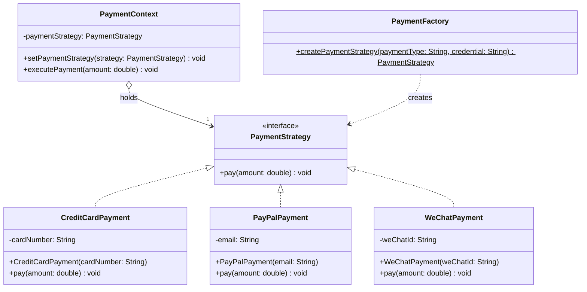

# 工厂模式（Factory Pattern）和策略模式（Strategy Pattern）是两种常见的设计模式，它们解决的问题和应用场景不同。以下是它们的区别和简要介绍：

### 1. **工厂模式**
- **定义**: 工厂模式属于**创建型模式**，用于创建对象。它通过定义一个工厂类或方法，封装对象的创建逻辑，客户端无需关心具体类的实例化过程。
- **核心思想**: 将对象的创建与使用分离，客户端通过工厂获取对象，而无需直接调用构造函数。
- **主要组成部分**:
    - **抽象产品**：定义产品的接口或抽象类。
    - **具体产品**：实现抽象产品的具体类。
    - **工厂**：负责根据输入参数或条件创建具体产品实例。
- **应用场景**:
    - 需要根据条件创建不同类型的对象。
    - 对象的创建过程复杂或需要统一管理。
    - 示例：根据用户输入创建不同类型的数据库连接（MySQL、PostgreSQL）。
- **代码示例**（简单工厂）:
  ```java
  interface Product {
      void use();
  }

  class ConcreteProductA implements Product {
      public void use() { System.out.println("Using Product A"); }
  }

  class ConcreteProductB implements Product {
      public void use() { System.out.println("Using Product B"); }
  }

  class Factory {
      public static Product createProduct(String type) {
          if ("A".equals(type)) return new ConcreteProductA();
          if ("B".equals(type)) return new ConcreteProductB();
          return null;
      }
  }

  public class Main {
      public static void main(String[] args) {
          Product product = Factory.createProduct("A");
          product.use(); // 输出: Using Product A
      }
  }
  ```

### 2. **策略模式**
- **定义**: 策略模式属于**行为型模式**，用于定义一系列算法或行为，将它们封装成独立的策略类，使它们可以互相替换。
- **核心思想**: 将算法或行为抽象出来，客户端可以动态选择不同的策略来执行任务，而不改变上下文的结构。
- **主要组成部分**:
    - **策略接口**：定义策略的抽象方法。
    - **具体策略**：实现策略接口的具体算法或行为。
    - **上下文**：持有策略对象，负责调用策略的方法。
- **应用场景**:
    - 需要根据情况动态选择不同的算法或行为。
    - 避免使用大量的条件语句（如 if-else）来切换行为。
    - 示例：支付系统中根据支付方式（信用卡、PayPal）选择不同的支付逻辑。
- **代码示例**:
  ```java
  interface Strategy {
      void execute();
  }

  class ConcreteStrategyA implements Strategy {
      public void execute() { System.out.println("Executing Strategy A"); }
  }

  class ConcreteStrategyB implements Strategy {
      public void execute() { System.out.println("Executing Strategy B"); }
  }

  class Context {
      private Strategy strategy;

      public void setStrategy(Strategy strategy) {
          this.strategy = strategy;
      }

      public void executeStrategy() {
          strategy.execute();
      }
  }

  public class Main {
      public static void main(String[] args) {
          Context context = new Context();
          context.setStrategy(new ConcreteStrategyA());
          context.executeStrategy(); // 输出: Executing Strategy A
      }
  }
  ```

### 3. **工厂模式与策略模式的区别**
| **维度**            | **工厂模式**                              | **策略模式**                              |
|---------------------|------------------------------------------|------------------------------------------|
| **类型**            | 创建型模式                               | 行为型模式                               |
| **主要目标**        | 封装对象的创建过程                       | 封装算法或行为，允许动态切换             |
| **关注点**          | 如何创建对象                             | 如何执行不同的算法或行为                 |
| **使用场景**        | 需要创建一系列相关对象                   | 需要在运行时选择不同的算法或行为         |
| **典型结构**        | 工厂类返回不同类型的对象                 | 上下文类通过策略接口调用不同实现         |
| **客户端交互**      | 客户端通过工厂获取对象                   | 客户端通过上下文切换策略                 |
| **代码复杂度**      | 关注对象的实例化逻辑                     | 关注算法的替换和行为逻辑                 |
| **示例**            | 创建不同类型的数据库连接                 | 根据支付方式选择不同的支付逻辑           |

### 4. **总结**
- **工厂模式**解决的是**对象创建**的问题，适合需要根据条件生成不同对象实例的场景。
- **策略模式**解决的是**行为切换**的问题，适合需要动态选择不同算法或行为的场景。
- **结合使用**：在实际开发中，工厂模式和策略模式可以结合使用。例如，工厂模式可以用来创建策略对象，然后通过策略模式动态选择执行的策略。

如果你有更具体的场景或需要更详细的代码示例，请告诉我！


---


下面我将通过一个结合**工厂模式**和**策略模式**的 Java 代码示例，展示如何在实际场景中联合使用这两种设计模式。示例的场景是模拟一个**支付系统**，其中工厂模式用于创建不同类型的支付策略对象，策略模式用于动态选择和执行不同的支付方式。

### 场景描述
假设我们有一个支付系统，支持多种支付方式（如信用卡、PayPal、微信支付）。我们希望：
1. 使用**工厂模式**根据用户输入动态创建不同的支付策略对象。
2. 使用**策略模式**让客户端可以动态切换支付方式并执行支付逻辑。

### 设计思路
- **策略模式**：定义一个 `PaymentStrategy` 接口，包含支付方法。不同的支付方式（如信用卡、PayPal）实现这个接口，提供具体的支付逻辑。
- **工厂模式**：定义一个 `PaymentFactory` 类，根据输入的支付类型（如 "credit"、"paypal"）创建对应的支付策略对象。
- **上下文**：定义一个 `PaymentContext` 类，持有支付策略对象并调用其支付方法。
- **结合**：客户端通过工厂获取支付策略对象，并将其设置到上下文中，上下文执行具体的支付逻辑。

### 代码实现
以下是完整的 Java 代码示例：

```java
// 支付策略接口（策略模式）
interface PaymentStrategy {
    void pay(double amount);
}

// 具体策略：信用卡支付
class CreditCardPayment implements PaymentStrategy {
    private String cardNumber;

    public CreditCardPayment(String cardNumber) {
        this.cardNumber = cardNumber;
    }

    @Override
    public void pay(double amount) {
        System.out.println("使用信用卡支付 " + amount + " 元，卡号: " + cardNumber);
    }
}

// 具体策略：PayPal支付
class PayPalPayment implements PaymentStrategy {
    private String email;

    public PayPalPayment(String email) {
        this.email = email;
    }

    @Override
    public void pay(double amount) {
        System.out.println("使用PayPal支付 " + amount + " 元，邮箱: " + email);
    }
}

// 具体策略：微信支付
class WeChatPayment implements PaymentStrategy {
    private String weChatId;

    public WeChatPayment(String weChatId) {
        this.weChatId = weChatId;
    }

    @Override
    public void pay(double amount) {
        System.out.println("使用微信支付 " + amount + " 元，微信ID: " + weChatId);
    }
}

// 支付工厂（工厂模式）
class PaymentFactory {
    public static PaymentStrategy createPaymentStrategy(String paymentType, String credential) {
        switch (paymentType.toLowerCase()) {
            case "credit":
                return new CreditCardPayment(credential);
            case "paypal":
                return new PayPalPayment(credential);
            case "wechat":
                return new WeChatPayment(credential);
            default:
                throw new IllegalArgumentException("不支持的支付类型: " + paymentType);
        }
    }
}

// 支付上下文（策略模式的上下文）
class PaymentContext {
    private PaymentStrategy paymentStrategy;

    public void setPaymentStrategy(PaymentStrategy paymentStrategy) {
        this.paymentStrategy = paymentStrategy;
    }

    public void executePayment(double amount) {
        if (paymentStrategy == null) {
            throw new IllegalStateException("未设置支付策略");
        }
        paymentStrategy.pay(amount);
    }
}

// 主程序：测试工厂模式和策略模式的结合
public class PaymentSystem {
    public static void main(String[] args) {
        // 创建支付上下文
        PaymentContext context = new PaymentContext();

        // 使用工厂模式创建支付策略
        // 场景1：用户选择信用卡支付
        PaymentStrategy creditCardStrategy = PaymentFactory.createPaymentStrategy("credit", "1234-5678-9012-3456");
        context.setPaymentStrategy(creditCardStrategy);
        context.executePayment(100.0);

        // 场景2：用户切换到PayPal支付
        PaymentStrategy payPalStrategy = PaymentFactory.createPaymentStrategy("paypal", "user@example.com");
        context.setPaymentStrategy(payPalStrategy);
        context.executePayment(200.0);

        // 场景3：用户切换到微信支付
        PaymentStrategy weChatStrategy = PaymentFactory.createPaymentStrategy("wechat", "wx_user123");
        context.setPaymentStrategy(weChatStrategy);
        context.executePayment(300.0);
    }
}
```

### 代码运行结果
运行上述代码后，输出如下：
```
使用信用卡支付 100.0 元，卡号: 1234-5678-9012-3456
使用PayPal支付 200.0 元，邮箱: user@example.com
使用微信支付 300.0 元，微信ID: wx_user123
```

### 代码讲解
1. **策略模式部分**：
    - `PaymentStrategy` 接口定义了支付方法 `pay`，所有具体支付方式（如 `CreditCardPayment`、`PayPalPayment`、`WeChatPayment`）都实现该接口。
    - 每个具体策略类封装了特定支付方式的逻辑，例如信用卡支付需要卡号，PayPal支付需要邮箱。
    - `PaymentContext` 是策略模式的上下文，负责持有当前支付策略并调用其 `pay` 方法。客户端通过 `setPaymentStrategy` 动态切换支付方式。

2. **工厂模式部分**：
    - `PaymentFactory` 是一个简单工厂类，提供了静态方法 `createPaymentStrategy`，根据输入的支付类型（如 "credit"、"paypal"）和凭证（如卡号、邮箱）创建对应的支付策略对象。
    - 工厂模式将支付策略对象的创建逻辑集中管理，客户端无需直接实例化具体策略类，降低了耦合性。

3. **结合使用**：
    - 在 `main` 方法中，客户端通过 `PaymentFactory` 创建不同类型的支付策略对象（如信用卡、PayPal、微信）。
    - 创建的策略对象被设置到 `PaymentContext` 中，上下文调用策略的 `pay` 方法执行支付逻辑。
    - 这种设计允许客户端在运行时动态切换支付方式（策略模式），而支付策略的创建则由工厂模式统一管理。

4. **优势**：
    - **工厂模式**：封装了支付策略对象的创建过程，客户端只需提供支付类型和凭证，无需关心具体类的构造细节。如果新增支付方式，只需在工厂中添加新的 case 分支。
    - **策略模式**：将支付逻辑抽象为可替换的策略，客户端可以动态切换支付方式，而无需修改上下文代码。
    - **解耦**：工厂模式和策略模式结合，客户端代码与具体支付方式的实现完全解耦，增强了系统的扩展性和维护性。
    - **可扩展性**：如果需要新增一种支付方式（例如支付宝），只需添加一个新的策略类（如 `AlipayPayment`）并在工厂中添加对应的创建逻辑，现有代码无需改动。

5. **潜在改进**：
    - 可以将简单工厂升级为**抽象工厂模式**，以支持更复杂的对象创建逻辑（例如，创建与支付相关的多种对象）。
    - 可以结合**依赖注入**，通过配置文件或框架自动注入支付策略，减少硬编码。

### 总结
通过这个示例，我们展示了如何结合工厂模式和策略模式来实现一个灵活的支付系统：
- **工厂模式**负责创建支付策略对象，隐藏了对象实例化的细节。
- **策略模式**允许动态切换支付方式，保持支付逻辑的独立性和可替换性。
- 两者的结合使得系统既易于扩展（新增支付方式），又灵活（动态切换支付逻辑）。

如果你有其他场景或需要进一步优化代码，请告诉我！

---

下面我将为结合**工厂模式**和**策略模式**的支付系统示例生成一个 **Mermaid UML 类图**，展示类之间的关系和结构。Mermaid 是一种基于文本的图表生成工具，适合描述 UML 类图。类图将基于之前的 Java 代码示例，包含策略模式和工厂模式的组件。

### 设计说明
- **策略模式**：包含 `PaymentStrategy` 接口及其实现类（`CreditCardPayment`、`PayPalPayment`、`WeChatPayment`），以及使用策略的 `PaymentContext` 类。
- **工厂模式**：包含 `PaymentFactory` 类，负责创建 `PaymentStrategy` 的具体实现。
- **关系**：
    - `PaymentStrategy` 是接口，具体支付方式类通过**实现**关系（`..|>`)关联。
    - `PaymentContext` 通过**组合**关系（`o--`)持有 `PaymentStrategy`。
    - `PaymentFactory` 通过**创建**关系（`..>`)生成 `PaymentStrategy` 实例。

### Mermaid UML 类图代码
以下是 Mermaid 格式的 UML 类图代码，描述了支付系统的类结构：



### 代码讲解
1. **类定义**：
    - `PaymentStrategy` 是一个接口（使用 `<<interface>>` 标注），定义了 `pay` 方法。
    - `CreditCardPayment`、`PayPalPayment` 和 `WeChatPayment` 是具体策略类，各自有私有属性（如 `cardNumber`、`email`、`weChatId`）和构造函数。
    - `PaymentContext` 持有 `PaymentStrategy` 的引用，并提供 `setPaymentStrategy` 和 `executePayment` 方法。
    - `PaymentFactory` 提供静态方法 `createPaymentStrategy` 用于创建策略对象（`$` 表示静态方法）。

2. **关系**：
    - `PaymentStrategy <|.. CreditCardPayment` 等表示实现关系（空心箭头，虚线）。
    - `PaymentContext o--> "1" PaymentStrategy` 表示组合关系（实心菱形箭头，`1` 表示一对一关系）。
    - `PaymentFactory ..> PaymentStrategy` 表示创建关系（虚线箭头，表示工厂生成策略对象）。

3. **Mermaid 语法**：
    - `classDiagram` 用于定义 UML 类图。
    - 类内部用 `+` 表示公共方法/属性，`-` 表示私有属性。
    - 关系使用 `..>`（依赖/创建）、`<|..`（实现）、`o--`（组合）等符号。

### 生成图表的说明
- 上述 Mermaid 代码可以在支持 Mermaid 的工具中渲染（如 Mermaid Live Editor、VS Code 的 Mermaid 插件，或 GitHub Markdown）。
- 渲染后，图表将清晰展示：
    - 策略模式的接口和实现类。
    - 工厂模式中工厂与策略对象的关系。
    - 上下文与策略的组合关系。

### 运行方式
如果你想预览图表，可以：
1. 复制上述 Mermaid 代码。
2. 粘贴到 [Mermaid Live Editor](https://mermaid.live/) 或其他支持 Mermaid 的平台。
3. 查看生成的 UML 类图。

### 补充说明
- 该类图清晰展示了工厂模式和策略模式的结合：
    - **策略模式**：`PaymentStrategy` 和其实现类（`CreditCardPayment` 等）体现了可替换的支付行为。
    - **工厂模式**：`PaymentFactory` 封装了策略对象的创建逻辑。
    - **上下文**：`PaymentContext` 动态使用不同的支付策略。
- 如果需要对图表进行调整（例如添加更多细节、修改样式）或生成其他类型的图（如时序图），请告诉我！

希望这个 UML 类图对你理解工厂模式和策略模式的结合有帮助！如果有其他需求，请随时告知。