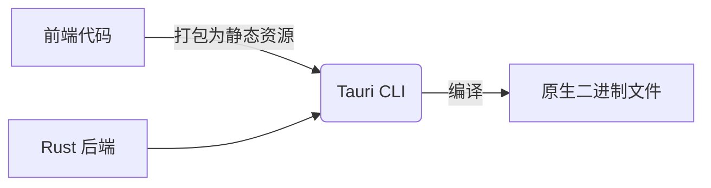

# **Tauri** 的架构解析和基本用法指南

以下是 **Tauri** 的架构解析和基本用法指南，帮助你快速掌握这一轻量级桌面应用开发框架：

---

### **一、Tauri 架构解析**
Tauri 采用 **前后端分离设计**，结合 Web 技术与系统原生能力，核心分为三层：

#### **1. 前端层（WebView）**
- **技术栈**：任意 HTML/CSS/JS 框架（如 React/Vue/Svelte）。
- **渲染引擎**：使用操作系统的原生 WebView（如 Windows 的 WebView2、macOS 的 WKWebView）。
- **通信**：通过 `@tauri-apps/api` 与后端 Rust 交互。

#### **2. 后端层（Rust）**
- **核心模块**：
    - **Tauri Core**：处理窗口管理、事件系统、插件集成。
    - **进程间通信（IPC）**：安全地桥接前端与系统调用。
    - **打包工具**：将应用编译为平台原生二进制文件。
- **优势**：Rust 提供内存安全、高性能和直接系统调用能力。

#### **3. 构建流程**



---

以下是 **Tauri 项目打包成可执行文件** 的完整步骤和注意事项，涵盖不同平台（Windows/macOS/Linux）的配置和优化建议：

---

### **一、打包前的准备工作**
1. **确保环境完整**
    - 安装 Rust：
      ```bash
      curl --proto '=https' --tlsv1.2 -sSf https://sh.rustup.rs | sh
      ```
    - 安装 Tauri CLI：
      ```bash
      npm install --global @tauri-apps/cli
      ```
    - 安装平台依赖：
        - **Windows**：需安装 [WebView2](https://developer.microsoft.com/en-us/microsoft-edge/webview2/)（通常系统已自带）。
        - **macOS**：
          ```bash
          brew install create-dmg  # 用于生成.dmg安装包
          ```
        - **Linux**：
          ```bash
          sudo apt install libwebkit2gtk-4.0-dev libayatana-appindicator3-dev  # Debian/Ubuntu
          ```

2. **检查项目配置**  
   确认 `src-tauri/tauri.conf.json` 中的关键配置：
   ```json
   {
     "package": {
       "productName": "my-app",  // 应用名称
       "version": "1.0.0"        // 版本号
     },
     "tauri": {
       "bundle": {
         "identifier": "com.example.myapp",  // 唯一标识符（重要！）
         "icon": ["icons/32x32.png", "icons/128x128.png"],  // 图标路径
         "targets": "all"                   // 打包目标平台
       }
     }
   }
   ```

---

### **二、打包命令**
1. **生产环境构建**  
   在项目根目录运行：
   ```bash
   npm run tauri build
   ```
    - 这会自动完成以下步骤：
        1. 编译前端（如 Vite/Rollup 打包）。
        2. 编译 Rust 后端为二进制文件。
        3. 生成平台特定的安装包。

2. **输出文件位置**
    - **二进制文件**：  
      `src-tauri/target/release/[应用名称]`  
      （例如 `my-app` 或 `my-app.exe`）
    - **安装包**：  
      `src-tauri/target/release/bundle/`  
      包含平台专属格式（如 Windows 的 `.msi`，macOS 的 `.dmg`）。

---

### **三、平台专属配置**
#### **1. Windows 打包**
- **生成 `.msi` 安装包**：  
  确保 `tauri.conf.json` 中启用 Windows 目标：
  ```json
  "tauri": {
    "bundle": {
      "windows": {
        "wix": {
          "template": "path/to/custom.wxs"  // 可选：自定义安装界面
        }
      }
    }
  }
  ```
- **签名应用（可选）**：  
  需购买代码签名证书，并在打包前配置签名工具。

#### **2. macOS 打包**
- **生成 `.dmg` 或 `.app`**：  
  需配置开发者证书（否则应用会被标记为“未验证”）：
  ```json
  "tauri": {
    "bundle": {
      "macOS": {
        "signingIdentity": "Apple Developer: Name (ID)",  // 开发者证书
        "providerShortName": "TeamID"                   // 开发者团队ID
      }
    }
  }
  ```
- **公证（Notarize）**：  
  使用 `tauri-apple-codesign` 工具完成公证，避免 Gatekeeper 拦截。

#### **3. Linux 打包**
- **生成 `.deb` 或 `.AppImage`**：  
  默认支持主流发行版，需确保目标系统已安装 WebKit2 GTK：
  ```json
  "tauri": {
    "bundle": {
      "linux": {
        "category": "Utility"  // 应用分类（如 Development/Game）
      }
    }
  }
  ```

---

### **四、自定义打包选项**
#### **1. 修改应用图标**
- 将图标文件（`.png` 或 `.ico`）放入 `src-tauri/icons/` 目录，命名格式为 `[size]x[size].png`（如 `32x32.png`）。
- Tauri 会自动转换为平台所需格式。

#### **2. 隐藏开发者控制台（仅 Windows）**
```json
"tauri": {
  "windows": [{
    "visible": false  // 隐藏运行时的控制台窗口
  }]
}
```

#### **3. 打包时排除文件**
在 `tauri.conf.json` 中配置：
```json
"build": {
  "beforeBuildCommand": "npm run build",
  "beforeDevCommand": "npm run dev",
  "distDir": "../dist",
  "devPath": "http://localhost:3000",
  "withGlobalTauri": false,
  "extraResources": ["data/*"]  // 包含额外资源文件
}
```

---

### **五、常见问题解决**
1. **错误：`Failed to bundle application`**
    - 检查图标文件是否存在且路径正确。
    - 确保 `identifier` 是唯一域名格式（如 `com.example.app`）。

2. **错误：`WebView2 not found`（Windows）**
    - 安装 [WebView2 Runtime](https://developer.microsoft.com/en-us/microsoft-edge/webview2/)。

3. **生成的安装包过大**
    - 使用 `upx` 压缩二进制文件（需安装 [UPX](https://upx.github.io/)）：
      ```bash
      upx --best src-tauri/target/release/my-app.exe
      ```

4. **macOS 应用无法打开**
    - 首次运行时右键选择“打开”绕过 Gatekeeper。
    - 长期解决方案：进行代码签名和公证。

---

### **六、高级优化**
#### **1. 减小体积**
- **前端优化**：
    - 使用代码分割（如 Vite 的 `splitChunks`）。
    - 移除未使用的依赖。
- **Rust 优化**：  
  在 `src-tauri/Cargo.toml` 中启用 LTO（链接时优化）：
  ```toml
  [profile.release]
  lto = true
  codegen-units = 1
  ```

#### **2. 自动更新**
在 `tauri.conf.json` 中配置更新服务器：
```json
"tauri": {
  "updater": {
    "active": true,
    "endpoints": ["https://example.com/updates/{{target}}/{{current_version}}"],
    "dialog": true  // 显示更新弹窗
  }
}
```

#### **3. 多语言打包**
使用 `tauri-i18n` 插件生成多语言安装包。

---

### **七、输出文件示例**
成功打包后，你会在以下路径找到文件：
```
src-tauri/target/release/bundle/
├── my-app_1.0.0_x64.msi      # Windows 安装包
├── my-app_1.0.0_x64.AppImage # Linux 可执行包
└── my-app.app.tar.gz         # macOS 应用包
```

---

通过以上步骤，你可以将 Tauri 项目打包为各平台的可执行文件。如果需要针对特定平台进一步优化，可以参考 [Tauri 官方打包文档](https://tauri.app/v1/guides/building/)。

---

### **二、基本用法指南**

#### **1. 环境准备**
```bash
# 安装 Rust
curl --proto '=https' --tlsv1.2 -sSf https://sh.rustup.rs | sh

# 安装 Tauri CLI
npm install --global @tauri-apps/cli
```

#### **2. 创建项目**
```bash
# 使用模板（如 Vite + React）
npm create tauri-app@latest
cd my-tauri-app
```

#### **3. 目录结构**
```
my-tauri-app/
├── src-tauri/    # Rust 后端代码
│   ├── Cargo.toml  # Rust 依赖配置
│   ├── main.rs     # 入口文件
│   └── tauri.conf.json  # 应用配置
├── src/          # 前端代码
└── public/       # 静态资源
```

#### **4. 核心配置（tauri.conf.json）**
```json
{
  "build": {
    "distDir": "../dist",  // 前端构建输出目录
    "devPath": "http://localhost:3000"  // 开发服务器地址
  },
  "tauri": {
    "windows": [{
      "title": "My App",
      "width": 800,
      "height": 600
    }],
    "allowlist": {  // 控制可访问的 API
      "fs": { "writeFile": true }  // 允许文件写入
    }
  }
}
```

#### **5. 前端调用 Rust 功能**
**示例：读写文件**
```javascript
// 前端代码（React）
import { writeFile, readTextFile } from '@tauri-apps/api/fs';

async function saveData() {
  await writeFile({ 
    path: '/path/to/file.txt', 
    contents: 'Hello Tauri!' 
  });
  const data = await readTextFile('/path/to/file.txt');
  console.log(data); // 输出: Hello Tauri!
}
```

#### **6. Rust 后端扩展**
**自定义命令（src-tauri/src/main.rs）**
```rust
#[tauri::command]
fn greet(name: &str) -> String {
    format!("Hello, {}!", name)
}

fn main() {
    tauri::Builder::default()
        .invoke_handler(tauri::generate_handler![greet])
        .run(tauri::generate_context!())
        .expect("error running Tauri application");
}
```
**前端调用：**
```javascript
import { invoke } from '@tauri-apps/api';
invoke('greet', { name: 'Alice' }).then(console.log); // 输出: Hello, Alice!
```

#### **7. 开发与构建**
```bash
# 开发模式（前端 + Tauri 实时加载）
npm run tauri dev

# 生产构建
npm run tauri build  # 输出二进制文件在 src-tauri/target/release
```

---

### **三、关键特性**
1. **极小的包体积**
    - 基础应用仅 ~2MB（Electron 约 100MB）。
2. **系统原生集成**
    - 支持托盘图标、文件系统、系统通知等。
3. **安全模型**
    - 默认禁用危险 API（需显式配置 `allowlist`）。
4. **跨平台**
    - 一套代码构建 Windows/macOS/Linux 应用。

---

### **四、进阶用法**
- **插件系统**：集成社区插件（如 SQLite、系统信息）。
- **窗口定制**：创建透明窗口、自定义菜单栏。
- **Updater**：内置应用自动更新支持。
- **移动端（实验性）**：Tauri 2.0 将支持 iOS/Android。

---

### **五、与 Electron 对比**
| **维度**       | **Tauri**              | **Electron**          |
|----------------|------------------------|-----------------------|
| **包体积**     | ~2MB                  | ~100MB               |
| **内存占用**   | 低（共享系统 WebView） | 高（独立 Chromium）  |
| **性能**       | 高（Rust 后端）        | 中等（Node.js）      |
| **生态成熟度** | 成长中                | 非常成熟             |

---

### **六、学习资源**
- [官方文档](https://tauri.app/)
- [Tauri GitHub](https://github.com/tauri-apps/tauri)
- [示例项目](https://github.com/tauri-apps/tauri-examples)

通过以上步骤，你可以快速构建一个高性能的桌面应用。遇到具体问题时，可以结合 Rust 的强大能力灵活扩展！