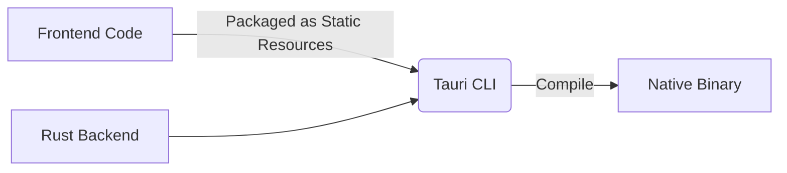

# Tauri Architecture Analysis and Basic Usage Guide

Here is a detailed **Tauri** architecture analysis and basic usage guide to help you quickly master this lightweight desktop application development framework:

---

## **I. Tauri Architecture Analysis**

Tauri adopts a **frontend-backend separation design**, combining web technologies with system native capabilities, with the core divided into three layers:

### **1. Frontend Layer (WebView)**
- **Technology Stack**: Any HTML/CSS/JS framework (such as React/Vue/Svelte).
- **Rendering Engine**: Uses the operating system's native WebView (such as WebView2 on Windows, WKWebView on macOS).
- **Communication**: Interacts with the backend Rust through `@tauri-apps/api`.

### **2. Backend Layer (Rust)**
- **Core Modules**:
    - **Tauri Core**: Handles window management, event systems, plugin integration.
    - **Inter-Process Communication (IPC)**: Securely bridges frontend and system calls.
    - **Packaging Tools**: Compiles the application into platform-native binary files.
- **Advantages**: Rust provides memory safety, high performance, and direct system call capabilities.

### **3. Build Process**


---

## **Complete Steps for Packaging Tauri Projects into Executables**

Here are the complete steps and considerations for packaging Tauri projects into executable files, covering different platforms (Windows/macOS/Linux) configurations and optimization suggestions:

---

### **I. Pre-packaging Preparation**

1. **Ensure Complete Environment**
    - Install Rust:
      ```bash
      curl --proto '=https' --tlsv1.2 -sSf https://sh.rustup.rs | sh
      ```
    - Install Tauri CLI:
      ```bash
      npm install --global @tauri-apps/cli
      ```
    - Install Platform Dependencies:
        - **Windows**: Need to install [WebView2](https://developer.microsoft.com/en-us/microsoft-edge/webview2/) (usually pre-installed).
        - **macOS**:
          ```bash
          brew install create-dmg  # For generating .dmg installer
          ```
        - **Linux**:
          ```bash
          sudo apt install libwebkit2gtk-4.0-dev libayatana-appindicator3-dev  # Debian/Ubuntu
          ```

2. **Check Project Configuration**
   Confirm key configurations in `src-tauri/tauri.conf.json`:
   ```json
   {
     "package": {
       "productName": "my-app",  // Application Name
       "version": "1.0.0"        // Version Number
     },
     "tauri": {
       "bundle": {
         "identifier": "com.example.myapp",  // Unique Identifier (Important!)
         "icon": ["icons/32x32.png", "icons/128x128.png"],  // Icon Paths
         "targets": "all"                   // Packaging Target Platforms
       }
     }
   }
   ```

---

### **II. Packaging Commands**

1. **Production Build**
   Run in the project root directory:
   ```bash
   npm run tauri build
   ```
   This will automatically complete the following steps:
       1. Compile frontend (such as Vite/Rollup packaging).
       2. Compile Rust backend into binary files.
       3. Generate platform-specific installers.

2. **Output File Locations**
    - **Binary Files**:
      `src-tauri/target/release/[application-name]`
      (e.g., `my-app` or `my-app.exe`)
    - **Installers**:
      `src-tauri/target/release/bundle/`
      Contains platform-specific formats (e.g., Windows `.msi`, macOS `.dmg`).

---

### **III. Platform-Specific Configuration**

#### **1. Windows Packaging**
- **Generate `.msi` Installer**:
  Ensure Windows target is enabled in `tauri.conf.json`:
  ```json
  "tauri": {
    "bundle": {
      "windows": {
        "wix": {
          "template": "path/to/custom.wxs"  // Optional: Custom Installation Interface
        }
      }
    }
  }
  ```
- **Sign Application (Optional)**:
  Need to purchase code signing certificate and configure signing tools before packaging.

#### **2. macOS Packaging**
- **Generate `.dmg` or `.app`**:
  Need to configure developer certificate (otherwise application will be marked as "unverified"):
  ```json
  "tauri": {
    "bundle": {
      "macOS": {
        "signingIdentity": "Apple Developer: Name (ID)",  // Developer Certificate
        "providerShortName": "TeamID"                   // Developer Team ID
      }
    }
  }
  ```
- **Notarization**:
  Use `tauri-apple-codesign` tool to complete notarization, avoiding Gatekeeper blocking.

#### **3. Linux Packaging**
- **Generate `.deb` or `.AppImage`**:
  Default support for mainstream distributions, ensure target system has WebKit2 GTK installed:
  ```json
  "tauri": {
    "bundle": {
      "linux": {
        "category": "Utility"  // Application Category (e.g., Development/Game)
      }
    }
  }
  ```

---

### **IV. Custom Packaging Options**

#### **1. Modify Application Icon**
- Place icon files (`.png` or `.ico`) in `src-tauri/icons/` directory, named as `[size]x[size].png` (e.g., `32x32.png`).
- Tauri will automatically convert to platform-required formats.

#### **2. Hide Developer Console (Windows Only)**
```json
"tauri": {
  "windows": [{
    "visible": false  // Hide console window at runtime
  }]
}
```

#### **3. Exclude Files During Packaging**
Configure in `tauri.conf.json`:
```json
"build": {
  "beforeBuildCommand": "npm run build",
  "beforeDevCommand": "npm run dev",
  "distDir": "../dist",
  "devPath": "http://localhost:3000",
  "withGlobalTauri": false,
  "extraResources": ["data/*"]  // Include additional resource files
}
```

---

### **V. Common Problem Resolution**

1. **Error: `Failed to bundle application`**
    - Check if icon files exist and paths are correct.
    - Ensure `identifier` is in unique domain format (e.g., `com.example.app`).

2. **Error: `WebView2 not found` (Windows)**
    - Install [WebView2 Runtime](https://developer.microsoft.com/en-us/microsoft-edge/webview2/).

3. **Generated Installer Too Large**
    - Use `upx` to compress binary files (need to install [UPX](https://upx.github.io/)):
      ```bash
      upx --best src-tauri/target/release/my-app.exe
      ```

4. **macOS Application Cannot Open**
    - Right-click and select "Open" on first run to bypass Gatekeeper.
    - Long-term solution: Perform code signing and notarization.

---

### **VI. Advanced Optimization**

#### **1. Reduce Size**
- **Frontend Optimization**:
    - Use code splitting (such as Vite's `splitChunks`).
    - Remove unused dependencies.
- **Rust Optimization**:
  Enable LTO (Link Time Optimization) in `src-tauri/Cargo.toml`:
  ```toml
  [profile.release]
  lto = true
  codegen-units = 1
  ```

#### **2. Auto-Update**
Configure update server in `tauri.conf.json`:
```json
"tauri": {
  "updater": {
    "active": true,
    "endpoints": ["https://example.com/updates/{{target}}/{{current_version}}"],
    "dialog": true  // Show update dialog
  }
}
```

#### **3. Multi-language Packaging**
Use `tauri-i18n` plugin to generate multi-language installers.

---

### **VII. Output File Examples**

After successful packaging, you will find files at these paths:
```
src-tauri/target/release/bundle/
├── my-app_1.0.0_x64.msi      # Windows Installer
├── my-app_1.0.0_x64.AppImage # Linux Executable Package
└── my-app.app.tar.gz         # macOS Application Package
```

---

For more platform-specific optimization, refer to the [Tauri official packaging documentation](https://tauri.app/v1/guides/building/).

---

## **II. Basic Usage Guide**

### **1. Environment Preparation**
```bash
# Install Rust
curl --proto '=https' --tlsv1.2 -sSf https://sh.rustup.rs | sh

# Install Tauri CLI
npm install --global @tauri-apps/cli
```

### **2. Create Project**
```bash
# Use template (e.g., Vite + React)
npm create tauri-app@latest
cd my-tauri-app
```

### **3. Directory Structure**
```
my-tauri-app/
├── src-tauri/    # Rust Backend Code
│   ├── Cargo.toml  # Rust Dependency Configuration
│   ├── main.rs     # Entry File
│   └── tauri.conf.json  # Application Configuration
├── src/          # Frontend Code
└── public/       # Static Resources
```

### **4. Core Configuration (tauri.conf.json)**
```json
{
  "build": {
    "distDir": "../dist",  // Frontend Build Output Directory
    "devPath": "http://localhost:3000"  // Development Server Address
  },
  "tauri": {
    "windows": [{
      "title": "My App",
      "width": 800,
      "height": 600
    }],
    "allowlist": {  // Controls Accessible APIs
      "fs": { "writeFile": true }  // Allow File Writing
    }
  }
}
```

### **5. Frontend Calls Rust Functions**
**Example: File Read/Write**
```javascript
// Frontend Code (React)
import { writeFile, readTextFile } from '@tauri-apps/api/fs';

async function saveData() {
  await writeFile({ 
    path: '/path/to/file.txt', 
    contents: 'Hello Tauri!' 
  });
  const data = await readTextFile('/path/to/file.txt');
  console.log(data); // Output: Hello Tauri!
}
```

### **6. Rust Backend Extension**
**Custom Commands (src-tauri/src/main.rs)**
```rust
#[tauri::command]
fn greet(name: &str) -> String {
    format!("Hello, {}!", name)
}

fn main() {
    tauri::Builder::default()
        .invoke_handler(tauri::generate_handler![greet])
        .run(tauri::generate_context!())
        .expect("error running Tauri application");
}
```
**Frontend Call:**
```javascript
import { invoke } from '@tauri-apps/api';
invoke('greet', { name: 'Alice' }).then(console.log); // Output: Hello, Alice!
```

### **7. Development and Building**
```bash
# Development Mode (Frontend + Tauri Hot Reload)
npm run tauri dev

# Production Build
npm run tauri build  # Output binary files in src-tauri/target/release
```

---

## **III. Key Features**

1. **Extremely Small Package Size**
    - Basic application only ~2MB (Electron ~100MB).

2. **System Native Integration**
    - Supports system tray icons, file system, system notifications, etc.

3. **Security Model**
    - Dangerous APIs are disabled by default (need explicit `allowlist` configuration).

4. **Cross-Platform**
    - Single codebase builds Windows/macOS/Linux applications.

---

## **IV. Advanced Usage**

- **Plugin System**: Integrate community plugins (such as SQLite, system information).
- **Window Customization**: Create transparent windows, custom menu bars.
- **Updater**: Built-in application auto-update support.
- **Mobile (Experimental)**: Tauri 2.0 will support iOS/Android.

---

## **V. Comparison with Electron**

| **Dimension**       | **Tauri**              | **Electron**          |
|----------------|------------------------|-----------------------|
| **Package Size**     | ~2MB                  | ~100MB               |
| **Memory Usage**   | Low (shares system WebView) | High (independent Chromium)  |
| **Performance**       | High (Rust backend)        | Medium (Node.js)      |
| **Ecosystem Maturity** | Growing                | Very mature             |

---

## **VI. Learning Resources**

- [Official Documentation](https://tauri.app/)
- [Tauri GitHub](https://github.com/tauri-apps/tauri)
- [Example Projects](https://github.com/tauri-apps/tauri-examples)

With the above steps, you can quickly build a high-performance desktop application. When encountering specific problems, you can flexibly extend using Rust's powerful capabilities!