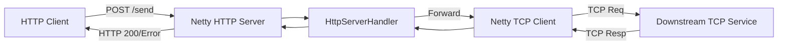
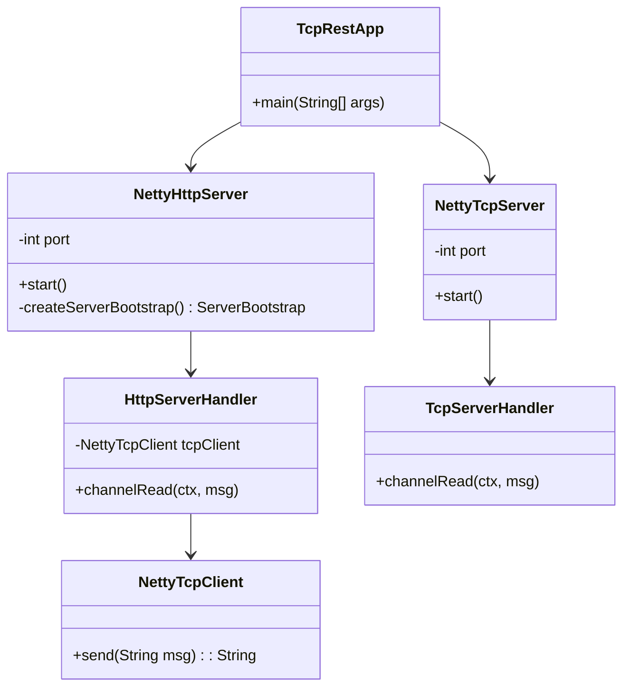
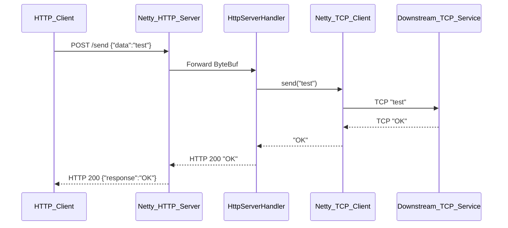

# **Comprehensive Technical Report: TcpRest Project**

## **1. Project Overview**
**Repository**: [liweinan/tcprest](https://github.com/liweinan/tcprest)  
**Language**: Java  
**Framework**: Netty (NIO-based)  
**Purpose**: A lightweight **HTTP-to-TCP proxy** that:
- Accepts HTTP requests
- Forwards payloads to a downstream TCP service
- Returns TCP responses as HTTP replies

---

## **2. Key Components**
### **2.1 Architecture Overview**


### **2.2 Module Breakdown**
| Component           | Purpose                          | Key Classes                     |
|---------------------|----------------------------------|---------------------------------|
| **HTTP Server**     | Listens on HTTP (8080 by default)| `NettyHttpServer`, `HttpServerHandler` |
| **TCP Client**      | Connects to downstream TCP       | `NettyTcpClient`                |
| **TCP Server**      | Optional test TCP server (7001)  | `NettyTcpServer`, `TcpServerHandler` |

---

## **3. Detailed UML Diagrams**
### **3.1 Class Diagram**


### **3.2 Sequence Diagram (HTTP → TCP Flow)**


---

## **4. NIO Implementation**
### **4.1 Netty NIO Components**
| Class               | NIO Usage                              |
|---------------------|----------------------------------------|
| `NettyHttpServer`   | `NioEventLoopGroup`, `NioServerSocketChannel` |
| `NettyTcpServer`    | `NioEventLoopGroup`, `NioSocketChannel` |
| `NettyTcpClient`    | Bootstrap with NIO transport           |

### **4.2 Non-Blocking I/O Flow**
1. **EventLoop Groups**:
   ```java
   // Both HTTP and TCP servers use NIO
   EventLoopGroup bossGroup = new NioEventLoopGroup();
   EventLoopGroup workerGroup = new NioEventLoopGroup();
   ```
2. **Zero-Copy Optimization**:
    - Uses Netty's `ByteBuf` for zero-copy memory access.

---

## **5. Code Highlights**
### **5.1 HTTP → TCP Bridging**
```java
// HttpServerHandler.java
public void channelRead(ChannelHandlerContext ctx, Object msg) {
    if (msg instanceof FullHttpRequest) {
        String content = ((FullHttpRequest) msg).content().toString(CharsetUtil.UTF_8);
        String tcpResponse = tcpClient.send(content); // Blocking call (could be improved)
        FullHttpResponse httpResponse = new DefaultFullHttpResponse(
            HTTP_1_1, OK, Unpooled.copiedBuffer(tcpResponse, CharsetUtil.UTF_8));
        ctx.writeAndFlush(httpResponse);
    }
}
```

### **5.2 TCP Server Handler**
```java
// TcpServerHandler.java
public void channelRead(ChannelHandlerContext ctx, Object msg) {
    String request = (String) msg;
    ctx.writeAndFlush("TCP Reply: " + request); // Echo server behavior
}
```

---

## **6. Performance Characteristics**
| Metric               | Detail                                |
|----------------------|---------------------------------------|
| **Concurrency Model**| Netty NIO (1 thread per core)         |
| **Throughput**       | Limited by TCP client's blocking call |
| **Scalability**      | Vertical scaling (more cores)         |

---

## **7. Limitations & Improvements**
### **7.1 Current Limitations**
1. **Blocking TCP Client**: `NettyTcpClient.send()` is synchronous.
2. **No Connection Pooling**: New TCP connection per request.
3. **Minimal Error Handling**: Basic channel exception logging.

### **7.2 Suggested Improvements**
1. **Reactive TCP Client**:
   ```java
   public Mono<String> sendReactive(String msg) {
       return Mono.fromCallable(() -> tcpClient.send(msg))
           .subscribeOn(Schedulers.boundedElastic());
   }
   ```
2. **Protocol Buffers Support**:
   ```java
   ch.pipeline().addLast(new ProtobufVarint32FrameDecoder());
   ch.pipeline().addLast(new ProtobufDecoder(MyProto.getDefaultInstance()));
   ```
3. **Load Testing**: Add JMeter/Gatling scenarios.

---

## **8. Conclusion**
This project demonstrates a **minimalist Netty-based gateway** for:  
✅ HTTP-to-TCP protocol conversion  
✅ NIO-powered non-blocking I/O  
✅ Extensible handler architecture

**Best For**: Legacy system integration where HTTP frontends need to communicate with TCP backends.

---
**Final Note**: The absence of Spring makes this project ideal for lightweight deployments where framework overhead is undesirable. Contributions to make the TCP client non-blocking would significantly improve throughput.